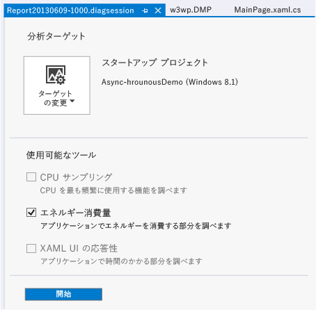
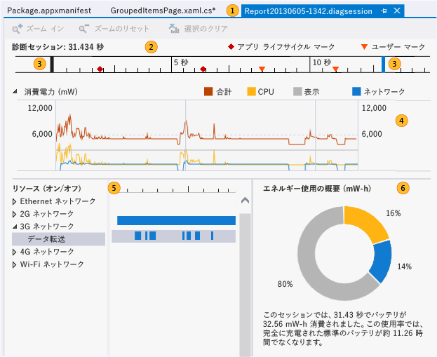
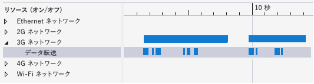
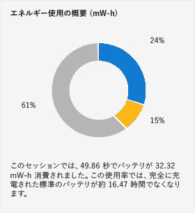

# ストア アプリでのエネルギー使用の分析
[!INCLUDE[vs2017banner](../code-quality/includes/vs2017banner.md)]

Visual Studio の**エネルギー消費**プロファイラーは、常時または一時的に内蔵バッテリで動作する低電力のタブレット デバイス上で、Windows ストア アプリによる電力とエネルギーの消費量を分析するのに役立ちます。 バッテリ電源デバイスでは、エネルギー消費量が多すぎるアプリはユーザーに嫌われ、最終的にアンインストールされる場合もあります。 エネルギー使用を最適化することで、ユーザーがそのアプリを選択する可能性が高まり、使用頻度も向上します。  
  
##  <a name="BKMK_What_the_Energy_Consumption_tool_is__how_it_works__and_what_it_measures"></a> エネルギー消費量プロファイラーの概要、しくみ、および測定対象  
 エネルギー消費プロファイラーは、プロファイル セッション中のデバイスのディスプレイ、CPU、およびネットワーク接続のアクティビティをキャプチャします。 次に、そのアクティビティに使用される電力と、プロファイル セッションのエネルギーの総量の見積もりを生成します。  
  
> [!NOTE]
>  エネルギー消費プロファイラーでの電力とエネルギーの使用量の見積もりには、アプリケーションが実行される低電力のタブレット デバイスを表す、標準参照デバイス ハードウェアのソフトウェア モデルが使用されます。 最適な見積もりを提供するために、低電力のタブレット デバイスでプロファイル データを収集することをお勧めします。  
>   
>  このモデルを使用すると、さまざまな低電力デバイスにおける適切な見積もりを生成できますが、プロファイルの対象となるデバイスの実際の値とはほとんどの場合、異なります。 見積もりの値は、使用される他のリソースと比べて比較的負荷の大きい、ディスプレイ、CPU、およびネットワーク接続のアクティビティを見つけて、最適化の候補にするために使用します。  
  
 エネルギー消費量プロファイラーでは、*電力*と*エネルギー*を次のように定義しています。  
  
-   *電力*は、一定の時間内に行われる仕事のために使用される力の割合を測定します。 電気の分野では、電力の標準単位は*ワット*です。ワットは、1 アンペアの電流が 1 ボルトの電位差で流れるときに行われる仕事の割合として定義されています。**\[消費電力\]** グラフでは、単位はワットの 1,000 分の 1 であるミリワット **\(mW\)** で表示されます。  
  
     電力は割合であるため、方向 \(一定時間内で仕事が増加または減少\) と速度 \(仕事が増加または減少する量\) があることに注意してください。  
  
-   *エネルギー*は、バッテリの電力容量のような能力または潜在力として、または一定の時間内に消費された総電力量として、電力の総量を表します。 エネルギーの単位はワット時です。これは、1 ワットの電力を 1 時間にわたって常時加えた場合の電力量です。**\[Energy Summary\] \(エネルギー使用の概要\)** では、単位はミリワット時間 **\(mW\-h\)** で表示されます。  
  
   
  
 たとえば、タブレットの完全に充電されたバッテリには、一定量のエネルギーが蓄えられています。 エネルギーは、ネットワーク経由での通信、値の計算、グラフィックスの表示などのタスクを実行するために使用され、バッテリの電力が消費される速度もさまざまです。 一定の期間内に消費された総電力も、エネルギーで測定されます。  
  
##  <a name="BKMK_Identify_scenarios_with_user_marks"></a> ユーザー マークによるシナリオの識別  
 また、タイムライン ルーラーの領域を識別できるようにプロファイル データに*ユーザー マーク*を追加できます。  
  
   
  
 マークは、タイムライン上でメソッドが実行された時点に、オレンジ色の三角形として表示されます。 マークの上にマウス ポインターを置くと、メッセージと時刻がツールヒントとして表示されます。 複数のユーザー マークが近接している場合、マークはマージされてツールヒントのデータはまとめられます。 タイムラインの表示を拡大すると、マークを分離できます。  
  
 **C\#、Visual Basic、C\+\+ コードに対するマークの追加**  
  
 C\#、Visual Basic、C\+\+ コードにユーザー マークを追加するには、まず [Windows.Foundation.Diagnostics LoggingChannel](http://msdn.microsoft.com/library/windows/apps/windows.foundation.diagnostics.loggingchannel.aspx) オブジェクトを作成します。 次に、マークするコードの位置に [LoggingChannel.LogMessage](http://msdn.microsoft.com/library/windows/apps/dn264210.aspx) メソッドの呼び出しを挿入します。 呼び出しでは [LoggingLevel.Information](http://msdn.microsoft.com/library/windows/apps/windows.foundation.diagnostics.logginglevel.aspx) を使用します。  
  
 メソッドが実行されると、ユーザー マークがメッセージと共にプロファイル データに追加されます。  
  
> [!NOTE]
>  -   Windows.Foundation.Diagnostics LoggingChannel は [Windows.Foundation.IClosable](http://msdn.microsoft.com/library/windows/apps/windows.foundation.iclosable.aspx) インターフェイス \(C\# および VB で [System.IDisposable](http://msdn.microsoft.com/library/System.IDisposable.aspx) として投影\) を実装します。オペレーティング システム リソースのリークを防ぐには、ログ チャンネルで終了するときに C\# および VB で [LoggingChannel.Close](http://msdn.microsoft.com/library/windows/apps/windows.foundation.diagnostics.loggingchannel.close.aspx)<xref:Windows.Foundation.Diagnostics.LoggingChannel.Close%2A>\(\) \([Windows.Foundation.Diagnostics.LoggingChannel.Dispose](assetId:///Windows.Foundation.Diagnostics.LoggingChannel.Dispose?qualifyHint=False&autoUpgrade=True)\(\)\) を呼び出します。  
> -   開いているログ記録チャネルそれぞれに一意の名前を付ける必要があります。 破棄されていないチャネルと同じ名前で新しくログ記録チャネルを作成しようとすると、例外が発生します。  
  
 例については、Windows SDK サンプル [LoggingSession Sample](http://code.msdn.microsoft.com/windowsapps/LoggingSession-Sample-ccd52336) を参照してください。  
  
 **JavaScript コードに対するマークの追加**  
  
 ユーザー マークを追加するには、コード内のマークする位置に次のコードを追加します。  
  
```  
if (performance && performance.mark) {  
    performance.mark(markDescription);  
}  
```  
  
 *markDescription* は、ユーザー マークのツールヒントに表示されるメッセージを含む文字列です。  
  
##  <a name="BKMK_Configure_your_environment_for_profiling"></a> プロファイリング用の環境の構成  
 正確な見積もりを取得するために、バッテリが電源になっている低電力デバイス上でのアプリのエネルギー使用をプロファイリングします。 Visual Studio は、これらのほとんどのデバイス上で動作しないため、Visual Studio Remote Tools を使用して、Visual Studio コンピューターをデバイスに接続する必要があります。 リモート デバイスに接続するには、Visual Studio プロジェクトとリモート デバイスの両方を構成する必要があります。 詳細については、「[リモート コンピューターでの Windows ストア アプリの実行](../debugger/run-windows-store-apps-on-a-remote-machine.md)」を参照してください。  
  
> [!TIP]
>  -   Windows ストア シミュレーターまたは Visual Studio コンピューターでエネルギー プロファイリングを実行することはお勧めできません。 実際のデバイスでプロファイリングを実行する方が、はるかに現実的なデータを取得できます。  
> -   プロファイリングは、ターゲット デバイスがバッテリ駆動されている間に行います。  
> -   同じリソース \(ネットワーク、CPU、またはディスプレイ\) を使用する可能性がある他のアプリを閉じます。  
  
##  <a name="BKMK_Collect_energy_profile_data_for_your_app"></a> アプリのエネルギー プロファイル データの収集  
  
1.  \[**デバッグ**\] メニューの \[**デバッグなしで診断を開始**\] をクリックします。  
  
       
  
2.  **\[エネルギー消費\]** チェック ボックスをオンにし、**\[開始\]** をクリックします。  
  
    > [!NOTE]
    >  **エネルギー消費**プロファイラーを開始すると、VsEtwCollector.exe を実行するアクセス許可を要求する **\[ユーザー アカウント制御\]** ウィンドウが表示される場合があります。**\[はい\]** をクリックします。  
  
3.  アプリケーションを実行して、データを収集します。  
  
4.  プロファイリングを停止するには、Visual Studio に戻り \(Alt \+ Tab\)、診断ハブのページの **\[コレクションの停止\]** をクリックします。  
  
       
  
     Visual Studio は、収集されたデータを分析し、結果を表示します。  
  
##  <a name="BKMK_Collect_energy_profile_data_for_an_installed_app"></a> インストール済みアプリのエネルギー プロファイル データの収集  
 エネルギー消費プロファイラーは、Visual Studio ソリューションから開始された Window 8.1 アプリまたは Windows ストアからインストールされた Window 8.1 アプリに対してのみ実行できます。 ソリューションを Visual Studio で開いている場合、既定のターゲットは **\[スタートアップ プロジェクト\]** です。 インストール済みアプリを対象とするには、以下の手順に従います。  
  
1.  **\[ターゲットの変更\]** をクリックし、**\[インストール済みのアプリ\]** をクリックします。  
  
2.  **\[インストール済みアプリ パッケージの選択\]** の一覧で、ターゲットをクリックします。  
  
3.  診断ハブのページで **\[エネルギー消費\]** をクリックします。  
  
4.  **\[開始\]** をクリックして、プロファイリングを開始します。  
  
 プロファイリングを停止するには、Visual Studio に戻り \(Alt \+ Tab\)、診断ハブのページで **\[コレクションの停止\]** をクリックします。  
  
##  <a name="BKMK_Analyze_energy_profile_data"></a> エネルギー プロファイル データの分析  
 エネルギー プロファイル データは、Visual Studio のドキュメント ウィンドウに次のように表示されます。  
  
   
  
|||  
|-|-|  
||レポート ファイルの名前は、Report*YYYYMMDD\-HHMM*.diagsession という形式になります。 レポートを保存する場合は、名前を変更できます。|  
||タイムラインは、プロファイル セッションの長さ、アプリケーションのアクティブ化ライフサイクル イベント、ユーザー マークを示します。|  
||青いバーをドラッグしてタイムラインの領域を選択することにより、レポートをタイムラインの一部だけに制限できます。|  
||**\[消費電力\]** グラフは、プロファイル セッション中にデバイス リソースによって引き起こされる電源出力の変化を系列別に表示する折れ線グラフです。 エネルギー消費量プロファイラーは、CPU、ネットワーク アクティビティ、および画面表示によって使用された電力を追跡します。|  
||**\[リソース \(オン\/オフ\)\]** グラフは、ネットワークのエネルギー コストの詳細を示します。**\[ネットワーク\]** バーは、ネットワーク接続が開かれていた時間を表します。**\[データ転送\]** 子バーは、アプリがネットワーク経由でデータを受信または送信していた時間です。|  
||**\[エネルギー使用の概要\]** は、選択されたタイムラインで CPU、ネットワーク アクティビティ、および画面表示によって使用された総エネルギーの割合を示します。|  
  
 **エネルギー プロファイル データを分析するには**  
  
 リソースの電力がピークになっている領域を探します。 ピーク領域をアプリの機能に関連付けます。 次に、タイムラインのコントロール バーを使用して、その領域を拡大表示します。 ネットワーク使用量に注目している場合は、**\[リソース \(オン\/オフ\)\]** グラフの **\[ネットワーク\]** ノードを展開して、ネットワーク接続が開かれていた時間とアプリがネットワーク経由でデータを受信または転送していた時間を比較します。 不必要にネットワークが開かれている時間を短縮することは、非常に有効な最適化です。  
  
##  <a name="BKMK_Optimize_energy_use"></a> エネルギー使用の最適化  
 ネットワーク接続では、データ送信の他にも、接続の初期化、維持、およびシャットダウン時にエネルギー コストが発生します。 一部のネットワークでは、データの送受信後も一定期間接続を維持することで、1 つの接続でさらにデータを転送できるようになっています。**\[リソース \(オン\/オフ\)\]** ウィンドウを使用して、アプリが接続とどのように連係しているかを調べることができます。  
  
   
  
 **\[ネットワーク\]** バーと **\[データ転送\]** バーが、一連の小さいデータ パケットを断続的に送信するために接続が長期間開かれていることを示している場合は、データをバッチ処理して 1 回の伝送で送信することで、ネットワークが開かれている時間を短縮し、エネルギー コストを削減することができます。  
  
   
  
 ディスプレイのエネルギー コストは、あまり制御できません。 ほとんどの画面では、暗い色より明るい色を表示する際に多くのエネルギーが必要になるため、暗い背景を使用することはエネルギー コストを削減する方法の 1 つです。  
  
##  <a name="BKMK_Other_resources"></a> その他のリソース  
  
-   Windows デベロッパー センターの **C\#\/VB\/C\+\+ と XAML** および [JavaScript と HTML](http://msdn.microsoft.com/ja-jp/0ee0b706-8432-4d49-9801-306ed90764e1) の「[接続状態とコストの管理](http://msdn.microsoft.com/ja-jp/372afa6a-1c7c-4657-967d-03a77cd8e933)」セクションでは、ネットワーク接続情報を提供する Windows API について説明しています。この情報を使って、アプリはネットワーク トラフィックのコストを最小限にすることができます。  
  
     Windows ストア アプリ用の Visual Studio シミュレーターでは、ネットワーク情報 API のデータ接続プロパティをシミュレートすることができます。 「[シミュレーターでの Windows ストア アプリの実行](../debugger/run-windows-store-apps-in-the-simulator.md)」を参照してください。  
  
-   **JavaScript 関数タイミング**および **CPU 使用率**ツールは、非効率的な関数のために生じる CPU 負荷の削減に役立ちます。 「[CPU 使用率の分析](../profiling/analyze-cpu-usage-in-a-windows-universal-app.md)」を参照してください。