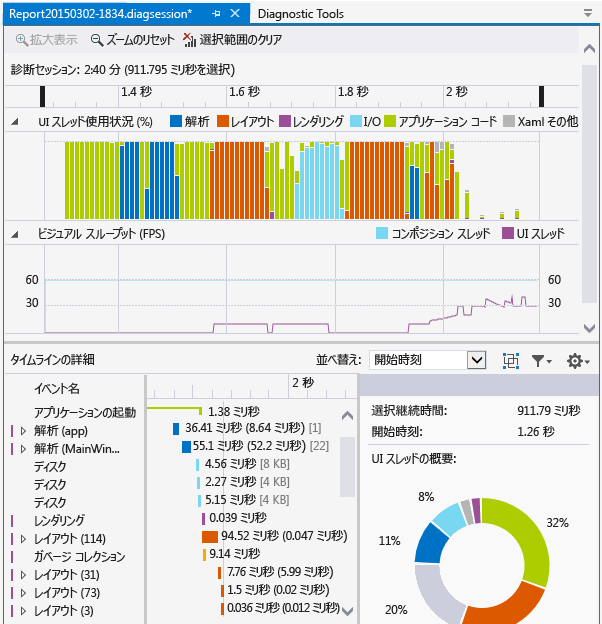
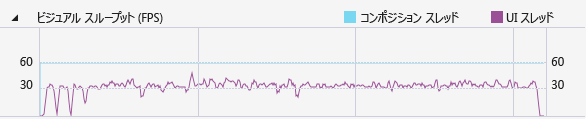

# リソース消費量と UI スレッド アクティビティを分析する (XAML)
**アプリケーション タイムライン** プロファイラーを使用すると、XAML アプリケーションにおけるアプリケーションの相互作用に関連するパフォーマンスの問題を検出および修復できます。 このツールは、アプリケーションのリソースの消費量の詳細ビューを提供することで、XAML アプリケーションのパフォーマンスの向上に役立ちます。 アプリケーションが UI フレームの準備 (レイアウトとレンダリング) やネットワークとディスクの要求の処理を実行することで、およびアプリケーションの起動、ページの読み込み、ウィンドウのサイズ変更などのシナリオにおいて使用した時間を分析することができます。  
  
 **アプリケーション タイムライン**は、**[デバッグ]** > **[パフォーマンス プロファイラー]** コマンドから開始できるツールの 1 つです。  
  
 このツールは、Visual Studio 2013 の診断ツールセットの一部であった **[XAML UI の応答性]** ツールから置き換わるものです。  
  
 このツールは、次のプラットフォームで使用することができます。  
  
1.  ユニバーサル Windows アプリ (Windows 10 で)  
  
2.  Windows 8.1  
  
4.  Windows Presentation Foundation (.Net 4.0 以上)  
  
5.  Windows 7  
  
> [!NOTE]
>  **アプリケーション タイムライン** データと共に、CPU 使用率データ、エネルギー消費量データを収集して分析できます。 「[デバッガーを使用して、または使用せずにプロファイリング ツールを実行する](../profiling/running-profiling-tools-with-or-without-the-debugger.md)」をご覧ください。
  
## アプリケーション タイムライン データの収集  
 ローカル コンピューター、接続されたデバイス、Visual Studio シミュレーターやエミュレーター、またはリモート デバイスでアプリの応答性をプロファイリングすることができます。 「[デバッガーを使用して、または使用せずにプロファイリング ツールを実行する](../profiling/running-profiling-tools-with-or-without-the-debugger.md)」をご覧ください。
  
> [!TIP]
>  可能な場合には、アプリをデバイス上で直接実行します。 シミュレーターまたはリモート デスクトップ接続で計測されたアプリケーションのパフォーマンスは、デバイス上での実際のパフォーマンスと同じではないことがあります。 一方で、Visual Studio リモート ツールを使用してデータを収集しても、パフォーマンス データには影響は及ぼしません。  
  
 基本的な手順は次のとおりです。  
  
1.  XAML アプリを開きます。  
  
2.  **[デバッグ] > [パフォーマンス プロファイラー]** の順にクリックします。 [.diagsession] ウィンドウにプロファイリング ツールの一覧が表示されます。  
  
3.  **[アプリケーション タイムライン]** を選択してから、ウィンドウの下部にある **[開始]** をクリックします。  
  
    > [!NOTE]
    >  *VsEtwCollector.exe* を実行するアクセス許可を求める [ユーザー アカウント制御] ウィンドウが表示されることがあります。 **[はい]** をクリックします。  
  
4.  パフォーマンス データを収集するアプリのプロファイリングで関心のあるシナリオを実行します。  
  
5.  プロファイリングを停止するには、.diagsession ウィンドウに切り替えてから、ウィンドウの上部にある **[停止]** をクリックします。  
  
     Visual Studio が、収集したデータを分析し、結果を表示します。  
  
       
  
## タイムライン プロファイル データの分析  
 プロファイル データを収集した後、次の手順によってコードの分析を開始することができます。  
  
1.  **[UI スレッド使用状況]** と **[ビジュアル スループット (FPS)]** のグラフの情報を確認し、タイムラインのナビゲーション バーを使用して、分析する時間の範囲を選択します。  
  
2.  **[UI スレッド使用状況]** または **[ビジュアル スループット (FPS)]** のグラフの情報を使用して、**[タイムラインの詳細]** ビューで詳細を確認し、応答性に問題があるように見受けられる場合は、考えられる原因を究明します。  
  
###   シナリオ、カテゴリ、およびイベントのレポート  
 **[アプリケーション タイムライン]** ツールは、XAML のパフォーマンスに関連するシナリオ、カテゴリ、およびイベントのタイミング データを表示します。  
  
###   診断セッションのタイムライン  
   
  
 ページの上部にあるルーラーは、プロファイル情報のタイムラインを示します。 このタイムラインは、 **[UI スレッド使用状況]** グラフと **[ビジュアル スループット]** グラフの両方に適用されます。 タイムラインのナビゲーション バーをドラッグしてタイムラインのセグメントを選択することにより、レポートのスコープを絞ることができます。  
  
 タイムラインには、挿入したすべてのユーザー マーク、およびアプリのアクティブ化ライフサイクル イベントも表示されます。  
  
###   UI スレッド使用状況グラフ  
   
  
 **[UI スレッド使用状況 (%)]** グラフは、コレクション期間中にあるカテゴリで費やされた相対的な時間を横棒グラフで示したものです。  
  
###   ビジュアル スループット (FPS) グラフ  
   
  
 **[ビジュアル スループット (FPS)]** の折れ線グラフは、アプリの UI スレッドとコンポジション スレッドの 1 秒あたりのフレーム数 (FPS) を示します。  
  
###   タイムラインの詳細  
 [詳細] ビューは、レポートの分析にほとんどの時間を費やす場所です。 UI フレームワーク サブシステムまたは CPU を消費したシステム コンポーネントによってカテゴリ化されるアプリケーションの CPU 使用率の詳細なビューを表示します。  
  
 次のイベントがサポートされます。  
  
|||  
|-|-|  
|**解析**|XAML ファイルの解析とオブジェクトの作成に費やされた時間。   **[タイムラインの詳細]** の **[解析]** ノードを展開すると、ルート イベントの結果として解析されたすべての XAML ファイルの依存関係チェーンが表示されます。 これにより、パフォーマンスが重要なシナリオにおいて不必要なファイル解析やオブジェクト作成を特定し、それらを取り除いて最適化できます。|  
|**レイアウト**|大規模なアプリケーションでは、多数の要素が画面に同時に表示される可能性があります。 これにより、UI のフレーム レートが低下し、これに対応してアプリケーションの応答性も低下します。 レイアウト イベントでは、各要素 (つまり、Arrange、Measure、ApplyTemplate、ArrangeOverride に費やした時間) をレイアウトするコストを正確に判断するだけでなく、レイアウト パスの一部を成すビジュアル ツリーを作成します。 この視覚表現を使用すると、簡略化する論理ツリーを判断したり、レイアウト パスを最適化するために他の遅延メカニズムを評価したりすることができます。|  
|**レンダリング**|XAML 要素を画面に描画するために費やされた時間。|  
|**入出力**|ローカル ディスクから、または [Microsoft Windows Internet (WinINet)](https://msdn.microsoft.com/en-us/library/windows/desktop/aa385331.aspx)API を使用してアクセスするネットワーク リソースから、データを取得するために費やされた時間。|  
|**アプリケーション コード**|解析やレイアウトに関連しないアプリケーション (ユーザー) コードを実行するために費やされた時間。|  
|**Xaml その他**|XAML ランタイム コードの実行に費やされた時間。|  
  
> [!TIP]
>  UI スレッドで実行されるアプリ メソッドを表示するためにプロファイリングを開始する場合は、 **[CPU 使用率]** ツールと共に **[アプリケーション タイムライン]** ツールを選択します。 実行時間の長いアプリ コードをバック グラウンド スレッドに移動すると、UI の応答性が向上します。  
  
####   タイムラインの詳細のカスタマイズ  
 **[タイムラインの詳細]** ツールバーを使用して、**[タイムラインの詳細]** ビュー エントリの並べ替え、フィルター操作、注釈の指定を行います。  
  
|||  
|-|-|  
|**並べ替え**|開始時刻またはイベントの長さによって並べ替えます。|  
||フレームごとにイベントをグループ化する最上位の **[フレーム]** カテゴリを追加または削除します。|  
||選択したカテゴリまたはイベントの長さに基づいて、一覧をフィルター処理します。|  
||イベントに注釈を指定できます。|  
  
## 関連項目  
 [WPF チーム ブログ: WPF アプリケーション用の新しい UI パフォーマンス分析ツール](http://blogs.msdn.com/b/wpf/archive/2015/01/16/new-ui-performance-analysis-tool-for-wpf-applications.aspx)  
 [C++、C#、または Visual Basic を使った UWP アプリのパフォーマンスのベスト プラクティス](http://msdn.microsoft.com/en-us/567bcefa-5da5-4e42-a4b8-1358c71adfa2)   
 [WPF アプリケーションのパフォーマンスの最適化](/dotnet/framework/wpf/advanced/optimizing-wpf-application-performance)  
 [Visual Studio のプロファイル](../profiling/index.md)  
 [プロファイル ツールの概要](../profiling/profiling-feature-tour.md)
