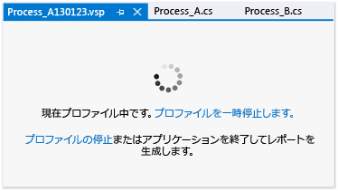

# 方法: パフォーマンス データ収集の一時停止と再開
プロファイル セッション ページ ウィンドウから、プロファイリング データの収集を対話形式で制御することができます。  
  
 データ収集を制御することで、プロファイル データ ファイルのサイズを小さくし、対象とする操作のデータのみを収集することができます。 プロファイリングは、パフォーマンス セッション内で複数回一時停止および再開することができます。  
  
   
  
> [!NOTE]
>  プロファイリングを一時停止した状態でパフォーマンス セッションを開始し、プログラム実行の後の時点でプロファイリングを再開することもできます。 プロファイリングを一時停止した状態でパフォーマンス セッションを開始するには、**[デバッグ]** メニューの **[Start Performance Analysis with Profiling Paused]\(プロファイリングを一時停止してパフォーマンス分析を開始)** コマンドを選択します。  
  
### プロファイリングを一時停止、再開、または停止するには  
  
-   プロファイル セッション ページで、次のように操作します。  
  
    -   データ コレクションを中断するには、**[収集の一時停止]** を選択します。  
  
    -   データ コレクションを一時停止した後で再開するには、**[収集の再開]** を選択します。  
  
    -   プロファイリング セッションを終了してレポートを生成するには、**[プロファイリングの停止]** を選択します。  
  
## 関連項目  
 [データ コレクションの制御](../profiling/controlling-data-collection.md)   
 [方法: パフォーマンス データの収集の開始と終了](../profiling/how-to-start-and-end-performance-data-collection.md)