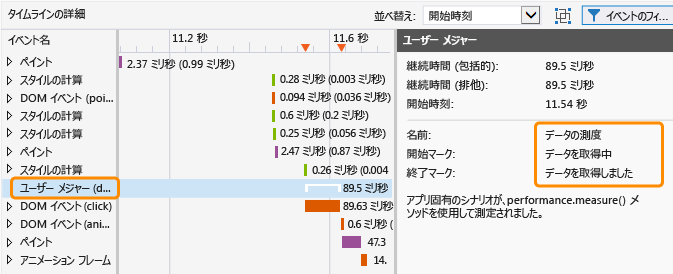
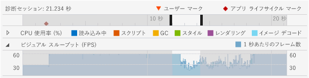
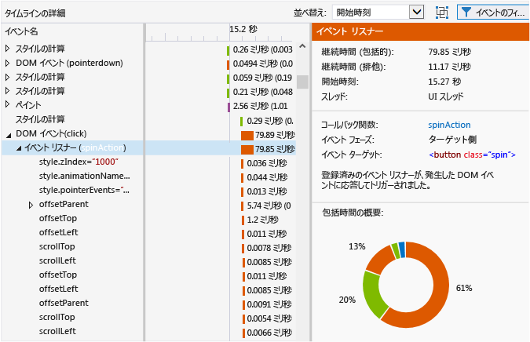
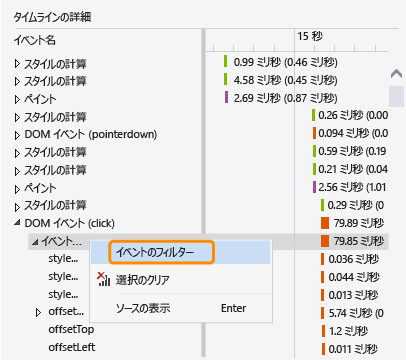
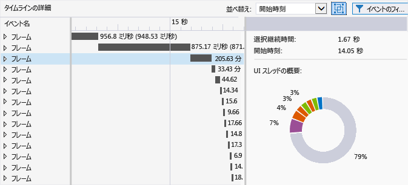

# <a name="analyze-html-ui-responsiveness-in-universal-windows-apps"></a>ユニバーサル Windows アプリの HTML UI の応答性を分析する
このトピックでは、アプリのパフォーマンス問題を UI 応答性プロファイラーを使って切り分ける方法を説明します。UI 応答性プロファイラーは、ユニバーサル Windows アプリで利用できるパフォーマンス ツールです。  
  
 UI 応答性プロファイラーは、これらの症状で一般的に発生する UI 応答性の問題やプラットフォーム側の効果などの問題を分離しやすくしてくれます。  
  
-   UI の応答性の不足。 UI スレッドがブロックされると、アプリの応答が遅くなる場合があります。 UI スレッドをブロックする可能性がある原因として、過剰に同期的な JavaScript コード、過剰な CSS レイアウトまたは CSS 計算作業、同期的 XHR 要求、ガベージ コレクション、過剰な描画回数、プロセッサ集中型の JavaScript コードなどが挙げられます。  
  
-   アプリまたはページの読み込みが遅い。 この症状は、一般に、リソースの読み込みに時間がかかりすぎている場合に発生します。  
  
-   ビジュアルの更新頻度が予想よりも少ない。 この症状は、UI スレッドの負荷が高すぎて滑らかなフレーム レートを維持できなくなった場合に発生します。 たとえば、UI スレッドがビジーであるためにコマ落ちが発生することがあります。 ネットワーク要求、イメージ デコード、描画など、一部の非 UI スレッド作業でも、ビジュアル更新の頻度が制限されることがあります。 すべての描画が UI スレッドで処理されるわけではありません。  
  
##  <a name="RunningProfiler"></a> HTML UI の応答性ツールの実行  
 HTML UI 応答性ツールは、動作中の Windows ユニバーサルまたは Windows ストア アプリが、Visual Studio で開かれているか、Windows 8 以降を実行しているコンピューターにインストールされている場合に使用できます。  
  
1.  アプリを Visual Studio から実行している場合は、 **[標準]** ツール バーの **[デバッグの開始]** の一覧から、配置ターゲットを選択します (Windows Phone エミュレーターの 1 つ、 **ローカル コンピューター**、 **シミュレーター**、 **リモート コンピューター**など)。  
  
2.  **[デバッグ]** メニューの **[パフォーマンス プロファイラー...]**をクリックします。  
  
     プロファイラーの分析ターゲットを変更する場合は、**[ターゲットの変更]**を選択します。  
  
       
  
     分析ターゲットに対して、次のオプションを使用できます。  
  
    -   **[スタートアップ プロジェクト]**。 現在のスタートアップ プロジェクトを分析するには、このオプションを選択します。 アプリをリモート コンピューターまたはデバイスで実行している場合は、既定値であるこの設定を使用する必要があります。  
  
    -   **[実行中のアプリ]**。 実行中のアプリの一覧から Windows ストア アプリを選択するには、このオプションを選択します。 アプリをリモート コンピューターまたはデバイスで実行している場合は、このオプションを使用できません。  
  
         このオプションを使用すると、ソース コードにアクセスできないときに、コンピューター上で実行されているアプリのパフォーマンスを分析できます。  
  
    -   **[インストールされているアプリ]**。 インストールされているアプリを分析用に選択するには、このオプションをクリックします。 アプリをリモート コンピューターまたはデバイスで実行している場合は、このオプションを使用できません。  
  
         このオプションを使用すると、ソース コードにアクセスできないときに、コンピューターにインストールされているアプリのパフォーマンスを分析できます。 このオプションは、自分が開発に携わっていないアプリのパフォーマンスを分析する場合にも便利です。  
  
3.  
                **[使用可能なツール]**で **[HTML UI の応答性]**を選択し、 **[開始]**をクリックします。  
  
4.  UI 応答性プロファイラーの開始時に、Visual Studio ETW Collector.exe を実行するためのアクセス許可を要求するユーザー アカウント制御ウィンドウが表示される場合があります。 **[はい]**をクリックします。  
  
     アプリを操作して、関連するパフォーマンス シナリオをテストします。 ワークフローの詳細については、以下を参照してください。 [UI の応答性の問題の特定](#Workflow) および [Isolate a visual throughput problem](#IsolateVisualThroughput)など)。  
  
5.  Alt キーを押しながら Tab キーを押して Visual Studio に切り替えます。  
  
6.  アプリのプロファイリングを停止し、プロファイラーによって収集されたデータを表示するには、 **[コレクションの停止]**をクリックします。  
  
##  <a name="IsolateAnIssue"></a> 問題の特定  
 次のセクションでは、パフォーマンス上の問題を特定するのに役立つ方法を示します。 サンプル パフォーマンス テスト アプリを使用してパフォーマンスの問題を識別し、修正する方法の詳しい手順については、「[チュートリアル: UI の応答性の向上 (HTML)](../profiling/walkthrough-improving-ui-responsiveness-html.md)」を参照してください。  
  
###  <a name="Workflow"></a> UI の応答性の問題の特定  
 以下の手順は、UI 応答性プロファイラーをより効果的に使用するために役立つ、推奨されるワークフローです。  
  
1.  Visual Studio でアプリを開きます。  
  
2.  アプリケーションの UI 応答性の問題をテストします。 (Ctrl + F5 キーを押して、デバッグを行わずにアプリケーションを開始します)。  
  
     問題を検出したら、テストを続けて、問題が発生している期間を絞り込むか、または問題の動作を引き起こすトリガーを識別します。  
  
3.  Visual Studio に戻り (Alt + Tab キーを押す)、デバッグを停止します (Shift + F5 キーを押す)。  
  
4.  必要に応じて、 [分析用のコードのマーク](#ProfileMark)など)。  
  
    > [!TIP]
    >  ユーザー マークは、プロファイラー データを表示しながら応答性の問題を特定するのに役立ちます。 たとえば、応答性の問題の原因となっているコードのセクションの先頭と末尾にユーザー マークを追加できます。  
  
5.  前のセクションの手順に従って、UI 応答性プロファイラーを実行します。  
  
6.  アプリケーションを UI の応答性の問題が生じている状態にします。  
  
7.  Visual Studio に切り替えて (Alt + Tab キーを押して)、UI 応答性プロファイラーのプロファイラー タブで **[コレクションの停止]** をクリックします。  
  
8.  ユーザー マークが追加済みの場合は、プロファイラーの [診断セッションのタイムラインの表示](#Ruler) に表示されます。 次の図は、コードで特定の操作を指定するために使用される単一のユーザー マークを示しています。  
  
       
  
9. ユーザー マーク、アプリケーション ライフ サイクル イベント、グラフ内のデータを使って、タイムラインとプロファイラー グラフで関心のある領域を特定します。 グラフのデータの分析と使用に役立つガイドラインを次に示します。  
  
    -   並べ替え方法を選択するには、 [診断セッションのタイムラインの表示](#Ruler) 」を使用して、 [分析用のコードのマーク](#ProfileMark)、アプリ ライフ サイクル イベント、これらのイベントに関連するタイムライン、他のグラフのデータのタイムラインを表示します。  
  
    -   [CPU utilization graph](#CPUutilization) 」を使用して、CPU アクティビティと、特定の期間内にそれが処理する作業の種類についての一般的な情報を表示します。 過剰な CPU アクティビティがある期間には、応答性の問題およびフレームのドロップが発生する場合があります。  
  
    -   ゲームやリッチ メディア アプリを開発する場合は、 [ビジュアル スループット (FPS) の表示](#VisualThroughput) を使用すると、フレーム レートが低下した期間を特定できます。  
  
10. いずれかのグラフで、グラフの一部をクリックし、ポインターをドラッグして (またはタブ キーと方向キーを使って)、関心のある領域を選択します。 選択によって期間を指定すると、プロファイラーの下部のペインにあるタイムラインの詳細グラフが、選択された期間だけを表示するように変更されます。  
  
     次の図は、関心のある領域を強調表示した、CPU 使用状況グラフを示します。  
  
       
  
11. [タイムライン グラフの表示](#TimelineDetails) 」 を使用すると、あまりに頻繁に実行されるイベントまたは完了に多くの時間がかかっているイベントに関する詳細情報を取得できます。 たとえば、次のものを探します。  
  
    -   イベント リスナー、タイマー、およびアニメーション フレームのコールバック。 特定のイベントに応じて、提供されるデータには変更された DOM 要素の ID、変更された CSS プロパティの名前、ソースの場所へのリンク、関連付けられたイベントまたはコールバック関数の名前が含まれる場合があります。  
  
    -   `window.getComputedStyles`の呼び出しなどのレンダリング要素を発生させるレイアウトまたはスクリプト イベント。 イベントの関連付けられた DOM 要素が提供されます。  
  
    -   HTML 解析イベントのスクリプト評価など、アプリケーションによって読み込まれるページまたは URL リソース。 ファイル名またはリソースが提供されます。  
  
    -   で指定されたその他のイベント [Profiler event reference](#ProfilerEvents).  
  
    > [!TIP]
    >  プロファイラーの有益な情報の大部分は、タイムラインの詳細グラフに表示されます。  
  
12. CPU 使用状況グラフまたはビジュアル スループット (FPS) グラフで領域を選択した状態で **[拡大表示]** (ボタンまたはコンテキスト メニューのどちらか) を選択すると、詳細情報が表示されます。 グラフのタイムラインが変更され、選択された期間だけを表示するようになります。  
  
13. 拡大表示の状態で、CPU 使用状況グラフまたはビジュアル スループット グラフの一部を選択します。 選択すると、プロファイラーの下部のペインにあるタイムラインの詳細グラフが、選択された期間だけを表示するように変更されます。  
  
###  <a name="IsolateVisualThroughput"></a> Isolate a visual throughput problem  
 過剰な CPU 使用状況の期間には、フレーム レートが低下したり、フレーム レートの一貫性がなくなったりする場合があります。 リッチ メディア アプリやゲームを開発する場合、ビジュアル スループット グラフは、CPU 使用状況グラフより重要なデータを提供する可能性があります。  
  
 ビジュアル スループットの問題を特定するには、前のセクションで説明した手順に従います。 重要なデータ ポイントの 1 つとしてビジュアル スループット グラフを使用します。  
  
###  <a name="ProfileMark"></a> 分析用のコードのマーク  
 グラフに表示されるデータに関連付けられているアプリ コードのセクションを特定しやすくするために、アプリ内に関数呼び出しを追加し、プロファイラーがタイムライン内で関数が実行される時点にユーザー マーク (下向きの三角形) を挿入するように指定します。 追加したすべてのユーザー マークが、CPU 使用状況グラフ、ビジュアル スループット グラフ、およびタイムラインの詳細グラフのタイムラインに表示されます。  
  
 ユーザー マークを追加するには、アプリに次のコードを追加します。 この例では、イベントの説明として "データの取得" を使用します。  
  
```javascript  
if (performance && performance.mark) {  
    performance.mark("getting data");  
}  
  
```  
  
 このイベントの説明は、ツールヒントとして、ユーザー マークの上にマウス ポインターを置くと表示されます。 ユーザー マークは必要なだけ追加できます。  
  
> [!NOTE]
>  `console.timeStamp`、Chrome のコマンドも、ユーザー マークとしても表示されます。  
  
 次の図は、1 つのユーザー マークとツールヒントが表示された診断ルーラーを示しています。  
  
   
  
 また、タイムライン詳細表示で、ツールで生成されるイベントを作成して、2 つのユーザー マーク間で経過する期間を表示することもできます。 次のコードでは、2 番目のユーザー マークと、2 つのユーザー マークを実行する間に経過する時間の測定値が追加されています (前のコードは最初のユーザー マークを示しています)。  
  
```javascript  
if (performance.mark && performance.measure) {  
    performance.mark("data retrieved");  
    performance.measure("data measure", "getting data", "data retrieved");  
}  
```  
  
 2 番目のユーザー マークが指定されていない場合、 `performance.measure` はタイムスタンプを 2 番目のユーザー マークとして使用します。 最初のユーザー マークは必須です。  
  
 期間の測定値は、[タイムラインの詳細] ビューに **[ユーザー測定]** イベントとして表示されます。 これを選択すると、詳細が表示されます。  
  
   
  
##  <a name="AnalyzeData"></a> データの分析  
 次のセクションでは、プロファイラーに表示されるデータの解釈に役立つ情報を提供します。  
  
###  <a name="Ruler"></a> 診断セッションのタイムラインの表示  
 プロファイラーの上部のルーラーは、プロファイル情報のタイムラインを示します。 このタイムラインは、[CPU 使用状況] グラフと [ビジュアル スループット] グラフの両方に適用されます。  
  
 次に、診断セッションのタイムラインの外観を示します。 いくつかのアプリ ライフサイクル イベントのツールヒントが表示されています。  
  
   
  
 タイムラインには、アクティブ化イベントのようなアプリのライフサイクル イベントが発生した日時が示されます。 また、コードに追加することができるユーザー マーク (ユーザー マークの三角形) も表示されます。 イベントを選択すると、より多くの情報を含むヒントが表示されます。 ユーザー マークの詳細については、このトピックの「 [分析用のコードのマーク](#ProfileMark) 」を参照してください。  
  
 アプリのライフサイクル イベントは、菱形記号として表示されます。 これらは次のような DOM イベントです。  
  
-   `DOMContentLoaded` および `Load` イベント。 通常は、コード内のアクティブ化されたイベント ハンドラーで発生します。 イベントのツールヒントには、特定のイベントと URL が表示されます。  
  
-   ナビゲーション イベント。 別のページに移動するときに発生します。 イベントのツールヒントには、移動先ページの URL が表示されます。  
  
###  <a name="CPUUtilization"></a> CPU 使用率の表示  
 CPU 使用状況グラフにより、過剰な CPU アクティビティがある期間を特定できます。 一定期間内でのアプリの平均 CPU 使用量に関する情報を示します。 情報は、特定のカテゴリを表すように色分けされています。 カテゴリには、 **[読み込み中]**、 **[スクリプティング]**、ガベージ コレクション (**[GC]**)、 **[スタイル]**、 **[レンダリング]**、 **[イメージ デコード中]**があります。 これらのカテゴリの詳細については、このトピックで後述する「 [Profiler event reference](#ProfilerEvents) 」を参照してください。  
  
 CPU 使用状況グラフは、1 つまたは複数の CPU の使用率値を 1 つのパーセント値にまとめて、すべてのアプリ スレッドに費やされた時間を示します。 CPU 使用率値は、複数の CPU を使用している場合、100% を超えることがあります。  
  
> [!NOTE]
>  GPU 使用率はグラフに表示されません。  
  
 次の例は、CPU 使用状況グラフの外観を示しています。  
  
   
  
 このグラフには、次のような用途があります。  
  
-   問題になる一般的な領域を特定します。  
  
-   タイムラインの詳細グラフで表示する特定の期間を選択します。 期間を選択するには、グラフの一部をクリックし、ポインターをドラッグします。  
  
-   **[拡大]** を選択することで、選択した期間のより詳細なビューが表示されます。  
  
 グラフの使用について、詳細はこのトピックの「 [Isolate a UI responsiveness problem](#Workflow) 」を参照してください。  
  
###  <a name="VisualThroughput"></a> ビジュアル スループット (FPS) の表示  
 ビジュアル スループット グラフにより、フレーム レートが低下した期間を特定できます。 ビジュアル スループット グラフは、アプリの 1 秒あたりのフレーム数 (FPS) を示します。 このグラフは、ゲームやリッチ メディア アプリの開発に最も役立ちます。  
  
 表示された FPS の値は、実際のフレーム レートとは異なる場合があります。 このグラフのデータを確認する場合には、次の情報を考慮します:  
  
-   このグラフは、アプリが特定の時点で実現可能な FPS を示しています。 アプリがアイドル状態のとき、FPS はモニターのリフレッシュ レートと同じです。  
  
-   このグラフは、アプリがビジュアルの更新を要求する作業を行う際の実際の FPS を示しています。  
  
-   グラフは、フレームがドロップしている (コマ落ちしている) 場合は、ゼロの値を示します。  
  
 次の例は、ビジュアル スループット グラフの外観を示しています。  
  
   
  
 ビジュアル スループット グラフには、次のような用途があります。  
  
-   問題になる一般的な領域を特定します。  
  
-   タイムラインの詳細グラフで表示する特定の期間を選択します。 期間を選択するには、グラフの一部をクリックし、ポインターをドラッグします。  
  
-   **[拡大]** を選択することで、選択した期間のより詳細なビューが表示されます。  
  
###  <a name="TimelineDetails"></a> タイムライン グラフの表示  
 タイムラインの詳細グラフは UI 応答性プロファイラーの下部のペインに表示されます。 選択された期間内にどのイベントが最も CPU 時間を消費したかについての順次的または階層的な情報を提供します。 このグラフは、何が特定のイベントを発生させたかを判断したり、イベントによっては、どのようにイベントを元のソース コードにマップするかを判断したりするために役立ちます。 このグラフは、画面にビジュアルの更新を描画するために必要な時間を判断する際にも役立ちます。  
  
 このグラフは、ビジュアルの更新を遅延させる原因となる UI スレッド作業とバックグラウンド スレッド上の作業を表示します。 グラフに表示されないのは、JavaScript JIT 作業、非同期 GPU 作業、ホスト プロセスの外部で実行される作業 (RuntimeBroker.exe、dwm.exe の作業など)、またはまだプロファイリング用にインストルメント化されていない、Windows ランタイムの領域に対する作業です (ディスク I/O など)。  
  
> [!TIP]
>  イベントがバックグラウンド スレッドで発生すると、スレッド ID がイベント名の横の角かっこ内に表示されます。  
  
 次の例は、DOM クリック イベントのイベント リスナーが選択されたときにタイムラインの詳細グラフがどのように表示されるかを示しています。  
  
   
  
 この図では、 **[イベント名]** 列の **spinAction** イベント ハンドラーがリンクになっており、クリックすると、ソース コードのイベント ハンドラーが表示されます。 右ペインで、 **Callback function** プロパティによってソース コードへの同じリンクが提供されます。 他のプロパティも、関連付けられた DOM 要素など、イベントに関する情報を提供します。  
  
 CPU 使用状況グラフとビジュアル スループット (FPS) グラフでタイムラインの一部が選択されている場合、タイムラインの詳細グラフは、選択された期間の詳細情報を表示します。  
  
 タイムラインの詳細グラフ内のイベントは、CPU 使用状況グラフで表示されるのと同じ作業カテゴリを表すために色分けされています。 イベント カテゴリおよび特定のイベントの詳細については、このトピックの「 [Profiler event reference](#ProfilerEvents) 」を参照してください。  
  
 タイムラインの詳細グラフには、次のような用途があります。  
  
-   タイムラインとグリッド ビューで、イベントのおおよその開始時間、期間、および終了時間を表示します。 タイムラインの詳細グラフは、グリッド ビューで、拡大の状態に応じて 30 ミリ秒から 30 秒までの範囲の期間を表示できます。 期間の値については:  
  
    -   包括時間は、子イベントを含むイベントの期間を表します。 グリッド ビューでは、この値が先に表示されます。  
  
    -   排他時間は、子イベントを含まないイベントの期間を表します。 グリッド ビューでは、この値がかっこ内に表示されます。  
  
-   イベントの子を表示するには、階層内のイベントを展開します。 子イベントは、親イベントによって発生させられた他のイベントです。 たとえば、DOM イベントは子として表示されるイベント リスナーを持っている場合があります。 イベント リスナーは、結果として、レイアウト イベントのような他のイベントを持っている場合があります。  
  
-   開始時刻 (既定値) または期間でイベントを並べ替えます。 並べ替え方法を選択するには、 **[並べ替え]** の一覧を使用します。  
  
-   各イベントの詳細は、詳細ウィンドウ (右ペイン) で表示します。 プロパティは、以下の例のように、イベントごとに異なります。  
  
    -   タイマー、イベント リスナー (DOM イベント)、およびアニメーション フレーム コールバックでは、 **Callback function** プロパティはイベント ハンドラーまたはコールバック関数の名前と共にソース コードの場所へのリンクを提供します。  
  
    -   タイマー、イベント リスナー (DOM イベント)、レイアウト イベント、およびアニメーションのフレームのコールバックでは、選択されたイベントとそのすべての子の色分けされた概要が **[包括時間の概要]** セクション (カラー コードされたリング) に表示されます。 イメージの色分けされた各スライスは、イベントの種類を表します。 イベントの種類の名前は、ツールヒントに表示されます。  
  
    > [!TIP]
    >  タイムラインの詳細グラフと **[包括時間の概要]** は、最適化の対象となる領域を特定するのに役立ちます。 これらのビューのいずれかに小さいタスクが数多く表示されている場合、そのイベントは最適化の対象となる可能性があります。 たとえば、アプリで DOM 要素が頻繁に更新されているために多数のレイアウト イベントと HTML 解析イベントが発生している場合は、 バッチ処理を使用することによってパフォーマンスを最適化できる可能性があります。  
  
###  <a name="FilterTimelineDetails"></a> タイムラインの詳細のフィルター  
 特定のイベントのコンテキスト メニューの **[イベントのフィルター]** をクリックして、タイムラインの詳細のビューを特定のイベントにフィルターできます。 このオプションを選択すると、タイムラインとグリッド ビューは選択されたイベントにスコープされます。 CPU 利用率グラフで選択を行った場合も特定のイベントにスコープされます。  
  
   
  
###  <a name="FilterEvents"></a> イベントのフィルター  
 あるイベントをタイムラインの詳細グラフから除外して、データのノイズを除去したり、パフォーマンス シナリオで必要のないデータを削除したりできます。 フィルタは、イベント名やイベント期間ごとに、またはこのトピックに記載する特定のフィルタで行うことができます。  
  
 イメージ デコード、予測ダウンロード、および GC イベントを除去するには、下部のペインのフィルター アイコンから **[バックグラウンド アクティビティ]** オプションの選択を解除します。 これらのイベントはあまり実用的ではないため、既定では非表示になっています。  
  
   
  
 HTTP 要求イベントを除去するには、下部のペインのフィルター アイコンから **[ネットワーク トラフィック]** オプションの選択を解除します。 既定では、これらのイベントはタイムラインの詳細グラフに表示されます。  
  
 UI スレッドのアクティビティをフィルターで除去するには、 **[UI アクティビティ]** オプションの選択を解除します。  
  
> [!TIP]
>  ネットワークの待機時間に関する問題を調査するには、このオプションの選択を解除してから、ネットワーク トラフィック オプションを選択します。  
  
 ユーザー測定をフィルターで除去するには、 **[ユーザー測定]** オプションの選択を解除します。 ユーザー測定は、子イベントがないトップレベル イベントです。  
  
###  <a name="GroupFrames"></a> フレームごとのグループ イベント  
 [タイムラインの詳細] ビューに表示されるイベントをグループ化して個々のフレームにすることができます。 これらのフレーム イベントは、ツールで生成されたイベントで、描画イベント間で発生するすべての UI スレッドの作業におけるトップレベルのイベント コンテナーを表しています。 このビューを有効にするには、 **[トップレベル イベントをフレームごとにグループ化する]**を選択します。  
  
   
  
 イベントをフレームごとにグループ化する場合、[タイムラインの詳細] ビューにあるトップレベル イベントは、それぞれフレームを表します。  
  
   
  
##  <a name="SaveSession"></a> 診断セッションの保存  
 Visual Studio では、セッションに関連付けられたタブを閉じるときに、診断セッションを保存できます。 保存されたセッションは、後で再度開くことができます。  
  
##  <a name="ProfilerEvents"></a> Profiler event reference  
 プロファイラー イベントは、UI 応答性プロファイラーで、カテゴリごとに色分けされています。 以下のイベント カテゴリがあります。  
  
-   **読み込み中。** アプリが初めて読み込まれるときに、アプリのリソースの取得と HTML および CSS の解析に費やされた時間を示します。 これには、ネットワーク要求も含まれる場合があります。  
  
-   **スクリプト。** JavaScript の解析と実行に費やされた時間を示します。 これには、DOM イベント、タイマー、スクリプトの評価、およびアニメーションのフレームの作業が含まれます。 ユーザー コードとライブラリ コードの両方が含まれます。  
  
-   **GC。** ガベージ コレクションに費やされた時間を示します。  
  
-   **スタイル。** CSS の解析と要素の表示およびレイアウトの計算に費やされた時間を示します。  
  
-   **レンダリング。** 画面の描画に費やされた時間を示します。  
  
-   **イメージ デコード中。** イメージの伸長とデコードに費やされた時間を示します。  
  
 UI 応答性プロファイラーは、スクリプトおよびスタイルのカテゴリに対して、対処可能なデータをタイムラインの詳細グラフで提供する場合があります。 スクリプトの問題を問題として特定する場合、UI の応答性プロファイラーで CPU サンプリング プロファイラーを実行できます。 また、詳細データを得るために、Visual Studio の関数プロファイラーも使用できます。 詳細については、「[JavaScript メモリ](../profiling/javascript-memory.md)」を参照してください。  
  
 他のイベント カテゴリについては、アプリに機能を追加したことによるプラットフォームの副作用を特定できる可能性がありますが、そのような場合、UI 応答性プロファイラーを使用して特定のパフォーマンスの問題を解決できないことがあります。  
  
 次の表は、イベントとその説明です。  
  
|イベント|イベントのカテゴリ|次の場合に発生します。|  
|-----------|--------------------|-----------------|  
|CSS 解析|[読み込み中]|新しい CSS コンテンツが検出され、それを解析しようとしました。|  
|HTML 解析|[読み込み中]|新しい HTML コンテンツが検出され、それをノードとして解析し、DOM ツリーに挿入しようとしました。|  
|HTTP 要求|[読み込み中]|リモート リソースが DOM で見つかったか、HTTP 要求が発生する XMLHttpRequest が作成されました。|  
|予測ダウンロード|[読み込み中]|後でリソースに対する HTTP 要求がすばやくスケジュールできるように、ページの HTML コンテンツで必要なリソースが検索されました。|  
|アニメーション フレームのコールバック関数|[スクリプティング]|ブラウザーが別のフレームを表示しようとしたことにより、アプリで用意されているコールバック関数がトリガーされました。|  
|DOM イベント|[スクリプティング]|DOM イベントが発生し、実行されました。<br /><br /> DOM イベントの `context` プロパティである  `DOMContentLoaded` や `click`などは、かっこ内に表示されます。|  
|イベント リスナー|[スクリプティング]|イベント リスナーが呼び出され、実行されました。|  
|メディア クエリ リスナー|[スクリプティング]|登録されたメディア クエリは無効化されました。 これにより、関連するリスナーが実行されました。|  
|Mutation observer|[スクリプティング]|確認された 1 つ以上の DOM 要素が変更されました。 これにより、MutationObserver の関連するコールバックが実行されました。|  
|スクリプトの評価|[スクリプティング]|新しい SCRIPT 要素が DOM で発見され、そのスクリプトを解析し、実行しようとしました。|  
|タイマー|[スクリプティング]|スケジュールされたタイマーの時間になったため、関連付けられているコールバック関数が実行されました。|  
|Windows ランタイムの非同期コールバック関数|[スクリプティング]|`Promise` コールバック関数をトリガーした非同期操作が、Windows ランタイム オブジェクトによって完了されました。|  
|Windows ランタイム イベント|[スクリプティング]|Windows ランタイム オブジェクトで発生したイベントによって、登録されているリスナーがトリガーされました。|  
|ガベージ コレクション|[GC]|使用されなくなったオブジェクトのメモリを収集するために時間が費やされました。|  
|CSS の計算|[スタイル]|影響を受けるすべての要素のスタイル プロパティの再計算が必要な変更が DOM に対して行われました。|  
|レイアウト|[スタイル]|影響を受けるすべての要素のサイズや位置の再計算が必要な変更が DOM に対して行われました。|  
|ペイント|[レンダリング]|ビジュアルの変更が DOM に対して行われ、ページの部分を再レンダリングしようとしました。|  
|レンダリング レイヤー|[レンダリング]|ビジュアルの変更が DOM の個別にレンダリングされるフラグメント (レイヤーと呼ばれます) に対して行われ、ページの部分のレンダリングが必要になりました。|  
|[イメージ デコード中]|[イメージ デコード中]|イメージが DOM に含まれていて、それを伸長して元の形式からビットマップにデコードしようとしました。|  
|フレーム|N/A|再描画されるページの影響を受ける部分がすべて必要となる DOM に対する視覚的な変更が行われました。 これは、グループ化に使用する、ツールで生成されるイベントです。|  
|[ユーザー測定]|N/A|`performance.measure` メソッドを使用して、アプリ固有のシナリオが測定されました。 これは、コードの分析に使用する、ツールで生成されるイベントです。|  
  
##  <a name="Tips"></a> 追加情報  
  
-   UI 応答性プロファイラーについては、この Build 2013 カンファレンスの [ビデオ](http://channel9.msdn.com/Events/Build/2013/3-316) をご覧ください。  
  
-   JavaScript を使用して Windows 用にビルドされた Windows ストア アプリのパフォーマンスのヒントを参照します。 詳細については、「 [JavaScript を使った Windows ストア アプリのパフォーマンスのベスト プラクティス](http://msdn.microsoft.com/library/windows/apps/hh465194.aspx)」を参照してください。  
  
-   シングル スレッドのコード実行モデルとパフォーマンスについては、「 [コードの実行](http://msdn.microsoft.com/library/windows/apps/hh781217.aspx)」を参照してください。  
  
## <a name="see-also"></a>関連項目  
 [プロファイリング ツール](../profiling/profiling-tools.md)
