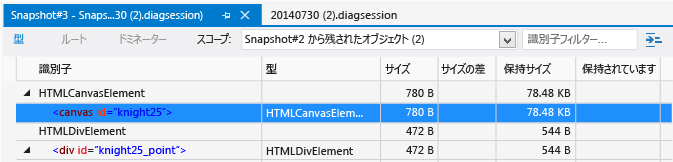
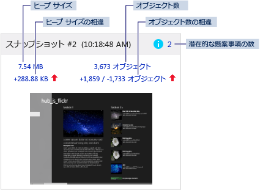
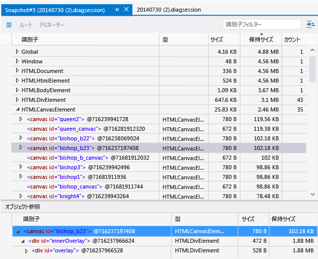
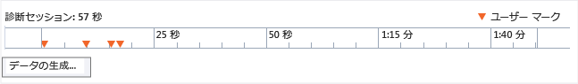

# <a name="javascript-memory"></a>[JavaScript メモリ]
Visual Studio に用意されている JavaScript メモリ アナライザーは、メモリ使用量を把握し、JavaScript を使用して Windows 用に開発されたストア アプリのメモリ リークを検出するのに役立ちます。 サポートされるアプリには、Windows Phone ストアおよび Windows ストア向けのアプリが含まれます。  
  
 JavaScript メモリ アナライザーは、次の機能を提供します。  
  
-   最も関連性の高いデータを強調することで、アプリのメモリ使用量の問題を迅速に見つけるのに役立ちます。  
  
     このデータは、2 つのスナップショットの相違を示し、より詳細なビューへのリンクを示す、スナップショットの概要で取得します。  
  
-   問題の特定に役立つ、ドミネーター、種類、およびルートのビューを提供します。  
  
-   JavaScript ヒープ データ内の非実用的な情報を減らします。  
  
     アプリ コードで直接作成されないオブジェクトは自動的にフィルターで除外されます。 また、オブジェクト名に基づいてデータをフィルター処理できます。  
  
 動作中のアプリのメモリ リークを識別するプロセスを紹介したチュートリアルについては、「[チュートリアル: メモリ リークの検出 (JavaScript)](../profiling/walkthrough-find-a-memory-leak-javascript.md)」をご覧ください。  
  
 このトピックの内容  
  
 [JavaScript メモリ アナライザーの実行](#Run)   
 [メモリの使用量の確認](#Check)   
 [メモリ リークの特定](#Isolate)   
 [実行中のメモリ使用量の概要の表示](#LiveMemory)   
 [スナップショットの概要の表示](#SnapshotSummary)   
 [スナップショットの詳細の表示](#SnapshotDetails)   
 [スナップショットの相違の表示](#SnapshotDiff)   
 [ドミネーターごとのオブジェクトの表示](#FoldObjects)   
 [識別子によるデータのフィルター](#Filter)   
 [オブジェクト ツリーでのオブジェクトの検索](#ShowInRootsView)   
 [共有されたオブジェクト参照の表示](#References)   
 [組み込みオブジェクトの表示](#BuiltInValues)   
 [診断セッション ファイルの保存](#Save)   
 [ソース コードとメモリ使用量データの関連付け](#JSConsoleCommands)   
 [メモリの問題を識別するためのヒント](#Tips)  
  
##  <a name="a-nameruna-run-the-javascript-memory-analyzer"></a><a name="Run"></a> JavaScript メモリ アナライザーの実行  
 メモリ アナライザーは、動作中の Windows ストア アプリが Visual Studio で開かれているか、[!INCLUDE[win8](../debugger/includes/win8_md.md)] 以降を実行しているコンピューターにインストールされている場合に使用できます。  
  
#### <a name="to-run-the-memory-analyzer"></a>メモリ アナライザーを実行するには  
  
1.  Visual Studio を開きます。  
  
2.  アプリを Visual Studio から実行している場合は、 **[標準]** ツール バーの **[デバッグの開始]** の一覧から、プロジェクト用にデバッグ ターゲットを選択します (Windows Phone エミュレーター、または Windows ストア アプリの場合は **ローカル コンピューター**、 **シミュレーター**、または **リモート コンピューター**)。  
  
     これらのオプションの詳細については、[Visual Studio からのアプリの実行](../debugger/run-store-apps-from-visual-studio.md)に関する記事をご覧ください。  
  
3.  メニュー バーで、**[デバッグ]**、**[パフォーマンス プロファイラー...]** の順にクリックします。  
  
     既定では、現在のスタートアップ プロジェクトが分析されます。 分析ターゲットを変更する場合は、 **[ターゲットの変更]**を選択します。  
  
       
  
     分析ターゲットに対して、次のオプションを使用できます。  
  
    -   **[スタートアップ プロジェクト]**。 現在のスタートアップ プロジェクトを分析します。 アプリをリモート コンピューターで実行している場合は、既定のこのオプションを選択する必要があります。  
  
    -   **[実行中のアプリ]**。 実行中の Windows ストア アプリの一覧からアプリを選択できます。 このオプションは、アプリをリモート コンピューターで実行している場合は使用できません。  
  
         このオプションを使用すると、ソース コードにアクセスできないときに、コンピューター上で実行されているアプリのメモリ使用量を分析できます。  
  
    -   **[インストールされているアプリ]**。 インストールされている Windows ストア アプリの中から分析するアプリを選択できます。 このオプションは、アプリをリモート コンピューターで実行している場合は使用できません。  
  
         このオプションを使用すると、ソース コードにアクセスできないときに、コンピューターにインストールされているアプリのメモリ使用量を分析できます。 このオプションは、自分が開発に携わっていないアプリのメモリ使用量を分析する場合にも便利です。  
  
4.  **[使用可能なツール]**で、 **[JavaScript メモリ]** チェック ボックスをオンにし、 **[開始]**をクリックします。  
  
5.  メモリ アナライザーの起動時に、Visual Studio ETW Collector.exe を実行するためのアクセス許可を要求するユーザー アカウント制御ウィンドウが表示される場合があります。 **[はい]**をクリックします。  
  
     以降のセクションの説明に従って、アプリを操作して関連するメモリ使用量シナリオをテストし、メモリ グラフを確認します。  
  
6.  Alt キーを押しながら Tab キーを押して Visual Studio に切り替えます。  
  
7.  メモリ アナライザーによって収集されたデータを表示するには、 **[ヒープ スナップショットの作成]**をクリックします。 このトピックで後述する「 [View a snapshot summary](#SnapshotSummary) 」を参照してください。  
  
##  <a name="a-namechecka-check-memory-usage"></a><a name="Check"></a> メモリの使用量の確認  
 JavaScript メモリ アナライザーのさまざまなビューを使用して、メモリ リークを識別することができます。 アプリでメモリ リークが発生している可能性がある場合には、「 [Isolate a memory leak](#Isolate) 」を参照して、推奨されるワークフローを確認します。  
  
 アプリケーションのメモリ リークを特定するには、次のビューを使用します。  
  
-   [実行中のメモリ使用量の概要を表示](#LiveMemory)します。 メモリ使用量グラフを使用して、特定の操作によって発生している、メモリ使用量の突然の上昇や継続的な増加がないかどうかを調べます。 実行中のメモリ使用量の概要ビューを使用して、ヒープのスナップショットを取得します。 スナップショットはメモリ使用量グラフの下にコレクションとして表示されます。  
  
    > [!TIP]
    >  スナップショットを取得すると、メモリ使用量の急な増加がわかります。 より正確な増加量を確認するには、スナップショットの概要を使用します。  
  
-   [スナップショットの概要を表示](#SnapshotSummary)します。 メモリ プロファイルのセッション中またはその後で、スナップショットの概要情報を表示できます。 スナップショットの概要を使用して、スナップショットの詳細とスナップショットの相違ビューをリンクします。  
  
    > [!TIP]
    >  通常、スナップショットの比較ビューは、メモリ リークに関する有益な情報を提供します。  
  
-   [スナップショットの詳細を表示](#SnapshotDetails)します。 単一のスナップショットの詳細なメモリ使用量データを示します。  
  
-   [スナップショットの相違を表示](#SnapshotDiff)します。 スナップショット間の差分値を示します。 これらのビューは、オブジェクトのサイズや数の違いを示します。  
  
##  <a name="a-nameisolatea-isolate-a-memory-leak"></a><a name="Isolate"></a> メモリ リークの特定  
 以下の手順は、JavaScript メモリ アナライザーをより効果的に使用するために役立つワークフローです。 これらの手順は、アプリケーションでメモリ リークが発生している可能性がある場合に役立ちます。 動作中のアプリのメモリ リークを識別するプロセスを紹介したチュートリアルについては、「[チュートリアル: メモリ リークの検出 (JavaScript)](../profiling/walkthrough-find-a-memory-leak-javascript.md)」をご覧ください。  
  
1.  Visual Studio でアプリを開きます。  
  
2.  JavaScript メモリ アナライザーを実行します。 詳細については、「 [JavaScript メモリ アナライザーの実行](#Run)」を参照してください。  
  
3.  テストするシナリオでアプリを実行します。 たとえばシナリオには、特定のページが読み込まれるときやアプリケーションが開始されるときの DOM の大きな変異などが含まれます。  
  
4.  シナリオを 1 ～ 4 回追加で繰り返します。  
  
    > [!TIP]
    >  テスト シナリオを数回繰り返すことにより、結果から初期化作業をフィルターで除外することができます。  
  
5.  Visual Studio に切り替えます (Alt + Tab キーを押します)。  
  
6.  **[ヒープ スナップショットの作成]**をクリックして、ベースラインのヒープ スナップショットを作成します。  
  
     次の図は、ベースライン スナップショットの一例を示しています。  
  
       
  
    > [!TIP]
    >  スナップショットのタイミングをより細かく制御する場合は、 [Associate source code with memory usage data](#JSConsoleCommands) コマンドをコードで使用します。  
  
7.  アプリに切り替え、テストするシナリオを繰り返します (1 度だけ繰り返す)。  
  
8.  Visual Studio に切り替え、2 番目のスナップショットを作成します。  
  
9. アプリに切り替え、テストするシナリオを繰り返します (1 度だけ繰り返す)。  
  
10. Visual Studio に切り替え、3 番目のスナップショットを作成します。  
  
     次の図は、2 番目と&3; 番目のスナップショットの一例を示しています。  
  
       
  
     このワークフローでベースライン、2 番目、および&3; 番目のスナップショットを作成することにより、メモリ リークに関連付けられていない変更をフィルターで除外しやすくなります。 たとえば、ページのヘッダーやフッターの更新などがある場合、メモリ使用量には変化があっても、メモリ リークには無関係である場合があります。  
  
11. 3 番目のスナップショットから、いずれかの相違表示へのリンクを選択します。  
  
    -   相違ヒープ サイズ (ヒープ サイズの左下のリンク)。 このリンク テキストは、現在のスナップショットのヒープ サイズと前のスナップショットのヒープ サイズとの相違を示しています。  
  
    -   相違オブジェクト カウント (オブジェクト カウントの右下のリンク) このリンク テキストは、2 つの値を示します (例: +1858 / -1765)。最初の値は、前のスナップショットから追加された新しいオブジェクトの数です。2 番目の値は、前のスナップショットから削除されたオブジェクトの数です。  
  
     これらのリンクは、ヒープの種類の相違スナップショット詳細ビューを開き、開いたリンクに応じて、保持サイズまたはオブジェクト カウントで並べ替えられます。  
  
12. 次のいずれかの **スコープ** フィルター オプションを選択して、メモリ使用量の問題を特定します。  
  
    -   **スナップショット #2 から残されたオブジェクト**。  
  
    -   **スナップショット #2 および #3 の間に追加されたオブジェクト**  
  
    > [!TIP]
    >  前のスナップショットから残されたオブジェクトのフィルターされたビューを使用して、メモリ リークを調査します。 たとえば、相違オブジェクト カウントが +205 / -195 の場合、このビューには 10 個のオブジェクトが残されていることを示しており、メモリ リークの候補となります。  
  
     次の図は、スナップショット #2 から残されたオブジェクトの相違ビューを示しています。  
  
       
  
     前の図では、2 個のオブジェクトが前のスナップショットから残されていることがわかります。 この特定のアプリで予期された動作かどうかを調査します。 予期されない動作の場合は、メモリ リークを示している可能性があります。  
  
13. グローバル オブジェクトが原因でガベージ コレクトされない場合、比較ビューでオブジェクトがそのグローバル オブジェクトをルートとしている場所を調べるには、オブジェクトのショートカット メニューを開き、 **[ルート ビューで表示]**をクリックします。 多数のオブジェクトが、グローバル オブジェクトにルートしている単一のオブジェクト (または少数のオブジェクト) によって参照されるため、メモリに保持されている場合があります。  
  
14. 残されたオブジェクトのビューにあるオブジェクトが多すぎる場合、メモリ リークが生じている期間をさらに特定して、3 つのスナップショットを再度作成します。 さらにメモリ リークを特定するには、 [Associate source code with memory usage data](#JSConsoleCommands)、 [Associate source code with memory usage data](#JSConsoleCommands)、 and other memory usage data available in the memory analyzer.  
  
##  <a name="a-namelivememorya-view-live-memory-usage-summary"></a><a name="LiveMemory"></a> 実行中のメモリ使用量の概要の表示  
 実行中のメモリ使用量の概要ビューは、実行中のアプリおよびすべてのスナップショット概要タイルのコレクションのメモリ使用量グラフを示します。 このビューでは、スナップショットの取得、概要情報の分析、他のビューへの移動など、基本的なタスクを実行できます。 データ収集を停止すると、メモリ グラフは表示されなくなり、[ [View a snapshot summary](#SnapshotSummary) ] ビューのみが表示されます。  
  
 メモリ グラフには、プライベート バイト、ネイティブ メモリ、および JavaScript ヒープを含むアプリのプロセスのメモリのライブ ビューが示されます。 メモリ グラフは、プロセス メモリのスクロール可能なビューです。 次のように表示されます。  
  
   
  
 ユーザー マークがアプリ コードに追加されている場合は (「 [Associate source code with memory usage data](#JSConsoleCommands)」参照)、コードの該当セクションにいつ到達したかを示す下向きの三角形がメモリ使用量グラフに表示されます。  
  
 メモリ グラフに示されるメモリの一部は、JavaScript ランタイムによって割り当てられます。 アプリでこのメモリの使用を制御することはできません。 グラフに表示されるメモリ使用量は、最初のスナップショットを取得したときに増加し、その後は追加のスナップショットを取得するたびに最小限増加します。  
  
##  <a name="a-namesnapshotsummarya-view-a-snapshot-summary"></a><a name="SnapshotSummary"></a> スナップショットの概要の表示  
 アプリのメモリ使用量に関する現在の状態のスナップショットを取得するには、メモリ グラフで **[ヒープ スナップショットの作成]** をクリックします。 スナップショットの概要タイルは、実行中のメモリ使用量の概要 (アプリの実行時) とスナップショットの概要 (アプリの停止時) の両方に表示されます。 このタイルに、JavaScript ヒープに関する情報と、詳細情報へのリンクが示されます。 複数のスナップショットを取得した場合、前のスナップショットのデータと比較した追加情報が提供されます。  
  
> [!NOTE]
>  JavaScript メモリ アナライザーは、スナップショットを取得する前にガベージ コレクションを強制的に実行します。 これにより、実行間における結果の一貫性が高まります。  
  
 複数のスナップショットを取得した場合のスナップショットの概要の例を次に示します。  
  
   
  
 スナップショットの概要には、次の情報が表示されます。  
  
-   スナップショットのタイトルとタイムスタンプ。  
  
-   潜在的な懸案事項の数 (青のアイコン)。 ノードが DOM にアタッチされていないなど、メモリに関する潜在的な懸案事項がある場合に、その数が表示されます。 この数値はスナップショットの種類ビューにリンクしています。このビューでは、データが懸案事項の種類に基づいて並べ替えられ、潜在的な懸案事項が強調表示されます。 また、懸案事項のツールヒントが表示されます。  
  
-   ヒープ サイズ。 この数値には、JavaScript ランタイム エンジンによって JavaScript ヒープに追加された DOM 要素およびオブジェクトが含まれます。 ヒープ サイズは、スナップショットの種類ビューにリンクしています。  
  
-   ヒープ サイズの相違。 この値は、現在のスナップショットのヒープ サイズと前のスナップショットのヒープ サイズとの相違を示しています。 メモリが増加している場合は値の後に赤の上矢印が表示され、メモリが減少している場合は緑の下矢印が表示されます。 スナップショットのヒープ サイズに変化がない場合は、数値の代わりに **[変更なし]** というテキストが表示されます。 最初のスナップショットの場合は、 **[ベースライン]**というテキストが表示されます。 ヒープ サイズの相違の値は、スナップショットの相違の [種類] ビューにリンクしています。  
  
-   オブジェクトの数。 この値は、アプリで作成されたオブジェクトのみを示します。 JavaScript ランタイムによって作成された組み込みオブジェクトは除外されています。 オブジェクトの数は、スナップショットの詳細の種類ビューにリンクしています。  
  
-   オブジェクトの数の相違。 これは、2 つの値を示します。最初の値は、前のスナップショットから追加された新しいオブジェクトの数です。2 番目の値は、前のスナップショットから削除されたオブジェクトの数です。 たとえば、この図では、スナップショット #1 以降に、1,859 個のオブジェクトが追加され、1,733 個のオブジェクトが削除されています。 オブジェクトの総数が増加している場合はこの情報の後に赤の上矢印が表示され、減少している場合は緑の下矢印が表示されます。 オブジェクトの数に変化がない場合は、数値の代わりに **[変更なし]** というテキストが表示されます。 最初のスナップショットの場合は、 **[ベースライン]**というテキストが表示されます。 オブジェクトの数の相違の値は、スナップショットの相違の種類ビューにリンクしています。  
  
-   スナップショットの取得時の画面のスクリーンショット。  
  
##  <a name="a-namesnapshotdetailsa-view-snapshot-details"></a><a name="SnapshotDetails"></a> スナップショットの詳細の表示  
 スナップショットの詳細ビューでは、各スナップショットのメモリの使用に関する詳細情報を表示できます。  
  
 スナップショットの詳細ビューは、スナップショットの概要ビューでリンクをクリックすると表示されます。 たとえば、ヒープ サイズのリンクをクリックすると、スナップショットの詳細が表示され、既定で種類ビューが開きます。  
  
 スナップショットの詳細の [種類] ビューを次に示します。このビューでは、メモリ使用量データが保持サイズに基づいて並べ替えられています。  
  
   
  
 スナップショットの詳細ビューでは、ツール バーでオプションを選択することで、種類、ルート、またはドミネーター別にメモリ使用量データを確認できます。  
  
-   **種類**: オブジェクトの種類別に、ヒープのオブジェクトのインスタンスの数と合計サイズが表示されます。 既定では、これらはインスタンスの数の順に並べ替えられます。  
  
    > [!TIP]
    >  通常、オブジェクト ヒープの種類の相違ビューは、メモリ リークを特定するのに最も有益なビューです。これらのビューは **スコープ** フィルターを提供し、残されたオブジェクトを特定するのに役立ちます。  
  
-   **ルート**: ルート オブジェクトから子の参照までのオブジェクトが階層形式で表示されます。 既定では、子ノードは保持サイズ列を基準に、保持サイズが大きいものから順に並べられます。  
  
-   **ドミネーター**: 他のオブジェクトへの排他的参照があるヒープのオブジェクトの一覧が表示されます。 ドミネーターは保持サイズ順に並べ替えられます。  
  
    > [!TIP]
    >  ドミネーターをメモリから削除すると、そのオブジェクトが保持しているすべてのメモリが解放されます。 アプリによっては、ドミネーター ビューが、保持メモリ サイズを明確にする場合があります。オブジェクト参照チェーン全体を調査できるからです。  
  
 3 つのいずれのビューでも同様の種類の値が示されます。  
  
-   **[識別子]**: オブジェクトを識別する名前。 たとえば、HTML 要素に対しては、ID 属性値が表示されます (使用する場合)。  
  
-   **[種類]**。 オブジェクトの種類 (HTML の link 要素や div 要素など)。  
  
-   **[サイズ]**: オブジェクトのサイズ (参照されたオブジェクトのサイズは含まれません)。  
  
-   **[保持サイズ]**。 オブジェクトのサイズと他の親を持たないすべての子オブジェクトのサイズの合計。 扱いやすいように、この合計はオブジェクトが保持しているメモリの量を表しており、オブジェクトを削除すると指定された量のメモリが解放されます。  
  
-   **カウント**: オブジェクトのインスタンスの数。 この値は、種類ビューにのみ表示されます。  
  
##  <a name="a-namesnapshotdiffa-view-a-snapshot-diff"></a><a name="SnapshotDiff"></a> スナップショットの相違の表示  
 JavaScript メモリ アナライザーでは、スナップショットの相違ビューでスナップショットとその前のスナップショットとを比較できます。  
  
 スナップショットの詳細の相違を表示するには、複数のスナップショットを取得した後で、スナップショットの概要ビューで、異なるヒープ サイズまたは異なるオブジェクトの数のリンクをクリックします。  
  
 種類、ルート、およびドミネーターに関する相違情報を表示できます。 スナップショットの相違表示では、2 つのスナップショットの間でヒープに追加されたオブジェクトなどの情報が表示されます。  
  
 スナップショットの相違の種類ビューを次に示します。  
  
   
  
 スナップショットの相違ウィンドウでは、[ドミネーター]、[種類]、[ルート] の各ビューは、[ [スナップショットの詳細の表示](#SnapshotDetails) ] ウィンドウと同じです。 スナップショットの相違では、スナップショットの詳細と同じ情報に加えて、次の追加の値が表示されます。  
  
-   **[サイズの相違]**。 現在のスナップショットと前のスナップショットとの間のオブジェクトのサイズの相違 (参照されたオブジェクトのサイズは含まれません)。  
  
-   **[保持サイズの相違]**。 現在のスナップショットと前のスナップショットとの間のオブジェクトの保持サイズの相違。 保持サイズには、オブジェクトのサイズと他の親を持たないすべての子オブジェクトのサイズが含まれます。 扱いやすいように、この保持サイズはオブジェクトが保持しているメモリの量を表しており、オブジェクトを削除すると指定された量のメモリが解放されます。  
  
 スナップショット間で相違情報をフィルターするには、相違ビューの上部でいずれかの **スコープ** フィルターを選択します。  
  
-   **スナップショット #\<number> から残されたオブジェクト**。 このフィルターは、ヒープに追加されたオブジェクトとヒープから削除されたオブジェクトの相違を、ベースライン スナップショットおよび前のスナップショットと比較して示します。 たとえば、スナップショットの概要でオブジェクトの数が +205 / -195 を示している場合、このフィルターは、追加され削除されなかった&10; 個のオブジェクトを示します。  
  
    > [!TIP]
    >  このフィルターで最も有益な情報を表示するには、以下に説明する手順に従います。 [Isolate a memory leak](#Isolate)  
  
-   **スナップショット #\<number> および #\<number> の間に追加されたオブジェクト**。 このフィルターは、前のスナップショットからヒープに追加されたすべてのオブジェクトを示します。  
  
-   **スナップショット #\<number> のすべてのオブジェクト**。 このフィルター設定では、ヒープのオブジェクトはフィルターで除外されません。  
  
 現在の **[スコープ]** フィルターと一致しないオブジェクト参照を表示する場合は、ペインの右上隅にある設定リスト ![メモリ アナライザーの [設定] ドロップダウン リスト](../profiling/media/js_mem_settings.png "JS_Mem_Settings") の **[一致しない参照の表示]** を選択します。 この設定を有効にすると、一致しない参照が灰色のテキストで表示されます。  
  
> [!TIP]
>  [Isolate a memory leak](#Isolate) 」の手順に従った後、 **[スコープ]** フィルターで残っているオブジェクトを使用して、メモリをリークしているオブジェクトを特定することをお勧めします。  
  
##  <a name="a-namefoldobjectsa-view-objects-by-dominator"></a><a name="FoldObjects"></a> ドミネーターごとのオブジェクトの表示  
 [種類] ビューと [ドミネーター ] ビューでは、オブジェクトをドミネーターの中に折りたたんで表示するかどうかを選択できます (これは [ドミネーター] タブの既定の表示です)。 このビューを選択すると、オブジェクトの最上位のビューにドミネーターのみが表示されます。 (非グローバル オブジェクトの下位オブジェクトは、最上位のビューでは非表示になります。)アプリによっては、データのノイズを低減することで、どのオブジェクトがメモリ リークを起こしているかを明確にすることができます。  
  
 ドミネーターごとにオブジェクトの表示を切り替えるには、 **[ドミネーターごとにオブジェクトをおりたたむ]** ボタンを選択します。   
  
 ドミネーターの詳細については、以下を参照してください。 [スナップショットの詳細の表示](#SnapshotDetails)  
  
##  <a name="a-namefiltera-filter-data-by-identifier"></a><a name="Filter"></a> 識別子によるデータのフィルター  
 ドミネーター ビューと種類ビューでは、特定の識別子を検索してデータをフィルターで除外できます。 識別子を検索するには、右上の **[識別子フィルター]** ボックスに識別子の名前を入力します。 入力を開始すると、入力した文字を含まない識別子がフィルターで除外されます。  
  
 それぞれのビューに独自のフィルターがあるため、別のビューに切り替えるとフィルターは保持されません。  
  
##  <a name="a-nameshowinrootsviewa-find-an-object-in-the-object-tree"></a><a name="ShowInRootsView"></a> オブジェクト ツリーでのオブジェクトの検索  
 種類ビューとドミネーター ビューでは、特定のオブジェクトと `Global` オブジェクトとの関係を表示できます。 `Global` オブジェクトをルートとしているオブジェクトに対してガベージ コレクションは行われません。 これにより、 `Global` のオブジェクト ツリーを検索することなく、ルート ビューで簡単に既知のオブジェクトを見つけることができます。 これを行うには、ドミネーター ビューまたは種類ビューでオブジェクトのショートカット メニューを開き、 **[ルート ビューで表示]**をクリックします。  
  
##  <a name="a-namereferencesa-view-shared-object-references"></a><a name="References"></a> 共有されたオブジェクト参照の表示  
 種類ビューとドミネーター ビューの下部ペインには、共有された参照を表示するオブジェクト参照の一覧があります。 上部ペインでオブジェクトを選択すると、そのオブジェクトを指すすべてのオブジェクトがオブジェクト参照の一覧に表示されます。  
  
> [!NOTE]
>  循環参照はアスタリスク (*) および情報提供のツールチップ付きで表示され、展開することはできません。 そうでなければ、参照ツリーをウォークしたりメモリを保持しているオブジェクトを識別したりできなくなります。  
  
 同等のオブジェクトを識別するのに役立つ追加のヘルプを表示するには、上部ペインの右上隅にある設定リスト ![メモリ アナライザーの [設定] ドロップダウン リスト](../profiling/media/js_mem_settings.png "JS_Mem_Settings") の **[オブジェクト ID の表示]** をクリックします。 このオプションをクリックすると、 **[識別子]** の一覧のオブジェクト名の横にオブジェクト ID が表示されます (オブジェクト参照の一覧だけでなくすべてのビューに表示されます)。 同じ ID を持つオブジェクトは共有された参照です。  
  
 選択した項目についてのオブジェクト参照の一覧で ID を表示した例を次に示します。  
  
   
  
##  <a name="a-namebuiltinvaluesa-show-built-in-objects"></a><a name="BuiltInValues"></a> 組み込みオブジェクトの表示  
 ドミネーター ビューと種類ビューには、既定では、アプリで作成するオブジェクトのみが表示されます。 これは、不要な情報を除外したり、アプリ関連の問題を特定したりするのに役立ちます。 ただし、JavaScript ランタイムによってアプリ用に生成されたすべてのオブジェクトを表示すると便利な場合もあります。  
  
 これらのオブジェクトを表示するには、ペインの右上隅にある設定リスト ![メモリ アナライザーの [設定] ドロップダウン リスト](../profiling/media/js_mem_settings.png "JS_Mem_Settings") の **[組み込み要素の表示]** をクリックします。  
  
##  <a name="a-namesavea-save-diagnostic-session-files"></a><a name="Save"></a> 診断セッション ファイルの保存  
 診断スナップショットの概要とそれに関連する詳細ビューは、.diagsession ファイルとして保存されます。 **ソリューション エクスプローラー** では、前の診断のセッションが診断セッション フォルダーに表示されます。 **ソリューション エクスプローラー**で、前のセッションを開く操作、ファイルの削除、またはファイル名の変更を行うことができます。  
  
##  <a name="a-namejsconsolecommandsa-associate-source-code-with-memory-usage-data"></a><a name="JSConsoleCommands"></a> ソース コードとメモリ使用量データの関連付け  
 メモリの問題があるコードのセクションを特定するには、次の方法に従います。  
  
-   詳細ビューと差分ビューで DOM 要素のクラス名と ID を探します。  
  
-   詳細ビューと差分ビューでソース コードに関連付けられている可能性がある文字列値を探します。  
  
-   [オブジェクト ツリーでのオブジェクトの検索](#ShowInRootsView) 」コマンドを使用してオブジェクト ツリーをウォークします。 これにより、関連付けられているソース コードを識別できることがあります。  
  
-   メモリ アナライザーのコマンドをソース コードに追加します。  
  
 ソース コードで使用できるコマンドを次に示します。  
  
-   `console.takeHeapSnapshot` は、JavaScript メモリ アナライザーに表示されるヒープのスナップショットを取得します。 このコマンドは、[JavaScript コンソール コマンド](../debugger/javascript-console-commands.md)の&1; つです。  
  
-   `performance.mark` は、アプリの実行時に概要ビューのメモリ グラフのタイムラインに表示されるユーザー マーク (下向きの三角形) を設定します。 このコマンドは、1 つの文字列引数を受け取ります。この引数は、イベントを記述し、メモリ グラフのツールヒントとして表示されます。 この説明は 100 文字以下にする必要があります。  
  
> [!TIP]
>  `console.takeHeapSnapshot` を使用すると、メモリ使用量シナリオを繰り返す場合に、分析を高速化できます。  
  
 これらのコマンドをアプリに追加した場合、JavaScript メモリ アナライザー以外でアプリを実行すると例外がスローされます。 ただし、コマンドが存在するかどうかを使用前にテストすることができます  (これらのコマンドはセッションの開始フェーズの時点では存在しません)。`takeHeapSnapshot` を安全に呼び出すことができるかどうかをチェックするには、次のコードを使用します。  
  
```javascript  
if (console && console.takeHeapSnapshot) {  
    console.takeHeapSnapshot();  
}  
```  
  
 `performance.mark` を安全に呼び出すことができるかどうかをチェックするには、次のコードを使用します。  
  
```javascript  
if (performance && performance.mark) {  
    performance.mark("message_string");  
}  
  
```  
  
 いくつかのユーザー マークが表示されたメモリ グラフを次に示します。現在選択されているユーザー マークに対するツールヒントの `performance.mark` 文字列引数は "data generated" に設定されています。  
  
   
  
##  <a name="a-nametipsa-tips-for-identifying-memory-issues"></a><a name="Tips"></a> メモリの問題を識別するためのヒント  
  
-   「[メモリ リークの特定](#Isolate)」で説明するワークフローに従って、差分ビューの **[スナップショット #\<number> から残されたオブジェクト]** フィルターを使用して、メモリ リークの可能性の高い候補を特定します。  
  
-   [オブジェクト ツリーでのオブジェクトの検索](#ShowInRootsView) 」を使用すると、オブジェクトがメモリ階層内のどこで参照されているかを確認できます。 ルート ビューは、オブジェクトがどのようにグローバル オブジェクトをルートとしているかを示します。これにより、グローバル オブジェクトはガベージ コレクトされなくなります。  
  
-   メモリに関する問題の原因を特定するのが難しい場合、特にビューに表示される他の多くのオブジェクトへの参照を含む&1; つのオブジェクト (または少数のオブジェクト) を特定するために、さまざまなビュー (種類やドミネーター) を使用して共通点を探します。  
  
-   ユーザーが新しいページに移動した後も誤ってメモリに保持されているオブジェクトを検索します。これは、一般的なメモリの問題の原因です。 次に例を示します。  
  
    -   [URL.CreateObjectUrl](http://msdn.microsoft.com/library/windows/apps/hh453196.aspx) 関数の不適切な使用により、この問題が発生する場合があります。  
  
    -   一部のオブジェクトは `dispose` メソッドおよび使用の推奨を提供する場合があります。 たとえば、一覧から `dispose` メソッドを呼び出して、ページから移動した場合には、 [WinJS.Binding.List](http://msdn.microsoft.com/library/windows/apps/Hh700774.aspx) で `createFiltered` を呼び出す必要があります。  
  
    -   1 つ以上のイベント リスナーを削除する必要が生じる場合があります。 詳細については、「[DOM イベント リスナーの表示](../debugger/view-dom-event-listeners.md)」をご覧ください。  
  
-   JavaScript メモリ アナライザーについては、この Build 2013 カンファレンスの [ビデオ](http://channel9.msdn.com/Events/Build/2013/3-316) の後半部分をご覧ください。  
  
-   [Managing memory in Windows Store apps (Windows ストア アプリでメモリを管理する)](http://msdn.microsoft.com/magazine/jj651575.aspx)を参照してください。  
  
-   問題を特定するためにコードを一時的に変更することを検討してください。 たとえば、次の操作を行います。  
  
    -   メモリ アナライザー用の `console.takeSnapshot` コマンドと `performance.mark`コマンドを使用します (「 [Associate source code with memory usage data](#JSConsoleCommands)」を参照)。  
  
         これらのコマンドを使用すると、手動でヒープ スナップショットを作成しても特定できない問題を特定するのに役立ちます。  
  
    -   JavaScript メモリ アナライザーのビュー (種類ビューなど) でテスト オブジェクトを作成してトレースします。 たとえば、非常に大きいオブジェクトを別のオブジェクトにアタッチすることで、特定のオブジェクトまたは要素に対してガベージ コレクションが行われたかどうかを確認できます。  
  
## <a name="see-also"></a>関連項目  
 [チュートリアル: メモリ リークの検出 (JavaScript)](../profiling/walkthrough-find-a-memory-leak-javascript.md)
