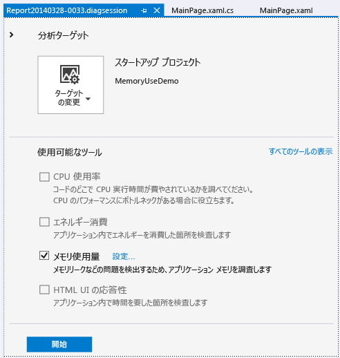
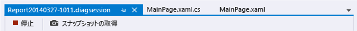
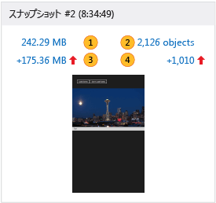
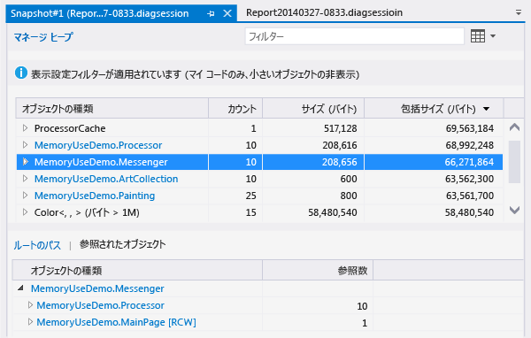
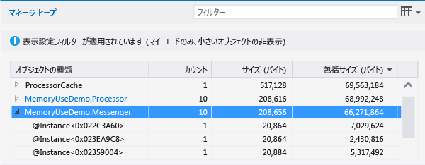
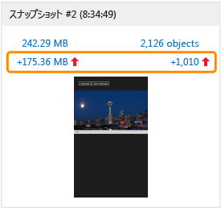

# Visual Studio デバッガーを使わずにメモリ使用量を分析する
デバッグなしの**メモリ使用量**ツールを使用して、次のような操作を行えます  
  
-   シナリオの開発中に Visual Studio 内でのアプリのメモリ使用量が適切かどうかを監視します。  
  
-   アプリのメモリの状態の詳しいスナップショットを作成します。  
  
-   スナップショットを比べて、メモリの問題の根本原因を見つけます。  
  
 このトピックでは、メモリ使用量ツールを使って UWP XAML アプリを分析する方法について説明します。 JavaScript と HTML を使用する UWP アプリでのメモリ使用量を分析する場合、[メモリ使用量の分析 (JavaScript)](../profiling/javascript-memory.md) に関する記事をご覧ください。  
  
##   メモリ使用量診断セッションの開始  
  
1.  Visual Studio で、C# のユニバーサル Windows プロジェクトを開きます。  
  
2.  メニュー バーで、**[デバッグ]、[パフォーマンス プロファイラー...]** の順にクリックします。  
  
3.  **[メモリ使用量]** を選択し、ページの下部にある **[開始]** ボタンをクリックします。  
  
       
  
##   メモリ使用量の監視  
 **[メモリ使用量]** ツールを使って、問題の検出と修正に使える詳しいレポートを生成できますが、現に開発中のシナリオがメモリに及ぼす影響をリアルタイムで調べることもできます。  
  
 診断セッションを開始すると、アプリが起動し、**診断ツール** ウィンドウにアプリのメモリ使用量のタイムライン グラフが表示されます。  
  
   
  
 タイムライン グラフには、アプリ実行中のメモリの変動が表示されます。 グラフの急な上下動は、通常、何らかのコードがデータを収集または作成し、処理が終わったときにデータを破棄していることを示します。 大きな上下動は、最適化できる可能性がある領域を示しています。 より重大な問題は、使われたまま返されないメモリが増えることです。これは、メモリが効率的に使われていないか、メモリ リークが起きていることを示しているからです。  
  
###   監視セッションを閉じる  
   
  
 レポートを作成せずに監視セッションを停止する場合は、単に診断ウィンドウを閉じます。 メモリのスナップショットを取ったときにレポートを生成するには、**[停止]** をクリックします。  
  
##   アプリのメモリ状態のスナップショットを取る  
 調べる必要があるメモリの問題を見つけた場合は、特定の瞬間にメモリ内のオブジェクトをキャプチャするため、診断セッション中にスナップショットを取ることができます。 アプリではさまざまな型のオブジェクトが大量に使われるため、1 つのシナリオを集中的に分析することをお勧めします。 さらに、メモリの問題が起きる前にアプリのベースライン スナップショットを取り、初めて問題が起きた後でもう 1 回スナップショットを取り、さらにシナリオを反復できる場合は追加のスナップショットを 1 つ以上取ることをお勧めします。  
  
 スナップショットを収集するには、新しい診断セッションを開始します。 メモリのデータをキャプチャしたいときは **[スナップショットの取得]** をクリックします。 レポートを生成するには、**[停止]** をクリックします。  
  
##   メモリ使用量の概要ページ  
 データ コレクションを停止すると、メモリ使用量ツールはアプリを停止し、概要レポートが表示されます。  
  
   
  
###   メモリ使用量のスナップショット ビュー  
 Visual Studio の新しいウィンドウで詳しいレポートを開くには、スナップショット ビューを使います。 スナップショット ビューには次の 2 種類があります。  
  
-   [スナップショットの詳細レポート](../profiling/memory-usage-without-debugging2.md#BKMK_Snapshot_details_reports)には、1 つのスナップショットに含まれる型とインスタンスが表示されます。  
  
-   [スナップショットの相違 (diff) レポート](../profiling/memory-usage-without-debugging2.md#BKMK_Snapshot_difference__diff__reports)では、2 つのスナップショットに含まれる型とインスタンスが比較されます。  
  
   
  
 スナップショット ビューの画像に番号を付けて示した項目は、メモリ使用量レポートのビューを開くリンクです。  
  
|||  
|-|-|  
||このリンク テキストは、スナップショット取得時のメモリ内の合計バイト数を示します。   このリンクをクリックすると、スナップショットの詳細レポートが各型のインスタンスの合計サイズ順に並べ替えて表示されます。|  
||このリンク テキストは、スナップショット取得時にメモリに含まれていたオブジェクトの総数を示します。   このリンクをクリックすると、スナップショットの詳細レポートが各型のインスタンス数の順に並べ替えて表示されます。|  
||このリンク テキストは、このスナップショットを取った時点のメモリに含まれていたオブジェクトの合計サイズと前のスナップショットの合計サイズとの差を示します。   このリンク テキストは、このスナップショットのメモリサイズが前のサイズより大きい場合は正の数、小さい場合は負の数になります。 **[ベースライン]** というリンク テキストは、このスナップショットが診断セッションの最初のスナップショットであることを示します。**[相違なし]** は、差がゼロであることを示します。   このリンクをクリックすると、スナップショットの相違レポートが各型のインスタンスの合計サイズの差の順に並べ替えて表示されます。|  
||このリンク テキストは、このスナップショットに含まれるメモリ オブジェクトの総数と前のスナップショットのオブジェクト数との差を示します。   このリンクをクリックすると、スナップショットの相違レポートが各型のインスタンスの総数の差の順に並べ替えて表示されます。|  
  
##   スナップショットのレポート  
   
  
###   スナップショットのレポート ツリー  
  
####   マネージ ヒープ  
 マネージ ヒープのツリー [[マネージ ヒープ] ツリー (スナップショットの詳細)](../profiling/memory-usage-without-debugging2.md#BKMK_Managed_Heap_tree__Snapshot_details_) と [[マネージ ヒープ] ツリー (スナップショットの相違)](../profiling/memory-usage-without-debugging2.md#BKMK_Managed_Heap_tree__Snapshot_diff_) には、レポートに含まれる型とインスタンスが表示されます。 種類またはインスタンスを選ぶと、選んだ項目の **[ルートのパス]** ツリーと **[参照されたオブジェクト]** ツリーが表示されます。  
  
####   ルートのパス  
 [[ルートのパス] ツリー (スナップショットの詳細)](../profiling/memory-usage-without-debugging2.md#BKMK_Paths_to_Root_tree__Snapshot_details_) と [[ルートのパス] ツリー (スナップショットの相違)](../profiling/memory-usage-without-debugging2.md#BKMK_Paths_to_Root_tree__Snapshot_diff_) には、種類またはインスタンスを参照するオブジェクトのチェーンが表示されます。 .NET Framework のガベージ コレクターは、オブジェクトへの参照がすべて解放された場合にのみ、オブジェクトのメモリをクリーンアップします。  
  
####   参照されたオブジェクト  
 [[参照されたオブジェクト] ツリー (スナップショットの詳細)](../profiling/memory-usage-without-debugging2.md#BKMK_Referenced_Objects_tree__Snapshot_details_) と [[参照されたオブジェクト] ツリー (スナップショットの相違)](../profiling/memory-usage-without-debugging2.md#BKMK_Referenced_Objects_tree__Snapshot_diff_) には、選んだ種類またはインスタンスによって参照されるオブジェクトが表示されます。  
  
###   [オブジェクトの種類] フィールドと [オブジェクト インスタンス] フィールド  
 **[オブジェクトの種類]** エントリに子エントリがある場合は、矢印アイコンをクリックして子エントリを表示できます。 **[オブジェクトの種類]** のテキストが青色の場合は、テキストをクリックすればソース コード ファイル内のオブジェクトに移動できます。 ソース ファイルは別のウィンドウで開きます。  
  
 インスタンス名は、メモリ使用量ツールで生成される一意の ID です。  
  
 容易に識別できない種類に気づいた場合や、それがどのようにコードにかかわるのかわからない場合は、これはおそらく、.NET Framework、オペレーティング システム、またはコンパイラのオブジェクトであり、オブジェクトの所有権の継承にかかわるためにメモリ使用量ツールに表示されているにすぎません。  
  
###   レポート ツリーのフィルター  
 ほとんどのアプリには驚くほど多くの型が含まれていますが、そのほとんどはアプリの開発者にとってあまり重要ではありません。 **メモリ使用量**ツールには 2 つのフィルターが定義されており、**[マネージ ヒープ]** ツリーと **[ルートのパス]** ツリーでこれらの型のほとんどを非表示にできます。 型名でツリーをフィルター処理することもできます。  
  
   
  
####   フィルター  
 **[フィルター]** ボックスに文字列を入力して、指定したテキストを含む型だけをツリーに表示するよう制限します。 このフィルターでは、大文字と小文字は区別されず、指定された文字列が型名のどこかに含まれていれば認識されます。  
  
####   小さいオブジェクトの非表示  
 このフィルターを適用すると、**[サイズ (バイト)]** がスナップショット メモリの合計サイズの 0.5% を下回る型が **[マネージ ヒープ]** リストで非表示になります。  
  
####   マイ コードのみ  
 **[マイ コードのみ]** フィルターを適用すると、外部コードによって生成されたほとんどのインスタンスが非表示になります。 外部の型は、オペレーティング システムまたは Framework コンポーネントによって所有されるか、コンパイラによって生成されます。  
  
##   スナップショットの詳細レポート  
 診断セッションで得られた 1 つのスナップショットに注目する場合は、スナップショットの詳細レポートを使います。 詳細レポートを開くには、次の画像に示すように、スナップショット ビューに含まれるいずれかのリンクをクリックします。 どちらのリンクからも同じレポートが開きますが、レポート内の **[マネージ ヒープ]** ツリーを最初に表示したときの並べ替え順序だけが異なります。 どちらの場合も、レポートが開いた後で並べ替え順序を変更できます。  
  
   
  
-   **[MB]** リンクをクリックすると、**[包括サイズ (バイト)]** 列でレポートが並べ替えられます。  
  
-   **[オブジェクト]** リンクをクリックすると、**[カウント]** 列でレポートが並べ替えられます。  
  
###   [マネージ ヒープ] ツリー (スナップショットの詳細)  
 **[マネージ ヒープ]** ツリーには、メモリ内に保持されているオブジェクトの種類が一覧表示されます。 型名を展開すると、サイズ順に、その型の最大のインスタンス 10 個が表示されます。 種類またはインスタンスを選ぶと、選んだ項目の **[ルートのパス]** ツリーと **[参照されたオブジェクト]** ツリーが表示されます。  
  
   
  
|||  
|-|-|  
|**オブジェクトの種類**|型またはオブジェクト インスタンスの名前。|  
|**カウント**|型のオブジェクト インスタンス数。 インスタンスの場合、この数は常に 1 です。|  
|**サイズ (バイト)**|型の場合は、メモリのスナップショットに含まれるその型の全インスタンスのサイズ (インスタンスに含まれているオブジェクトのサイズは除く)。   インスタンスの場合は、オブジェクトのサイズ (インスタンスに含まれているオブジェクトのサイズは除く)。 インスタンス。|  
|**包括サイズ (バイト)**|型のインスタンスのサイズまたは単一インスタンスのサイズ (含まれているオブジェクトのサイズを含む)。|  
  
###   [ルートのパス] ツリー (スナップショットの詳細)  
 **[ルートのパス] ツリー**には、種類またはインスタンスを参照するオブジェクトのチェーンが表示されます。 .NET Framework のガベージ コレクターは、オブジェクトへの参照がすべて解放された場合にのみ、オブジェクトのメモリをクリーンアップします。  
  
 ![型の [ルートのパス] ツリー](../profiling/media/memuse_snapshotdetails_type_pathstoroottree.png "MEMUSE_SnapshotDetails_Type_PathsToRootTree")  
  
 **[ルートのパス]** ツリーに種類が表示されると、その種類への参照を保持する種類のオブジェクト数が **[参照数]** 列に表示されます。 この列は、インスタンスを分析するときには表示されません。  
  
###   [参照されたオブジェクト] ツリー (スナップショットの詳細)  
 **[参照されたオブジェクト]** ツリーには、選んだ種類またはインスタンスによって参照されるオブジェクトが表示されます。  
  
 ![インスタンスの [参照されたオブジェクト] ツリー](../profiling/media/memuse_snapshotdetails_referencedobjects_instance.png "MEMUSE_SnapshotDetails_ReferencedObjects_Instance")  
  
|||  
|-|-|  
|**オブジェクトの種類 / インスタンス**|型またはオブジェクト インスタンスの名前。|  
|**サイズ (バイト)**|型の場合は、その型の全インスタンスのサイズ (型に含まれているオブジェクトのサイズは除く)。   インスタンスの場合は、オブジェクトのサイズ (オブジェクトに含まれているオブジェクトのサイズは除く)。|  
|**包括サイズ (バイト)**|型のインスタンスの合計サイズまたはインスタンスのサイズ (含まれているオブジェクトのサイズを含む)。|  
  
##   スナップショットの相違 (diff) レポート  
 スナップショットの相違 (diff) レポートには、指定したスナップショットとその直前に取られたスナップショットの変更点が表示されます。 相違レポートを開くには、次の画像に示すように、スナップショット ビューに含まれるいずれかのリンクをクリックします。 どちらのリンクからも同じレポートが開きますが、レポート内の **[マネージ ヒープ]** ツリーを最初に表示したときの並べ替え順序だけが異なります。 レポートが開いた後で並べ替え順序を変更できます。  
  
   
  
-   **[MB]** リンクをクリックすると、**[包括サイズ (バイト)]** 列でレポートが並べ替えられます。  
  
-   **[オブジェクト]** リンクをクリックすると、**[カウント]** 列でレポートが並べ替えられます。  
  
###   [マネージ ヒープ] ツリー (スナップショットの相違)  
 **[マネージ ヒープ]** ツリーには、メモリ内に保持されているオブジェクトの種類が一覧表示されます。 型名を展開すると、サイズ順に、その型の最大のインスタンス 10 個が表示されます。 種類またはインスタンスを選ぶと、選んだ項目の **[ルートのパス]** ツリーと **[参照されたオブジェクト]** ツリーが表示されます。  
  
 ![差分レポートにある種類の [マネージ ヒープ] ツリー](../profiling/media/memuse_snapshotdiff_type_heap.png "MEMUSE_SnapshotDiff_Type_Heap")  
  
 この画像で、**[カウント]**、**[サイズ (バイト)]**、**[包括サイズ (バイト)]** の各列が非表示になっている点にご注意ください。  
  
|||  
|-|-|  
|**オブジェクトの種類**|型またはオブジェクト インスタンスの名前。|  
|**カウント**|指定したスナップショットに含まれる型のインスタンス数。 インスタンスの場合、**[カウント]** は常に 1 です。|  
|**数の相違**|型の場合は、指定したスナップショットと前のスナップショットとの、型のインスタンス数の差。 インスタンスの場合、このフィールドは空白です。|  
|**サイズ (バイト)**|指定したスナップショットに含まれているオブジェクトのサイズ (オブジェクトに含まれているオブジェクトのサイズは除く)。 型の場合、**[サイズ (バイト)]** と **[包含サイズ (バイト)]** は型インスタンスの合計サイズです。|  
|**合計サイズの相違 (バイト)**|型の場合は、指定したスナップショットと前のスナップショットとの、その型のインスタンスの合計サイズの差 (インスタンスに含まれているオブジェクトのサイズは除く)。 インスタンスの場合、このフィールドは空白です。|  
|**包括サイズ (バイト)**|指定したスナップショットに含まれているオブジェクトのサイズ (オブジェクトに含まれているオブジェクトのサイズを含む)。|  
|**包括サイズの相違 (バイト)**|型の場合は、指定したスナップショットと前のスナップショットとの、その型の全インスタンスのサイズの差 (オブジェクトに含まれているオブジェクトのサイズを含む)。 インスタンスの場合、このフィールドは空白です。|  
  
###   [ルートのパス] ツリー (スナップショットの相違)  
 **[ルートのパス] ツリー**には、種類またはインスタンスを参照するオブジェクトのチェーンが表示されます。 .NET Framework のガベージ コレクターは、オブジェクトへの参照がすべて解放された場合にのみ、オブジェクトのメモリをクリーンアップします。  
  
 ![差分ビューのインスタンスの [ルートのパス] ツリー](../profiling/media/memuse_snapshotdiff_pathstoroot_instance_all.png "MEMUSE_SnapshotDiff_PathsToRoot_Instance_All")  
  
###   [参照されたオブジェクト] ツリー (スナップショットの相違)  
 **[参照されたオブジェクト]** ツリーには、主要な種類またはインスタンスによって参照されるオブジェクトが表示されます。  
  
 ![インスタンスの [参照されたオブジェクト] ツリー](../profiling/media/memuse_snapshotdetails_referencedobjects_instance.png "MEMUSE_SnapshotDetails_ReferencedObjects_Instance")  
  
|||  
|-|-|  
|**オブジェクトの種類 / インスタンス**|型またはオブジェクト インスタンスの名前。|  
|**サイズ (バイト)**|インスタンスの場合は、指定したスナップショットに含まれるオブジェクトのサイズ (インスタンスに含まれているオブジェクトのサイズは除く)。   型の場合は、指定したスナップショットに含まれるその型のインスタンスの合計サイズ (インスタンスに含まれているオブジェクトのサイズは除く)。|  
|**包括サイズ (バイト)**|指定したスナップショットに含まれているオブジェクトのサイズ (オブジェクトに含まれているオブジェクトのサイズを含む)。|  
  
## 参照  
 [[JavaScript メモリ]](../profiling/javascript-memory.md)  
 [Visual Studio のプロファイル](../profiling/index.md)  
 [プロファイリング機能ツアー](../profiling/profiling-feature-tour.md)  
 [C++、C#、または Visual Basic を使った UWP アプリのパフォーマンスのベスト プラクティス](http://msdn.microsoft.com/library/windows/apps/hh750313.aspx)   
 [Visual Studio で新しいメモリ使用量ツールでメモリの問題を診断する](http://go.microsoft.com/fwlink/p/?LinkId=394706)