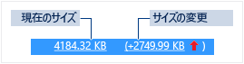
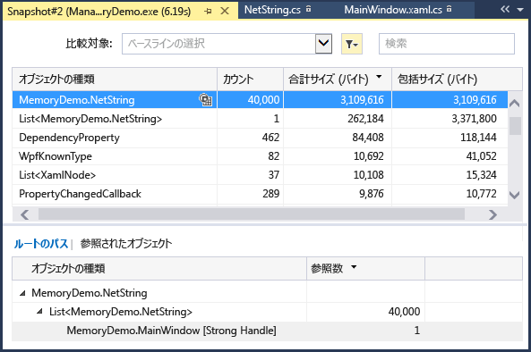
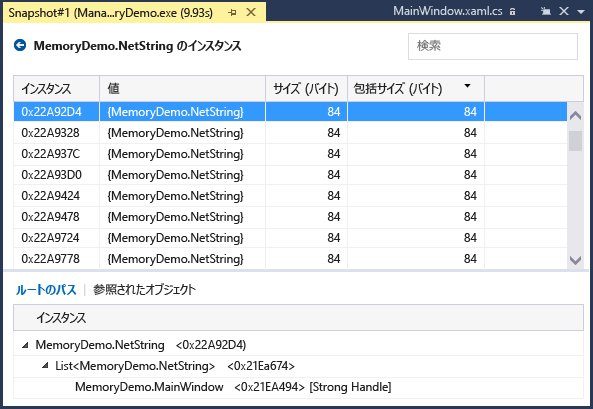
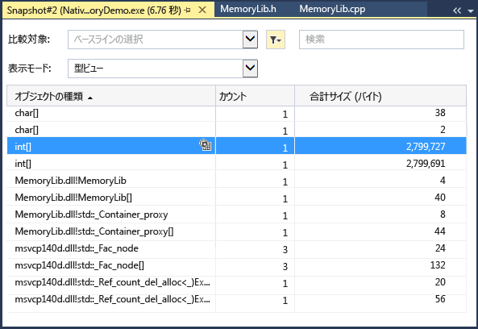
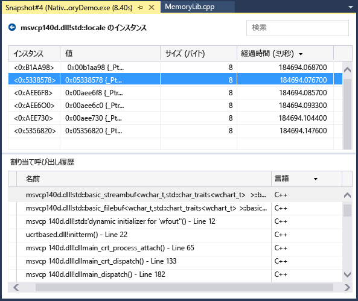
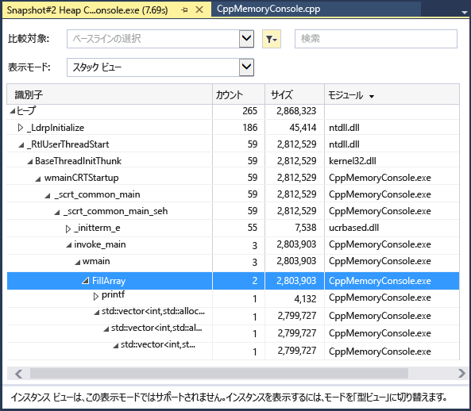

# メモリ使用量
デバッガーに統合された **メモリ使用量** 診断ツールを使用したデバッグ中に、メモリ リークおよび非効率的なメモリを見つけます。 メモリ使用量ツールを使用すると、マネージ メモリ ヒープ、およびネイティブ メモリ ヒープの&1; つまたは複数の *スナップショット* を取得できます。 .NET アプリ、ネイティブ アプリ、または混在モード (.NET とネイティブ) アプリのスナップショットを収集できます。  
  
-   単一のスナップショットを分析することにより、オブジェクト型のメモリ使用に対する相対的な影響を理解し、アプリ内でメモリが効率的に使用されていないコードを検出することができます。  
  
-   アプリの&2; つのスナップショットを比較 (diff) することにより、コード内で時間の経過に伴ってメモリ使用量が増加している箇所を検出することもできます。  
  
 次の図は、**[診断ツール]** ウィンドウ (Visual Studio 2015 Update 1 以降で利用可能) を示しています。  
  
   
  
 **メモリ使用量** ツールでメモリのスナップショットをいつでも収集できますが、Visual Studio デバッガーを使用すると、パフォーマンスの問題を調査中にアプリケーションの実行方法を制御することができます。 ブレークポイントの設定、ステップ実行、すべて中断、その他のデバッガー アクションは、パフォーマンスの調査を最も関連性の高いコード パスに集中させるのに役立ちます。 アプリの実行中にこれらのアクションを実行することで、目的としていないコードからのノイズを除去することができ、問題の診断にかかる時間を大幅に短縮できます。  
  
 さらに、デバッガーの外部のメモリ ツールも使用できます。 「[ストア アプリのメモリ使用量の分析](../profiling/memory-usage-without-debugging2.md)」を参照してください。  
  
> [!NOTE]
>  **カスタム アロケーター サポート** ネイティブ メモリ プロファイラーは、実行時に生成された割り当て [ETW](https://msdn.microsoft.com/en-us/library/windows/desktop/bb968803\(v=vs.85\).aspx) イベント データを収集して機能します。  CRT および Windows SDK のアロケーターには、割り当てデータをキャプチャできるように、ソース レベルで注釈が付けられています。  独自のアロケーターを作成する場合、新しく割り当てられたヒープ メモリへのポインターを返すすべての関数は、[__declspec](/visual-cpp/cpp/declspec)(アロケーター) で修飾できます。myMalloc での例を次に示します。  
>   
>  `__declspec(allocator) void* myMalloc(size_t size)` 

## メモリ使用量データの収集

1.  Visual Studio でデバッグするプロジェクトを開き、メモリ使用率を調べ始めるポイントでアプリのブレークポイントを設定します。

    メモリの問題があると疑われる領域がある場合は、メモリの問題が発生する前に、最初のブレークポイントを設定します。

    > [!TIP]
    >  アプリがメモリの割り当てと割り当て解除を頻繁に行う場合、目的とする操作のメモリ プロファイルを取得するのが容易ではないため、操作の最初と最後にブレークポイントを設定して (または操作をステップ実行して)、メモリが変更された正確なポイントを見つけます。 

2.  分析するコードの関数またはリージョンの終わりに (または疑わしいメモリの問題が発生したあとに)&2; つ目のブレークポイントを設定します。
  
3.  **[診断ツール]** ウィンドウは、オフにしていない限り自動的に表示されます。 もう一度ウィンドウを表示するには、**[デバッグ] > [ウィンドウ] > [診断ツールの表示]** の順にクリックします。

4.  ツールバーにある **[ツールの選択]** の設定で、**[メモリ使用量]** を選択します。

     

5.  **[デバッグ]、[デバッグの開始]** の順にクリックします (あるいは、ツール バーの **[開始]** をクリックするか、**F5** を押します)。

     アプリケーションが読み込みを完了すると、診断ツールの概要ビューが表示されます。

     

     > [!NOTE]
     >  メモリ データの収集はネイティブ アプリや混在モードのアプリのパフォーマンスに影響する可能性があるため、既定でメモリのスナップショットは無効になっています。 ネイティブ アプリや混在モードのアプリのスナップショットを有効にするには、デバッグ セッションを開始します (ショートカット キー: **F5**)。 **[診断ツール]** ウィンドウが表示されたら、[メモリ使用量] タブを選択して、**[ヒープのプロファイル]** を選択します。  
     >   
     >    
     >   
     >  デバッグを停止 (ショートカット キー: **Shift + F5**) してから再開します。  

6.  デバッグ セッションの開始時にスナップショットを取得するには、**[メモリ使用量]** 概要ツールバーで **[スナップショットの取得]** を選択します。 (ここにもブレークポイントを設定すると役に立つ場合があります。)

     
     
     > [!TIP]
     >  -   メモリ比較のベースラインを作成するには、デバッグ セッションの開始時に、スナップショットを取得することを検討します。  

6.  最初のブレークポイントにヒットするシナリオを実行します。

7.  デバッガーが最初のブレークポイントで一時停止している間に、**[メモリ使用量]** 概要ツールバーで **[スナップショットの取得]** を選択します。  

8.  F5 キーを押すと、アプリケーションが&2; つ目のブレークポイントまで実行されます。

9.  次に、別のスナップショットを取得しましょう。

     この時点で、データの分析を開始できます。    
  
## メモリ使用量データの分析
メモリ使用量の概要テーブルの行には、デバッグ セッション中に取得したスナップショットが一覧表示され、より詳細なビューへのリンクが提供されています。

 列の名前は、プロジェクトのプロパティで選択したデバッグ モード (.NET、ネイティブ、または混合 (.NET とネイティブの両方)) によって決まります。  
  
-   **[オブジェクト (相違)]** および **[割り当て (相違)]** 列には、スナップショット取得時の .NET メモリおよびネイティブ メモリ内のオブジェクト数が表示されます。  
  
-   **[ヒープ サイズ (相違)]** 列には、.NET ヒープおよびネイティブ ヒープのバイト数が表示されます。 

複数のスナップショットを取得した場合、概要テーブルのセルには、行のスナップショットと前のスナップショットの間の値の変化が含まれます。  
  
  

メモリ使用量を分析するには、リンクを&1; つクリックして、メモリ使用量の詳細なレポートを開きます。  

-   現在のスナップショットと前のスナップショットの相違点の詳細を表示するには、矢印の左にある変更リンクを選択します ()。 赤い矢印はメモリ使用量が増加したことを示し、緑の矢印は減少したことを示しています。

    > [!TIP]
    >  より迅速にメモリの問題を識別するために、Diff レポートは、総数が最も増加したオブジェクト型の順 (**[オブジェクト (相違)]** 列の変更リンク) や、総ヒープ サイズが最も増加したオブジェクト型の順 (**[ヒープ サイズ (相違)]** 変更リンク) に並べ替えられています。

-   選択したスナップショットのみの詳細を表示するには、変更リンクではないリンクを選択します。 
  
 レポートが新しいウィンドウに表示されます。   
  
### マネージ型レポート  
 メモリ使用量の概要テーブルで、**[オブジェクト (相違)]** または **[割り当て (相違)]** セルの現在のリンクを選択します。  
  
   
  
 上のウィンドウには、型で参照されているすべてのオブジェクトのサイズ (**包括サイズ**) を含む、スナップショット内の型の総数およびサイズが表示されます。  
  
 下のウィンドウの **[ルートのパス]** ツリーには、上ウィンドウで選択されている型を参照するオブジェクトが表示されます。 .NET Framework のガベージ コレクターがオブジェクトのメモリをクリーンアップするのは、そのオブジェクトを参照する最後の型が解放されたときに限られます。  
  
 **[参照される型]** ツリーには、上のウィンドウで選択されている型に保持されている参照が表示されます。  
  
   
  
 上のウィンドウで選択した型のインスタンスを表示するには、![[インスタンス] アイコン](../profiling/media/dbgdiag_mem_instanceicon.png "DBGDIAG_MEM_InstanceIcon") アイコンを選択します。  
  
   
  
 **[インスタンス]** ビューには、上のウィンドウのスナップショットで選択されているインスタンスが表示されます。 [ルートのパス] および [参照されたオブジェクト] ウィンドウには、選択したインスタンスを参照するオブジェクト、および選択したインスタンスが参照する型が表示されます。 スナップショットが取得された時点でデバッガーを停止すると、[値] セルの上にマウス カーソルを移動して、ツール ヒントにオブジェクトの値を表示することができます。  
  
### ネイティブ型のレポート  
 **[診断ツール]** ウィンドウのメモリ使用量の概要テーブルで、**[割り当て (相違)]** または **[ヒープ サイズ (相違)]** セルの現在のリンクを選択します。  
  
   
  
 **[型ビュー]** には、スナップショットの型の数およびサイズが表示されます。  
  
-   選択した型のインスタンス アイコン (![[オブジェクト型] 列の [インスタンス] アイコン](../profiling/media/dbg_mma_instancesicon.png "DBG_MMA_InstancesIcon")) を選択し、スナップショットの選択した型のオブジェクトに関する情報を表示します。  
  
     **[インスタンス]** ビューには、選択した型の各インスタンスが表示されます。 インスタンスを選択すると呼び出し履歴が表示され、その結果、 **[割り当て呼び出し履歴]** ウィンドウにそのインスタンスが作成されます。  
  
       
  
-   **[表示モード]** の一覧で **[スタック ビュー]** を選択し、選択した型の割り当て履歴を表示します。  
  
       
  
### 変更 (Diff) レポート  
  
-   **[診断ツール]** ウィンドウの **[メモリ使用量]** タブで、概要テーブルのセルにある変更リンクを選択します。  
  
       
  
-   マネージ レポート、もしくはネイティブ レポートの **[比較対象]** 一覧でスナップショットを選択します。  
  
       
  
 変更レポートを実行すると、基本のスナップショット値と比較のスナップショットの差分を表示する列 ( **(Diff)**のマークが付けられる) が、基本レポートに追加されます。 ネイティブ型の差分レポート ビューは次のようになります。  
  
   
  
## ブログとビデオ  
 [Visual Studio 2015 の診断ツール [デバッガー] ウィンドウ](http://blogs.msdn.com/b/visualstudioalm/archive/2015/01/16/diagnostic-tools-debugger-window-in-visual-studio-2015.aspx)  
  
 [ブログ: Visual Studio 2015 のデバッグ中のメモリ使用量ツール](http://blogs.msdn.com/b/visualstudioalm/archive/2014/11/13/memory-usage-tool-while-debugging-in-visual-studio-2015.aspx)  
  
 [Visual C++ ブログ: VS2015 プレビューでのネイティブ メモリ診断](http://blogs.msdn.com/b/vcblog/archive/2014/11/21/native-memory-diagnostics-in-vs2015-preview.aspx)  
  
 [Visual C++ ブログ: Visual Studio 2015 CTP のネイティブ メモリ診断ツール](http://blogs.msdn.com/b/vcblog/archive/2014/06/04/native-memory-diagnostic-tools-for-visual-studio-14-ctp1.aspx)
