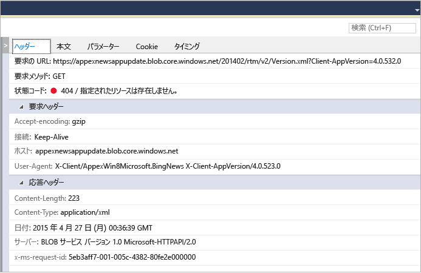

# UWP アプリのネットワーク使用量を分析する
Visual Studio の **ネットワーク**診断ツールは、[Windows.Web.Http API](/uwp/api/windows.web.http) を使用して実行されたネットワーク操作についてのデータを収集します。 そのデータを分析すると、アクセスや認証の問題、不適切なキャッシュの使用、表示やダウンロードの低パフォーマンスなどの問題を解決するのに役立ちます。  
  
 ネットワーク ツールは、Windows ユニバーサル プラットフォーム アプリのみをサポートしています。 その他のプラットフォームは現時点ではサポートされていません。  
  
> [!NOTE]
>  ネットワーク ツールの詳細については、[Visual Studio のネットワーク ツールの概要](http://blogs.msdn.com/b/visualstudio/archive/2015/05/04/introducing-visual-studio-s-network-tool.aspx)に関する記事をご覧ください。  
  
## ネットワーク ツール データの収集  
 **ネットワーク** ツールを実行するには、Visual Studio コンピューター上で開かれた状態の Visual Studio プロジェクトが必要です。  
  
1.  Visual Studio でプロジェクトを開きます。  
  
2.  **[デバッグ]、[パフォーマンス プロファイラー...]** の順にクリックします。**[ネットワーク]** を選択し、**[開始]** をクリックします。  
  
3.  ネットワーク ツールは、アプリの HTTP トラフィックの収集を開始します。  
  
     アプリを実行する際、左側のウィンドウにある [概要] ビューに、キャプチャされた HTTP 操作の一覧が自動的に表示されます。 右側のウィンドウにある [詳細] パネルで詳細を確認するには、[概要] ビューの項目を選択します。  
  
4.  **[停止]** をクリックしてアプリを閉じます。  
  
 レポート ウィンドウは次のように表示されます。  
  
 ![[ネットワーク] ウィンドウ](../profiling/media/network_fullwindow.png "NETWORK_FullWindow")  
  
## データを分析する  
 アプリの実行中、またはアプリが閉じられた後でも、[概要] ビューに表示されたいずれかのネットワーク操作を選択すると、キャプチャされた HTTP トラフィックを分析できます。  
  
 **[ネットワーク]** 概要ビューに、アプリの実行中の各ネットワーク操作のデータが表示されます。 列ヘッダーを選択して一覧を並べ替えるか、コンテンツの種類を選択して **[コンテンツの種類]** フィルター ビューで表示します。  
  
 **[Save as HAR]** (HAR として保存) を選択すると、Fiddler などのサード パーティ製ツールで使用可能な JSON ファイルを作成できます。  
  
 **[ネットワーク]** の詳細ビューには、[概要] ビューのネットワーク操作に関する詳細情報が表示されます。  
  
   
  
|||  
|-|-|  
|**ヘッダー**|イベントの要求ヘッダーに関する情報。|  
|**本文**|要求と応答のペイロード データ。|  
|**パラメーター**|クエリ文字列パラメーター名と値。|  
|**Cookie**|応答と要求の cookie データ。|  
|**タイミング**|選択したリソースの取得中のステージのグラフ。|  
  
 ネットワークの **[概要]** バーは、ある特定の時点で表示されているネットワーク操作の数、転送されたデータの量、データのダウンロードに要した時間、および表示可能なエラー (4xx 応答または 5xx 応答が返された要求) の数を示しています。  
  
### 分析のヒント  
 このツールは、次のネットワーク関連の分析を実行する際に役立つ特定の領域を強調表示します。  
  
1.  キャッシュから完全に処理される要求は、**[受信元]** 列の **[(キャッシュから)]** に表示されます。 これにより、キャッシュを使用して効果的にユーザーの帯域幅を節約しているかどうか、または誤って応答をキャッシュして、アプリケーションのエンド ユーザーに古いデータを提供しているかどうかを判断できます。  
  
2.  エラー応答 (4xx または 5xx) は、**[結果]** 列で状態コードが赤い状態で、[概要] バーで強調表示された状態で表示されます。 これにより、アプリケーションの多くの潜在的な要求の間でエラーを見つけやすくなります。  
  
3.  ([本文] タブ内の) [応答の整形出力] ボタンは、コンテンツをさらに読みやすくして、JSON、XML、HTML、CSS、JavaScript、および TypeScript の応答のペイロードを解析できるようにします。  
  
## 関連項目  
 [デバッガーを使用して、または使用せずにプロファイリング ツールを実行する](../profiling/running-profiling-tools-with-or-without-the-debugger.md)  
 [Visual Studio ブログ: Visual Studio のネットワーク インスペクターの紹介](http://go.microsoft.com/fwlink/?LinkId=535022)   
 [Channel 9 ビデオ: Visual Studio 診断ツール - 新しいネットワーク プロファイラー](http://channel9.msdn.com/Series/ConnectOn-Demand/206)  
 [Visual Studio のプロファイル](../profiling/index.md)  
 [プロファイリング機能ツアー](../profiling/profiling-feature-tour.md)