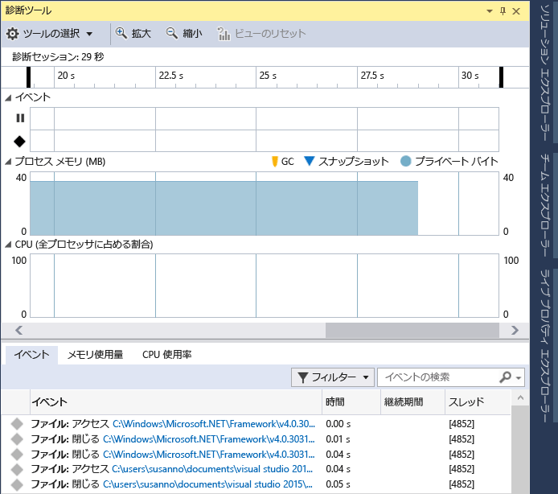

# デバッガーを使用して、または使用せずにプロファイリング ツールを実行する
Visual Studio ではパフォーマンス ツールを選ぶことができます。一部のツール (たとえば、**[CPU 使用率]** と **[メモリ使用量]**) は、デバッガーがありでもなしでも実行できます。 デバッガーを使用しないパフォーマンス ツールは、リリース構成で実行することを目的とし、デバッガー統合のツールはデバッグ構成で実行するためのものです。  
  
## このツールは、デバッガーを使用して実行したほうが良いですか、使用しないほうが良いですか。  
 デバッガー統合のパフォーマンス ツールを使用すると、デバッガーなしのツールが行えない多くのことが可能になります。たとえば、ブレークポイントの設定や変数値の調査を行えます。 デバッガーを使用しないツールでは、リリースされたアプリケーションでユーザーに対して表示される内容に近いエクスペリエンスが提供されます。  
  
 どちらのツールがご自分の目的に適しているかを判断するうえで役立ついくつかの質問を次に示します。  
  
1.  アプリケーションの開発中に問題が発生しましたか、またはリリース版に問題が見つかりましたか。  
  
     扱っている問題が開発中に見つかったものならば、リリース ビルドでパフォーマンス ツールを実行する必要はおそらくありません。 リリース版で見つかったものであれば、リリース構成で問題を再現して、さらに調査するためにデバッガーが役立つかどうか判断してください。  
  
2.  CPU 負荷の高い処理が問題の原因ですか。  
  
     多くの問題は、ファイル入出力、ネットワークの応答性など外的なパフォーマンス上の問題に起因しています。この場合、パフォーマンス ツールのデバッガーの有無が大きな違いになることはありません。 問題が CPU 負荷の高い呼び出しに起因している場合、リリース構成とデバッグ構成の違いは考慮に値するかもしれません。デバッガー統合ツールを使用する前に、おそらくリリース ビルドで問題が生じるかどうかを確認するべきでしょう。  
  
3.  パフォーマンスを正確に測定する必要がありますか、それともおおよその測定で構いませんか。  
  
     デバッグ ビルドには、リリース ビルドにはある最適化がありません。たとえば、関数呼び出しと定数のインライン化、不使用のコード パスの除去、変数の保存などは、デバッガーが使用できない方法で行われます。 デバッガー自体によって、パフォーマンス時間が変わります。デバッガーによって必要な特定の操作 (例外の解釈やモジュール読み込みのイベントなど) が実行されるためです。 デバッガー統合ツールでのパフォーマンス数値は、デバッガーの最適化が考慮されないため、精度は低くなりますが、デバッグ中に行われる他の相対測定と比べると便利です。 デバッガーを使用しないリリース構成のツールによるパフォーマンス数値の方が、精度が高くなります。
  
##   デバッグ中にプロファイリング データを収集する  
 次のセクションでは、ローカル デバッグについて説明します。 後のセクションでは、デバイスでのデバッグやリモート デバッグについて確認できます。  
  
1.  デバッグするプロジェクトを開いてから、 **[デバッグ] / [デバッグの開始]** の順にクリックします (またはツールバーの **[開始]** をクリックするか、 **F5**キーを押します)。  
  
2.  **[診断ツール]** ウィンドウは、オフにしていない限り自動的に表示されます。 もう一度ウィンドウを表示するには、**[デバッグ] > [ウィンドウ] > [診断ツールの表示]** の順にクリックします。  
  
3.  データを収集するシナリオを実行します。  
  
     セッションの実行中に、イベント、プロセスのメモリおよび CPU 使用率に関する情報を確認できます。  
  
     次の図は、Visual Studio 2015 Update 1 の **[診断ツール]** ウィンドウを示しています。  
  
       
  
4.  ツールバーにある **[ツールの選択]** の設定で、**[メモリ使用率]** や **[CPU 使用率]** (またはその両方) を表示するかどうかを選択できます。 Visual Studio Enterprise を実行している場合は、**[ツール] > [オプション] > [IntelliTrace]** で IntelliTrace を有効または無効にすることができます。  
  
5.  診断セッションは、デバッグを停止すると終了します。  
  
 Visual Studio 2015 Update 1 では、 **[診断ツール]** ウィンドウを使用すると、興味のあるイベントに簡単に注目できます。   イベント名にカテゴリ プレフィックス (**ジェスチャ**、**プログラム出力**、**ブレークポイント**、**ファイル**など) が付随して表示されるようになったため、迅速に一覧をスキャンして特定のカテゴリを検索したり、必要のないカテゴリを飛ばしたりできます。  
  
 ウィンドウには検索ボックスがあり、イベント一覧で特定の文字列を検索できます。 たとえば、次の図は、文字列 "install" の検索の結果、一致する 4 つのイベントが見つかったことを示しています。  
  
   
  
 ウィンドウに表示するイベントや表示しないイベントをフィルター処理することもできます。 **[フィルター]** ボックスの一覧で、イベントの特定のカテゴリをオンまたはオフにすることができます。 カテゴリ名は、プレフィックス名と同じです。  
  
   
  
 詳細については、「 [Searching and filtering the Events tab of the Diagnostic Tools window](http://blogs.msdn.com/b/visualstudioalm/archive/2015/11/12/searching-and-filtering-the-events-tab-of-the-diagnostic-tools-window.aspx)」を参照してください。  
  
## デバッグなしでプロファイリング データを収集する  
 一部のプロファイリング ツールを実行するには管理者権限が必要です。 管理者として Visual Studio を開始することもできますし、診断セッションを開始するときに管理者としてのツールの実行を選択することもできます。  
  
1.  Visual Studio でプロジェクトを開きます。  
  
2.  **[デバッグ]** メニューの **[パフォーマンス プロファイラー...]** をクリックします。(ショートカット キー: Alt + F2)。  
  
3.  診断の起動ページで、セッションで実行する 1 つ以上のツールを選択します。 プロジェクトの種類、オペレーティング システム、およびプログラミング言語に適用されるツールのみが表示されます。 ある診断ツールを選択すると、同じ診断セッションで実行できないツールの選択肢が無効になります。 C# Windows ユニバーサル アプリでの選択例を次に示します。  
  
       
  
4.  診断セッションを開始するには、**[開始]** をクリックします。  
  
5.  データを収集するシナリオを実行します。  
  
     セッションを実行している間に、ツールによっては診断ツールの起動ページにリアルタイム データが表示されます。  
  
     ![[パフォーマンスと診断] ページでデータを収集](../profiling/media/pdhub_collectdata.png "PDHUB_CollectData")  
  
6.  診断セッションを終了するには、**[コレクションの停止]** をクリックします。  
  
 診断セッションにおけるデータ収集を停止すると、データが分析され、[診断] ページにレポートが表示されます。  
  
 また、診断ツールの起動ページで直前に開かれた一覧から保存された .diagnosis セッション ファイルを開くことができます。  
  
   
  
## プロファイリング レポート  
   
  
|||  
|-|-|  
||タイムラインは、プロファイル セッションの長さ、アプリケーションのアクティブ化ライフサイクル イベント、ユーザー マークを示します。|  
||青いバーをドラッグしてタイムラインの領域を選択することにより、レポートをタイムラインの一部だけに制限できます。|  
||ツールには 1 つ以上のマスター グラフが表示されます。 診断セッションが複数のツールによって作成される場合には、すべてのマスター グラフが表示されます。|  
||個々のグラフを展開および折りたたむことができます。|  
||データに複数のツールからの情報が含まれる場合、ツールの詳細情報が収集されてタブに表示されます。|  
||ツールには、1 つ以上の詳細ビューが含まれることがあります。 ビューはタイムラインの選択された領域でフィルター処理されます。|  
  
## 分析ターゲットを別のデバイスに設定する  
 Visual Studio プロジェクトからのアプリの起動以外に、別のターゲットに対して診断セッションを実行することもできます。 たとえば、Windows アプリ ストアからインストールされたバージョンのアプリのパフォーマンス問題を診断することができます。  
  
   
  
 既にデバイスにインストール済みのアプリを起動することも、既に実行中の一部のアプリに診断ツールをアタッチすることもできます。 **[実行中のアプリ]** または **[インストール済みのアプリ]** を選択する場合、指定された配置ターゲット上で検出されたアプリの一覧の中からアプリを選択します。  
  
   
  
 **[Internet Explorer]** を選択する場合には、URL を指定して、電話の配置ターゲットを変更できます。  
  
   
  
## Remote Debugging  
 リモート PC またはタブレットで診断セッションを実行するには、リモート ターゲットに Visual Studio リモート ツールがインストールおよび実行されている必要があります。 デスクトップ アプリについては、「[リモート デバッグ](../debugger/remote-debugging.md)」をご覧ください。  Windows ユニバーサル アプリについては、「[リモート コンピューターでの Windows ストア アプリの実行](../debugger/run-windows-store-apps-on-a-remote-machine.md)」をご覧ください。  
  
## 診断開発チームのブログ投稿と MSDN 記事  
 [MSDN マガジン: Visual Studio 2015 でのデバッグ中のパフォーマンス分析](https://msdn.microsoft.com/en-us/magazine/dn973013.aspx)  
  
 [MSDN マガジン: IntelliTrace を使用して迅速に問題を診断する](https://msdn.microsoft.com/en-us/magazine/dn973014.aspx)  
  
 [ブログの投稿: Diagnosing Event Handler Leaks with the Memory Usage Tool in Visual Studio 2015 (Visual Studio 2015 でのメモリ使用量ツールを使用したイベント ハンドラーのリークの診断)](http://blogs.msdn.com/b/visualstudioalm/archive/2015/04/29/diagnosing-event-handler-leaks-with-the-memory-usage-tool-in-visual-studio-2015.aspx)  
  
 [ビデオ: Historical Debugging with IntelliTrace in Microsoft Visual Studio Ultimate 2015 (Microsoft Visual Studio Ultimate 2015 での IntelliTrace を使用したデバッグ履歴)](https://channel9.msdn.com/Events/Ignite/2015/BRK3716)  
  
 [ビデオ: Debugging Performance Issues Using Visual Studio 2015 (Visual Studio 2015 を使用したパフォーマンスに関する問題のデバッグ)](https://channel9.msdn.com/Events/Build/2015/3-731)  
  
 [PerfTips: Performance Information at-a-glance while Debugging with Visual Studio (Visual Studio を使用したデバッグ中のパフォーマンス概要の参照)](http://blogs.msdn.com/b/visualstudioalm/archive/2014/08/18/perftips-performance-information-at-a-glance-while-debugging-with-visual-studio.aspx)  
  
 [Visual Studio 2015 の診断ツール [デバッガー] ウィンドウ](http://blogs.msdn.com/b/visualstudioalm/archive/2015/01/16/diagnostic-tools-debugger-window-in-visual-studio-2015.aspx)  
  
 [IntelliTrace in Visual Studio Enterprise 2015 (Visual Studio Enterprise2015 の IntelliTrace)](http://blogs.msdn.com/b/visualstudioalm/archive/2015/01/16/intellitrace-in-visual-studio-ultimate-2015.aspx)

