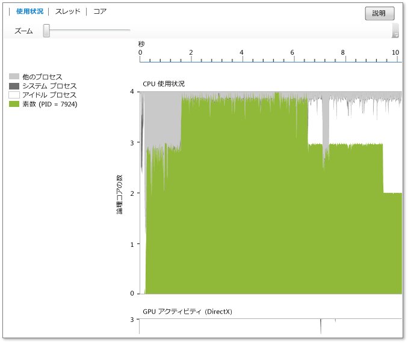

# 使用状況ビュー
[!INCLUDE[vs2017banner](../code-quality/includes/vs2017banner.md)]

CPU に関する情報を表示します **\[\[使用状況\] ビュー\]**、GPU と現在のプロセスによって使用されるそのほかのシステム リソース。  これは、分析対象のプロセス \(アイドル状態のプロセス、システム プロセス、および一定期間システム上で実行されている他のプロセスによる平均コア使用率が表示されます。  任意の時点にどのコアがアクティブであるかは表示されません。  たとえば、2 個のコアが特定の長さの容量 50 に各実行されている場合、このビューは使用されている一つの論理コア 1。  このビューは、プロファイル時間を短い時間セグメントに分割して生成されます。  セグメントごとに、グラフは、その期間中に論理コア上で実行しているプロセス スレッドの平均数を計画します。  
  
   
  
 グラフは、ターゲット プロセス、アイドル状態のプロセスおよびシステム プロセスによって使用される平均論理コアと時間 \(x 軸上に示します\) \(アイドル状態のプロセスは、アイドル状態のコア。  システム プロセスは他のプロセスに代わって処理を実行できる Windows プロセスです\)。すべての残りのコアの使用状況のシステム アカウントで実行されている他のプロセス。  
  
 論理コアの数は、y 軸に示されます。  Windows は、論理コアとしてハードウェア扱います \(たとえば、超スレッド処理\) の同時マルチスレッド サポートを提供します。  したがって、コアごとに 2 回のハードウェア スレッドをサポートするクアッドコア プロセッサがあるシステムは 8 論理コア システムとして表示されます。  これは、コア ビューにも当てはまります   詳細については、「[コア ビュー](../profiling/cores-view.md)」を参照してください。  
  
 GPU アクティビティ チャートは使用中の DirectX エンジンの数が時間の経過とともに表示されます。エンジンは、DMA パケットを処理する場合は使用中です。グラフには、DirectX 特定のエンジンがない \(たとえば、3D エンジンは、エンジン、ビデオなど\)。  
  
## 目的  
 これはパフォーマンス調査の開始点として、同時実行ビジュアライザーを使用すると使用率のビューをお勧めします。  これはアプリケーションの同時実行の程度の概要を時間の経過とともに使用すると、すぐにパフォーマンス チューニングまたは並列を必要とする区分を識別するために使用できます。  
  
 パフォーマンスの調整を行う場合、期待に応えない動作を識別することを試みる場合があります。  論理 CPU コアの下位使用率が高く、領域の手順と原因を検索する場合を考えます。  また、CPU と GPU 間の使用パターンを検索する場合を考えます。  
  
 アプリケーションの並列化を目的とする場合は、実行の CPU バインドされた CPU が活用されていない領域や領域を検索します。  
  
 CPU バインドされた領域は緑で表示されます。  グラフは、アプリケーションが並列で利用できる 1 種類のコアを示します。  
  
 CPU が活用されていない領域は灰色です。  これらは、アプリケーションがアイドル状態になってから、または実行を表すことができます。ポイントの並列化に他の CPU バインドされた処理と重複して手段を用意する I\/O をブロックします。  
  
 目的の動作が見つかった場合は、その領域でモジュールを選択して拡大できます。  ズーム インすると、詳細な分析のスレッド ビューまたはコア ビューをに切り替えるできます。  
  
 C\+\+ AMP または DirectX を使用して GPU を使用すると、GPU が予期せずアイドル状態である使用中で GPU エンジンまたは区分の数を指定する必要があります。  
  
## ズーム  
 CPU 使用状況グラフまたは GPU アクティビティ グラフを拡大するには、セクションを選択するか、グラフ上のズーム スライダー ツールを使用します。  ズーム設定は、他のビューに切り替えてもそのままになります。  縮小し直すには、ズーム スライダー ツールを使用します。  も使用 Ctrl\+scrollして拡大できます。  
  
## 参照  
 [同時実行ビジュアライザー](../profiling/concurrency-visualizer.md)   
 [コア ビュー](../profiling/cores-view.md)