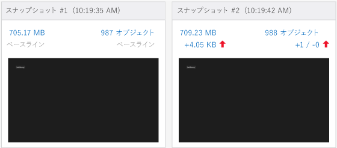
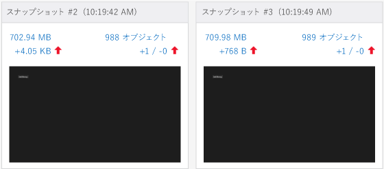
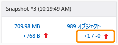
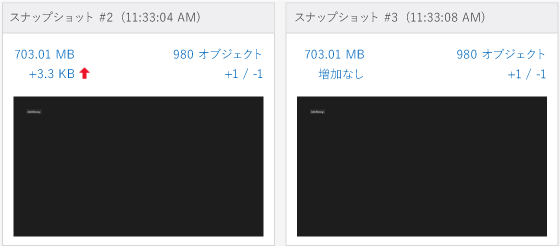

# <a name="walkthrough-find-a-memory-leak-javascript"></a>チュートリアル: メモリ リークの検出 (JavaScript)
  
  
 このチュートリアルでは、JavaScript メモリ アナライザーを使用し、単純なメモリの問題を特定して修復するプロセスについて説明します。 JavaScript メモリ アナライザーは、Visual Studio で、JavaScript を使用して Windows 用に開発された UWP アプリに対して使用できます。 このシナリオでは、作成されるのと同じペースで破棄されるはずの DOM 要素がメモリに保持されてしまうアプリを作成します。  
  
 このアプリのメモリ リークの原因は非常に特殊なものですが、以下に示す手順は、一般にメモリがリークしているオブジェクトを分離するのに効果的なワークフローです。  
  
### <a name="running-the-javascript-memory-analyzer-test-app"></a>JavaScript メモリ アナライザーのテスト アプリの実行  
  
1.  Visual Studio で、 **[ファイル]**、 **[新規作成]**、 **[プロジェクト]**の順にクリックします。  
  
2.  左ペインで **[JavaScript]** を選択し、次に **[Windows]**、 **[Windows 8]**の順に選択してから、 **[ユニバーサル]** または **[Windows Phone アプリ]**を選択します。  
  
    > [!IMPORTANT]
    >  このトピックに示すメモリ使用量の結果は、Windows 8 アプリでテストされます。  
  
3.  中央のペインにある **[空のアプリケーション]** プロジェクト テンプレートを選択します。  
  
4.  **[名前]** ボックスに `JS_Mem_Tester`などの名前を指定し、 **[OK]**をクリックします。  
  
5.  **ソリューション エクスプローラー**で default.html を開き、次のコードを \<body> タグの間に貼り付けます。  
  
    ```html  
    <div class="wrapper">  
        <div id="item"></div>  
        <button class="memleak" style="display: block" >Leak Memory</button>  
    </div>  
    ```  
  
    > [!IMPORTANT]
    >  「Windows 8.1 ユニバーサル アプリ」テンプレートを使用する場合、Windows および.WindowsPhone プロジェクトの両方で HTML および CSS コードを更新する必要があります。  
  
6.  default.css を開き、次の CSS コードを追加します。  
  
    ```css  
    .memleak {  
        position: absolute; top: 100px; left: 100px;  
    }  
    ```  
  
7.  default.js を開き、すべてのコードを次のコードに置き換えます。  
  
    ```javascript  
    (function () {  
        "use strict";  
  
        var app = WinJS.Application;  
        var activation = Windows.ApplicationModel.Activation;  
  
        var wrapper;  
        var elem;  
  
        app.onactivated = function (args) {  
            if (args.detail.kind === activation.ActivationKind.launch) {  
                if (args.detail.previousExecutionState !== activation.ApplicationExecutionState.terminated) {  
                } else {  
                }  
                args.setPromise(WinJS.UI.processAll());  
  
                elem = document.getElementById("item");  
                wrapper = document.querySelector(".wrapper");  
                var btn = document.querySelector(".memleak");  
                btn.addEventListener("click", btnHandler);  
                run();  
            }  
        };  
  
        app.oncheckpoint = function (args) {  
        };  
  
        app.start();  
  
        function run() {  
            initialize();  
            load();  
        }  
  
        function initialize() {  
  
            if (wrapper != null) {  
                elem.removeNode(true);  
            }  
        }  
  
        function load() {  
  
            var newDiv = document.createElement("div");  
  
            newDiv.style.zIndex = "-1";  
            newDiv.id = "item";  
  
            wrapper.appendChild(newDiv);  
        }  
  
        function btnHandler(args) {  
            run();  
        }  
  
    })();  
    ```  
  
8.  F5 キーを押してデバッグを開始します。 **[Leak Memory]** ボタンがページに表示されることを確認します。  
  
9. Visual Studio に戻り (Alt + Tab キー)、Shift キーを押しながら F5 キーを押してデバッグを停止します。  
  
     アプリが動作することは確認できたので、次にメモリの使用量を確認します。  
  
### <a name="analyzing-the-memory-usage"></a>メモリの使用量の分析  
  
1.  **[デバッグ]** ツール バーの、 **[デバッグの開始]** の一覧で、更新されたプロジェクトのデバッグ対象を選択します (Windows Phone エミュレーターまたは **[シミュレーター]**のいずれか)。  
  
    > [!TIP]
    >  UWP アプリの場合、この一覧で **[ローカル コンピューター]** または **[リモート コンピューター]** を選択することもできます。 
  
2.  **[デバッグ]** メニューの **[パフォーマンス プロファイラー...]**をクリックします。  
  
3.  **[使用可能なツール]**で **[JavaScript メモリ]**を選択し、 **[開始]**をクリックします。  
  
     このチュートリアルでは、メモリ アナライザーをスタートアップ プロジェクトにアタッチします。 インストールしたアプリへのメモリ アナライザーのアタッチなど、その他のオプションについては、以下を参照してください。 [[JavaScript メモリ]](../profiling/javascript-memory.md)の順にクリックします。  
  
     メモリ アナライザーを起動したとき、VsEtwCollector.exe を実行するアクセス許可を要求するユーザー アカウント制御が表示される場合があります。 **[はい]**をクリックします。  
  
4.  **[Leak Memory] (メモリ リーク)** を 4 回続けてクリックします。  
  
     ボタンをクリックすると、default.js のイベント処理コードで、メモリ リークを引き起こす処理が実行されます。 これを診断用に使用します。  
  
    > [!TIP]
    >  メモリ リークをテストするシナリオを繰り返すことによって、アプリの初期化中やページの読み込み時にヒープに追加されるオブジェクトなど、必要のない情報を簡単に除去できます。  
  
5.  実行中のアプリから Visual Studio に切り替えます (Alt + Tab キーを押します)。  
  
     JavaScript メモリ アナライザーの情報が Visual Studio の新しいタブに表示されます。  
  
     この概要ビューのメモリ グラフには、メモリの使用量の変化が表示されます。 このビューには、 **[ヒープ スナップショットの作成]**などのコマンドも用意されています。 特定の時刻におけるメモリの使用量の詳細情報がスナップショットに示されます。 詳細については、「 [[JavaScript メモリ]](../profiling/javascript-memory.md)の順にクリックします。  
  
6.  **[ヒープ スナップショットの作成]**をクリックします。  
  
7.  アプリに切り替え、 **[Leak Memory]**をクリックします。  
  
8.  Visual Studio に切り替え、 **[ヒープ スナップショットの作成]** をもう一度クリックします。  
  
     次の図は、ベースライン スナップショット (#1) とスナップショット #2 を示しています。  
  
       
  
    > [!NOTE]
    >  Windows Phone エミュレーターでは、スナップショットが取得されたときにアプリのスクリーンショットが表示されません。  
  
9. アプリに切り替え、もう一度 **[Leak Memory]** をクリックします。  
  
10. Visual Studio に切り替え、 **[ヒープ スナップショットの作成]** をもう一度クリックします。  
  
    > [!TIP]
    >  このワークフローの 3 番目のスナップショットを取得することにより、ベースラインのスナップショットと 2 番目のスナップショットの間での、メモリ リークと関連しない変更を除外できます。 たとえば、ページのヘッダーやフッターの更新などがある場合、メモリ使用量には変化があっても、メモリ リークには無関係である場合があります。  
  
     次の図は、スナップショット #2 とスナップショット #3 を示しています。  
  
       
  
11. Visual Studio で、 **[停止]** をクリックしてプロファイリングを停止します。  
  
12. Visual Studio でスナップショットを比較します。 [スナップショット #2] には次の情報が示されています。  
  
    -   ヒープ サイズ (左側の赤い上矢印) は、スナップショット #1 に比べて数 KB 増加しています。  
  
        > [!IMPORTANT]
        >  ヒープ サイズの正確なメモリ使用量の値はデバッグ対象によって異なります。  
  
    -   ヒープのオブジェクト数 (右側の赤い上矢印) も、スナップショット #1 に比べて増加しています。 1 つのオブジェクトが追加され (+1)、削除されたオブジェクトはありません (-0)。  
  
     [スナップショット #3] には次の情報が示されています。  
  
    -   ここでも、ヒープ サイズはスナップショット #2 に比べて数百バイト増加しています。  
  
    -   ヒープのオブジェクト数もスナップショット #2 に比べて増加しています。 1 つのオブジェクトが追加され (+1)、削除されたオブジェクトはありません (-0)。  
  
13. スナップショット #3 で、右側のリンク テキスト (赤い上矢印の横の +1 / -0 という値) を選択します。  
  
       
  
     ヒープのオブジェクトの差分ビュー ( **[スナップショット #3 - スナップショット #2]**) が開き、既定で種類ビューが表示されます。 既定で、スナップショット #2 とスナップショット #3 の間でヒープに追加されたオブジェクトの一覧が表示されます。  
  
14. **スコープ** フィルターで、 **スナップショット #2 から残されたオブジェクト**を選択します。  
  
15. 次に示すように、オブジェクト ツリーの最上位にある HTMLDivElement オブジェクトを開きます。  
  
       
  
     このビューには、次のような、メモリ リークに関する有用な情報が表示されます。  
  
    -   このビューには、 `item`の ID と共に DIV 要素が表示され、オブジェクトの保持サイズは数百バイトです (正確な値は異なります)。  
  
    -   このオブジェクトは、スナップショット #2 から残されたオブジェクトで、メモリ リークの可能性があるものを表しています。  
  
     ここでこのアプリについて少し説明しておくと、 **[Leak Memory] (メモリ リーク)** をクリックすると DIV 要素が削除され、要素の追加されます。したがって、このコードは正しく動作していないと思われます (つまり、メモリがリークする)。 次のセクションでは、その修正方法について説明します。  
  
    > [!TIP]
    >  `Global` オブジェクトに対する相対的な位置を特定することによってオブジェクトを識別できる場合があります。 これを行うには、その識別子のショートカット メニューを開き、 **[ルート ビューで表示]**をクリックします。  
  
##  <a name="FixingMemory"></a> メモリの問題の修正  
  
1.  プロファイラーで公開されたデータを使用して、"項目" の ID と共に DOM 要素の削除を担当するコードを確認します。 これは `initialize()` 関数で発生します。  
  
    ```javascript  
    function initialize() {  
  
        if (wrapper != null) {  
            elem.removeNode(true);  
        }  
    }  
    ```  
  
     `elem.removeNode(true)` は、おそらく、正常に動作していません。 コードが DOM 要素をキャッシュして、問題を見つける方法を確認します。キャッシュされた要素への参照は更新されていません。  
  
2.  default.js で、load 関数の `appendChild`の呼び出しの直前に次のコード行を追加します。  
  
    ```javascript  
    elem = newDiv;  
    ```  
  
     このコードは、キャッシュされた要素への参照を更新します。これにより、 **[Leak Memory] (メモリ リーク)** をクリックすると要素が正しく削除されるようになります。 load 関数の完全なコードは次のようになります。  
  
    ```javascript  
    function load() {  
  
        wrapper = document.querySelector(".wrapper");  
  
        var newDiv = document.createElement("div");  
  
        newDiv.style.zIndex = "-1";  
        newDiv.id = "item";  
        elem = newDiv;  
  
        wrapper.appendChild(newDiv);  
    }  
    ```  
  
3.  **[デバッグ]** メニューの **[パフォーマンスと診断]**をクリックします。  
  
4.  **[使用可能なツール]**で **[JavaScript メモリ]**を選択し、 **[開始]**をクリックします。  
  
5.  前と同じ手順に従って 3 つのスナップショットを取得します。 手順は次のとおりです。  
  
    1.  アプリで **[Leak Memory] (メモリ リーク)** を 4 回続けてクリックします。  
  
    2.  Visual Studio に切り替え、 **[ヒープ スナップショットの作成]** をクリックしてベースライン スナップショットを取得します。  
  
    3.  アプリで **[Leak Memory]** をクリックします。  
  
    4.  Visual Studio に切り替え、 **[ヒープ スナップショットの作成]** をクリックして 2 番目のスナップショットを取得します。  
  
    5.  アプリで **[Leak Memory]** をクリックします。  
  
    6.  Visual Studio に切り替え、 **[ヒープ スナップショットの作成]** をクリックして 3 番目のスナップショットを取得します。  
  
     スナップショット #3 の表示が、ヒープ サイズは " **増加なし** " (スナップショット #2 からのヒープ サイズの増加はなし)、オブジェクトの数は "+1/-1" (1 つのオブジェクトが追加され、1 つのオブジェクトが削除された) になります。 これは期待した動作です。  
  
     次の図は、スナップショット #2 とスナップショット #3 を示しています。  
  
       
  
## <a name="see-also"></a>参照  
 [[JavaScript メモリ]](../profiling/javascript-memory.md)