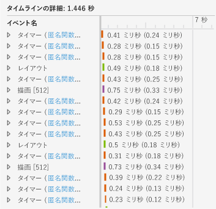
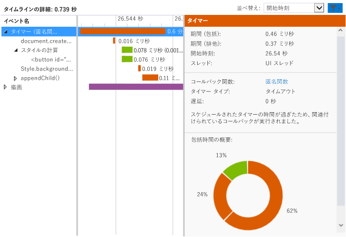

# <a name="walkthrough-improving-ui-responsiveness-html"></a>チュートリアル: UI の応答性の向上 (HTML)
このチュートリアルでは、[HTML UI の応答性プロファイラー](../profiling/html-ui-responsiveness.md)を使って、パフォーマンスの問題を特定し修復するプロセスについて説明します。 このプロファイラーは、Visual Studio で、JavaScript を使用した Windows ユニバーサルおよび UWP アプリに対して使用できます。 このシナリオでは、DOM 要素の更新の頻度が高すぎるパフォーマンス テスト アプリを作成し、この問題をプロファイラーを使用して特定および修正します。  
  
### <a name="creating-and-running-the-performance-test-app"></a>パフォーマンス テスト アプリを作成して実行する  
  
1.  Visual Studio で、新しい Windows ユニバーサル JavaScript プロジェクトを作成します。 (**[ファイル]、[新規作成]、[プロジェクト] の順に選択します**。 左ペインで **[JavaScript]** を選択し、次に **[Windows]**、**[Windows 10]** と選択してから、**[ユニバーサル]** または **[Windows Phone]** を選択します。  
  
2.  > [!IMPORTANT]
    >  このトピックで示す診断の結果は、Windows 8 アプリ用です。  
  
3.  中央のペインで **[空のアプリケーション]** などの空のプロジェクト テンプレートの 1 つを選択します。  
  
4.  **[名前]** ボックスに `JS_Perf_Tester` などの名前を指定し、**[OK]** をクリックします。  
  
5.  **ソリューション エクスプローラー** で default.html を開き、次のコードを \<body> タグの間に貼り付けます。  
  
    ```html  
    <div class="wrapper">  
        <button id="content">Waiting for values</button>  
    </div>  
    ```  
  
6.  default.css を開き、次の CSS コードを追加します。  
  
    ```css  
    #content {  
        margin-left: 100px;  
        margin-top: 100px;  
    }  
    ```  
  
7.  default.js を開き、すべてのコードを次のコードに置き換えます。  
  
    ```javascript  
    (function () {  
        "use strict";  
  
        var app = WinJS.Application;  
        var activation = Windows.ApplicationModel.Activation;  
  
        var content;  
        var wrapper;  
  
        app.onactivated = function (args) {  
            if (args.detail.kind === activation.ActivationKind.launch) {  
                if (args.detail.previousExecutionState !== activation.ApplicationExecutionState.terminated) {  
  
                    content = document.getElementById("content");  
                    wrapper = document.querySelector(".wrapper");  
  
                    content.addEventListener("click", handler);  
  
                } else {  
                }  
  
                args.setPromise(WinJS.UI.processAll());  
            }  
        };  
  
        app.oncheckpoint = function (args) {  
        };  
  
        app.start();  
  
        var idx = 0;  
        var count = 0;  
        var max = 5000;  
        var text = ["what", "is", "the", "Matrix?"];  
        var color = ["red", "crimson", "maroon", "purple"];  
  
        function increment() {  
  
            setTimeout(function () {  
  
                idx++;  
                count++;  
  
                if (idx > 3) { idx = 0; }  
                if (count < max) { increment(); }  
  
            }, 1000);  
        }  
  
        function setValues() {  
  
            content = document.getElementById("content");  
            content.removeNode(true);  
  
            var newNode = document.createElement("button");  
            newNode.id = "content";  
            newNode.textContent = text[idx];  
            //newNode.textContent = getData();  
            newNode.style.backgroundColor = color[idx];  
            //newNode.style.animationName = "move";  
            //count++;  
  
            wrapper.appendChild(newNode);  
  
        }  
  
        function update() {  
  
            setTimeout(function () {  
  
                setValues();  
                if (count < max) { update(); }  
            });  
        }  
  
        function handler(args) {  
  
            content.textContent = "eenie";  
            increment();  
            update();  
        }  
  
    })();  
  
    ```  
  
8.  F5 キーを押してデバッグを開始します。 **[Waiting for values]\(値の待機)** ボタンがページに表示されることを確認します。  
  
9. **[Waiting for values]\(値の待機)** を選択し、ボタンのテキストと色が 1 秒に 1 回更新されることを確認します。 これは仕様に基づく制限事項です。  
  
10. Visual Studio に戻り (Alt + Tab キー)、Shift キーを押しながら F5 キーを押してデバッグを停止します。  
  
     アプリが動作することは確認できたので、次にプロファイラーを使用してパフォーマンスをチェックします。  
  
### <a name="analyzing-performance-data"></a>パフォーマンス データを分析する  
  
1.  **[デバッグ]** ツール バーの **[デバッグの開始]** の一覧で、いずれかの Windows Phone エミュレーターまたは **[シミュレーター]** を選択します。  
  
2.  **[デバッグ]** メニューの **[パフォーマンスと診断]**をクリックします。  
  
3.  **[使用可能なツール]** で **[HTML UI の応答性]** を選択し、**[開始]** をクリックします。  
  
     このチュートリアルでは、プロファイラーをスタートアップ プロジェクトにアタッチします。 インストールしたアプリへのプロファイラーのアタッチなど、その他のオプションについては、「[HTML UI responsiveness](../profiling/html-ui-responsiveness.md) (HTML UI の応答性)」をご覧ください。  
  
     プロファイラーを起動したとき、VsEtwCollector.exe を実行するアクセス許可を要求するユーザー アカウント制御が表示される場合があります。 **[はい]**をクリックします。  
  
4.  アプリの実行中に、**[Waiting for values]\(値の待機)** を選択して約 10 秒待ちます。 ボタンのテキストと色が 1 秒間に約 1 回更新されることを確認します。  
  
5.  実行中のアプリから Visual Studio に切り替えます (Alt + Tab キーを押します)。  
  
6.  **[コレクションの停止]** をクリックします。  
  
     プロファイラーの情報が Visual Studio の新しいタブに表示されます。 CPU 使用状況とビジュアル スループット (FPS) のデータを見ると、次のような傾向があることがすぐにわかります。  
  
    -   CPU 使用状況は約 3 秒後 (**[Waiting for values]\(値の待機)** ボタンをクリックしたとき) に大幅に増加し、それ以降は明確なイベント パターン (スクリプト イベント、スタイリング イベント、レンダリング イベントの一貫した組み合わせ) を示します。  
  
    -   ビジュアル スループットは影響を受けておらず、FPS は全体を通じて 60 のままです (つまり、フレームのドロップはありません)。  
  
     CPU 使用状況グラフの一般的なセクションを調べて、このアクティビティが多い期間にアプリが何をしているのか見てみましょう。  
  
7.  CPU 使用状況グラフの中程の部分を 1 ～ 2 秒選択します (クリックしてドラッグするか、Tab キーと方向キーを使用します)。 次の図は、選択を行った後の CPU 使用状況グラフを示しています。 共有されていない領域は選択範囲です。  
  
       
  
8.  **[拡大]** を選択します。  
  
     グラフが変更されて、選択した期間の詳細が表示されます。 次の図は、拡大した後の CPU 使用状況グラフを示しています。 (特定のデータは変化することがありますが、一般的なパターンは明らかです。)  
  
       
  
     下部のペインの [タイムラインの詳細] に、選択した期間の詳細の例が表示されます。  
  
       
  
     [タイムラインの詳細] では、CPU 使用状況グラフで見られた傾向を裏付けるように、短い期間に多数のイベントが発生しています。 それらのイベントが、`Timer`、`Layout`、`Paint` であることもわかります。  
  
9. コンテキスト メニュー (右クリック) を使用して、下部のペインの `Timer` イベントの 1 つを選択し、**[イベントのフィルター]** を選択します。 次の図に、このテスト アプリの `Timer` イベントの 1 つに一般的な詳細な例を示します。  
  
       
  
     このデータからはさまざまなことがわかります。 例:  
  
    -   各 `Timer` イベント (色分けからスクリプト イベントであることがわかります) には `document.createElement` の呼び出しが含まれており、その後にスタイルの計算と `style.backgroundColor` および `appendChild()` の呼び出しが続いています。  
  
    -   選択した短い期間 (約 1 ～ 2 秒) に、`Timer` イベント、`Layout` イベント、`Paint` イベントが数多く発生しています。 `Timer`イベントは、アプリを実行して **[Waiting for values]**\(値の待機) ボタンをクリックした後に見られる 1 秒間に約 1 回のペースをはるかに超える頻度で発生します。  
  
10. 調査のために、左下のペインでいずれかの `Timer` イベントの匿名関数へのリンクをクリックします。 default.js の次の関数が表示されます。  
  
    ```javascript  
    function update() {  
  
        setTimeout(function () {  
  
            setValues();  
            if (count < max) { update(); }  
        });  
    }  
    ```  
  
     この再帰関数は、UI のボタンを更新する `setValues()` 関数を呼び出すループを設定します。 プロファイラーで個々のタイマー イベントを注意深く確認すると、ほとんどまたはすべてのタイマー イベントが、実行頻度が高すぎるこのコードに起因していることが分かります。したがって、問題の原因はこのコードにあると考えられます。  
  
### <a name="fixing-the-performance-issue"></a>パフォーマンスの問題を修正する  
  
1.  `update()` 関数を次のコードに置き換えます。  
  
    ```javascript  
    function update() {  
  
        setTimeout(function () {  
  
            setValues();  
            if (count < max) { update(); }  
        }, 1000 );  
    }  
    ```  
  
     この修正したバージョンのコードには 1000 ミリ秒の遅延が含まれています。前のバージョンのコードではこれが省略されていたため、既定値が使用されていました。 プロファイラー データから、既定値は 0 ミリ秒であると思われ、これによって `setValues()` 関数が頻繁に発生していると思われます。  
  
2.  HTML UI の応答性プロファイラーを再度実行し、CPU 使用状況グラフを確認します。 過剰なイベントはなくなり、CPU 使用状況はゼロに近い値に下がっています。 問題は修正されました。  
  
## <a name="see-also"></a>関連項目  
 [HTML UI の応答性](../profiling/html-ui-responsiveness.md)