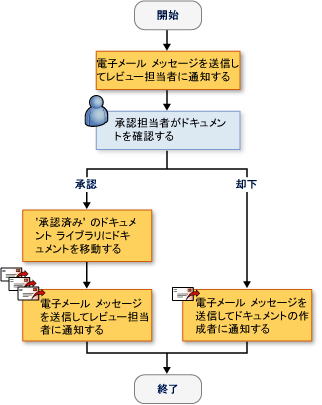
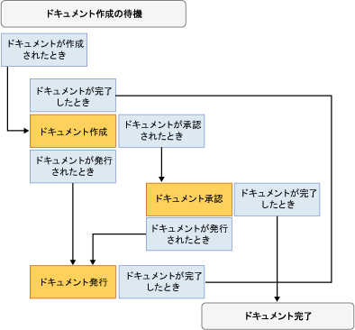

# SharePoint ワークフロー ソリューションの作成
  [!INCLUDE[vsprvs](../sharepoint/includes/vsprvs-md.md)] ドキュメントとリスト アイテムを SharePoint Web サイトでのライフ サイクルを管理するカスタム ワークフローを作成するのに役立つツールを提供します。 指定された項目には、デザイナー、一連のアクティビティのコントロール、および必要なアセンブリ参照が含まれます。 [!INCLUDE[vsprvs](../sharepoint/includes/vsprvs-md.md)] 含まれています、 **SharePoint カスタマイズ ウィザード**を作成し、ワークフローを構成するために、します。  
  
 SharePoint プロジェクトを作成するための前提条件の一覧については[!INCLUDE[vsprvs](../sharepoint/includes/vsprvs-md.md)]を参照してください[SharePoint ソリューションの開発要件](../sharepoint/requirements-for-developing-sharepoint-solutions.md)です。 SharePoint の詳細については、次を参照してください。 [Microsoft SharePoint 製品およびテクノロジ](http://go.microsoft.com/fwlink/?LinkId=178470)です。  
  
## SharePoint でのワークフロー  
 ワークフローを SharePoint ライブラリまたはリストに追加する場合は、ライブラリまたはリスト内のすべてのアイテムで、ビジネス プロセスを適用します。 ワークフローは、システムまたはユーザーが項目を編集して、確認を送信するなど、各項目に対して実行する必要がありますアクションを説明します。 呼ばれるこれらのアクション*アクティビティ*ワークフローのビルド ブロックです。  
  
 SharePoint ワークフローを作成することができます[!INCLUDE[vsprvs](../sharepoint/includes/vsprvs-md.md)]し、SharePoint Web サイトに展開します。 ワークフローは、SharePoint に配置される後、は、ライブラリまたはリストに関連付けます。 できますし、開始する必要が自動的に、プロセスが、またはユーザーによって手動でします。 ワークフロー操作の詳細については、次を参照してください。 [SharePoint の開発を Visual Studio を使用してワークフロー](https://docs.microsoft.com/sharepoint/dev/general-development/develop-sharepoint-workflows-using-visual-studio)です。  
  
## カスタム SharePoint ワークフローを作成します。  
 2 つの SharePoint ワークフロー プロジェクトで使用できる[!INCLUDE[vsprvs](../sharepoint/includes/vsprvs-md.md)]:**シーケンシャル ワークフロー**と**ステート マシン ワークフロー**です。  
  
 A*シーケンシャル ワークフロー*一連の手順を表します。 最後のアクティビティが完了するまで、手順は 1 つずつで実行されます。 シーケンシャル ワークフローは、それらの実行で厳密に連続性が常にします。 外部のイベントの受信を並列ロジックのフローを含めることができます、ために、実際の実行順序は異なる場合があります。 次の図は、シーケンシャル ワークフローの例を示します。  
  
   
  
 A*ステート マシン ワークフロー*状態、遷移、およびアクションのセットを表します。 ステート マシン ワークフローの手順は、非同期的に実行します。 つまり、それらが必ずしも実行される 1 つずつが、アクションと状態によってトリガーされる代わりにします。 開始状態として 1 つの状態が割り当てられているし、次に、イベントに基づき、状態が変わる別の状態にします。 ステート マシンは、ワークフローの終了を決定する最終の状態を持つことができます。 次の図は、ステート マシン ワークフローの例を示します。  
  
   
  
 ワークフローの種類の詳細については、次を参照してください。[ワークフロー型](http://go.microsoft.com/fwlink/?LinkId=178995)です。  
  
### ウィザードの使用  
 SharePoint ワークフロー プロジェクトを作成するときに[!INCLUDE[vsprvs](../sharepoint/includes/vsprvs-md.md)]、最初にその設定を指定する、 **SharePoint カスタマイズ ウィザード**です。 ウィザードでは、これらの設定を使用でプロジェクトを作成して**ソリューション エクスプ ローラー**です。 このプロジェクトは、コード ファイル、ワークフローの配置に使用されるいくつかのファイルが含まれていますおよびカスタム SharePoint ワークフローを作成するために必要なアセンブリへの参照します。  
  
 ワークフローを作成した後は、[プロパティ] ウィンドウでそのプロパティを変更できます。 省略記号ボタンをクリックする必要がいくつかが、ほとんどのワークフローのプロパティは、[プロパティ] ウィンドウで直接変更できます () に値を変更します。 このボタンの再起動、 **SharePoint カスタマイズ ウィザード**です。 プロパティ値の変更で、選択を行ったら、**完了**ボタンをクリックして確定します。  
  
> [!NOTE]  
>  **ワークフロー型**プロパティは読み取り専用と変更できません。 ワークフローの種類を変更する場合は、別のワークフローを作成する必要があります。  
  
## SharePoint ワークフローの設計  
 ビジネス プロセスのすべての手順を定義した後を使用して、[!INCLUDE[vsprvs](../sharepoint/includes/vsprvs-md.md)]ワークフロー デザイナーは、SharePoint ワークフローを設計します。 デザイナーを開くには、する Workflow1.cs またはで Workflow1.vb ダブルクリック**ソリューション エクスプ ローラー**、またはそれらのファイルのいずれかのショートカット メニューを開き、クリックして**開く**です。  
  
### アクティビティ  
 ワークフローを設計するには、アクティビティを追加、**ツールボックス**を*ワークフロー スケジュール*デザイナーにします。 ワークフローのスケジュールには、それらを実行する順序での活動のシーケンスが含まれています。  
  
 アクティビティの 2 つの種類があります。  
  
-   *単純なアクティビティ*「1 日の遅延」または「Web サービスを開始します。」など、作業の 1 つの単位を実行します。  
  
-   *複合アクティビティ*他のアクティビティを含むです。 たとえば、条件付きアクティビティが 2 つの分岐を含めることができます。  
  
 使用可能なアクティビティの両方の種類、**ツールボックス**です。  
  
 アクティビティには、プロパティ、メソッド、およびイベントを持つことができます。 使用して、**プロパティ**アクティビティのプロパティを設定するウィンドウです。  
  
 カスタム アクティビティを作成することもできます。 詳細については、次を参照してください。[チュートリアル: カスタム サイト ワークフロー アクティビティを作成](../sharepoint/walkthrough-create-a-custom-site-workflow-activity.md)です。  
  
 活動が、次のタブに整理されています、**ツールボックス**:  
  
-   **SharePoint ワークフロー**  
  
-   **Windows Workflow v3.0**  
  
-   **Windows Workflow v3.5**  
  
 すべての主要なワークフロー活動は、SharePoint によってサポートされます。 詳細については、次を参照してください。[ワークフロー アクティビティの Windows SharePoint Services の概要](http://go.microsoft.com/fwlink/?LinkID=156094)です。  
  
#### SharePoint ワークフロー アクティビティ  
 **SharePoint ワークフロー**タブで使用するための特殊な活動に含める[!INCLUDE[wss_14_long](../sharepoint/includes/wss-14-long-md.md)]です。 これらのアクティビティは、簡略化し、ドキュメントのライフ サイクル管理するワークフローの開発を合理化します。 一覧表示されたアクティビティの詳細については、 **SharePoint ワークフロー**  タブを参照してください[ワークフロー アクティビティの Windows SharePoint Services の概要](http://go.microsoft.com/fwlink/?LinkID=156094)です。  
  
#### Windows ワークフローのアクティビティ  
 **Windows ワークフロー**タブによって提供されるアクティビティに含める、[!INCLUDE[TLA#tla_workflow](../sharepoint/includes/tlasharptla-workflow-md.md)]です。 これらのアクティビティを使用して、あらゆる種類の Windows ワークフロー アプリケーションのワークフローのスケジュールを作成することができます。  
  
 一覧表示されたアクティビティの詳細については、 **Windows ワークフロー**  タブを参照してください[Windows Workflow Foundation アクティビティ](http://go.microsoft.com/fwlink/?LinkID=156096)です。 Windows Workflow Foundation の詳細については、次を参照してください。 [Windows Workflow Foundation の概要](http://go.microsoft.com/fwlink/?LinkID=128632)です。  
  
### デザイナーのアクティビティの使用  
 ワークフロー スケジュールは、Windows ワークフローのアクティビティと SharePoint ワークフロー アクティビティの組み合わせを含めることができます。  
  
 デザイナーには、配置して、アクティビティが適切に構成するのに役立つ視覚的な手掛かりが表示されます。 ドラッグしたり、ワークフローのスケジュールにアクティビティをコピーする場合、デザイナーには、ワークフローでそのアクティビティの有効な場所が表示される緑色のプラス記号 (+) アイコンが表示されます。 場所ことは有効な場所にアクティビティを配置することはできません。 たとえば、待ち受けアクティビティの分岐で最初のアクティビティとして送信アクティビティを配置することはできません。 詳細については、次を参照してください。 [SharePoint Designer デベロッパー センター](http://go.microsoft.com/fwlink/?LinkId=178476)です。  
  
## ワークフローの間に情報を収集します。  
 ユーザーから情報を収集することができますの時間にワークフローの定義済みです。 フォームまたはアイテムのプロパティを使用して情報を収集することができます。  
  
### フォーム  
 フォームは、質問を含めるし、ユーザーが回答を提供する方法を提供できるダイアログ ボックスに似ています。  
  
 ワークフローで使用できるフォームの 4 つの種類があります。  
  
-   関連付け  
  
-   開始に使用します。  
  
-   変更  
  
-   タスク  
  
 これらのうち、[!INCLUDE[vsprvs](../sharepoint/includes/vsprvs-md.md)]関連付けフォームと開始フォーム項目テンプレートが含まれています。 例、*関連付けフォーム*経費ワークフローの使用制限など、ワークフローに関連するパラメーターを入力できるように、ワークフローをインストールする管理者は、1 つです。 例、*開始フォーム*経費ワークフローのユーザーがワークフローに費やされた時間を入力できる 1 つです。 この種類のフォームの詳細については、次を参照してください。 [SharePoint プロジェクトとプロジェクト項目テンプレート](../sharepoint/sharepoint-project-and-project-item-templates.md)です。  
  
### アイテムのプロパティ  
 SharePoint ライブラリまたはリスト内の項目のプロパティを使用して、ユーザーから情報を収集することもできます。 メイン コード ファイル (Workflow1.cs または Workflow1.vb) という名前の Microsoft.SharePoint.Workflow.SPWorkflowActivationProperties.WorkflowProperties クラスのインスタンスを宣言して`workflowProperties`です。 使用して、`workflowProperties`ライブラリまたはコードの一覧のプロパティにアクセスするオブジェクト。 例については、次を参照してください。[チュートリアル: SharePoint ワークフロー ソリューションのデバッグの作成と](../sharepoint/walkthrough-creating-and-debugging-a-sharepoint-workflow-solution.md)です。  
  
## SharePoint ワークフロー テンプレートのデバッグ  
 できますプロジェクトをデバッグする SharePoint ワークフローと同じ他のデバッグ時に[!INCLUDE[vsprvs](../sharepoint/includes/vsprvs-md.md)]Web ベースのプロジェクトです。 開始すると、[!INCLUDE[vsprvs](../sharepoint/includes/vsprvs-md.md)]デバッガー、[!INCLUDE[vsprvs](../sharepoint/includes/vsprvs-md.md)]で指定した設定を使用して、 **SharePoint カスタマイズ ウィザード**を適切な SharePoint Web サイトを開き、ワークフロー テンプレートを自動的に関連付ける適切なライブラリまたはリスト。 [!INCLUDE[vsprvs](../sharepoint/includes/vsprvs-md.md)] アタッチ、[!INCLUDE[vsprvs](../sharepoint/includes/vsprvs-md.md)]するデバッガー、 [!INCLUDE[wss_14_long](../sharepoint/includes/wss-14-long-md.md)] w3wp.exe をという名前のプロセスです。  
  
 ワークフローをテストするにする必要があります手動で起動します。 詳細についてを参照してください「ワークフローのデバッグ」で[SharePoint ソリューションのデバッグ](../sharepoint/debugging-sharepoint-solutions.md)です。 詳細については[!INCLUDE[vsprvs](../sharepoint/includes/vsprvs-md.md)]Web アプリケーションのデバッグを参照してください[Web アプリケーションのデバッグとスクリプト](/visualstudio/debugger/debugging-web-applications-and-script)です。  
  
## SharePoint ワークフロー テンプレートを展開します。  
 [!INCLUDE[vsprvs](../sharepoint/includes/vsprvs-md.md)] SharePoint ワークフロー プロジェクトの配置と同じように他の[!INCLUDE[vsprvs](../sharepoint/includes/vsprvs-md.md)]SharePoint プロジェクト。 詳細については、次を参照してください。[パッケージ化と SharePoint ソリューションの配置](../sharepoint/packaging-and-deploying-sharepoint-solutions.md)です。  
  
## グローバルに再利用可能なワークフローのインポート  
 に加えて、サイト固有の再利用可能なワークフローを作成するには、SharePoint Designer を使用すると、作成*グローバルに再利用可能なワークフロー*、これは、任意の SharePoint サイトで使用できるワークフローです。 再利用可能なワークフローのインポート プロジェクト[!INCLUDE[vsprvs](../sharepoint/includes/vsprvs-md.md)]現在グローバルに再利用可能なワークフローをインポートしません。 ただし、SharePoint Designer を使用して、グローバルに再利用可能なワークフローを再利用可能なワークフローに変換するか、または、未変換宣言型ワークフローとワークフローをインポートすることができます。 詳細については、次を参照してください。[既存の SharePoint サイトからインポートする項目](../sharepoint/importing-items-from-an-existing-sharepoint-site.md)です。  
  
## 関連トピック  
  
|タイトル|説明|  
|-----------|-----------------|  
|[チュートリアル: SharePoint ワークフロー ソリューションの作成とデバッグ](../sharepoint/walkthrough-creating-and-debugging-a-sharepoint-workflow-solution.md)|作成し、デバッグ、単純な手順について説明[!INCLUDE[vsprvs](../sharepoint/includes/vsprvs-md.md)]ワークフローです。|  
|[チュートリアル: 関連付けフォームと開始フォームを持つワークフローの作成](../sharepoint/walkthrough-creating-a-workflow-with-association-and-initiation-forms.md)|手順について説明、フル機能の作成に[!INCLUDE[vsprvs](../sharepoint/includes/vsprvs-md.md)]ワークフロー関連付けフォームと開始フォームを完了します。|  
|[チュートリアル: ワークフローへのアプリケーション ページの追加](../sharepoint/walkthrough-add-an-application-page-to-a-workflow.md)|トピックを上に構築[チュートリアル: アソシエーションと開始フォームを使用するワークフローを作成する](../sharepoint/walkthrough-creating-a-workflow-with-association-and-initiation-forms.md)ワークフローに入力されたデータを報告する追加の .aspx アプリケーション ページを追加することによりします。|  
|[チュートリアル: サイトのカスタム ワークフロー アクティビティの作成](../sharepoint/walkthrough-create-a-custom-site-workflow-activity.md)|2 つの主要タスクを実行する方法を示します。 サイト レベルのワークフローを作成し、カスタム ワークフロー アクティビティを作成します。|  
|[チュートリアル: SharePoint Designer の再利用可能なワークフローの Visual Studio へのインポート](../sharepoint/walkthrough-import-a-sharepoint-designer-reusable-workflow-into-visual-studio.md)|SharePoint Designer 2010 で作成した再利用可能な宣言型ワークフローをインポートする方法を示します、 [!INCLUDE[vsprvs](../sharepoint/includes/vsprvs-md.md)] SharePoint プロジェクト。|  
  
## 関連項目  
 [SharePoint ソリューションの開発](../sharepoint/developing-sharepoint-solutions.md)   
 [SharePoint ソリューションのビルドとデバッグ](../sharepoint/building-and-debugging-sharepoint-solutions.md)   
 [SharePoint のアプリケーション ページの作成](../sharepoint/creating-application-pages-for-sharepoint.md)  
  
  