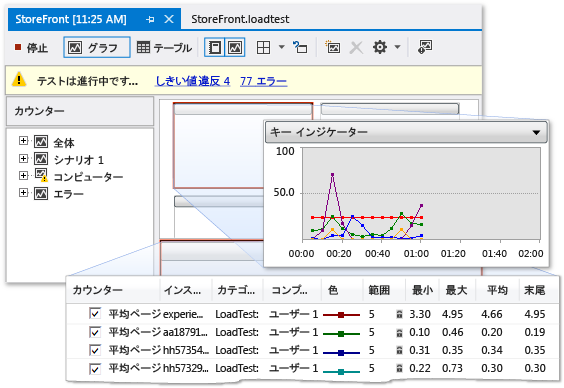

# SharePoint アプリケーションのパフォーマンスのプロファイリング
  SharePoint アプリケーションの実行速度が遅いか効率的でない場合、Visual Studio のプロファイル機能を使用して、問題のあるコードやその他の要素を特定できます。  ロード テスト機能を使用すると、多数のユーザーがアプリケーションに同時にアクセスする場合など、ストレス下で SharePoint アプリケーションを実行する方法を決定できます。  Web パフォーマンス テストを実行すると、Web 上でのアプリケーションの実行方法を測定できます。  コード化された UI テストを使用すると、ユーザー インターフェイスを含め、SharePoint アプリケーション全体が適切に機能しているかどうかを確認できます。  これらのテストを一緒に使用すると、アプリケーションを配置する前にパフォーマンスの問題を識別するのに役立ちます。  
  
## プロファイリング ツールの概要  
 プロファイルとは、実行中のアプリケーションのパフォーマンス動作を観察および記録するプロセスのことです。  アプリケーションをプロファイルすると、ボトルネック、非効率的なコード、メモリ割り当ての問題など、アプリケーションの実行速度の低下または過度なメモリ消費を引き起こす問題を見つけることができます。  たとえば、プロファイルを使用すると、頻繁に呼び出され、アプリケーション全体のパフォーマンスを低下させる可能性があるコードのセグメントであるホットスポットをコード内で特定できます。  特定したホットスポットは、最適化するか除去します。  
  
 統合開発環境 \(IDE: Integrated Development Environment\) を使用すると、このようなパフォーマンスの問題を特定し検索できます。  SharePoint プロジェクトに対するこれらのツールの動作は、他の種類の Visual Studio プロジェクトに対する動作と同じです。  プロファイリング ツールのパフォーマンス ウィザードでは、指定したテストを使用するパフォーマンス セッションを作成できます。  パフォーマンス セッションは、パフォーマンス情報をアプリケーションから収集する際に使用される一連の構成データと、1 つ以上のプロファイル実行の結果です。  パフォーマンス セッションはプロジェクト フォルダーに格納され、**パフォーマンス エクスプローラー**に表示できます。  詳細については、「[プロファイル方法について](../profiling/understanding-performance-collection-methods.md)」を参照してください。  
  
 アプリケーションでプロファイル分析を作成して実行すると、レポートにそのパフォーマンスに関する詳細情報が示されます。  このレポートには、一定期間における CPU 使用率のグラフ、階層関数の呼び出し履歴、コール ツリーなどの項目を含めることができます。  レポートの正確な内容は、サンプリング、インストルメンテーションなど、実行するテストの種類によって異なることがあります。  詳細については、「[プロファイル ツール レポートの概要](http://go.microsoft.com/fwlink/?LinkId=224689)」を参照してください。  
  
## パフォーマンス セッションのプロセス  
 アプリケーションのプロファイリングを行うには、最初に、プロファイリング ツールのパフォーマンス ウィザードを使用してパフォーマンス セッションを作成します。  メニュー バーで、**\[分析\]**、**\[パフォーマンス ウィザードの起動\]** の順に選択します。  ウィザードの完了時に、必要なプロファイリング方法、プロファイリングするアプリケーションなど、パフォーマンス セッションに必要な情報を入力します。  詳細については、「[方法: パフォーマンス ウィザードを使用して Web サイトまたは Web アプリケーションのプロファイリングを行う](http://go.microsoft.com/fwlink/?LinkId=224692)」を参照してください。  また、コマンド ライン オプションを使用して、パフォーマンス セッションを設定および実行することもできます。  詳細については、「[コマンド ラインからのプロファイリング ツールの使用](http://go.microsoft.com/fwlink/?LinkId=224703)」を参照してください。  パフォーマンス セッションをあらゆる側面から構成する必要がある場合は、「[方法: プロファイリング ツールを使用してパフォーマンス セッションを手動で作成する](http://go.microsoft.com/fwlink/?LinkId=224691)」を参照してください。  また、**\[テスト結果\]** ウィンドウで単体テストのショートカット メニューを開き、**\[パフォーマンス セッションの作成\]** を選択して、単体テストからパフォーマンス セッションを作成することもできます。  
  
 パフォーマンス セッションを設定したら、セッションの構成が保存され、プロファイル データを提供するようにサーバーが構成されます。その後、アプリケーションが実行されます。  アプリケーションの使用中、パフォーマンス データがログ ファイルに書き込まれます。  パフォーマンス セッションは、**\[ターゲット\]** フォルダーの下の **\[パフォーマンス エクスプローラー\]** に表示されます。  パフォーマンス セッションが終了すると、レポートが**パフォーマンス エクスプローラー**の **\[レポート\]** フォルダーに表示されます。  レポートを表示するには、そのレポートを**パフォーマンス エクスプローラー**で開きます。  パフォーマンス セッションのプロパティを表示および構成するには、**パフォーマンス エクスプローラー**でそのセッションのショートカット メニューを開き、**\[プロパティ\]** を選択します。  パフォーマンス セッションの特定のプロパティの詳細については、「[プロファイリング ツールのパフォーマンス セッションの構成](http://go.microsoft.com/fwlink/?LinkId=224694)」を参照してください。  パフォーマンス セッションの結果を解釈する方法の詳細については、「[プロファイリング ツール データの分析](http://go.microsoft.com/fwlink/?LinkId=224704)」を参照してください。  
  
## ストレス テスト  
 アプリケーションのストレスへ パフォーマンスを分析するには、Visual Studio Ultimate でロード テストおよび Web パフォーマンス テストを作成します。  Visual Studio でロード テストを作成するときに、アプリケーションをテストするときに比較対象として使用する、シナリオと呼ばれる要素の組み合わせを指定します。  これらの要素には、ロード パターン、テスト ミックス モデル、テスト ミックス、ネットワーク ミックス、Web ブラウザー ミックスなどが含まれます。  ロード テスト シナリオには、単体テストと Web パフォーマンス テストの両方を含めることができます。  
  
 図 1: ロード テストの結果の例  
  
   
  
 Web パフォーマンス テストでは、エンド ユーザーが SharePoint アプリケーションとやり取りする方法をシミュレートします。  Web パフォーマンス テストを作成するには、ブラウザー セッションで HTTP 要求を記録するか、**Web パフォーマンス テスト レコーダー**を使用します。  Web 要求は、ブラウザー セッションの終了後に **Web パフォーマンス テスト エディター**に表示されます。  その後、**Web パフォーマンス テスト結果ビューアー**で結果をデバッグできます。  また、**Web パフォーマンス テスト エディター**を使用して、Web パフォーマンス テストを手動で構築することもできます。  
  
## ユーザー インターフェイスをテストする  
 コード化された UI テストでは、ユーザー インターフェイス \(UI\) を介して SharePoint アプリケーションが自動的に実行されます。  これらのテストでは、ボタン、メニューなどの UI コントロールが正しく動作するかどうかを確認します。  この種類のテストは、検証や他のロジックが Web ページなどの UI で実行されている場合に特に便利です。  また、コード化された UI テストを使用して、手動テストを自動化することもできます。  SharePoint アプリケーションのコード化された UI テストは、他の種類のアプリケーションのテストを作成するときと同じ方法で作成します。  詳細については、「[コード化された UI テストを使用した SharePoint 2010 アプリケーションのテスト](../test/testing-sharepoint-2010-applications-with-coded-ui-tests.md)」を参照してください。  
  
## 関連トピック  
  
|タイトル|説明|  
|----------|--------|  
|[Walkthrough: Profiling a SharePoint Application](../sharepoint/walkthrough-profiling-a-sharepoint-application.md)|SharePoint アプリケーションのサンプリング プロファイル分析を実行する方法を示します。|  
|[Create and run a load test](http://msdn.microsoft.com/ja-jp/7041cbcf-9ab1-4579-98ff-8f296aeaded4)|SharePoint アプリケーションのストレス テストに役立つロード テストを作成する方法について説明します。|  
|[Creating and Editing Web Performance Tests](http://msdn.microsoft.com/ja-jp/8bf5f2a7-c693-47d6-9282-5946480151dc)|ユーザーによる Web 上での SharePoint サイトの操作をシミュレートするのに役立つ、Web パフォーマンス テストを作成する方法について説明します。|  
|[コードの単体テスト](../test/unit-test-your-code.md)|単体テストを使用してコードの論理エラーを検出する方法について説明します。|  
|[コード化された UI テストを使用した SharePoint 2010 アプリケーションのテスト](../test/testing-sharepoint-2010-applications-with-coded-ui-tests.md)|SharePoint アプリケーションのユーザー インターフェイスをテストする方法について説明します。|  
  
## 参照  
 [SharePoint ソリューションのビルドとデバッグ](../sharepoint/building-and-debugging-sharepoint-solutions.md)   
 [アプリケーションのテスト](../Topic/Test%20apps%20early%20and%20often.md)   
 [コードの品質向上](../test/improve-code-quality.md)  
  
  