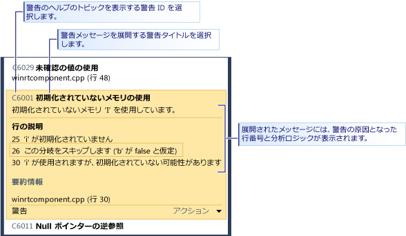

# Visual Studio 静的コード分析によるストア アプリの C++ コード品質の分析
  
  
 Visual Studio express edition のコード分析ツールは、コードを調べてプログラミング上の一般的な問題や違反がないことを確認します。 コード分析の警告はコンパイラのエラーや警告とは異なります。コード分析は、有効であってもコードの作成者やコードを利用する他のユーザーにとって問題になる可能性がある特定のコード パターンを検索するからです。 また、コード分析では、テストでは検出できないコードの欠陥を見つけることができます。 開発プロセス中に定期的にコード分析ツールを実行することで、高品質なアプリを完成させることができます。  
  
> [!NOTE]
>  Visual Studio Ultimate、Visual Studio Premium、および Visual Studio Professional では、コード分析ツールの全機能を使用できます。 MSDN ライブラリの「[コード分析ツールを使用したアプリケーション品質の分析](http://msdn.microsoft.com/library/dd264897.aspx)」を参照してください。  
  
## このトピックの内容  
 以下について説明します。  
  
 [コード分析の実行](../test/analyze-cpp-code-quality-of-store-apps-using-visual-studio-static-code-analysis.md#BKMK_Run)  
  
 [コード分析警告の分析と解決](../test/analyze-cpp-code-quality-of-store-apps-using-visual-studio-static-code-analysis.md#BKMK_Analyze)  
  
 [コード分析警告の抑制](../test/analyze-cpp-code-quality-of-store-apps-using-visual-studio-static-code-analysis.md#BKMK_Suppress)  
  
 [コード分析結果の検索とフィルター処理](../test/analyze-cpp-code-quality-of-store-apps-using-visual-studio-static-code-analysis.md#BKMK_Search)  
  
 [C++ のコード分析の警告](../test/analyze-cpp-code-quality-of-store-apps-using-visual-studio-static-code-analysis.md#Warnings)  
  
##   コード分析の実行  
 Visual Studio ソリューションでコード分析を実行するには:  
  
-   [**ビルド**] メニューの [**ソリューションでコード分析を実行**] をクリックします。  
  
 プロジェクトをビルドするたびに自動的にコード分析を実行するには:  
  
1.  ソリューション エクスプローラーでプロジェクト名を選択し、[**プロパティ**] をクリックします。  
  
2.  プロジェクトのプロパティ ページで [**コード分析**]、[**ビルド時に C/C++ のコード分析を有効化**] の順に選択します。  
  
 ソリューションがコンパイルされ、コード分析が実行されます。 結果は、[コード分析] ウィンドウに表示されます。  
  
 ![[コード分析] ウィンドウ](../test/media/ca_cpp_collapsed.png "CA_CPP_Collapsed")  
  
##   コード分析警告の分析と解決  
 特定の警告を分析するには、[コード分析] ウィンドウで警告のタイトルを選択します。 警告が展開され、問題に関する詳細情報が表示されます。 コード分析は、可能な場合は警告につながる行番号と分析ロジックを表示します。  
  
   
  
 警告を展開すると、警告の原因となったコード行が Visual Studio のコード エディターで強調表示されます。  
  
   
  
 問題を理解した後は、コード内で解決できます。 その後、コード分析に戻り、[コード分析] ウィンドウに警告が表示されなくなったことと、修正によって新たな警告が発生していないことを確認します。  
  
> [!TIP]
>  コード分析は、[コード分析] ウィンドウから再実行できます。 [**分析**] ボタンをクリックし、分析の範囲を選択します。 ソリューション全体または選択したプロジェクトの分析を再実行できます。  
  
##   コード分析警告の抑制  
 コード分析警告の修正を行わないことを決定する場合があります。 コードを実装したときの警告の発生確率と、警告を解決するためのコード変更の量を比較して、解決しないことを選択できます。 または、警告で使用された分析が特定のコンテキストでは不適切であると判断できます。 個々の警告を抑制して、[コード分析] ウィンドウに表示されないように設定できます。  
  
 警告を抑制するには:  
  
1.  詳細情報が表示されない場合は、警告のタイトルを展開します。  
  
2.  警告の下部にある [**アクション**] リンクをクリックします。  
  
3.  [**メッセージの非表示**]、[**ソース内**] の順に選択します。  
  
 メッセージを非表示にすると、コードの該当行に対して警告を抑制する`#pragma(warning:`*警告 ID*`)` が挿入されます。  
  
##   コード分析結果の検索とフィルター処理  
 警告メッセージの長い一覧の検索と、複数のプロジェクトから成るソリューションの警告をフィルター処理できます。  
  
 ![[コード分析] ウィンドウの検索とフィルター処理](../test/media/ca_searchfilter.png "CA_SearchFilter")  
  
##   C++ のコード分析の警告  
 コード分析は、C++ コードに次の警告を発生させます。  
  
|ルール|説明|  
|----------|-----------------|  
|[C6001](../code-quality/c6001.md)|初期化されていないメモリの使用|  
|[C6011](../code-quality/c6011.md)|Null ポインターの逆参照|  
|[C6029](../code-quality/c6029.md)|未確認の値の使用|  
|[C6053](../code-quality/c6053.md)|呼び出しの 0 での終了|  
|[C6059](../code-quality/c6059.md)|不適切な連結|  
|[C6063](../code-quality/c6063.md)|Format 関数への文字列引数がない|  
|[C6064](../code-quality/c6064.md)|Format 関数への整数引数がない|  
|[C6066](../code-quality/c6066.md)|Format 関数へのポインター引数がない|  
|[C6067](../code-quality/c6067.md)|Format 関数への文字列ポインター引数がない|  
|[C6101](../code-quality/c6101.md)|初期化されていないメモリを返す|  
|[C6200](../code-quality/c6200.md)|インデックスがバッファーの最大値を超過|  
|[C6201](../code-quality/c6201.md)|インデックスがスタック バッファーの最大値を超過|  
|[C6270](../code-quality/c6270.md)|Format 関数への Float 引数がない|  
|[C6271](../code-quality/c6271.md)|Format 関数への余分な引数|  
|[C6272](../code-quality/c6272.md)|Format 関数への Float でない引数|  
|[C6273](../code-quality/c6273.md)|Format 関数への整数でない引数|  
|[C6274](../code-quality/c6274.md)|Format 関数への文字でない引数|  
|[C6276](../code-quality/c6276.md)|無効な文字列のキャスト|  
|[C6277](../code-quality/c6277.md)|無効な CreateProcess 呼び出し|  
|[C6284](../code-quality/c6284.md)|Format 関数への無効なオブジェクト引数|  
|[C6290](../code-quality/c6290.md)|論理 Not とビットごとの And の優先順位|  
|[C6291](../code-quality/c6291.md)|論理 Not とビットごとの Or の優先順位|  
|[C6302](../code-quality/c6302.md)|Format 関数への無効な文字列引数|  
|[C6303](../code-quality/c6303.md)|Format 関数への無効なワイド文字列引数|  
|[C6305](../code-quality/c6305.md)|サイズと数の使用の不一致|  
|[C6306](../code-quality/c6306.md)|不適切な変数引数の関数呼び出し|  
|[C6328](../code-quality/c6328.md)|引数の型の不一致の可能性|  
|[C6385](../code-quality/c6385.md)|読み取りのオーバーラン|  
|[C6386](../code-quality/c6386.md)|書き込みのオーバーラン|  
|[C6387](../code-quality/c6387.md)|無効なパラメーター値|  
|[C6500](../code-quality/c6500.md)|無効な属性プロパティ|  
|[C6501](../code-quality/c6501.md)|属性プロパティ値の競合|  
|[C6503](../code-quality/c6503.md)|参照は Null にはできない|  
|[C6504](../code-quality/c6504.md)|非ポインターでの Null|  
|[C6505](../code-quality/c6505.md)|Void での MustCheck|  
|[C6506](../code-quality/c6506.md)|非ポインターまたは配列でのバッファー サイズ|  
|[C6507](http://msdn.microsoft.com/en-us/18f88cd1-d035-4403-a6a4-12dd0affcf21)|逆参照ゼロでの Null 不一致|  
|[C6508](../code-quality/c6508.md)|定数での書き込みアクセス|  
|[C6509](../code-quality/c6509.md)|前提条件で使用される Return|  
|[C6510](../code-quality/c6510.md)|非ポインターでの Null 終了|  
|[C6511](../code-quality/c6511.md)|MustCheck は Yes または No でなければならない|  
|[C6513](../code-quality/c6513.md)|バッファー サイズのない要素サイズ|  
|[C6514](../code-quality/c6514.md)|バッファー サイズが配列サイズを超過|  
|[C6515](../code-quality/c6515.md)|非ポインターでのバッファー サイズ|  
|[C6516](../code-quality/c6516.md)|属性にプロパティがない|  
|[C6517](../code-quality/c6517.md)|読み取り可能でないバッファーでの有効なサイズ|  
|[C6518](../code-quality/c6518.md)|書き込み可能でないバッファーでの書き込み可能サイズ|  
|[C6519](http://msdn.microsoft.com/en-us/2b6326b0-0539-4d26-8fb1-720114933232)|無効な注釈です: 'NeedsRelease' プロパティは Yes または No でなければなりません|  
|[C6521](http://msdn.microsoft.com/en-us/e98d0ae3-6f13-47b2-9a15-15d4055af9ef)|無効なサイズの文字列の逆参照|  
|[C6522](../code-quality/c6522.md)|無効なサイズの文字列型|  
|[C6523](http://msdn.microsoft.com/en-us/11397a31-b224-46b0-afb7-d49ca576a3bb)|無効なサイズの文字列パラメーター|  
|[C6525](../code-quality/c6525.md)|無効なサイズの到達不能な場所の文字列|  
|[C6526](http://msdn.microsoft.com/en-us/59c590c7-0098-4166-a1ac-87f324596002)|無効なサイズの文字列バッファー型|  
|[C6527](../code-quality/c6527.md)|無効な注釈です: 'NeedsRelease' プロパティは、void 型の値では使用できません|  
|[C6530](../code-quality/c6530.md)|認識されない書式指定文字列スタイル|  
|[C6540](../code-quality/c6540.md)|この関数で属性注釈を使用すると、既存の __declspec 注釈がすべて無効となります|  
|[C6551](../code-quality/c6551.md)|無効なサイズ指定です: 式が解析可能ではありません|  
|[C6552](../code-quality/c6552.md)|無効な Deref= または Notref= です: 式が解析可能ではありません|  
|[C6701](../code-quality/c6701.md)|値が有効な Yes/No/Maybe 値ではありません|  
|[C6702](../code-quality/c6702.md)|値が文字列値ではありません|  
|[C6703](../code-quality/c6703.md)|値が数値ではありません|  
|[C6704](../code-quality/c6704.md)|予期しない注釈式エラーです|  
|[C6705](../code-quality/c6705.md)|想定した注釈の引数の数が、実際の注釈の引数の数と一致しません|  
|[C6706](../code-quality/c6706.md)|注釈に対する、予期しない注釈エラーです|  
|[C28021](../code-quality/c28021.md)|注釈が付けられているパラメーターはポインターである必要があります|  
|[C28182](../code-quality/c28182.md)|Null ポインターの逆参照 このポインターは、もう 1 つのポインターと同じ Null 値を持ちます。|  
|[C28202](../code-quality/c28202.md)|静的でないメンバーへの参照が正しくありません|  
|[C28203](../code-quality/c28203.md)|クラス メンバーへのあいまいな参照です。|  
|[C28205](../code-quality/c28205.md)|_Success\_ または _On_failure\_ が無効なコンテキスト内で使用されています|  
|[C28206](../code-quality/c28206.md)|左側のオペランドは構造体をポイントするため、'-> ' を使用します|  
|[C28207](../code-quality/c28207.md)|左側のオペランドは構造体であるため、'.' を使用します|  
|[C28210](../code-quality/c28210.md)|__on_failure コンテキストの注釈を明示的なプリ コンテキストに含めることはできません|  
|[C28211](../code-quality/c28211.md)|SAL_context には静的コンテキスト名が必要です|  
|[C28212](../code-quality/c28212.md)|注釈にはポインター式が必要です|  
|[C28213](../code-quality/c28213.md)|_Use_decl_annotations\_ 注釈は、変更、先行する宣言なしで、参照に使用される必要があります。|  
|[C28214](../code-quality/c28214.md)|属性パラメーター名は、p1...p9 である必要があります|  
|[C28215](../code-quality/c28215.md)|typefix は、既に typefix のあるパラメーターには適用できません|  
|[C28216](../code-quality/c28216.md)|checkReturn 注釈は、特定の関数パラメーターの事後条件にのみ適用されます。|  
|[C28217](../code-quality/c28217.md)|関数について、注釈へのパラメーター数がファイルで検出されたものと一致しません|  
|[C28218](../code-quality/c28218.md)|関数パラメーターについて、注釈のパラメーターがファイルで検出されたものと一致しません|  
|[C28219](../code-quality/c28219.md)|注釈 (注釈のパラメーター) には列挙型のメンバーが必要です|  
|[C28220](../code-quality/c28220.md)|注釈 (注釈のパラメーター) には整数式が必要です|  
|[C28221](../code-quality/c28221.md)|注釈のパラメーターには文字列式が必要です|  
|[C28222](../code-quality/c28222.md)|注釈には __yes、\__no、または \__maybe が必要です|  
|[C28223](../code-quality/c28223.md)|注釈に必要なトークン/識別子、パラメーターがありません|  
|[C28224](../code-quality/c28224.md)|注釈にはパラメーターが必要です|  
|[C28225](../code-quality/c28225.md)|注釈に正しい数の必須パラメーターがありません|  
|[C28226](../code-quality/c28226.md)|注釈は、PrimOp (現在の宣言内) になることもできません|  
|[C28227](../code-quality/c28227.md)|注釈は、PrimOp (前の宣言を参照) になることもできません|  
|[C28228](../code-quality/c28228.md)|注釈パラメーター: 注釈内で型を使用することはできません|  
|[C28229](../code-quality/c28229.md)|注釈はパラメーターをサポートしません|  
|[C28230](../code-quality/c28230.md)|パラメーターの型にはメンバーがありません。|  
|[C28231](../code-quality/c28231.md)|注釈は配列でのみ有効です|  
|[C28232](../code-quality/c28232.md)|pre、post、または deref は注釈に適用されません|  
|[C28233](../code-quality/c28233.md)|pre、post、または deref はブロックに適用されます|  
|[C28234](../code-quality/c28234.md)|_at 式は現在の関数に適用されません|  
|[C28235](../code-quality/c28235.md)|関数は注釈として独立できません|  
|[C28236](../code-quality/c28236.md)|注釈は式内で使用できません|  
|[C28237](../code-quality/c28237.md)|パラメーターの注釈は、もうサポートされていません|  
|[C28238](../code-quality/c28238.md)|パラメーターの注釈には、複数の値、stringValue、および longValue が含まれています。 paramn=xxx を使用してください|  
|[C28239](../code-quality/c28239.md)|パラメーターの注釈には、両方の値、stringValue、または longValue、さらに paramn=xxx が含まれます。 paramn=xxx のみを使用してください|  
|[C28240](../code-quality/c28240.md)|パラメーターの注釈は、param2 を含みますが param1 は含みません|  
|[C28241](../code-quality/c28241.md)|パラメーターの関数の注釈は認識されません|  
|[C28243](../code-quality/c28243.md)|パラメーターの関数の注釈には、注釈が付けられた実際の型に許可された数よりも多くの逆参照が必要です|  
|[C28245](../code-quality/c28245.md)|関数に対する注釈は、非メンバー関数上で 'this' に注釈を付けます。|  
|[C28246](../code-quality/c28246.md)|関数に対するパラメーターの注釈が、パラメーターの型に一致しません|  
|[C28250](../code-quality/c28250.md)|関数に対する一貫性のない注釈: 前のインスタンスにはエラーが含まれます。|  
|[C28251](../code-quality/c28251.md)|関数に対する一貫性のない注釈: 前のインスタンスにはエラーが含まれます。|  
|[C28252](../code-quality/c28252.md)|関数に対する一貫性のない注釈: パラメーターは、このインスタンスについて他の注釈を含みます。|  
|[C28253](../code-quality/c28253.md)|関数に対する一貫性のない注釈: パラメーターは、このインスタンスについて他の注釈を含みます。|  
|[C28254](../code-quality/c28254.md)|dynamic_cast<>() は、注釈ではサポートされません|  
|[C28262](../code-quality/c28262.md)|注釈での構文エラーが関数の注釈で見つかりました|  
|[C28263](../code-quality/c28263.md)|条件付き注釈での構文エラーが、組み込みの注釈で見つかりました|  
|[C28264](http://msdn.microsoft.com/en-us/bf6ea983-a06e-4752-a042-747a7dbf338c)|結果リストの値は定数である必要があります。|  
|[C28267](../code-quality/c28267.md)|注釈での構文エラーが、関数の注釈で見つかりました。|  
|[C28272](../code-quality/c28272.md)|検査中の関数とパラメーターに対する注釈に関数宣言との一貫性がありません|  
|[C28273](../code-quality/c28273.md)|関数について、手がかりには関数宣言との一貫性がありません。|  
|[C28275](../code-quality/c28275.md)|_Macro_value\_ のパラメーターは null です|  
|[C28279](../code-quality/c28279.md)|シンボルについて、'begin' はありましたが、対応する 'end' がありません|  
|[C28280](../code-quality/c28280.md)|シンボルについて、'end' はありましたが、対応する 'begin' がありません|  
|[C28282](../code-quality/c28282.md)|書式指定文字列は、前提条件の中に存在する必要があります|  
|[C28285](../code-quality/c28285.md)|関数について、パラメーターに構文エラーがあります|  
|[C28286](../code-quality/c28286.md)|関数について、構文エラーが最後の近くにあります|  
|[C28287](../code-quality/c28287.md)|関数について、_At\_() 注釈 (認識されないパラメーター名) に構文エラーがあります|  
|[C28288](../code-quality/c28288.md)|関数について、_At\_() 注釈 (無効のパラメーター名) に構文エラーがあります|  
|[C28289](../code-quality/c28289.md)|関数について: ReadableTo または WritableTo には、パラメーターとして limit-spec がありませんでした|  
|[C28290](../code-quality/c28290.md)|関数の注釈は、実際のパラメーターの数より多い外部参照を含みます|  
|[C28291](../code-quality/c28291.md)|deref レベル 0 での post null/notnull は、関数に対して意味がありません。|  
|[C28300](../code-quality/c28300.md)|演算子に対する互換性のない型の、式のオペランドです|  
|[C28301](../code-quality/c28301.md)|関数の最初の宣言に対して注釈がありません。|  
|[C28302](../code-quality/c28302.md)|余分な _Deref\_ 演算子が注釈に見つかりました。|  
|[C28303](../code-quality/c28303.md)|あいまいな _Deref\_ 演算子が注釈に見つかりました。|  
|[C28304](../code-quality/c28304.md)|不適切に設定された _Notref\_ 演算子がトークンに適用されました。|  
|[C28305](../code-quality/c28305.md)|トークンの解析中にエラーが発生しました。|  
|[C28350](../code-quality/c28350.md)|注釈には、条件付きで適用できない状況の説明が表示されます。|  
|[C28351](../code-quality/c28351.md)|注釈には、動的な値 (変数) が使用できない条件が記述されています。|

