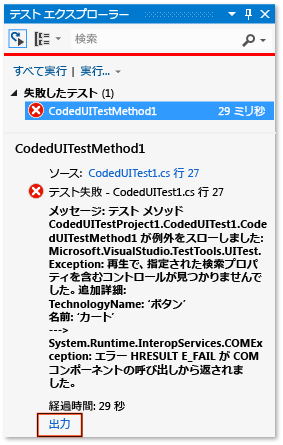
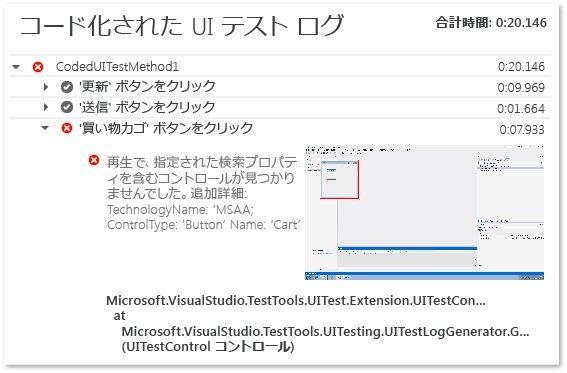

# <a name="analyzing-coded-ui-tests-using-coded-ui-test-logs"></a>コード化された UI テスト ログを使用したコード化された UI テストの分析
コード化された UI テスト ログは、コード化された UI テストの実行に関する重要な情報にフィルターを適用して記録します。  
  
 **Requirements**  
  
-   Visual Studio Enterprise  
  
## <a name="why-should-i-do-this"></a>この操作を行う理由  
 問題をすばやくデバッグできるような形式で、ログが表示されます。  
  
## <a name="how-do-i-do-this"></a>操作方法  
  
### <a name="step-1-enable-logging"></a>手順 1: ログ記録を有効にする  
 シナリオに応じて、以下のいずれかのメソッドを使用してログを有効にします。  
  
-   ターゲット .NET Framework バージョン 4 のテスト プロジェクトに、App.config ファイルが含まれていない  
  
    -   **QTAgent32_40.exe.config** ファイルを開きます。  
  
         既定では、このファイルは、**\<ドライブ名>:\Program Files (x86)\Microsoft Visual Studio 12.0\Common7\IDE** にあります。  
  
         EqtTraceLevel の値を、目的のログ レベルに変更します。  
  
         ファイルを保存します。  
  
-   ターゲット .NET Framework バージョン 4.5 のテスト プロジェクトに、App.config ファイルが含まれていない  
  
    -   **QTAgent32.exe.config** ファイルを開きます。  
  
         既定では、このファイルは、**\<ドライブ名>:\Program Files (x86)\Microsoft Visual Studio 12.0\Common7\IDE** にあります。  
  
         EqtTraceLevel の値を、目的のログ レベルに変更します。  
  
         ファイルを保存します。  
  
-   テスト プロジェクトに App.config ファイルが含まれている  
  
    -   プロジェクトに含まれている App.config ファイルを開きます。  
  
         構成ノードの下に次のコードを追加します。  
  
         `<system.diagnostics>     <switches>       <add name="EqtTraceLevel" value="4" />     </switches>  </system.diagnostics>`  
  
-   テスト コード自体からログを有効にする  
  
    -   <xref:Microsoft.VisualStudio.TestTools.UITesting.PlaybackSettings.LoggerOverrideState%2A> = HtmlLoggerState.AllActionSnapshot;  
  
### <a name="step-2-run-your-coded-ui-test-and-view-the-log"></a>手順 2: コード化された UI テストを実行してログを表示する  
 **QTAgent32.exe.config** ファイルに変更を加えてコード化された UI テストを実行すると、テスト エクスプローラーの結果に、出力リンクが表示されます。 トレース レベルが “verbose” に設定されていると、ログ ファイルはテストが失敗した場合だけでなく、テストが成功した場合にも生成されます。  
  
1.  [**テスト**] メニューの [**ウィンドウ**] を選択し、[**テスト エクスプローラー**] を選択します。  
  
2.  [**ビルド**] メニューの [**ソリューションのビルド**]をクリックします。  
  
3.  テスト エクスプローラーで、実行するコード化された UI テストを選択し、ショートカット メニューを開いて [**選択したテストの実行**] を選択します。  
  
     自動テストが実行され、成功したか失敗したかが示されます。  
  
    > [!TIP]
    >  [**テスト**] メニューからテスト エクスプローラーを表示するには、[**Windows**] をポイントし、[**テスト エクスプローラー**] をクリックします。  
  
4.  テスト エクスプローラーの結果で、[**出力**] リンクを選択します。  
  
       
  
     この操作によって表示されるテストの出力に、操作ログへのリンクが含まれています。  
  
       
  
5.  UITestActionLog.html リンクを選択します。  
  
     Web ブラウザーにログが表示されます。  
  
       
  
## <a name="q--a"></a>Q & A  
  
### <a name="q-what-happened-to-the-enablehtmllogger-key"></a>Q: EnableHtmlLogger キーはどうなったのですか?  
 以前のバージョンの Visual Studio では、コード化された UI テストで HTML ロガーを有効にするための構成設定が他に&2; つありました。  
  
```  
  
<add key="EnableHtmlLogger" value="true"/>  
  
<add key="EnableSnapshotInfo" value="true"/>  
  
```  
  
 Visual Studio 2012 以降、その 2 つの設定は両方とも非推奨となっています。 HTML ロガーを有効にするために変更する必要がある設定は、EqtTraceLevel のみです。  
  
## <a name="see-also"></a>関連項目  
 [UI オートメーションを使用してコードをテストする](../test/use-ui-automation-to-test-your-code.md)   
 [方法: Microsoft Visual Studio からテストを実行する](http://msdn.microsoft.com/Library/1a1207a9-2a33-4a1e-a1e3-ddf0181b1046)

