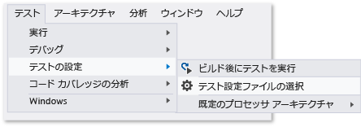

# <a name="configure-unit-tests-by-using-a-runsettings-file"></a>.runsettings ファイルを使用して単体テストを構成する
Visual Studio の単体テストは、\*.runsettings ファイルを使用して構成できます。 (拡張子 runsettings を使用していればファイル名は自由です。) たとえば、テストが実行される .NET Framework、テスト結果が配信されるディレクトリ、テストの実行中に収集されるデータを変更できます。  
  
 特殊な構成を行う必要がない場合、\*.runsettings ファイルは不要です。 このファイルが最もよく使われるのは、[コード カバレッジ](../test/customizing-code-coverage-analysis.md)をカスタマイズする場合です。  
  
> [!NOTE]
>  **.runsettings と .testsettings**  
>   
>  テストを構成するファイルには、次の 2 種類があります。 \*.runsettings は単体テストに使用されます。 \*.testsettings は、[ラボ環境テスト](/devops-test-docs/test/specifying-test-settings-for-visual-studio-tests)、Web パフォーマンスおよびロード テストに使用されます。また、一部の種類の診断データ アダプター (Intellitrace など) およびイベント ログ アダプターをカスタマイズする場合にも使用されます。  
>   
>  2010 以前のエディションの Visual Studio では、単体テストをカスタマイズするためにも \*.testsettings ファイルが使用されていました。 これは現在でも可能ですが、\*.runsettings ファイルで同等の構成を使用する場合より、テストの実行速度が遅くなります。  
  
## <a name="customizing-tests-with-a-runsettings-file"></a>.runsettings ファイルによるテストのカスタマイズ  
  
1.  XML ファイルを Visual Studio ソリューションに追加し、ファイル名を test.runsettings に変更します。 (ファイル名は自由ですが、拡張子には runsettings を使用する必要があります。)  
  
2.  ファイルの内容を以下の [サンプル](#example)で置き換えます。  
  
     必要に応じてファイルを編集します。  
  
3.  **[テスト]** メニューの **[テストの設定]**をクリックし、 **[テスト設定ファイルの選択]**をクリックします。  
  
 ソリューション内に複数の \*.runsettings ファイルを作成し、**[テストの設定]** メニューを使用して状況に応じてそれらを有効または無効にすることができます。  
  
   
  
##  <a name="example"></a> このサンプル .runsettings ファイルをコピーする  
 一般的な \*.runsettings ファイルを示します。 すべての値には既定値があるため、ファイルの各要素は省略可能です。  
  
```xml  
<?xml version="1.0" encoding="utf-8"?>  
<RunSettings>  
  <!-- Configurations that affect the Test Framework -->  
  <RunConfiguration>  
    <MaxCpuCount>1</MaxCpuCount>  
    <!-- Path relative to solution directory -->  
    <ResultsDirectory>.\TestResults</ResultsDirectory>  
  
    <!-- [x86] | x64    
      - You can also change it from menu Test, Test Settings, Default Processor Architecture -->  
    <TargetPlatform>x86</TargetPlatform>  
  
    <!-- Framework35 | [Framework40] | Framework45 -->  
    <TargetFrameworkVersion>Framework40</TargetFrameworkVersion>  
  
    <!-- Path to Test Adapters -->  
    <TestAdaptersPaths>%SystemDrive%\Temp\foo;%SystemDrive%\Temp\bar</TestAdaptersPaths>  
  </RunConfiguration>  
  
  <!-- Configurations for data collectors -->  
  <DataCollectionRunSettings>  
    <DataCollectors>  
      <DataCollector friendlyName="Code Coverage" uri="datacollector://Microsoft/CodeCoverage/2.0" assemblyQualifiedName="Microsoft.VisualStudio.Coverage.DynamicCoverageDataCollector, Microsoft.VisualStudio.TraceCollector, Version=11.0.0.0, Culture=neutral, PublicKeyToken=b03f5f7f11d50a3a">  
        <Configuration>  
          <CodeCoverage>  
            <ModulePaths>  
              <Exclude>  
                <ModulePath>.*CPPUnitTestFramework.*</ModulePath>  
              </Exclude>  
            </ModulePaths>  
  
            <!-- We recommend you do not change the following values: -->  
            <UseVerifiableInstrumentation>True</UseVerifiableInstrumentation>  
            <AllowLowIntegrityProcesses>True</AllowLowIntegrityProcesses>  
            <CollectFromChildProcesses>True</CollectFromChildProcesses>  
            <CollectAspDotNet>False</CollectAspDotNet>  
  
          </CodeCoverage>  
        </Configuration>  
      </DataCollector>  
  
    </DataCollectors>  
  </DataCollectionRunSettings>  
  
  <!-- Parameters used by tests at runtime -->  
  <TestRunParameters>  
    <Parameter name="webAppUrl" value="http://localhost" />  
    <Parameter name="webAppUserName" value="Admin" />  
    <Parameter name="webAppPassword" value="Password" />  
  </TestRunParameters>  
  
  <!-- Adapter Specific sections -->  
  
  <!-- MSTest adapter -->  
  <MSTest>  
    <MapInconclusiveToFailed>True</MapInconclusiveToFailed>  
    <CaptureTraceOutput>false</CaptureTraceOutput>  
    <DeleteDeploymentDirectoryAfterTestRunIsComplete>False</DeleteDeploymentDirectoryAfterTestRunIsComplete>  
    <DeploymentEnabled>False</DeploymentEnabled>  
    <AssemblyResolution>  
      <Directory Path="D:\myfolder\bin\" includeSubDirectories="false"/>  
    </AssemblyResolution>  
  </MSTest>  
  
</RunSettings>  
```  
  
 .runsettings ファイルは、[コード カバレッジ](../test/customizing-code-coverage-analysis.md)を構成するためにも使用されます。  
  
 このトピックの残りの部分では、ファイルの内容について説明します。  
  
## <a name="edit-your-runsettings-file"></a>.runsettings ファイルを編集する  
 .runsettings ファイルには、次の要素があります。  
  
### <a name="test-run-configuration"></a>テストの実行の構成  
  
|ノード|既定値|値|  
|----------|-------------|------------|  
|`ResultsDirectory`||テスト結果が配置されるディレクトリ。|  
|`TargetFrameworkVersion`|Framework40|Framework35、Framework40、Framework45<br /><br /> テストを検出して実行するために、どのバージョンの単体テスト フレームワークを使用するかを指定します。 これは、単体テスト プロジェクトのビルド プロパティで指定した .NET プラットフォームのバージョンと異なっていてもかまいません。|  
|`TargetPlatform`|x86|x86、x64|  
|`TreatTestAdapterErrorsAsWarnings`|false|false、true|  
|`TestAdaptersPaths`||TestAdapter が配置されているディレクトリの 1 つまたは複数のパス|  
|`MaxCpuCount`|1|単体テストを実行するときに、コンピューターで使用可能なコアを使ってテストを並列実行する程度を制御します。  テストの実行エンジンは、使用可能な各コア上の別個のプロセスとして起動し、アセンブリ、DLL、または関連する成果物など、実行するテストが入ったコンテナーを各コアに与えます。  テスト コンテナーはスケジューリングの単位です。  各コンテナーでは、テストはテスト フレームワークに従って実行されます。  コンテナーが多くある場合、あるコンテナー内のテストの実行を終了したプロセスには、次の使用可能なコンテナーが与えられます。<br /><br /> MaxCpuCount には次の値を指定することができます。<br /><br /> n。ここで n は、1 以上、コアの数以下です。最大 n 個のプロセスが起動します<br /><br /> n。ここで n = その他の値です。起動するプロセスの数は、コンピューター上の利用可能なコア数以下になります|  
  
### <a name="diagnostic-data-adapters-data-collectors"></a>診断データ アダプター (データ コレクター)  
 `DataCollectors` 要素は、診断データ アダプターの設定を指定します。 診断データ アダプターは、テスト対象の環境とアプリケーションに関する追加情報を収集するために使用します。 各アダプターには既定の設定があるため、既定値を使用しない場合にのみ設定を指定する必要があります。  
  
#### <a name="code-coverage-adapter"></a>コード カバレッジ アダプター  
 コード カバレッジ データ コレクターは、アプリケーション コードのどの部分がテストで実行されたかを示すログを作成します。 コード カバレッジの設定のカスタマイズの詳細については、「[コード カバレッジ分析のカスタマイズ](../test/customizing-code-coverage-analysis.md)」を参照してください。  
  
#### <a name="other-diagnostic-data-adapters"></a>その他の診断データ アダプター  
 コード カバレッジ アダプターは、現在のところ、実行設定ファイルを使用してカスタマイズできる唯一のアダプターです。  
  
 他の種類の診断データ アダプターをカスタマイズするには、テスト設定ファイルを使用する必要があります。 詳細については、「[Visual Studio のテストにおけるテスト設定の指定](/devops-test-docs/test/specifying-test-settings-for-visual-studio-tests)」を参照してください。  
  
#### <a name="testrunparameters"></a>TestRunParameters  
 TestRunParameters は、実行時にテストで使用できる変数と値の定義方法を提供します。  
  
### <a name="mstest-run-settings"></a>MSTest の実行設定  
 これらは、 `[TestMethod]` 属性を持つテスト メソッドを実行するテスト アダプターに固有の設定です。  
  
|構成|既定値|値|  
|-------------------|-------------|------------|  
|ForcedLegacyMode|false|Visual Studio 2012 で、MSTest アダプターは処理速度と拡張性を高めるために最適化されました。 テストが実行される順序などの一部の動作は、Visual Studio の以前のエディションでの動作と完全に同じではない場合もあります。 以前のテスト アダプターを使用するには、この値を `true` に設定します。<br /><br /> たとえば、単体テスト用に指定された app.config ファイルがある場合は、これを使用することがあります。<br /><br /> より新しいアダプターを使用できるように、テストのリファクタリングを検討することをお勧めします。|  
|IgnoreTestImpact|false|テストの影響機能は、MSTest で実行したとき、または Microsoft Test Manager から実行したときに最近の変更の影響を受けるテストの優先順位を付けます。 この設定は機能を非アクティブ化します。 詳細については、「[方法: コードの変更後に実行するテストをチェックするためのデータを収集する](http://msdn.microsoft.com/Library/2f921ea1-9bb0-4870-a30f-0521fc22cb47)」を参照してください。|  
|SettingsFile||ここで、MSTest アダプターで使用するテスト設定ファイルを指定できます。 **[テスト]**メニューの **[テストの設定]**、 **[テスト設定ファイルの選択]**を使用してテスト設定ファイルを指定することもできます。<br /><br /> この値を指定する場合は、 **ForcedlegacyMode** も **true**に設定する必要があります。<br /><br /> `<RunSettings>   <MSTest>     <SettingsFile>my.testsettings</SettingsFile>      <ForcedLegacyMode>true</ForcedLegacyMode>    </MSTest> </RunSettings>`|  
|KeepExecutorAliveAfterLegacyRun|false|テストの実行が完了した後、MSTest がシャットダウンされます。 テストの一部として起動されたプロセスは、現時点で中止されます。 テスト実行プログラムを中止しない場合は、この構成を true に切り替えます。<br /><br /> たとえば、コード化された UI テストの間にブラウザーの実行を維持するためにこれを使用できます。|  
|DeploymentEnabled|true|これを false に設定すると、テスト メソッドで指定した配置項目が配置ディレクトリにコピーされません。|  
|CaptureTraceOutput|true|Trace.WriteLine を使用して、テスト メソッドからデバッグ トレースに書き込むことができます。 この構成を使用して、これらのデバッグ トレースをオフにできます。|  
|DeleteDeploymentDirectoryAfterTestRunIsComplete|true|この値を false に設定することで、テストの実行後に配置ディレクトリを保持できます。|  
|MapInconclusiveToFailed|false|テストが結果不確定の状態で返された場合、通常はテスト エクスプローラーで [スキップ] 状態にマップされます。 結果不確定のテストを [失敗] として表示する場合は、この構成を使用します。|  
|InProcMode|false|テストを MSTest アダプターと同じプロセスで実行する場合は、この値を true に設定します。 この設定で、わずかにパフォーマンスが向上します。 ただし、あるテストが例外で終了した場合、他のテストは続行されません。|  
|AssemblyResolution|false|単体テストを検索して実行する場合、追加のアセンブリへのパスを指定できます。  たとえば、テスト アセンブリと同じディレクトリに存在しない依存関係アセンブリにこれらのパスを使用します。  パスを指定するには、"ディレクトリ パス" 要素を使用します。  パスには、環境変数を含めることができます。<br /><br /> `<AssemblyResolution>  <Directory Path>"D:\myfolder\bin\" includeSubDirectories="false"/> </AssemblyResolution>`|  
  
## <a name="see-also"></a>関連項目  
 [コード カバレッジ分析のカスタマイズ](../test/customizing-code-coverage-analysis.md)   
 [Visual Studio のテストにおけるテスト設定の指定](/devops-test-docs/test/specifying-test-settings-for-visual-studio-tests)

