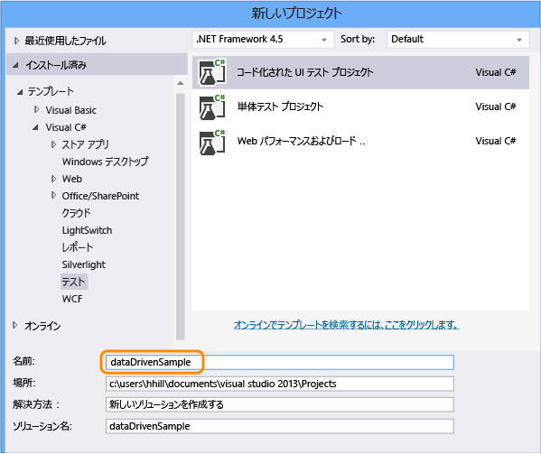
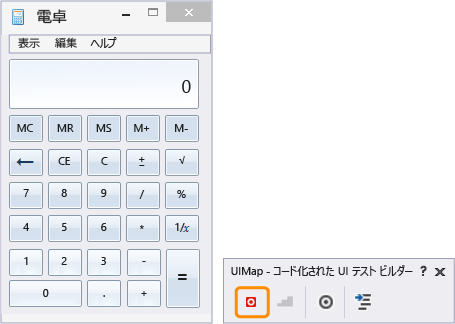
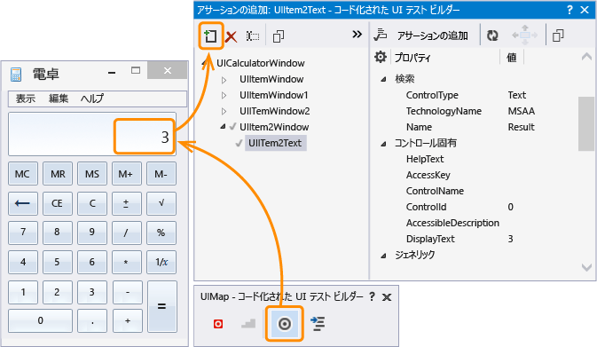
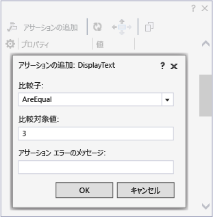
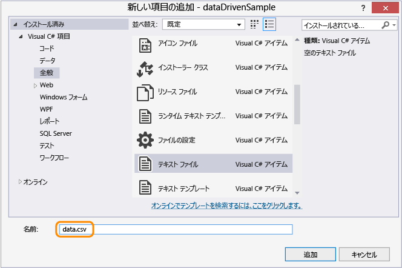
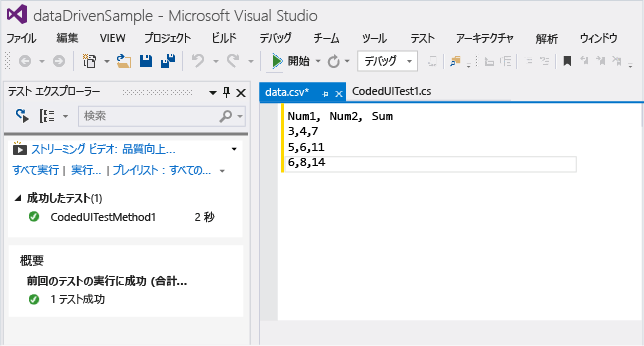
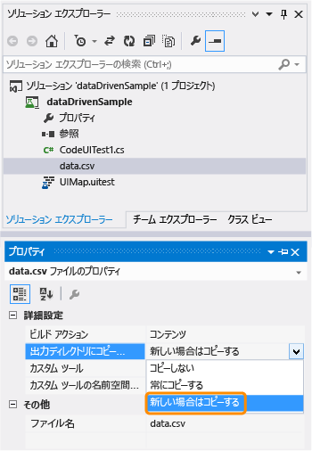
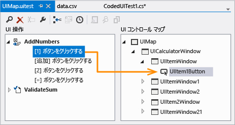
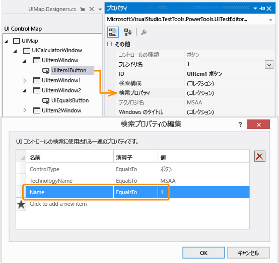

# <a name="creating-a-data-driven-coded-ui-test"></a>データ ドリブンのコード化された UI テストの作成

さまざまな条件をテストするには、パラメーター値を変えながら複数回テストを実行します。 これを行う場合、データ ドリブンのコード化された UI テストが便利な方法です。 データ ソースにパラメーター値を定義し、データ ソース内の各行はコード化された UI テストのイテレーションとします。 テスト全体の結果は、すべてのイテレーションの結果に基づきます。 たとえば、1 つのテスト イテレーションが失敗した場合、テスト全体の結果は失敗となります。  
  
 **必要条件**  
  
-   Visual Studio Enterprise  
  
## <a name="create-a-data-driven-coded-ui-test"></a>データ ドリブンのコード化された UI テストの作成  
 このサンプルでは、Windows 電卓アプリケーション上で実行されるコード化された UI テストを作成します。 2 つの数値を加算し、アサーションを使用して合計が正しいことを検証します。 次に、アサーションおよび 2 つの数値のパラメーター値をデータ ドリブンになるようにコーディングし、コンマ区切り値 (.csv) ファイルに保存します。  
  
#### <a name="step-1---create-a-coded-ui-test"></a>ステップ 1 - コード化された UI テストを作成する  
  
1.  プロジェクトを作成します。  
  
       
  
2.  アクションを記録することを選択します。  
  
       
  
3.  電卓アプリを開き、テストの記録を開始します。  
  
       
  
4.  1 と 2 を加算し、レコーダーを一時停止し、テスト メソッドを生成します。 後で、このユーザー入力の値をデータ ファイルからの値に置換することになります。  
  
       
  
     テスト ビルダーを閉じます。 メソッドがテストに追加されます。  

    ```csharp
    [TestMethod]  
    public void CodedUITestMethod1()  
    {  
        // To generate code for this test, select "Generate Code for Coded UI Test" from the shortcut menu and select one of the menu items.  
        this.UIMap.AddNumbers();
    }
    ```

5.  `AddNumbers()` メソッドを使用して、テストが実行されていることを確認します。 前に示したテスト メソッドにカーソルを置き、コンテキスト メニューを開き、**[テストの実行]** を選択します。 (キーボード ショートカット: Ctrl + R、T)。  
  
     テストの合格または失敗を示すテスト結果が、[テスト エクスプローラー] ウィンドウに表示されます。 [テスト エクスプローラー] ウィンドウを開くには、**[テスト]** メニューの **[Windows]** を選択し、**[テスト エクスプローラー]** を選択します。  
  
6.  予期される値を検証するテストでのアサーション パラメーター値のためにデータ ソースを使用する場合もあるため、2 つの数値の合計が正しいことを検証するアサーションを追加してみます。 前に示したテスト メソッドにカーソルを置き、コンテキスト メニューを開き、**[コード化された UI テストのコードの生成]**、**[コード化された UI テスト ビルダーの使用]** の順に選択します。  
  
     合計を表示する電卓のテキスト コントロールをマップします。  
  
       
  
7.  合計の値が正しいことを検証するアサーションを追加します。 値が **3** である **[DisplayText]** プロパティを選択し、**[アサーションの追加]** を選択します。 **AreEqual** 比較演算子を使用し、比較値が **3** であることを確認します。  
  
       
  
8.  アサーションを構成した後、ビルダーからコードを再生成します。 これにより、検証用の新しいメソッドが作成されます。  
  
       
  
     `ValidateSum` メソッドは、`AddNumbers` メソッドの結果を検証するため、コード ブロックの末尾に移動します。  
  
    ```csharp
    public void CodedUITestMethod1()  
    {  
  
        // To generate code for this test, select "Generate Code for Coded UI Test" from the shortcut menu and select one of the menu items.  
        this.UIMap.AddNumbers();  
        this.UIMap.ValidateSum();  
  
    }
    ```
  
9. `ValidateSum()` メソッドを使用して、テストが実行されていることを確認します。 前に示したテスト メソッドにカーソルを置き、コンテキスト メニューを開き、**[テストの実行]** を選択します。 (キーボード ショートカット: Ctrl + R、T)。  
  
     この時点では、すべてのパラメーター値はそのメソッドに定数として定義されます。 次に、テストがデータ ドリブンになるようにデータ セットを作成してみます。  
  
#### <a name="step-2---create-a-data-set"></a>ステップ 2 - データ セットを作成する  
  
1.  dataDrivenSample プロジェクトにテキスト ファイルを追加し、その名前を「`data.csv`」にします。  
  
       
  
2.  この .csv ファイルに次のデータを設定します。  
  
    |Num1|Num2|Sum|  
    |----------|----------|---------|  
    |3|4|7|  
    |5|6|11|  
    |6|8|14|  
  
     データを追加した後、ファイルが次のように表示されます。  
  
       
  
3.  正しいエンコーディングを使用して .csv ファイルを保存することが重要です。 **[ファイル]** メニューで、**[保存オプションの詳細設定]** を選択し、エンコード方式として **[Unicode (UTF-8 シグネチャなし) - コードページ 65001]** を選択します。  
  
4.  .csv ファイルは出力ディレクトリにコピーする必要があり、そのようにしないとテストを実行できません。 このコピーには、[プロパティ] ウィンドウを使用します。  
  
       
  
     データ セットを作成したので、次にデータをテストにバインドしてみます。  
  
#### <a name="step-3---add-data-source-binding"></a>ステップ 3 - データ ソース バインドを追加する  
  
1.  データ ソースをバインドするには、テスト メソッドのすぐ上にある既存の `DataSource` 属性内に `[TestMethod]` 属性を追加します。  
  
    ```csharp
    [DataSource("Microsoft.VisualStudio.TestTools.DataSource.CSV", "|DataDirectory|\\data.csv", "data#csv", DataAccessMethod.Sequential), DeploymentItem("data.csv"), TestMethod]  
    public void CodedUITestMethod1()  
    {  
  
        // To generate code for this test, select "Generate Code for Coded UI Test" from the shortcut menu and select one of the menu items.  
        this.UIMap.AddNumbers();  
        this.UIMap.ValidateSum();  
  
    }
    ```

     データ ソースがこのテスト メソッドで使用できるようになりました。  
  
    > [!TIP]
    > XML、SQL Express、Excel など他の種類のデータ ソースを使用するサンプルについては、Q & A のセクションにある[データ ソース属性のサンプル](#CreateDataDrivenCUIT_QA_DataSourceAttributes)を参照してください。  
  
2.  テストを実行します。  
  
     テストは、3 つのイテレーションを実行することに注意してください。 これは、バインドされたデータ ソースに 3 行のデータが含まれているためです。 ただし、テストでは定数パラメーター値が引き続き使用され、毎回 3 の合計に 1 + 2 が加算されます。  
  
     次に、データ ソース ファイル内の値を使用するようにテストを構成します。  
  
#### <a name="step-4---use-the-data-in-the-coded-ui-test"></a>ステップ 4 - コード化された UI テストでデータを使用する  
  
1.  CodedUITest.cs ファイルの先頭に `using Microsoft.VisualStudio.TestTools.UITesting.WinControls` を追加します。  
  
    ```csharp
    using System;  
    using System.Collections.Generic;  
    using System.Text.RegularExpressions;  
    using System.Windows.Input;  
    using System.Windows.Forms;  
    using System.Drawing;  
    using Microsoft.VisualStudio.TestTools.UITesting;  
    using Microsoft.VisualStudio.TestTools.UnitTesting;  
    using Microsoft.VisualStudio.TestTools.UITest.Extension;  
    using Keyboard = Microsoft.VisualStudio.TestTools.UITesting.Keyboard;  
    using Microsoft.VisualStudio.TestTools.UITesting.WinControls;  
    ```
  
2.  データ ソースからの値を適用する `TestContext.DataRow[]` メソッドに `CodedUITestMethod1()` を追加します。 データ ソースの値は、コントロール `SearchProperties` を使用して UIMap コントロールに割り当てられている定数をオーバーライドします。  
  
    ```csharp
    public void CodedUITestMethod1()  
    {  
  
        // To generate code for this test, select "Generate Code for Coded UI Test" from the shortcut menu and select one of the menu items.  
        this.UIMap.UICalculatorWindow.UIItemWindow.UIItem1Button.SearchProperties[WinButton.PropertyNames.Name] = TestContext.DataRow["Num1"].ToString();this.UIMap.UICalculatorWindow.UIItemWindow21.UIItem2Button.SearchProperties[WinButton.PropertyNames.Name] = TestContext.DataRow["Num2"].ToString();  
        this.UIMap.AddNumbers();  
        this.UIMap.ValidateSumExpectedValues.UIItem2TextDisplayText = TestContext.DataRow["Sum"].ToString();  
        this.UIMap.ValidateSum();  
  
    }
    ```
  
     どの検索プロパティにデータをコーディングするかを確認するには、コード化された UI テスト エディターを使用します。  
  
    -   UIMap.uitest ファイルを開きます。  
  
           
  
    -   UI アクションを選択し、対応する UI コントロールのマップを確認します。 マップがどのようにコードに対応するかに注意します (たとえば、`this.UIMap.UICalculatorWindow.UIItemWindow.UIItem1Button`)。  
  
           
  
    -   [プロパティ] ウィンドウで、**[検索プロパティ]** を開きます。 検索プロパティ **[名前]** の値は、データ ソースを使用してコードで操作される対象です。 たとえば、`SearchProperties` には各データ行の最初の列の値 (`UIItem1Button.SearchProperties[WinButton.PropertyNames.Name] = TestContext.DataRow["Num1"].ToString();`) が割り当てられます。 3 つのイテレーションのために、このテストでは検索プロパティの **[名前]** の値を 3、5、6 の順に変更します。  
  
           
  
3.  ソリューションを保存します。  
  
#### <a name="step-5---run-the-data-driven-test"></a>ステップ 5 - データ ドリブン テストを実行する  
  
1.  テストを再実行して、テストがデータ ドリブンになったことを確認します。  
  
     テストでは、.csv ファイル内の値を使用して、3 つのイテレーションが実行されます。 検証も機能し、テストはテスト エクスプローラーで渡されたとおりに表示されます。  
  
 **ガイダンス**  
  
 詳細については、「[Visual Studio 2012 を使用した継続的配信のためのテスト - 第 2 章: 単体テスト: 内部のテスト](http://go.microsoft.com/fwlink/?LinkID=255188)」および「[Visual Studio 2012 を使用した継続的配信のためのテスト - 第 5 章: システム テストの自動化](http://go.microsoft.com/fwlink/?LinkID=255196)」 を参照してください。  
  
## <a name="q--a"></a>Q & A  
  
###  <a name="CreateDataDrivenCUIT_QA_DataSourceAttributes"></a> SQL Express や XML など他のデータ ソースの種類のデータ ソースの属性とは何ですか。  
 次の表に示したサンプルのデータ ソース文字列を使用できます。コードにコピーし、必要なカスタマイズを行ってください。  
  
 **データ ソースの型と属性**  
  
-   CSV  
  
     `[DataSource("Microsoft.VisualStudio.TestTools.DataSource.CSV", "|DataDirectory|\\data.csv", "data#csv", DataAccessMethod.Sequential), DeploymentItem("data.csv"), TestMethod]`  
  
-   Excel  
  
     `DataSource("System.Data.Odbc", "Dsn=ExcelFiles;Driver={Microsoft Excel Driver (*.xls)};dbq=|DataDirectory|\\Data.xls;defaultdir=.;driverid=790;maxbuffersize=2048;pagetimeout=5;readonly=true", "Sheet1$", DataAccessMethod.Sequential), DeploymentItem("Sheet1.xls"), TestMethod]`  
  
-   Team Foundation Server でのテスト ケース  
  
     `[DataSource("Microsoft.VisualStudio.TestTools.DataSource.TestCase", "http://vlm13261329:8080/tfs/DefaultCollection;Agile", "30", DataAccessMethod.Sequential), TestMethod]`  
  
-   XML  
  
     `[DataSource("Microsoft.VisualStudio.TestTools.DataSource.XML", "|DataDirectory|\\data.xml", "Iterations", DataAccessMethod.Sequential), DeploymentItem("data.xml"), TestMethod]`  
  
-   SQL Express  
  
     `[DataSource("System.Data.SqlClient", "Data Source=.\\sqlexpress;Initial Catalog=tempdb;Integrated Security=True", "Data", DataAccessMethod.Sequential), TestMethod]`  
  
### <a name="q-can-i-use-data-driven-tests-on-my-windows-phone-app"></a>Q: Windows Phone アプリでデータ ドリブン テストを使用できますか。  
 **A:** できます。 Windows Phone 用のデータ ドリブンのコード化された UI テストは、テスト メソッドで DataRow 属性を使用して定義します。 次の例で、x および y に使用する値は、テストの最初のイテレーションでは 1 と 2、2 番目のイテレーションでは -1 と -2 です。  

```csharp
[DataRow(1, 2, DisplayName = "Add positive numbers")]  
[DataRow(-1, -2, DisplayName = "Add negative numbers")]  
[TestMethod]  
public void DataDrivingDemo_MyTestMethod(int x, int y)
```

詳細については、「[Windows Phone アプリでのデータ ドリブンのコード化された UI テストの使用](../test/test-windows-phone-8-1-apps-with-coded-ui-tests.md#TestingPhoneAppsCodedUI_DataDriven)」を参照してください。
  
### <a name="q-why-cant-i-modify-the-code-in-the-uimapdesigner-file"></a>Q: UIMap.Designer ファイルでコードを変更できないのはなぜですか?  
 **A**: UIMapDesigner.cs ファイルでコードを変更しても、[UIMap - コード化された UI テスト ビルダー] を使用してコードを生成するたびに変更が上書きされます。 このサンプルも含めてほとんどの場合、テストでデータ ソースを使用できるようにするためのコード変更は、テストのソース コード ファイル (CodedUITest1.cs) に対して行うことができます。  

記録されたメソッドを変更する必要がある場合は、メソッドを UIMap.cs ファイルにコピーし、メソッド名を変更する必要があります。 UIMap.cs ファイルを使用すると、UIMapDesigner.cs ファイルのメソッドやプロパティをオーバーライドできます。 Coded UITest.cs ファイルの元のメソッドへの参照を削除し、変更したメソッド名に置き換える必要があります。  

## <a name="see-also"></a>関連項目

<xref:Microsoft.VisualStudio.TestTools.UITest.Common.UIMap.UIMap>   
<xref:Microsoft.VisualStudio.TestTools.UnitTesting.Assert>   
[UI オートメーションを使用してコードをテストする](../test/use-ui-automation-to-test-your-code.md)   
[コード化された UI テストを作成する](../test/use-ui-automation-to-test-your-code.md)   
[コード化された UI テストのベスト プラクティス](../test/best-practices-for-coded-ui-tests.md)   
[コード化された UI テストと操作の記録でサポートされている構成とプラットフォーム](../test/supported-configurations-and-platforms-for-coded-ui-tests-and-action-recordings.md)
