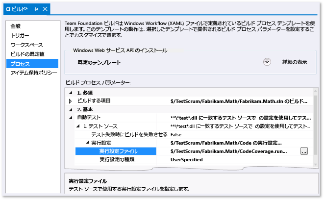

# <a name="customizing-code-coverage-analysis"></a>コード カバレッジ分析のカスタマイズ
既定では、Visual Studio Code カバレッジ ツールは、単体テスト中に読み込まれるすべてのソリューション アセンブリ (.exe/.dll) を分析します。 多くの場合は、この設定が効果的なので、既定のままにしておくことをお勧めします。 詳細については、「[コード カバレッジを使用した、テストされるプロジェクトのコード割合の確認](../test/using-code-coverage-to-determine-how-much-code-is-being-tested.md)」を参照してください。  
  
 コード カバレッジの動作をカスタマイズする前に、次のようないくつかの代替手段を検討してください。  
  
-   *コード カバレッジの結果からテスト コードを除外して、アプリケーションのコードのみを含めます。*  
  
     テスト クラスに `ExcludeFromCodeCoverage Attribute` を追加します。  
  
-   *ソリューションの一部ではないアセンブリを含めます。*  
  
     これらのアセンブリの .pdb ファイルを取得し、アセンブリ .dll ファイルと同じフォルダーにコピーします。  
  
 コード カバレッジの動作をカスタマイズするには、[このトピックの最後にあるサンプル](#sample)をコピーし、ファイル拡張子を .runsettings にしてソリューションに追加します。 ニーズに合わせて編集し、**[テスト]** メニューで **[テストの設定]**、**[テスト設定ファイルの選択]** の順に選択します。 このトピックの残りの部分では、この手順を詳しく説明します。  
  
## <a name="the-runsettings-file"></a>.runsettings ファイル  
 高度なコード カバレッジの設定は、.runsettings ファイルで指定されます。 これは、単体テスト ツールによって使用される構成ファイルです。 [このトピックの最後にあるサンプル](#sample)をコピーし、ニーズに合わせて編集することをお勧めします。  
  
-   *Visual Studio 2010 の .testsettings ファイルとの違い*  
  
     Visual Studio 2010 では、.testsettings ファイルは MSTest フレームワークに基づいて、単体テストだけに適用されます。 Visual Studio 2012 では、テスト ツールは MSTest だけでなく、NUnit、xUnit.net など、他のフレームワークにも適用されます。 .testsettings ファイルは、これらでは機能しません。 .runsettings ファイルは、すべてのテスト フレームワークで機能する方法でテスト ツールをカスタマイズできるように設計されています。  
  
 コード カバレッジをカスタマイズするには、ソリューションに .runsettings ファイルを追加する必要があります。  
  
1.  `.runsettings` という拡張子で、ソリューション項目として .xml ファイルを追加します。  
  
     ソリューション エクスプローラーでソリューションのショートカット メニューを開き、**[追加]**、**[新しい項目]**、**[XML ファイル]** の順にクリックします。 末尾が `CodeCoverage.runsettings` などになる名前でファイルを保存します。  
  
2.  このトピックの最後にあるサンプルの内容を追加し、以下の各セクションの説明に従って、ニーズに合わせてカスタマイズします。  
  
3.  **[テスト]** メニューで **[テストの設定]**、**[テスト設定ファイルの選択]** の順に選択し、ファイルを選択します。  
  
4.  これで、**[コード カバレッジの分析]** を実行すると、この `.runsettings` ファイルが動作を制御するようになります。 コード カバレッジを再度実行する必要があることに注意してください。前のカバレッジの結果とコードの色分けは、テストを実行したりコードを更新したりしても、自動的に非表示にはなりません。  
  
5.  カスタム設定のオンとオフを切り替えるには、**[テストの設定]** メニューの **[テスト]** でファイルを選択したり選択解除したりします。  
  
 ![カスタム設定ファイルを持つ [テストの設定] メニュー](../test/media/codecoverage-settingsfile.png "CodeCoverage-settingsFile")  
  
 単体テストのその他の面も、同じ .runsettings ファイルで構成できます。 詳しくは、「[コードの単体テストUnit Test Your Code](../test/unit-test-your-code.md)」をご覧ください。  
  
### <a name="specifying-symbol-search-paths"></a>シンボル検索パスの指定  
 コード カバレッジでは、アセンブリのシンボル (.pdb ファイル) が存在している必要があります。 ソリューションによってビルドされたアセンブリには、通常、バイナリ ファイルと共にシンボル ファイルも存在しており、コード カバレッジは自動的に動作します。 ただし、場合によっては、参照されるアセンブリをコード カバレッジ分析に追加したいこともあります。 そのような場合、.pdb ファイルがバイナリと同じ場所にないこともありますが、シンボル検索パスを .runsettings ファイルで指定できます。  
  
```xml  
<SymbolSearchPaths>                
      <Path>\\mybuildshare\builds\ProjectX</Path>  
      <!--More paths if required-->  
</SymbolSearchPaths>  
  
```  
  
> [!WARNING]
>  シンボルの解決には、特に多数のアセンブリでリモートのファイルの場所を使用している場合、時間がかかることがあります。 そのため、リモート .pdb ファイルをバイナリ (.dll または .exe) ファイルと同じローカルの場所にコピーすることを検討してください。  
  
### <a name="excluding-and-including"></a>除外と包含  
 指定したアセンブリをコード カバレッジ分析から除外できます。 次に例を示します。  
  
```minterastlib  
<ModulePaths>  
  <Exclude>  
   <ModulePath>Fabrikam.Math.UnitTest.dll</ModulePath>  
   <!-- Add more ModulePath nodes here. -->  
  </Exclude>  
</ModulePaths>  
```  
  
 逆に、どのアセンブリが包含されるかを指定することもできます。 ソリューションにアセンブリを追加するときに、一覧にも忘れずに追加しなければならないのが、この方法の欠点です。  
  
```minterastlib  
<ModulePaths>  
  <Include>  
   <ModulePath>Fabrikam.Math.dll</ModulePath>  
   <!-- Add more ModulePath nodes here. -->  
  </Include>  
</ModulePaths>  
```  
  
 `<Include>` が空の場合、コード カバレッジの処理は、`<Exclude>` 一覧の句に一致する項目を除き、対応する **.pdb** ファイルが見つかる、読み込まれたすべてのアセンブリ (.dll と .exe ファイル) を対象にします。  
  
 `Include` は、`Exclude` の前に処理されます。  
  
### <a name="regular-expressions"></a>正規表現  
 Include ノードと Exclude ノードでは、正規表現を使用できます。 詳細については、「[Visual Studio での正規表現の使用](../ide/using-regular-expressions-in-visual-studio.md)」を参照してください。 正規表現は、ワイルドカードと同じではありません。 特に次の点に注意してください。  
  
1.  **.\*** は任意の文字の文字列と一致します  
  
2.  **\\.** はピリオド "." と一致します  
  
3.  **\\(   \\)** は "(  )" と一致します  
  
4.  **\\\\** はファイル パス区切り記号 "\\" と一致します  
  
5.  **^** は文字列の先頭と一致します  
  
6.  **$** は文字列の末尾と一致します  
  
 すべての一致で、大文字と小文字が区別されます。  
  
 次に例を示します。  
  
```xml  
<ModulePaths>  
  <Include>  
    <!-- Include all loaded .dll assemblies (but not .exe assemblies): -->  
    <ModulePath>.*\.dll$</ModulePath>  
  </Include>  
  <Exclude>  
    <!-- But exclude some assemblies: -->  
    <ModulePath>.*\\Fabrikam\.MyTests1\.dll$</ModulePath>  
    <!-- Exclude all file paths that contain "Temp": -->  
    <ModulePath>.*Temp.*</ModulePath>   
  </Exclude>  
</ModulePaths>  
  
```  
  
> [!WARNING]
>  正規表現にエラー (エスケープされず、一致しないかっこなど) がある場合、コード カバレッジ分析は実行されません。  
  
### <a name="other-ways-to-include-or-exclude-elements"></a>要素を包含または除外するための別の方法  
 例については、[このトピックの末尾のサンプル](#sample)を参照してください。  
  
-   `ModulePath` – アセンブリ ファイル パスで指定されたアセンブリ。  
  
-   `CompanyName` – 会社名属性でアセンブリと一致します。  
  
-   `PublicKeyToken` – 公開キー トークンで、署名付きアセンブリと一致します。 たとえば、すべての Visual Studio コンポーネントおよび拡張機能と一致させるには、`<PublicKeyToken>^B03F5F7F11D50A3A$</PublicKeyToken>` を使用します。  
  
-   `Source` – 要素が定義されているソース ファイルのパス名で要素と一致します。  
  
-   `Attribute` – 特定の属性のアタッチ先の要素と一致します。 属性の完全名を指定し、名前の末尾に "Attribute" を含めます。  
  
-   `Function` – 完全修飾名でプロシージャ、関数、またはメソッドに一致します。  
  
 **関数名の一致**  
  
 正規表現が、名前空間、クラス名、メソッド名、およびパラメーター リストを含む関数の完全修飾名と一致する必要があります。 次に例を示します。  
  
-   C# または Visual Basic: `Fabrikam.Math.LocalMath.SquareRoot(double)`  
  
-   C++: `Fabrikam::Math::LocalMath::SquareRoot(double)`  
  
```xml  
<Functions>  
  <Include>  
    <!-- Include methods in the Fabrikam namespace: -->  
    <Function>^Fabrikam\..*</Function>  
    <!-- Include all methods named EqualTo: -->  
    <Function>.*\.EqualTo\(.*</Function>  
  </Include>  
  <Exclude>  
    <!-- Exclude methods in a class or namespace named UnitTest: -->  
    <Function>.*\.UnitTest\..*</Function>  
  </Exclude>  
</Functions>  
  
```  
  
## <a name="how-to-specify-runsettings-files-while-running-tests"></a>テストの実行中に .runsettings ファイルを指定する方法  
  
### <a name="to-customize-runsettings-in-visual-studio-tests"></a>Visual Studio テストで runsettings をカスタマイズするには  
 **[テスト]**、**[テストの設定]**、**[テスト設定ファイルの選択]** の順に選択し、.runsettings ファイルを選択します。 ファイルは、[テストの設定] メニューに表示され、選択したり取り消したりすることができます。 選択されている間、.runsettings ファイルは、**[コード カバレッジの分析]** を使用するたびに適用されます。  
  
### <a name="to-customize-run-settings-in-a-command-line-test"></a>コマンド ライン テストで実行設定をカスタマイズするには  
 コマンド ラインからテストを実行するには、vstest.console.exe を使用します。 設定ファイルは、このユーティリティのパラメーターです。 詳細については、「[コマンド ラインからの VSTest.console の使用](/devops-test-docs/test/using-vstest-console-from-the-command-line)」を参照してください。  
  
1.  Visual Studio 開発者コマンド プロンプトを起動します。  
  
     Windows の **[スタート]** メニューで **[すべてのプログラム]**、**[Microsoft Visual Studio]**、**[Visual Studio Tools]**、**[開発者コマンド プロンプト]** の順に選択します。  
  
2.  実行します。  
  
     `vstest.console.exe MyTestAssembly.dll /EnableCodeCoverage /Settings:CodeCoverage.runsettings`  
  
### <a name="to-customize-run-settings-in-a-build-definition"></a>ビルド定義で実行設定をカスタマイズするには  
 チーム ビルドからコード カバレッジ データを取得できます。  
  
   
  
1.  .runsettings ファイルがチェックインされていることを確認します。  
  
2.  チーム エクスプローラーで、[**ビルド**] を開き、ビルド定義を追加または編集します。  
  
3.  [**プロセス**] ページで [**自動テスト**]、[**テスト ソース**]、[**実行設定**] の順に展開します。 **.runsettings** ファイルを選択します。  
  
    -   *しかし、**[テスト ソース]** の代わりに **[テスト アセンブリ]** が表示されます。**[実行設定]** フィールドを設定しようとすると、.testsettings ファイルしか選択できません。*  
  
         **[自動テスト]** の下の **[テスト アセンブリ]** を選択し、行の末尾の **[...]** ボタンを選択します。 **[テストの実行の追加と編集]** ダイアログ ボックスで、**[テスト ランナー]** を **[Visual Studio テスト ランナー]** に設定します。  
  
 結果は、ビルド レポートの概要セクションに表示されます。  
  
##  <a name="sample"></a>サンプル .runsettings ファイル  
 このコードをコピーし、独自のニーズに合わせて編集します。 これは、既定の .runsettings ファイルです。  
  
 (.runsettings ファイルのその他の用途については、「[.runsettings ファイルを使用して単体テストを構成する](../test/configure-unit-tests-by-using-a-dot-runsettings-file.md)」を参照してください。)  
  
```xml  
<?xml version="1.0" encoding="utf-8"?>  
<!-- File name extension must be .runsettings -->  
<RunSettings>  
  <DataCollectionRunSettings>  
    <DataCollectors>  
      <DataCollector friendlyName="Code Coverage" uri="datacollector://Microsoft/CodeCoverage/2.0" assemblyQualifiedName="Microsoft.VisualStudio.Coverage.DynamicCoverageDataCollector, Microsoft.VisualStudio.TraceCollector, Version=11.0.0.0, Culture=neutral, PublicKeyToken=b03f5f7f11d50a3a">  
        <Configuration>  
          <CodeCoverage>  
<!--  
Additional paths to search for .pdb (symbol) files. Symbols must be found for modules to be instrumented.  
If .pdb files are in the same folder as the .dll or .exe files, they are automatically found. Otherwise, specify them here.  
Note that searching for symbols increases code coverage runtime. So keep this small and local.  
-->   
<!--             
            <SymbolSearchPaths>                
                   <Path>C:\Users\User\Documents\Visual Studio 2012\Projects\ProjectX\bin\Debug</Path>  
                   <Path>\\mybuildshare\builds\ProjectX</Path>  
            </SymbolSearchPaths>  
-->  
  
<!--  
About include/exclude lists:  
Empty "Include" clauses imply all; empty "Exclude" clauses imply none.  
Each element in the list is a regular expression (ECMAScript syntax). See http://msdn.microsoft.com/library/2k3te2cs.aspx.  
An item must first match at least one entry in the include list to be included.  
Included items must then not match any entries in the exclude list to remain included.  
-->  
  
            <!-- Match assembly file paths: -->  
            <ModulePaths>  
              <Include>  
                <ModulePath>.*\.dll$</ModulePath>  
                <ModulePath>.*\.exe$</ModulePath>  
              </Include>  
              <Exclude>  
                <ModulePath>.*CPPUnitTestFramework.*</ModulePath>  
              </Exclude>  
            </ModulePaths>  
  
            <!-- Match fully qualified names of functions: -->  
            <!-- (Use "\." to delimit namespaces in C# or Visual Basic, "::" in C++.)  -->  
            <Functions>  
              <Exclude>  
                <Function>^Fabrikam\.UnitTest\..*</Function>           
                <Function>^std::.*</Function>  
                <Function>^ATL::.*</Function>  
                <Function>.*::__GetTestMethodInfo.*</Function>  
                <Function>^Microsoft::VisualStudio::CppCodeCoverageFramework::.*</Function>  
                <Function>^Microsoft::VisualStudio::CppUnitTestFramework::.*</Function>  
              </Exclude>  
            </Functions>  
  
            <!-- Match attributes on any code element: -->  
            <Attributes>  
              <Exclude>  
                <!—Don't forget "Attribute" at the end of the name -->  
                <Attribute>^System\.Diagnostics\.DebuggerHiddenAttribute$</Attribute>  
                <Attribute>^System\.Diagnostics\.DebuggerNonUserCodeAttribute$</Attribute>  
                <Attribute>^System\.Runtime\.CompilerServices.CompilerGeneratedAttribute$</Attribute>  
                <Attribute>^System\.CodeDom\.Compiler.GeneratedCodeAttribute$</Attribute>  
                <Attribute>^System\.Diagnostics\.CodeAnalysis.ExcludeFromCodeCoverageAttribute$</Attribute>  
              </Exclude>  
            </Attributes>  
  
            <!-- Match the path of the source files in which each method is defined: -->  
            <Sources>  
              <Exclude>  
                <Source>.*\\atlmfc\\.*</Source>  
                <Source>.*\\vctools\\.*</Source>  
                <Source>.*\\public\\sdk\\.*</Source>  
                <Source>.*\\microsoft sdks\\.*</Source>  
                <Source>.*\\vc\\include\\.*</Source>  
              </Exclude>  
            </Sources>  
  
            <!-- Match the company name property in the assembly: -->  
            <CompanyNames>  
              <Exclude>  
                <CompanyName>.*microsoft.*</CompanyName>  
              </Exclude>  
            </CompanyNames>  
  
            <!-- Match the public key token of a signed assembly: -->  
            <PublicKeyTokens>  
              <!-- Exclude Visual Studio extensions: -->  
              <Exclude>  
                <PublicKeyToken>^B77A5C561934E089$</PublicKeyToken>  
                <PublicKeyToken>^B03F5F7F11D50A3A$</PublicKeyToken>  
                <PublicKeyToken>^31BF3856AD364E35$</PublicKeyToken>  
                <PublicKeyToken>^89845DCD8080CC91$</PublicKeyToken>  
                <PublicKeyToken>^71E9BCE111E9429C$</PublicKeyToken>  
                <PublicKeyToken>^8F50407C4E9E73B6$</PublicKeyToken>  
                <PublicKeyToken>^E361AF139669C375$</PublicKeyToken>  
              </Exclude>  
            </PublicKeyTokens>  
  
            <!-- We recommend you do not change the following values: -->  
            <UseVerifiableInstrumentation>True</UseVerifiableInstrumentation>  
            <AllowLowIntegrityProcesses>True</AllowLowIntegrityProcesses>  
            <CollectFromChildProcesses>True</CollectFromChildProcesses>  
            <CollectAspDotNet>False</CollectAspDotNet>  
  
          </CodeCoverage>  
        </Configuration>  
      </DataCollector>  
    </DataCollectors>  
  </DataCollectionRunSettings>  
</RunSettings>  
  
```  
  
## <a name="see-also"></a>関連項目  
 [コード カバレッジを使用した、テストされるプロジェクトのコード割合の確認](../test/using-code-coverage-to-determine-how-much-code-is-being-tested.md)   
 [コードの単体テスト](../test/unit-test-your-code.md)

