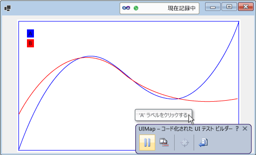

# <a name="enable-coded-ui-testing-of-your-controls"></a>コントロールのコード化された UI テストを有効化する

コード化された UI テスト フレームワークのサポートを実装すると、コントロールがテストしやすくなります。 サポート レベルを徐々に上げることができます。 記録と再生およびプロパティの検証のサポートから始めます。 次に、そのサポートに基づき、コード化された UI テスト ビルダーを有効にし、コントロールのカスタム プロパティを認識します。 生成されたコードからそれらのプロパティにアクセスするためのカスタム クラスを提供します。 また、コード化された UI テスト ビルダーが、記録される操作の目的に近い方法で操作をキャプチャできるようにすることもできます。


## <a name="support-record-and-playback-and-property-validation-by-implementing-accessibility"></a>アクセシビリティの実装によって記録と再生およびプロパティの検証をサポートする

コード化された UI テスト ビルダーは、記録時に出現したコントロールに関する情報をキャプチャし、そのセッションを再生するコードを生成します。 コントロールがアクセシビリティをサポートしていない場合、コード化された UI テスト ビルダーは画面座標を使用して操作 (マウス クリックなど) をキャプチャします。 テストの再生時、生成されたコードは同じ画面座標にアクションを表示します。 テストの再生時にコントロールが画面上の別の場所に表示される場合、生成されたコードは操作の実行に失敗します。 コントロールのアクセシビリティを実装しないとき、異なる画面構成や異なる環境でテストを再生したとき、あるいは UI レイアウトが変わったとき、テスト エラーが表示されることがあります。

 

 アクセシビリティを実装している場合は、コード化された UI テスト ビルダーがそれを利用し、テストを記録するときにコントロールに関する情報をキャプチャします。 その後、テストを実行すると、コントロールがユーザー インターフェイスの別の場所にあっても、生成されたコードがコントロールに対してそれらのイベントを再生します。 テストの作成者は、コントロールの基本的なプロパティを使用してアサートを作成することもできます。

 

### <a name="to-support-record-and-playback-property-validation-and-navigation-for-a-windows-forms-control"></a>Windows フォーム コントロールの記録と再生、プロパティの検証、およびナビゲーションをサポートするには
 次のプロシージャに概要を示し、<xref:System.Windows.Forms.AccessibleObject> で詳しく説明しているように、コントロールのユーザー補助を実装します。

 

1.  <xref:System.Windows.Forms.Control.ControlAccessibleObject> から派生するクラスを実装し、クラスのオブジェクトを返すように <xref:System.Windows.Forms.Control.AccessibilityObject%2A> プロパティをオーバーライドします。

    ```csharp
    public partial class ChartControl : UserControl
    {
        // Overridden to return the custom AccessibleObject for the control.
        protected override AccessibleObject CreateAccessibilityInstance()
        {
            return new ChartControlAccessibleObject(this);
        }

        // Inner class ChartControlAccessibleObject represents accessible information
        // associated with the ChartControl and is used when recording tests.
        public class ChartControlAccessibleObject : ControlAccessibleObject
        {
            ChartControl myControl;
            public ChartControlAccessibleObject(ChartControl ctrl)
                : base(ctrl)
            {
                myControl = ctrl;
            }
        }
    }
    ```

2.  アクセス可能なオブジェクトの <xref:System.Windows.Forms.AccessibleObject.Role%2A>、<xref:System.Windows.Forms.AccessibleObject.State%2A>、<xref:System.Windows.Forms.AccessibleObject.GetChild%2A>、および <xref:System.Windows.Forms.AccessibleObject.GetChildCount%2A> プロパティおよびメソッドをオーバーライドします。

3.  子コントロールの別のアクセシビリティ オブジェクトを実装し、アクセシビリティオブジェクトを返すように子コントロールの <xref:System.Windows.Forms.Control.AccessibilityObject%2A> プロパティをオーバーライドします。

4.  子コントロールのアクセシビリティ オブジェクトの <xref:System.Windows.Forms.AccessibleObject.Bounds%2A>、<xref:System.Windows.Forms.AccessibleObject.Name%2A>、<xref:System.Windows.Forms.AccessibleObject.Parent%2A>、<xref:System.Windows.Forms.AccessibleObject.Role%2A>、<xref:System.Windows.Forms.AccessibleObject.State%2A>、<xref:System.Windows.Forms.AccessibleObject.Navigate%2A>、および <xref:System.Windows.Forms.AccessibleObject.Select%2A> プロパティおよびメソッドをオーバーライドします。

> [!NOTE]
> このトピックでは、<xref:System.Windows.Forms.AccessibleObject> でアクセシビリティのサンプルから始め、残りのプロシージャでそのサンプルに基づいて構築します。 ユーザー補助サンプルの作業バージョンを作成する場合は、コンソール アプリケーションを作成し、*Program.cs* のコードをサンプル コードで置き換えます。 アクセシビリティ、System.Drawing、System.Windows.Forms に参照を追加します。 ビルド警告を除去するために、アクセシビリティの **[相互運用機能型の埋め込み]** を **False** に変更します。 アプリケーションの実行時にコンソール ウィンドウが表示されないように、プロジェクトの出力の種類を **[コンソール アプリケーション]** から **[Windows アプリケーション]** に変更できます。

## <a name="support-custom-property-validation-by-implementing-a-property-provider"></a>プロパティ プロバイダーの実装によってカスタム プロパティの検証をサポートする

記録と再生およびプロパティの検証の基本的なサポートを実装したら、<xref:Microsoft.VisualStudio.TestTools.UITesting.UITestPropertyProvider> プラグインを実装して、コントロールのカスタム プロパティをコード化された UI テストから使用できるようにすることができます。 たとえば、次のプロシージャでは、コード化された UI テストがグラフ コントロールの CurveLegend 子コントロールの State プロパティにアクセスできるようにするプロパティ プロバイダーを作成します。

 

### <a name="to-support-custom-property-validation"></a>カスタム プロパティの検証をサポートするには


1. 曲線の凡例のアクセス可能なオブジェクトの <xref:System.Windows.Forms.AccessibleObject.Description%2A> プロパティをオーバーライドし、説明文字列の豊富なプロパティ値を渡します。 複数の値はセミコロン (;) で区切ります。

    ```csharp
    public class CurveLegendAccessibleObject : AccessibleObject
    {
        // add the state property value to the description
        public override string Description
        {
            get
            {
                // Add ";" and the state value to the end
                // of the curve legend's description
                return "CurveLegend; " + State.ToString();
            }
        }
    }
    ```

1. クラス ライブラリ プロジェクトを作成し、コントロールの UI テスト拡張パッケージを作成します。 アクセシビリティ、Microsoft.VisualStudio.TestTools.UITesting、Microsoft.VisualStudio.TestTools.UITest.Common、Microsoft.VisualStudio.TestTools.Extension に参照を追加します。 アクセシビリティの **[相互運用機能型の埋め込み]** を **False** に変更します。

1. <xref:Microsoft.VisualStudio.TestTools.UITesting.UITestPropertyProvider> から派生したプロパティ プロバイダー クラスを追加します。

    ```csharp
    using System;
    using System.Collections.Generic;
    using Accessibility;
    using Microsoft.VisualStudio.TestTools.UITesting;
    using Microsoft.VisualStudio.TestTools.UITest.Extension;
    using Microsoft.VisualStudio.TestTools.UITesting.WinControls;
    using Microsoft.VisualStudio.TestTools.UITest.Common;

    namespace ChartControlExtensionPackage
    {
        public class ChartControlPropertyProvider : UITestPropertyProvider
        {
        }
    }
    ```

1. <xref:System.Collections.Generic.Dictionary%602> でプロパティ名とプロパティ記述子を設定して、プロパティ プロバイダーを実装します。

1. アセンブリがコントロールとその子コントロールにコントロール固有のサポートを提供することを示すように、<xref:Microsoft.VisualStudio.TestTools.UITesting.UITestPropertyProvider.GetControlSupportLevel%2A?displayProperty=fullName> をオーバーライドします。

1. <xref:Microsoft.VisualStudio.TestTools.UITesting.UITestPropertyProvider?displayProperty=fullName> の残りの抽象メソッドをオーバーライドします。

1. <xref:Microsoft.VisualStudio.TestTools.UITest.Extension.UITestExtensionPackage> から派生した拡張パッケージ クラスを追加します。

1. アセンブリの `UITestExtensionPackage` 属性を定義します。

1. 拡張パッケージ クラスで、プロパティ プロバイダーが要求されたときにプロパティ プロバイダー クラスを返すように <xref:Microsoft.VisualStudio.TestTools.UITest.Extension.UITestExtensionPackage.GetService%2A?displayProperty=fullName> をオーバーライドします。

1. <xref:Microsoft.VisualStudio.TestTools.UITest.Extension.UITestExtensionPackage> の残りの抽象メソッドと抽象プロパティをオーバーライドします。

1. バイナリをビルドし、*%ProgramFiles%\Common\Microsoft Shared\VSTT\10.0\UITestExtensionPackages* にコピーします。

> [!NOTE]
> この拡張パッケージは、"Text" 型であるすべてのコントロールに適用されます。 同じ種類の複数のコントロールをテストしている場合は、テストを記録するとき、配置する拡張パッケージを管理できるように別々にテストします。

## <a name="support-code-generation-by-implementing-a-class-to-access-custom-properties"></a>カスタム プロパティにアクセスするためのクラスを実装してコード生成をサポートする

コード化された UI テスト ビルダーはセッションの記録からコードを生成するとき、<xref:Microsoft.VisualStudio.TestTools.UITesting.UITestControl> クラスを使用してコントロールにアクセスします。

コントロールのカスタム プロパティへのアクセスを提供するためにプロパティ プロバイダーを実装している場合は、これらのプロパティへのアクセスに使用する特殊なクラスを追加できます。 特殊なクラスを追加することで、生成されるコードか簡略化されます。

### <a name="to-add-a-specialized-class-to-access-your-control"></a>特殊なクラスを追加してコントロールにアクセスするには


1. <xref:Microsoft.VisualStudio.TestTools.UITesting.WinControls.WinControl> から派生したクラスを実装し、コンストラクターの検索プロパティのコレクションにコントロールの型を追加します。

1. クラスのプロパティとして、コントロールのカスタム プロパティを実装します。

1. 曲線の凡例の子コントロールの新しいクラスの型を返すように、プロパティ プロバイダーの <xref:Microsoft.VisualStudio.TestTools.UITesting.UITestPropertyProvider.GetSpecializedClass%2A?displayProperty=fullName> メソッドをオーバーライドします。

1. 新しいクラスの PropertyNames メソッドの型を返すように、プロパティ プロバイダーの <xref:Microsoft.VisualStudio.TestTools.UITesting.UITestPropertyProvider.GetPropertyNamesClassType%2A> メソッドをオーバーライドします。

## <a name="support-intent-aware-actions-by-implementing-an-action-filter"></a>操作フィルターの実装によって目的に応じた操作をサポートする

 Visual Studio はテストを記録するとき、各マウス イベントとキーボード イベントをキャプチャします。 ただし、一連のマウス イベントとキーボード イベントで操作の目的が失われる場合があります。 たとえば、コントロールがオートコンプリートをサポートしている場合は、テストを別の環境で再生すると、同じマウス イベントとキーボード イベントのセットで別の値になることがあります。 一連のキーボード イベントとマウス イベントを単一の操作に置き換える操作フィルター プラグインを追加できます。 こうすることで、値を選択する一連のマウス イベントとキーボード イベントを、値を設定する単一の操作に置き換えることができます。 これによって、コード化された UI テストは環境の違いによるオートコンプリートの結果の違いから保護されます。

### <a name="to-support-intent-aware-actions"></a>目的に応じた操作をサポートするには


1. <xref:Microsoft.VisualStudio.TestTools.UITest.Common.UITestActionFilter> から派生した操作フィルター クラスを実装して、<xref:Microsoft.VisualStudio.TestTools.UITest.Common.UITestActionFilter.ApplyTimeout%2A>、<xref:Microsoft.VisualStudio.TestTools.UITest.Common.UITestActionFilter.Category%2A>、<xref:Microsoft.VisualStudio.TestTools.UITest.Common.UITestActionFilter.Enabled%2A>、<xref:Microsoft.VisualStudio.TestTools.UITest.Common.UITestActionFilter.FilterType%2A>、<xref:Microsoft.VisualStudio.TestTools.UITest.Common.UITestActionFilter.Group%2A>、および <xref:Microsoft.VisualStudio.TestTools.UITest.Common.UITestActionFilter.Name%2A> プロパティをオーバーライドします。

1. <xref:Microsoft.VisualStudio.TestTools.UITest.Common.UITestActionFilter.ProcessRule%2A> をオーバーライドします。 次の例では、ダブルクリック操作をシングルクリック操作に置き換えています。

1. 拡張パッケージの <xref:Microsoft.VisualStudio.TestTools.UITest.Extension.UITestExtensionPackage.GetService%2A> メソッドに操作フィルターを追加します。

1. バイナリをビルドし、*%ProgramFiles%\Common Files\Microsoft Shared\VSTT\10.0\UITestExtensionPackages* にコピーします。

> [!NOTE]
> 操作フィルターは、ユーザー補助の実装またはプロパティ プロバイダーに依存しません。

## <a name="debug-your-property-provider-or-action-filter"></a>プロパティ プロバイダーまたは操作フィルターをデバッグする

プロパティ プロバイダーとアクション フィルターは拡張パッケージで実装されます。 テスト ビルダーは、アプリケーションとは別のプロセスで拡張パッケージを実行します。

### <a name="to-debug-your-property-provider-or-action-filter"></a>プロパティ プロバイダーまたは操作フィルターをデバッグするには

1.  拡張パッケージのデバッグ バージョンをビルドし、*.dll* ファイルと *.pdb* ファイルを *%ProgramFiles%\Common Files\Microsoft Shared\VSTT\10.0\UITestExtensionPackages* にコピーします。

2.  アプリケーションを実行します (デバッガーの外部で)。

3.  コード化された UI テスト ビルダーを実行します。

     `codedUITestBuilder.exe  /standalone`

4.  codedUITestBuilder プロセスにデバッガーをアタッチします。

5.  コード内にブレークポイントを設定します。

6.  コード化された UI テスト ビルダーで、プロパティ プロバイダーを実行するためのアサートを作成し、操作フィルターを実行するための操作を記録します。

## <a name="see-also"></a>関連項目

- <xref:System.Windows.Forms.AccessibleObject>
- [UI オートメーションを使用してコードをテストする](../test/use-ui-automation-to-test-your-code.md)