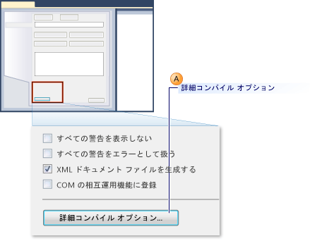
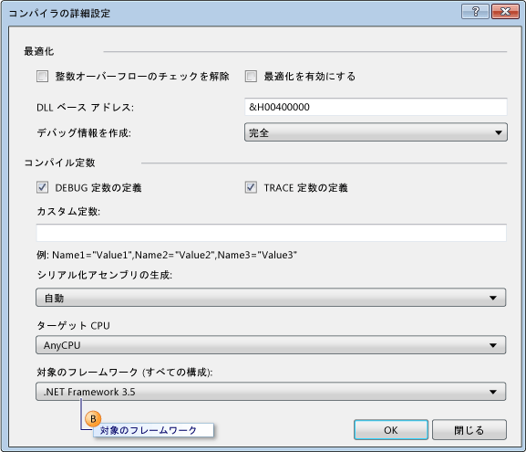
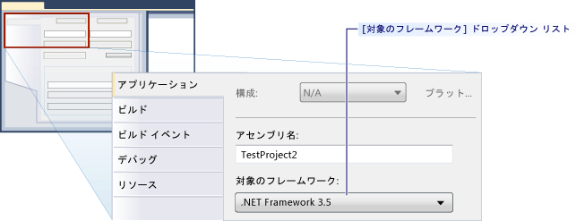

# 方法: .NET Framework の旧バージョンを対象とした単体テストを構成する
[!INCLUDE[vs2017banner](../code-quality/includes/vs2017banner.md)]

Microsoft Visual Studio でテスト プロジェクトを作成すると、.NET Framework の最新バージョンはターゲットと同様に既定で設定されます。  また、Visual Studio の以前のバージョンからテスト プロジェクトをアップグレードする場合、.NET Framework の最新バージョンを対象とするようにアップグレードされます。  プロジェクトのプロパティを編集することによって、.NET Framework の旧バージョンに再ターゲット プロジェクト明示的にできます。  
  
 単体テスト プロジェクトには、.NET Framework の特定のバージョンを対象とします。  対象とするバージョン 3.5 以降がクライアント版にすることはできません。  Visual Studio では、特定のバージョンを対象とする単体テストに対して次のような基本サポートが有効になります。:  
  
-   単体テストのプロジェクトを、.NET Framework の特定のバージョンを対象にすることができます。  
  
-   ローカル コンピューターで Visual Studio の .NET Framework の特定のバージョンを対象とする単体テストを実行できます。  
  
-   コマンド プロンプトで MSTest.exe を使用して、.NET Framework の特定のバージョンを対象とする単体テストを実行できます。  
  
-   単体テストをビルドの一部としてビルド エージェントで実行できます。  
  
 **テスト SharePoint Applications**  
  
 機能は、上に Visual Studio を使用して SharePoint アプリケーションの単体テストおよび統合テストを作成できるようにされます。  [!INCLUDE[crabout](../test/includes/crabout_md.md)] は Visual Studio を使用して SharePoint アプリケーションを開発する方法を [SharePoint ソリューションの作成](/office-dev/office-dev/create-sharepoint-solutions)、[SharePoint ソリューションのビルドとデバッグ](/office-dev/office-dev/building-and-debugging-sharepoint-solutions) と [SharePoint コードの検証およびデバッグ](/office-dev/office-dev/verifying-and-debugging-sharepoint-code)を参照します。  
  
 **制限事項**  
  
 次の制限は、テストが .NET Framework の旧バージョンを使用するようにプロジェクトを再ターゲットする場合は適用する:  
  
-   .NET Framework 3.5 では、単体テストのみを含むテスト プロジェクトについてはマルチ ターゲットがサポートされます。  .NET Framework 3.5 では、コード化された UI テストやロード テストなど、その他の種類のテストはサポートされません。  単体テスト以外の種類のテストでは、再ターゲットすることはできません。  
  
-   .NET Framework の旧バージョンを対象としてテストの実行では既定のホスト アダプターでのみサポートされます。  ASP.NET ホスト アダプターではサポートされていません。  ASP.NET 開発サーバーのコンテキストで実行する必要のある ASP.NET アプリケーションは .NET Framework の現在のバージョンとの互換性が必要です。  
  
-   .NET Framework 3.5 のマルチ ターゲットをサポートするテストを実行する場合、データ収集のサポートは無効になります。  Visual Studio コマンド ライン ツールを使用することでコード カバレッジを実行できます。  
  
-   .NET Framework 3.5 を使用する単体テストは、リモート コンピューターでは実行できません。  
  
-   フレームワークの以前のクライアント バージョンに単体テストを対象にすることはできません。  
  
### Visual Basic 単体テスト プロジェクト用に特定のバージョンの .NET Framework を再ターゲットする  
  
1.  新しい Visual Basic 単体テスト プロジェクトを作成します。  **\[ファイル\]** メニューの **\[新規作成\]** をポイントし、**\[プロジェクト\]** をクリックします。  
  
     **\[新しいプロジェクト\]** ダイアログ ボックスが表示されます。  
  
2.  **\[インストールされているテンプレート\]** の **\[Visual Basic\]** を展開します。  **\[テスト\]** を選択し、**\[テスト プロジェクト\]** テンプレートを選択します。  
  
3.  **\[名前\]** のテキスト ボックスに Visual Basic テスト プロジェクトの名前を入力し、**\[OK\]** をクリックします。  
  
4.  ソリューション エクスプローラーで、新しい Visual Basic テスト プロジェクトのショートカット メニュー **\[プロパティ\]** をクリックします。  
  
     Visual Basic テスト プロジェクトのプロパティが表示されます。  
  
5.  **\[コンパイル\]** タブで、次の図に示すように **\[詳細コンパイル オプション\]** をクリックします。  
  
       
  
6.  **\[.NET Framework 3.5\]** にターゲット フレームワークを次の図に示すように、吹き出し B に新しいバージョンを変更するには **\[対象のフレームワーク \(すべての構成\):\]** ドロップダウン リストを使用します。  クライアント版を指定する必要はありません。  
  
       
  
### Visual C\# 単体テスト プロジェクト用に特定のバージョンの .NET Framework を再ターゲットする  
  
1.  新しい Visual C\# 単体テスト プロジェクトを作成します。  **\[ファイル\]** メニューの **\[新規作成\]** をポイントし、**\[プロジェクト\]** をクリックします。  
  
     **\[新しいプロジェクト\]** ダイアログ ボックスが表示されます。  
  
2.  **\[インストールされているテンプレート\]** の **\[Visual C\#\]** を展開します。  **\[テスト\]** を選択し、**\[テスト プロジェクト\]** テンプレートを選択します。  
  
3.  **\[名前\]** のテキスト ボックスで、Visual C\# テスト プロジェクトの名前を入力し、**\[OK\]** をクリックします。  
  
4.  ソリューション エクスプローラーで、新しい Visual C\# テスト プロジェクトのショートカット メニュー **\[プロパティ\]** をクリックします。  
  
     Visual C\# テスト プロジェクトのプロパティが表示されます。  
  
5.  **\[アプリケーション\]** タブで、次の図に示す framework.as ターゲットを変更するには、ドロップダウン リストから以降のバージョン **\[ターゲット フレームワーク\]** をクリックします、**\[.NET Framework 3.5\]** をクリックします。  クライアント版を指定する必要はありません。  
  
       
  
### C\+\+\/CLI 単体テスト プロジェクト用に特定のバージョンの .NET Framework を再ターゲットする  
  
1.  新しい C\+\+ 単体テスト プロジェクトを作成します。  **\[ファイル\]** メニューの **\[新規作成\]** を選択し、**\[プロジェクト\]** をクリックします。  
  
     **\[新しいプロジェクト\]** ダイアログ ボックスが表示されます。  
  
    > [!WARNING]
    >  Visual C\+\+ の .NET Framework の以前のバージョンの C\+\+\/CLI 単体テストを作成するには、Visual Studio 内の対応するバージョンを使用する必要があります。  たとえば、.NET Framework 3.5 を対象とする場合、[!INCLUDE[vs_orcas_long](../debugger/includes/vs_orcas_long_md.md)] と [!INCLUDE[vs_orcas_long](../debugger/includes/vs_orcas_long_md.md)] Service Pack 1.をインストールする必要があります。  
  
2.  **\[インストールされているテンプレート\]** の **\[Visual C\+\+\]** を展開します。  **\[テスト\]** を選択し、**\[テスト プロジェクト\]** テンプレートを選択します。  
  
3.  **\[プロジェクト名\]** テキスト ボックスに Visual C\+\+ テスト プロジェクトの名前を入力し、**\[OK\]** をクリックします。  
  
4.  ソリューション エクスプローラーで、新しい Visual C\+\+ テスト プロジェクトから **\[プロジェクトのアンロード\]** をクリックします。  
  
5.  ソリューション エクスプローラーで、アンロードされた Visual C\+\+ テスト プロジェクトを選択し、**\[編集 \<プロジェクト名\>.vcxproj\]** をクリックします。  
  
     エディターで .vcxproj ファイルが開きます。  
  
6.  バージョン 3.5 に `TargetFrameworkVersion` を設定する `PropertyGroup` の新しいバージョンは、`"Globals"`を分類します。  クライアント版を指定する必要があります:  
  
    ```  
    <PropertyGroup Label="Globals">  
        <TargetName>DefaultTest</TargetName>  
        <ProjectTypes>{3AC096D0-A1C2-E12C-1390-A8335801FDAB};{8BC9CEB8-8B4A-11D0-8D11-00A0C91BC942}</ProjectTypes>  
        <ProjectGUID>{CE16D77A-E364-4ACD-948B-1EB6218B0EA3}</ProjectGUID>  
        <TargetFrameworkVersion>3.5</TargetFrameworkVersion>  
        <Keyword>ManagedCProj</Keyword>  
        <RootNamespace>CPP_Test</RootNamespace>  
      </PropertyGroup>  
  
    ```  
  
7.  .vcxproj ファイルを保存して閉じます。  
  
8.  ソリューション エクスプローラーで、**\[プロジェクトの再読み込み\]** を選択します新しい Visual C\+\+ テスト プロジェクトのショートカット メニューから選択します。  
  
## 参照  
 [Creating and Running Unit Tests for Existing Code](http://msdn.microsoft.com/ja-jp/e8370b93-085b-41c9-8dec-655bd886f173)   
 [SharePoint ソリューションの作成](/office-dev/office-dev/create-sharepoint-solutions)   
 [SharePoint ソリューションのビルドとデバッグ](/office-dev/office-dev/building-and-debugging-sharepoint-solutions)   
 [\[ビルドの詳細設定\] ダイアログ ボックス \(Visual Basic\)](../Topic/Advanced%20Compiler%20Settings%20Dialog%20Box%20\(Visual%20Basic\).md)