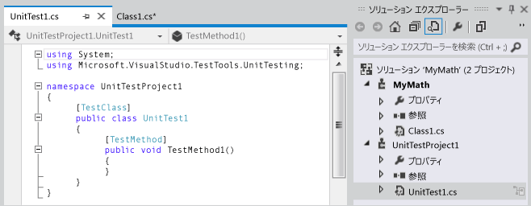
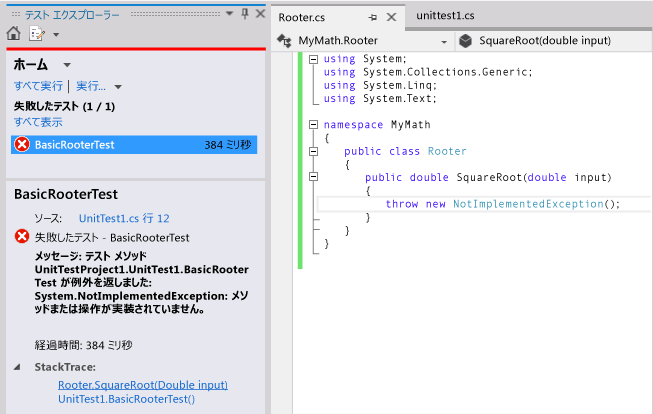
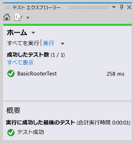
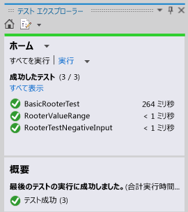

# <a name="quickstart-test-driven-development-with-test-explorer"></a>クイック スタート: テスト エクスプローラーによるテスト駆動開発

変更を繰り返して段階的に開発を行ううえで、コードの正しい動作を維持するには、単体テストを作成することをお勧めします。 サード パーティ製を含めていくつかのフレームワークを単体テストの記述に使用できます。 一部のテスト フレームワークは、別々の言語またはプラットフォームでのテストに特化されています。 テスト エクスプローラーは、1 つのインターフェイスで、どのフレームワークでの単体テストにも対応します。 最も一般的に使用されるフレームワーク用にアダプターが用意されており、他のフレームワーク用に独自のアダプターを作成することもできます。

 テスト エクスプローラーは、Visual Studio の以前のエディションにあった単体テスト ウィンドウに代わる機能です。 これには次のような利点があります。

-   .NET、アンマネージ、データベース、およびその他の種類のテストを 1 つのインターフェイスで実行できます。

-   NUnit や MSTest など、任意の単体テスト フレームワークを使用できます。

-   必要な情報をすべて、1 つのウィンドウで確認できます。

## <a name="using-test-explorer"></a>テスト エクスプローラーの使用
 ![[すべて実行] ボタンを示す単体テスト エクスプローラー](../test/media/unittestexplorer-beta-.png)

### <a name="to-run-unit-tests-by-using-test-explorer"></a>テスト エクスプローラーを使用して単体テストを実行するには

1.  任意のテスト フレームワークを使用して単体テストを作成します。

     たとえば、MSTest フレームワークを使用するテストを作成するには:

    1.  テスト プロジェクトを作成します。

         **[新しいプロジェクト]** ダイアログ ボックスで、 **[Visual Basic]**、 **[Visual C#]**、または **[Visual C++]** を展開し、 **[テスト]** をクリックします。

         **[単体テスト プロジェクト]** を選択します。

    2.  各単体テストをメソッドとして記述します。 各テスト メソッドにプレフィックスとして `[TestMethod]` 属性を付けます。

2.  個々のテストに実行順序を定める依存関係がない場合、ツール バーにある  トグル ボタンで並列テストの実行を有効にします。 これにより、すべてのテスト実行にかかる時間を著しく短縮できます。

3.  メニュー バーで、 **[テスト]**、 **[単体テストの実行]**、 **[すべてのテスト]** の順にクリックします。

     ソリューションがビルドされ、テストが実行されます。

     テスト エクスプローラーが開き、結果の概要が表示されます。

 **テストの一覧を表示するには:** 任意のカテゴリで、 **[すべて表示]** をクリックします。

 **テスト結果の詳細を表示するには:** 例外メッセージなどの詳細を詳細ペインに表示するには、テスト エクスプローラーでテストを選択します。

 **テストのコードに移動するには:** テスト エクスプローラーでテストをダブルクリックするか、ショートカット メニューの **[テストを開く]** をクリックします。

 **テストをデバッグするには:** 1 つ以上のテストを選択し、ショートカット メニューの **[選択したテストのデバッグ]** をクリックします。

> [!IMPORTANT]
> 最新のテスト実行の結果が表示されます。 色分けされた結果バーに表示されるのは、実行されたテストの結果のみです。 たとえば、複数のテストを実行してそのいくつかに失敗し、次に成功したテストのみを実行した場合は、結果バーには緑色のみが表示されます。


> [!NOTE]
> テストが表示されない場合は、使用するテスト フレームワークにテスト エクスプローラーを接続するためのアダプターがインストールされていることを確認してください。 詳細については、「[サードパーティ製の単体テスト フレームワークをインストールする](install-third-party-unit-test-frameworks.md)」をご覧ください。


##  <a name="walkthrough"></a> チュートリアル: 単体テストを使用してメソッドを開発する
 このチュートリアルでは、Microsoft 単体テスト フレームワークを使用して、テスト済みメソッドを C# で開発する方法を示します。 他の言語に適合させることも、NUnit など他のテスト フレームワークを使用することも、容易です。 詳細については、「[サードパーティ製の単体テスト フレームワークをインストールする](install-third-party-unit-test-frameworks.md)」をご覧ください。

#### <a name="creating-the-test-and-method"></a>テストとメソッドを作成する

1.  Visual C# クラス ライブラリ プロジェクトを作成します。 このプロジェクトには、提供するコードを含めます。 この例では、 `MyMath`という名前が付いています。

2.  テスト プロジェクトを作成します。

    -   **[新しいプロジェクト]** ダイアログ ボックスで、 **[Visual C#]**、 **[テスト]** 、 **[単体テスト プロジェクト]** の順にクリックします。

         

3.  基本的なテスト メソッドを記述します。 特定の入力に対して生じた結果を確認します。

    ```csharp

    [TestMethod]
    public void BasicRooterTest()
    {
      // Create an instance to test:
      Rooter rooter = new Rooter();
      // Define a test input and output value:
      double expectedResult = 2.0;
      double input = expectedResult * expectedResult;
      // Run the method under test:
      double actualResult = rooter.SquareRoot(input);
      // Verify the result:
      Assert.AreEqual(expectedResult, actualResult,
          delta: expectedResult / 100);
    }
    ```

4.  テストからメソッドを生成します。

    1.  `Rooter`にカーソルを置き、ショートカット メニューで **[生成]**、 **[新しい型]** の順にクリックします。

    2.  **[新しい型の生成]** ダイアログ ボックスで、 **[プロジェクト]** をクラス ライブラリ プロジェクトに設定します。 この例では、 `MyMath`です。

    3.  `SquareRoot`にカーソルを置き、ショートカット メニューで **[生成]**、 **[メソッド スタブ]** の順にクリックします。

5.  単体テストを実行します。

    1.  **[テスト]** メニューで、 **[単体テストの実行]**、 **[すべてのテスト]** の順にクリックします。

         ソリューションがビルドされ、実行されます。

         テスト エクスプローラーが開き、結果が表示されます。

         **[失敗したテスト]** の下にテストが表示されます。

6.  テストの名前を選択します。

     テストの詳細は、テスト エクスプローラーの下部に表示されます。

7.  テストに失敗した箇所を確認するには、 **[スタック トレース]** の下に表示されている項目を選択します。

 

 この時点で、テストとスタブが作成されています。テストに合格するには、これらを修正する必要があります。

#### <a name="after-every-change-make-all-the-tests-pass"></a>各変更後にすべてのテストに合格する

1.  `MyMath\Rooter.cs`で、 `SquareRoot`のコードを改良します。

    ```csharp
    public double SquareRoot(double input)
     {
       return input / 2;
     }
    ```

2.  テスト エクスプローラーで **[すべて実行]** をクリックします。

     テストがビルドされ、テストが実行されます。

     テストに合格します。

     

#### <a name="add-tests-to-extend-the-range-of-inputs"></a>テストを追加して入力の範囲を拡張する

1.  あらゆる場合にコードが動作するという信頼性を強化するには、テストを追加して、より広範囲の入力値を試みます。

    > [!TIP]
    > 合格した既存のテストは変更しないでください。 代わりに、新しいテストを追加します。 既存のテストを変更するのは、ユーザー要件が変更されたときのみに限定します。 このポリシーにより、コードを拡張する作業を行うときに、既存の機能が失われないようにすることができます。

     一定範囲の入力値を試みるために、次のテストをテスト クラスに追加します。

    ```csharp
    [TestMethod]
    public void RooterValueRange()
    {
      // Create an instance to test:
      Rooter rooter = new Rooter();
      // Try a range of values:
      for (double expectedResult = 1e-8;
          expectedResult < 1e+8;
          expectedResult = expectedResult * 3.2)
      {
        RooterOneValue(rooter, expectedResult);
      }
    }

    private void RooterOneValue(Rooter rooter, double expectedResult)
    {
      double input = expectedResult * expectedResult;
      double actualResult = rooter.SquareRoot(input);
      Assert.AreEqual(expectedResult, actualResult,
          delta: expectedResult / 1000);
    }
    ```

2.  テスト エクスプローラーで **[すべて実行]** をクリックします。

     最初のテストには今回も合格しますが、新しいテストには失敗します。

     エラー箇所を見つけるには、失敗したテストを選択し、テスト エクスプローラーの下部で、 **[スタック トレース]** の下に表示されている先頭の項目を選択します。

3.  テスト対象のメソッドを調べて、問題点を確認します。 `MyMath.Rooter` クラスで、コードを書き直します。

    ```csharp
    public double SquareRoot(double input)
    {
      double result = input;
      double previousResult = -input;
      while (Math.Abs(previousResult - result) > result / 1000)
      {
        previousResult = result;
        result = result - (result * result - input) / (2 * result);
      }
      return result;
    }
    ```

4.  テスト エクスプローラーで **[すべて実行]** をクリックします。

     今回は、両方のテストに合格します。

#### <a name="add-tests-for-exceptional-cases"></a>例外的なケース用にテストを追加する

1.  負数の入力用にテストを追加します。

    ```csharp
    [TestMethod]
     public void RooterTestNegativeInputx()
     {
         Rooter rooter = new Rooter();
         try
         {
             rooter.SquareRoot(-10);
         }
         catch (ArgumentOutOfRangeException e)
         {
             return;
         }
         Assert.Fail();
     }
    ```

2.  テスト エクスプローラーで **[すべて実行]** をクリックします。

     テスト対象のメソッドはループするため、実行を手動で取り消す必要があります。

3.  **[キャンセル]** をクリックします。

     テストが 10 秒後に停止します。

4.  メソッドのコードを修正します。

    ```csharp

    public double SquareRoot(double input)
    {
      if (input <= 0.0)
      {
        throw new ArgumentOutOfRangeException();
      }
    ...
    ```

5.  テスト エクスプローラーで **[すべて実行]** をクリックします。

     すべてのテストに合格します。

#### <a name="refactor-without-changing-tests"></a>テストを変更せずにリファクタリングする

1.  テストを変更せずに、コードを簡略化します。

    > [!TIP]
    > *リファクタリング* とは、コードのパフォーマンスを高めたり、コードをわかりやすくすることを目的として行う変更です。 コードの動作を変更することを意図しないため、テストは変更されません。
    >
    > リファクタリングの手順は、機能を拡張する手順とは別に実行することをお勧めします。 テストを変更しないことで、リファクタリング時に誤ってバグが生じる状況を回避できます。

    ```csharp
    public class Rooter
    {
      public double SquareRoot(double input)
      {
        if (input <= 0.0)
        {
          throw new ArgumentOutOfRangeException();
        }
        double result = input;
        double previousResult = -input;
        while (Math.Abs(previousResult - result) > result / 1000)
        {
          previousResult = result;
          result = (result + input / result) / 2;
          //was: result = result - (result * result - input) / (2*result);
        }
        return result;
      }
    }
    ```

2.  **[すべて実行]** をクリックします。

     今回もすべてのテストに合格します。

     
