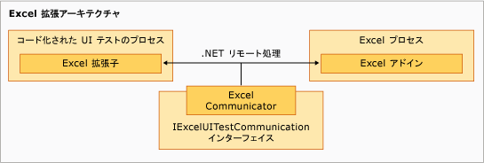

# Excel 用にコード化された UI テストの拡張子のサンプル
サンプルの拡張機能コンポーネントは [!INCLUDE[vsprvs](../code-quality/includes/vsprvs_md.md)] のコード化された UI テスト プロセスで実行され、`ExtensionPackage` クラスをベースにして多少階層的になります。 コントロール要素が最上位レベルで、`TechnologyManager` クラス、`ActionFilter` クラス、および `PropertyProvider` クラスはその次のレベルにあります。

  Excel 拡張アーキテクチャ

## 拡張ポイント
 これらのクラスはサンプルに実装される拡張ポイントを表し、[!INCLUDE[ofprexcel](../test/includes/ofprexcel_md.md)] 用のコード化された UI テストを可能にします。

### ExtensionPackage
 <xref:Microsoft.VisualStudio.TestTools.UITest.Extension.UITestExtensionPackage> から継承されます。これはコード化された UI テスト拡張機能のエントリ ポイントです。 この抽象クラスを実装すると、コード化された UI テスト フレームワークが、新しい UI をテストするために、カスタム UI テスト テクノロジ マネージャー、UI テスト プロパティ プロバイダー、および UI テスト アクション フィルターに内部アクセスできるようになります。 詳細については、「[ExtensionPackage Class (ExtensionPackage クラス)](../test/sample-excel-extension-extensionpackage-class.md)」を参照してください。

### TechnologyManager
 <xref:Microsoft.VisualStudio.TestTools.UITest.Extension.UITechnologyManager> クラスから継承されます。このクラスには、テスト記録および再生用のテクノロジ マネージャーが用意されています。 詳細については、「[TechnologyManager Class (TechnologyManager クラス)](../test/sample-excel-extension-technologymanager-class.md)」を参照してください。

### ActionFilter
 <xref:Microsoft.VisualStudio.TestTools.UITest.Common.UITestActionFilter> クラスから継承されます。このクラスには、似たテスト アクション結果を単一のテスト結果に集約する基底クラスがあります。 詳細については、「[ActionFilter Class (ActionFilter クラス)](../test/sample-excel-extension-actionfilter-class.md)」を参照してください。

### テクノロジ要素
 <xref:Microsoft.VisualStudio.TestTools.UITest.Extension.UITechnologyElement> クラスから継承された基底クラスには、UI テストで記録および再生に使用できるテクノロジ要素の基礎が用意されています。 詳細については、「[Element Classes (要素クラス)](../test/sample-excel-extension-element-classes.md)」を参照してください。

### PropertyProvider
 <xref:Microsoft.VisualStudio.TestTools.UITesting.UITestPropertyProvider> クラスから継承されます。このクラスには、テスト記録および再生に使用できる UI 要素のプロパティをサポートする基底クラスがあります。 詳細については、「[PropertyProvider Class (PropertyProvider クラス)](../test/sample-excel-extension-propertyprovider-class.md)」を参照してください。

## 関連項目

- <xref:Microsoft.VisualStudio.TestTools.UITesting.UITestPropertyProvider>
- <xref:Microsoft.VisualStudio.TestTools.UITest.Extension.UITechnologyElement>
- <xref:Microsoft.VisualStudio.TestTools.UITest.Common.UITestActionFilter>
- <xref:Microsoft.VisualStudio.TestTools.UITest.Extension.UITestExtensionPackage>
- [ExtensionPackage クラス](../test/sample-excel-extension-extensionpackage-class.md)
- [TechnologyManager クラス](../test/sample-excel-extension-technologymanager-class.md)
- [ActionFilter クラス](../test/sample-excel-extension-actionfilter-class.md)
- [要素クラス](../test/sample-excel-extension-element-classes.md)
- [PropertyProvider Class (PropertyProvider クラス)](../test/sample-excel-extension-propertyprovider-class.md)
