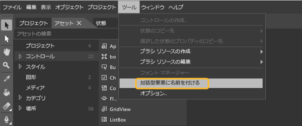

# <a name="set-a-unique-automation-property-for-uwp-controls-for-testing"></a>テスト用に UWP コントロールの一意のオートメーション プロパティを設定する

XAML ベースの UWP アプリケーション用のコード化された UI テストを実行する場合は、一意のオートメーション プロパティによって各コントロールを識別する必要があります。 アプリケーションで XAML コントロールの種類に基づいて固有のオートメーション プロパティを割り当てることができます。

## <a name="static-xaml-definition"></a>静的な XAML 定義

XAML ファイルに定義されているコントロールに一意のオートメーション プロパティを指定する目的で、次の例のように、**AutomationProperties.AutomationId** または **AutomationProperties.Name** を暗黙的または明示的に設定できます。 これらの値のいずれかを設定すると、コントロールに一意のオートメーション プロパティが割り当てられ、コード化された UI テストまたは操作の記録を作成するとき、コントロールを識別するために使用できます。

### <a name="set-the-property-implicitly"></a>プロパティを暗黙的に設定する

コントロールの XAML で **Name** プロパティを使用して、**AutomationProperties.AutomationId** を **ButtonX** に設定します。

```xaml
<Button Name="ButtonX" Height="31" HorizontalAlignment="Left" Margin="23,26,0,0"  VerticalAlignment="Top" Width="140" Click="ButtonX_Click" />
```

コントロールの XAML で **Content** プロパティを使用して、**AutomationProperties.Name** を **ButtonY** に設定します。

```xaml
<Button Content="ButtonY" Height="31" HorizontalAlignment="Left" Margin="23,76,0,0" VerticalAlignment="Top" Width="140" Click="ButtonY_Click" />
```

### <a name="set-the-property-explicitly"></a>プロパティを明示的に設定する

コントロールの XAML で **AutomationProperties.AutomationId** を **ButtonX** に明示的に設定します。

```xaml
<Button AutomationProperties.AutomationId="ButtonX" Height="31" HorizontalAlignment="Left" Margin="23,26,0,0"  VerticalAlignment="Top" Width="140" Click="ButtonX_Click" />
```

コントロールの XAML で **AutomationProperties.Name** を **ButtonY** に明示的に設定します。

```xaml
<Button AutomationProperties.Name="ButtonY" Height="31" HorizontalAlignment="Left" Margin="23,76,0,0" VerticalAlignment="Top" Width="140" Click="ButtonY_Click" />
```

## <a name="assign-unique-names"></a>一意の名前を割り当てる

Blend for Visual Studio では、ボタン、リスト ボックス、コンボ ボックス、テキスト ボックスなど、対話型要素に一意の名前を割り当てるオプションを選択することができます。これにより、コントロールの **AutomationProperties.Name** に一意の値が割り当てられます。

既存のコントロールに一意の名前を割り当てるには、**[ツール]** > **[対話型要素に名前を付ける]** の順に選択します。



追加する新しいコントロールに一意の名前を自動的に付けるには、**[ツール]** > **[オプション]** の順に選択して、**[オプション]** ダイアログ ボックスを開きます。 **[XAML デザイナー]** を選択し、次に **[対話要素の作成時に自動的に名前を付ける]** を選択します。 **[OK]** を選択してダイアログ ボックスを閉じます。

## <a name="use-a-data-template"></a>データ テンプレートを使用する

**ItemTemplate** を使用して簡単なテンプレートを定義すると、リスト ボックスの値を変数にバインドできます。

```xaml
<ListBox Name="listBox1" ItemsSource="{Binding Source={StaticResource employees}}">
   <ListBox.ItemTemplate>
      <DataTemplate>
         <StackPanel Orientation="Horizontal">
            <TextBlock Text="{Binding EmployeeName}" />
            <TextBlock Text="{Binding EmployeeID}" />
         </StackPanel>
      </DataTemplate>
   </ListBox.ItemTemplate>
</ListBox>
```

**ItemContainerStyle** を含むテンプレートを使用して、値を変数にバインドすることもできます。

```xaml
<ListBox Name="listBox1" ItemsSource="{Binding Source={StaticResource employees}}">
   <ListBox.ItemContainerStyle>
      <Style TargetType="ListBoxItem">
         <Setter Property="Template">
            <Setter.Value>
               <ControlTemplate TargetType="ListBoxItem">
                  <Grid>
                     <Button Content="{Binding EmployeeName}" AutomationProperties.AutomationId="{Binding EmployeeID}"/>
                  </Grid>
               </ControlTemplate>
            </Setter.Value>
         </Setter>
      </Style>
   </ListBox.ItemContainerStyle>
</ListBox>
```

いずれの例でも、後続のコード例のように、**ItemSource** の **ToString()** メソッドをオーバーライドする必要があります。 バインディングによって各データ バインド リスト項目に一意のオートメーション プロパティを設定することはできないため、このコードを使用して、**AutomationProperties.Name** 値を設定し、その値が確実に一意になるようにします。 この場合、**Automation Properties.Name** に一意の値を設定するだけで十分です。

> [!NOTE]
> この方法を使用すると、リスト項目の内部コンテンツをバインディングによって Employee クラスの文字列に設定することもできます。 この例に示されているように、各リスト項目内のボタン コントロールには、Employee ID を表す一意のオートメーション ID が割り当てられます。

```csharp
Employee[] employees = new Employee[]
{
   new Employee("john", "4384"),
   new Employee("margaret", "7556"),
   new Employee("richard", "8688"),
   new Employee("george", "1293")
};

listBox1.ItemsSource = employees;

public override string ToString()
{
    return EmployeeName + EmployeeID; // Unique Identification to be set as the AutomationProperties.Name
}
```

## <a name="use-a-control-template"></a>コントロール テンプレートを使用する

コントロール テンプレートを使用すると、特定の型の各インスタンスがコードで定義されるときに、一意のオートメーション プロパティが与えられるようにすることができます。 **AutomationProperty** がコントロール インスタンスの一意の ID にバインドされるようにテンプレートを作成します。 次の XAML は、コントロール テンプレートを使用してこのバインディングを作成する方法を示しています。

```xaml
<Style x:Key="MyButton" TargetType="Button">
<Setter Property="Template">
   <Setter.Value>
<ControlTemplate TargetType="Button">
   <Grid>
      <CheckBox HorizontalAlignment="Left" AutomationProperties.AutomationId="{TemplateBinding Content}"></CheckBox>
      <Button Width="90" HorizontalAlignment="Right" Content="{TemplateBinding Content}" AutomationProperties.AutomationId="{TemplateBinding Content}"></Button>
   </Grid>
</ControlTemplate>
   </Setter.Value>
</Setter>
</Style>
```

このコントロール テンプレートを使用して 1 つのボタンのインスタンスを 2 つ定義すると、テンプレート内のコントロールのオートメーション ID は一意のコンテンツ文字列に設定されます。このときの XAML を次に示します。

```xaml
<Button Content="Button1" Style="{StaticResource MyButton}" Width="140"/>
<Button Content="Button2" Style="{StaticResource MyButton}" Width="140"/>
```

### <a name="dynamic-controls"></a>ダイナミック コントロール

静的に作成または XAML ファイルのテンプレートから作成されたのではなく、コードから動的に作成されたコントロールがある場合は、そのコントロールの **Content** プロパティまたは **Name** プロパティを設定する必要があります。 これにより、各ダイナミック コントロールに確実に一意のオートメーション プロパティが与えられるようにします。 たとえば、リスト項目を選択したときに表示するチェック ボックスがある場合は、次に示すようにこれらのプロパティを設定できます。

```csharp
private void CreateCheckBox(string txt, StackPanel panel)
{
   CheckBox cb = new CheckBox();
   cb.Content = txt; // Sets the AutomationProperties.Name
   cb.Height = 50;
   cb.Width = 100;
   cb.Name = "DynamicCheckBoxAid"+ txt; // Sets the AutomationProperties.AutomationId
   panel.Children.Add(cb);
}
```

## <a name="see-also"></a>関連項目

- [コード化された UI テストを使用して UWP アプリをテストする](../test/test-uwp-app-with-coded-ui-test.md)
