# コード化された UI テストを使用した Windows Phone 8.1 アプリのテスト
[!INCLUDE[vs2017banner](../code-quality/includes/vs2017banner.md)]

コード化された UI テストを使用して、Windows Phone アプリをテストします。  
  
## 簡単な Windows Phone アプリの作成  
  
1.  Visual C\# または Visual Basic テンプレートを使用して、空の Windows Phone アプリ用の新しいプロジェクトを作成します。  
  
     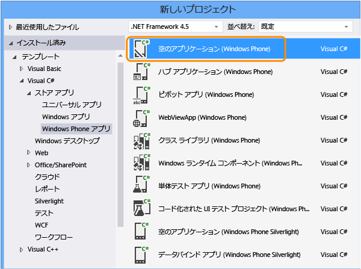  
  
2.  ソリューション エクスプローラーで、MainPage.xaml を開きます。 ツールボックスから、ボタン コントロールとテキスト ボックス コントロールをデザイン サーフェイスにドラッグします。  
  
       
  
3.  \[プロパティ\] ウィンドウで、このボタン コントロールに名前を付けます。  
  
     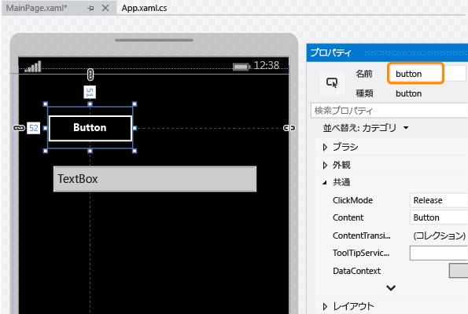  
  
4.  テキスト ボックス コントロールに名前を付けます。  
  
     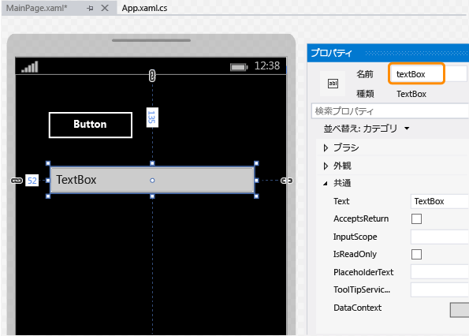  
  
5.  デザイナー画面でボタン コントロールをダブルクリックし、次のコードを追加します。  
  
    ```c#  
    private void button_Click_1(object sender, RoutedEventArgs e) { this.textBox.Text = this.button.Name; }  
  
    ```  
  
    ```vb#  
    Public NotInheritable Class MainPage Inherits Page Private Sub button_Click(sender As Object, e As RoutedEventArgs) Handles Button.Click Me.textBox.Text = Me.button.Name End Sub End Class  
    ```  
  
6.  F5 キーを押してエミュレーターで Windows Phone アプリを実行し、アプリが機能することを確認します。  
  
     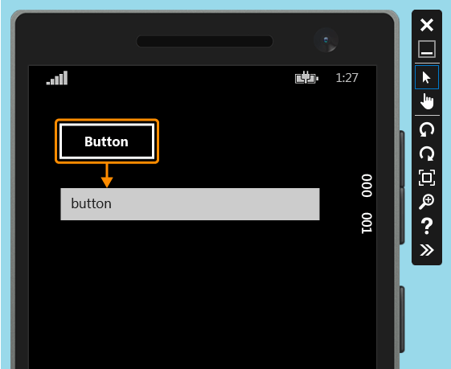  
  
7.  エミュレーターを終了します。  
  
## Windows Phone アプリの配置  
  
1.  コード化された UI テストでアプリのコントロールをマップするには、その前に、アプリを配置する必要があります。  
  
     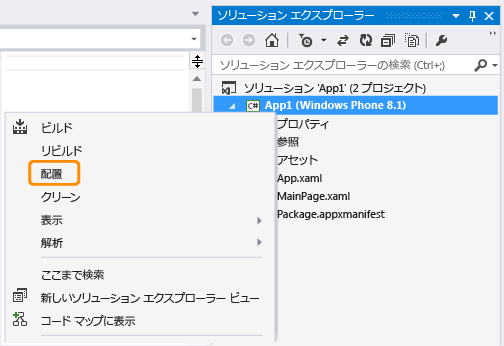  
  
     エミュレーターが開始します。 これで、テストに対してアプリを使用できるようになりました。  
  
     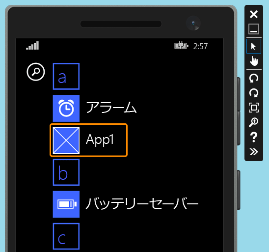  
  
     コード化された UI テストを作成する間は、エミュレーターを実行中のままにしてください。  
  
## Windows Phone アプリのコード化された UI テストの作成  
  
1.  Windows Phone アプリを使用するソリューションに、新しいコード化された UI テスト プロジェクトを追加します。  
  
     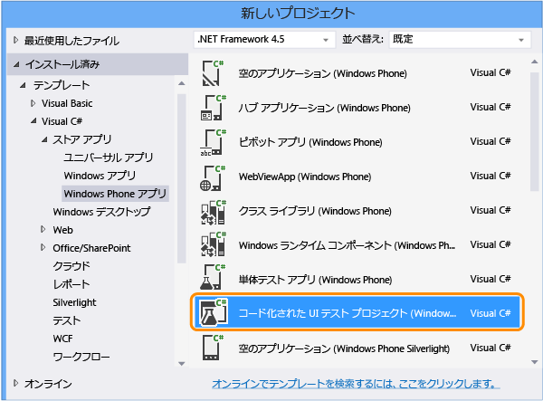  
  
2.  十字線ツールを使用して UI マップを編集することを選択します。  
  
       
  
3.  十字線ツールを使用してアプリを選択してから、アプリの **\[AutomationId\]** プロパティの値をコピーします。この値は後で、テストでアプリを起動するために使用します。  
  
     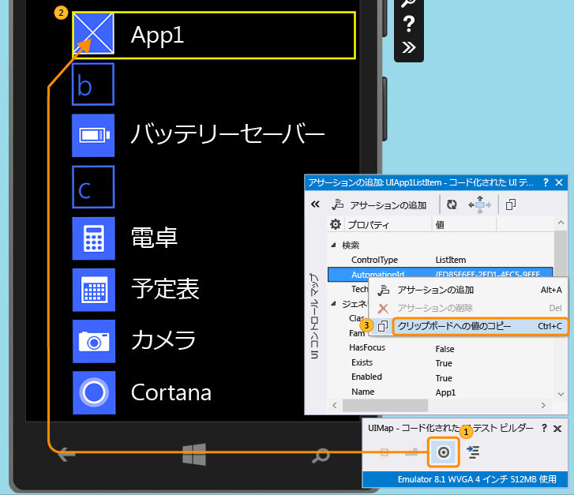  
  
4.  エミュレーターでアプリを起動し、十字線ツールを使用してボタン コントロールを選択します。 次に、ボタン コントロールを UI コントロール マップに追加します。  
  
     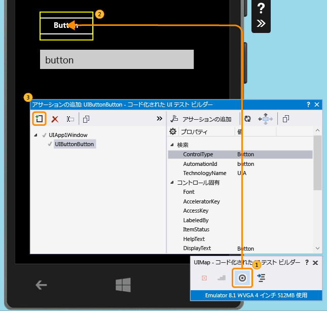  
  
5.  テキスト ボックス コントロールを UI コントロール マップに追加するには、前の手順を繰り返します。  
  
     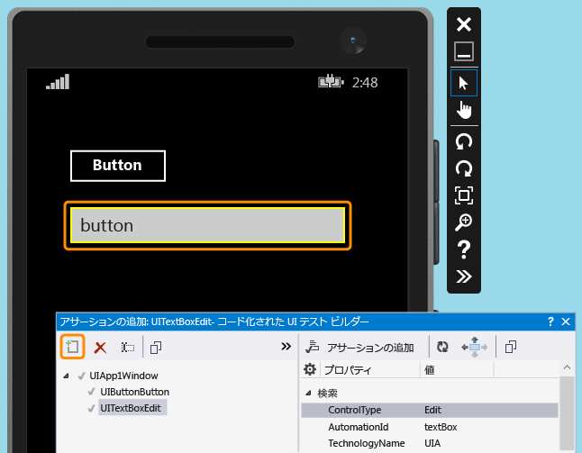  
  
6.  コードを生成して、UI コントロール マップの変更に対応するコードを作成します。  
  
     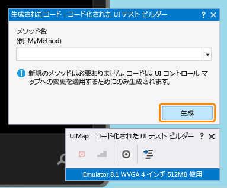  
  
7.  十字線ツールを使用してテキスト ボックス コントロールを選択し、**\[Text\]** プロパティを選択します。  
  
     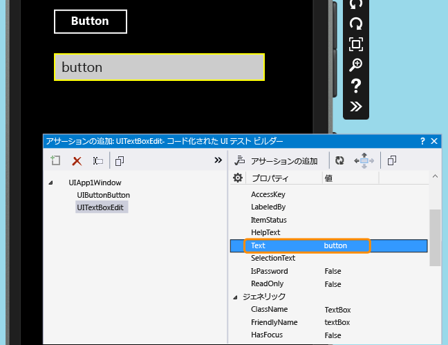  
  
8.  アサーションを追加します。 これは、値が正しいことを確認するためにテストで使用されます。  
  
     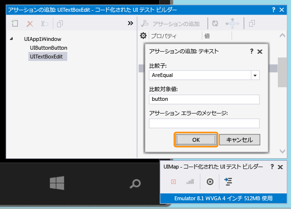  
  
9. Assert メソッドのコードを追加および生成します。  
  
     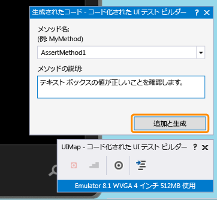  
  
10. **Visual C\#**  
  
     ソリューション エクスプローラーで、UIMap.Designer.cs ファイルを開いて、Assert メソッドとコントロール用に追加したコードを表示します。  
  
     **Visual Basic**  
  
     ソリューション エクスプローラーで、CodedUITest1.vb ファイルを開きます。 CodedUITestMethod1\(\) テスト メソッドのコードで、アサーション メソッド \(自動的に追加された `Me.UIMap.AssertMethod1()`\) への呼び出しを右クリックし、**\[定義へ移動\]** を選択します。 これにより、コード エディターで UIMap.Designer.vb ファイルが開かれて、Assert メソッドとコントロール用に追加したコードを確認できます。  
  
    > [!WARNING]
    >  UIMap.designer.cs または UIMap.Designer.vb ファイルを直接変更しないでください。 そうすると、ファイルへの変更はテストが生成されるたびにオーバーライドされます。  
  
     **Assert メソッド**  
  
    ```c#  
    public void AssertMethod1() { #region Variable Declarations XamlEdit uITextBoxEdit = this.UIApp1Window.UITextBoxEdit; #endregion // Verify that the 'Text' property of 'textBox' text box equals 'button' Assert.AreEqual(this.AssertMethod1ExpectedValues.UITextBoxEditText, uITextBoxEdit.Text); }  
    ```  
  
    ```vb#  
    Public Sub AssertMethod1() Dim uITextBoxEdit As XamlEdit = Me.UIApp1Window.UITextBoxEdit 'Verify that the 'Text' property of 'textBox' text box equals 'button' Assert.AreEqual(Me.AssertMethod1ExpectedValues.UITextBoxEditText, uITextBoxEdit.Text) End Sub  
    ```  
  
     **コントロール**  
  
    ```c#  
    #region Properties public virtual AssertMethod1ExpectedValues AssertMethod1ExpectedValues { get { if ((this.mAssertMethod1ExpectedValues == null)) { this.mAssertMethod1ExpectedValues = new AssertMethod1ExpectedValues(); } return this.mAssertMethod1ExpectedValues; } } public UIApp1Window UIApp1Window { get { if ((this.mUIApp1Window == null)) { this.mUIApp1Window = new UIApp1Window(); } return this.mUIApp1Window; } } #endregion #region Fields private AssertMethod1ExpectedValues mAssertMethod1ExpectedValues; private UIApp1Window mUIApp1Window; #endregion  
    ```  
  
    ```vb#  
    #Region "Properties" Public ReadOnly Property UIButtonButton() As XamlButton Get If (Me.mUIButtonButton Is Nothing) Then Me.mUIButtonButton = New XamlButton(Me) Me.mUIButtonButton.SearchProperties(XamlButton.PropertyNames.AutomationId) = "button" End If Return Me.mUIButtonButton End Get End Property Public ReadOnly Property UITextBoxEdit() As XamlEdit Get If (Me.mUITextBoxEdit Is Nothing) Then Me.mUITextBoxEdit = New XamlEdit(Me) Me.mUITextBoxEdit.SearchProperties(XamlEdit.PropertyNames.AutomationId) = "textBox" End If Return Me.mUITextBoxEdit End Get End Property #End Region #Region "Fields" Private mUIButtonButton As XamlButton Private mUITextBoxEdit As XamlEdit #End Region  
    ```  
  
11. ソリューション エクスプローラーで、CodedUITest1.cs ファイルまたは CodedUITest1.vb ファイルを開きます。 これで、テストを実行する必要がある操作の CodedUTTestMethod1 メソッドにコードを追加できます。 UIMap に追加したコントロールを使用して、次のコードを追加します。  
  
    1.  前にクリップボードにコピーしたオートメーション ID プロパティを使用して、Windows Phone アプリを起動します。  
  
        ```c#  
        XamlWindow myAppWindow = XamlWindow.Launch("ed85f6ff-2fd1-4ec5-9eef-696026c3fa7b_cyrqexqw8cc7c!App");  
        ```  
  
        ```vb#  
        XamlWindow.Launch("ed85f6ff-2fd1-4ec5-9eef-696026c3fa7b_cyrqexqw8cc7c!App");  
        ```  
  
    2.  ボタン コントロールをタップするジェスチャを追加します。ボタン コントロールをタップするジェスチャを追加します。  
  
        ```c#  
        Gesture.Tap(this.UIMap.UIApp1Window.UIButtonButton);  
        ```  
  
        ```vb#  
        Gesture.Tap(Me.UIMap.UIApp1Window.UIButtonButton)  
        ```  
  
    3.  自動的に生成された Assert メソッドへの呼び出しが、アプリの起動とボタンのタップ ジェスチャの後にあることを確認します。  
  
        ```c#  
        this.UIMap.AssertMethod1();  
        ```  
  
        ```vb#  
        Me.UIMap.AssertMethod1()  
        ```  
  
     コードを追加すると、CodedUITestMethod1 テスト メソッドは次のようになります。  
  
    ```c#  
    [TestMethod] public void CodedUITestMethod1() { // To generate code for this test, select "Generate Code for Coded UI Test" from the shortcut menu and select one of the menu items. // Launch the app. XamlWindow myAppWindow = XamlWindow.Launch("ed85f6ff-2fd1-4ec5-9eef-696026c3fa7b_cyrqexqw8cc7c!App"); // Tap the button. Gesture.Tap(this.UIMap.UIApp1Window.UIButtonButton); this.UIMap.AssertMethod1(); }  
    ```  
  
    ```vb#  
    <CodedUITest> Public Class CodedUITest1 <TestMethod()> Public Sub CodedUITestMethod1() ' ' To generate code for this test, select "Generate Code for Coded UI Test" from the shortcut menu and select one of the menu items. ' ' Launch the app. XamlWindow.Launch("ed85f6ff-2fd1-4ec5-9eef-696026c3fa7b_cyrqexqw8cc7c!App") '// Tap the button. Gesture.Tap(Me.UIMap.UIApp1Window.UIButtonButton) Me.UIMap.AssertMethod1() End Sub  
    ```  
  
## コード化された UI テストの実行  
  
1.  テストをビルドし、テスト エクスプローラーを使用してテストを実行します。  
  
     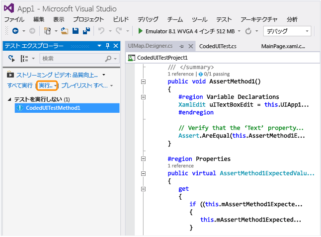  
  
     Windows Phone アプリが起動し、ボタンをタップする操作が完了し、Assert メソッドを使用してテキスト ボックスの Text プロパティが設定され、検証されます。  
  
       
  
     テストの完了後、テストの成功を示す確認メッセージがテスト エクスプローラーに表示されます。  
  
     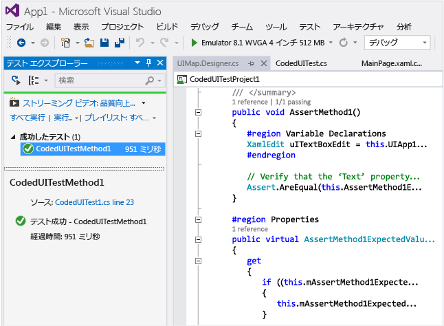  
  
##  <a name="TestingPhoneAppsCodedUI_DataDriven"></a> Windows Phone アプリでのデータ ドリブンのコード化された UI テストの使用  
 異なる条件をテストするために、異なるデータ セットを使用して、コード化された UI テストを複数回実行できます。  
  
 Windows Phone 用のデータ ドリブンのコード化された UI テストは、テスト メソッドで DataRow 属性を使用して定義します。 次の例で、x および y に使用する値は、テストの最初のイテレーションでは 1 と 2、2 番目のイテレーションでは \-1 と \-2 です。  
  
```  
[DataRow(1, 2, DisplayName = "Add positive numbers")] [DataRow(-1, -2, DisplayName = "Add negative numbers")] [TestMethod] public void DataDrivingDemo_MyTestMethod(int x, int y)  
  
```  
  
## Q & A  
  
### Q: UI コントロールをマップするには、Windows Phone アプリをエミュレーターに配置する必要がありますか?  
 **A**: はい、その必要があります。コード化された UI テスト ビルダーでは、エミュレーターが実行中であること、そしてエミュレーターにアプリが配置されていることが要件となります。 そうでないと、実行中のエミュレーターが見つからないことを通知するエラー メッセージがスローされます。  
  
###  <a name="TestingPhoneAppsCodedUI_EmulatorDevice"></a> Q: テストを実行できるのはエミュレーターだけですか? 物理デバイスを使用することもできますか?  
 **A**: どちらのオプションもサポートされています。 テストの実行ターゲットを選択するには、エミュレーター タイプを変更するか、デバイスのツールバーでデバイスを選択します。 \[デバイス\] を選択する場合、Phone Blue デバイスがコンピューターのいずれかの USB ポートに接続されている必要があります。  
  
 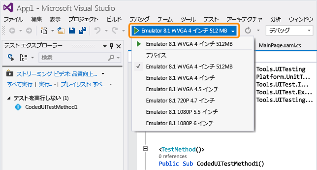  
  
### Q: \[コード化された UI テスト\] ダイアログの \[コードの生成\] に、コード化された UI テストを記録するオプションが表示されないのはなぜですか?  
 **A**: 記録するオプションは、Windows Phone アプリではサポートされません。  
  
### Q: WinJS、Silverlight、または HTML5 ベースの Windows Phone アプリ用に、コード化された UI テストを作成することはできますか?Q: WinJS、Silverlight、または HTML5 ベースの Windows Phone アプリ用に、コード化された UI テストを作成することはできますか?  
 **A**: いいえ、XAML ベースのアプリだけがサポートされます。  
  
### Q: Windows 8.1 または Windows 10 が実行されていないシステムで、Windows Phone アプリのコード化された UI テストを作成できますか?  
 **A**: いいえ、できません。コード化された UI テスト プロジェクトのテンプレートは、Windows 8.1 および Windows 10 でのみ使用できます。 ユニバーサル Windows プラットフォーム \(UWP\) アプリ用にオートメーションを作成するには、Windows 10 が必要です。  
  
### Q: ユニバーサル Windows プラットフォーム \(UWP\) アプリ用のコード化された UI テストは、どのようにして作成できますか?  
 **A**: コード化された UI テスト プロジェクトは、UWP アプリをテストしているプラットフォームに応じて、次のいずれかの方法で作成します。  
  
-   ローカル コンピューターで実行している UWP アプリは、ストア アプリとして実行されます。 このアプリをテストする場合、**コード化された UI テスト プロジェクト \(Windows\)** のテンプレートを使用します。 新しいプロジェクトの作成時にこのテンプレートを検索するには、**\[Windows\]**、**\[ユニバーサル\]** ノードに移動します。 あるいは、**\[Windows\]**、**\[Windows 8\]**、**\[Windows\]** ノードに移動します。  
  
-   モバイル デバイスまたはエミュレーターで実行している UWP アプリは、Phone アプリケーションとして実行されます。 このアプリをテストする場合、**コード化された UI テスト プロジェクト \(Windows Phone\)** のテンプレートを使用します。 新しいプロジェクトの作成時にこのテンプレートを検索するには、**\[Windows\]**、**\[ユニバーサル\]** ノードに移動します。 あるいは、**\[Windows\]**、**\[Windows 8\]**、**\[Windows Phone\]** ノードに移動します。  
  
 プロジェクトを作成した後も、テストの作成は以前と同じままになります。  
  
### Q: エミュレーターにはないコントロールを選択することはできますか?  
 **A**: いいえ、できません。そのようなコントロールは、ビルダーで検出されません。  
  
### Q: 物理的な電話デバイスを使用して、コード化された UI テスト ビルダーを使ってコントロールをマップすることはできますか?  
 **A**: いいえ、できません。ビルダーが UI 要素をマップできるのは、アプリがエミュレーターに配置されている場合のみです。  
  
### Q: UIMap.Designer ファイルでコードを変更できないのはなぜですか?  
 **A**: UIMapDesigner.cs ファイルでコードを変更しても、\[UIMap \- コード化された UI テスト ビルダー\] を使用してコードを生成するたびに変更が上書きされます。 記録されたメソッドを変更する必要がある場合は、メソッドを UIMap.cs ファイルにコピーし、メソッド名を変更する必要があります。 UIMap.cs ファイルを使用すると、UIMapDesigner.cs ファイルのメソッドやプロパティをオーバーライドできます。 Coded UITest.cs ファイルの元のメソッドへの参照を削除し、変更したメソッド名に置き換える必要があります。  
  
### Q: コマンド ラインから、コード化された UI テストを Windows Phone アプリで実行することはできますか?  
 **A**: はい、できます。 runsettings ファイルを使用して、テストを実行するターゲット デバイスを指定できます。 次に例を示します。  
  
 **vstest.console.exe “pathToYourCodedUITestDll” \/settings:devicetarget.runsettings**  
  
 サンプル runsettings ファイル:  
  
```  
<?xml version="1.0" encoding="utf-8"?> <RunSettings> <MSPhoneTest> <!--to specify test execution on device, use a TargetDevice option as follows--> <TargetDevice>Device</TargetDevice> <!--to specify an emulator instead, use a TargetDevice option like below--> <!--<TargetDevice>Emulator 8.1 WVGA 4 inch 512MB</TargetDevice>--> </MSPhoneTest> </RunSettings>  
```  
  
### Q: XAML ベースの Windows ストア アプリと Windows Phone アプリでは、コード化された UI テストにどのような違いがありますか?  
 **A**: 次のように、いくつかの重要な違いがあります。  
  
|機能|Windows ストア アプリ|Windows Phone アプリ|  
|--------|---------------------|-----------------------|  
|テストの実行ターゲット|ローカルまたはリモート コンピューター。 リモート コンピューターを指定できるのは、自動テスト ケースを使用してテストを実行する場合です。 「[Microsoft Test Manager でのテスト ケースの自動化](/devops-test-docs/test/automate-a-test-case-in-microsoft-test-manager)」を参照してください。|エミュレーターまたはデバイス。 このトピックの「[Q: テストを実行できるのはエミュレーターだけですか? 物理デバイスを使用することもできますか?](#TestingPhoneAppsCodedUI_EmulatorDevice)」を参照してください。|  
|コマンド ラインからの実行|ターゲットを指定するのに設定ファイルは必要ありません。|ターゲットを指定するには runsettings ファイルが必要です。|  
|シェル コントロールに特化されたクラス|<xref:Microsoft.VisualStudio.TestTools.UITesting.DirectUIControls.DirectUIControl>|<xref:Microsoft.VisualStudio.TestTools.UITesting.UITestControl>|  
|XAML アプリの WebView コントロール|Html\* に特化されたクラスを使用して HTML 要素を操作する場合はサポートされます。 「<xref:Microsoft.VisualStudio.TestTools.UITesting.HtmlControls>」を参照してください。|サポートされていません。|  
|MTM からの自動テストの実行|サポートされています。|サポートされていません。|  
|データ ドリブン テスト|外部データ ソースの使用およびテスト メソッドでの DataSource 属性の使用については、「[データ ドリブン テスト](../test/creating-a-data-driven-coded-ui-test.md)」を参照してください。|データは、テスト メソッドの DataRow 属性を使用して、インラインで指定されます。 このトピックの「[Windows Phone アプリでのデータ ドリブンのコード化された UI テストの使用](#TestingPhoneAppsCodedUI_DataDriven)」を参照してください。|  
  
 Windows ストア アプリのコード化された UI テストについては、「[コード化された UI テストを使用した Windows ストア 8.1 アプリのテスト](../test/test-windows-store-8-1-apps-with-coded-ui-tests.md)」を参照してください。  
  
## 外部リソース  
 Microsoft Visual Studio アプリケーション ライフサイクル管理ブログ: [コード化された UI を使用して XAML ベースの Windows Phone アプリをテストする](http://blogs.msdn.com/b/visualstudioalm/archive/2014/04/05/using-coded-ui-to-test-xaml-based-windows-phone-apps.aspx?PageIndex=2#comments)  
  
## 参照  
 [UI オートメーションを使用してコードをテストする](../test/use-ui-automation-to-test-your-code.md)