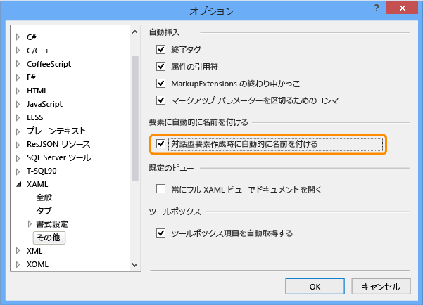
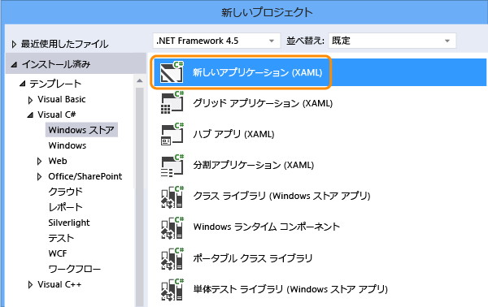
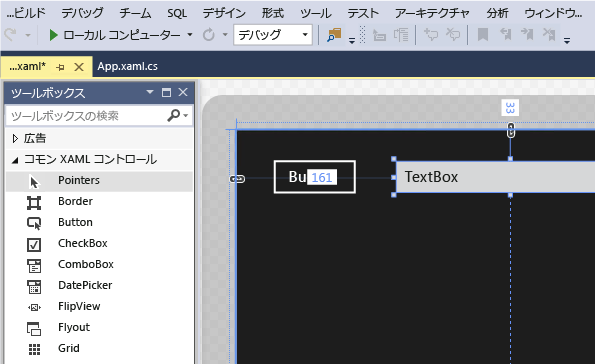
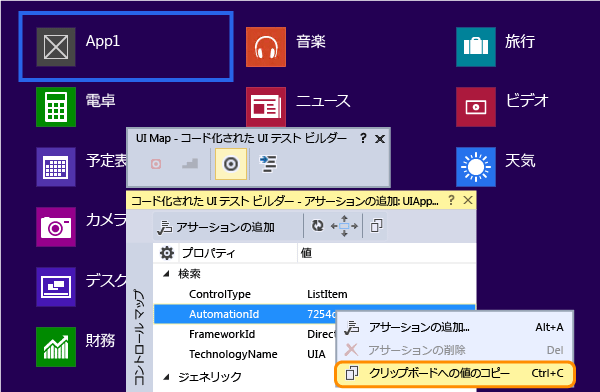
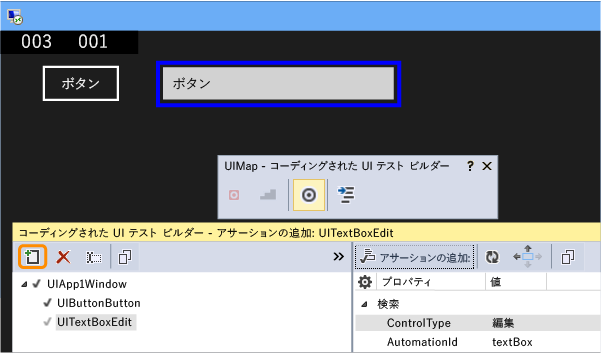
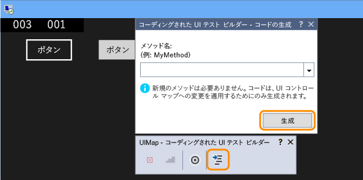
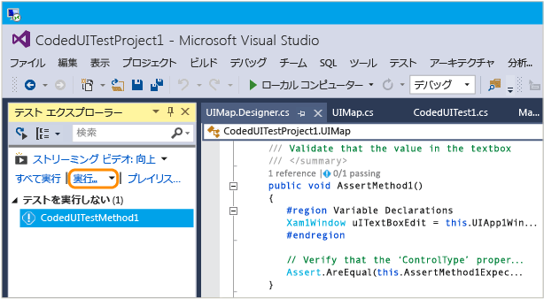
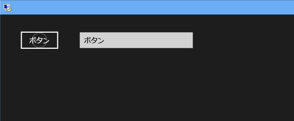
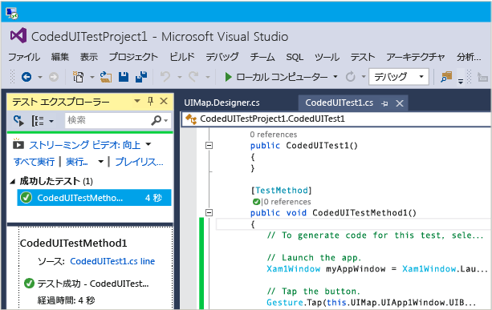

# <a name="test-windows-uwp-and-81-store-apps-with-coded-ui-tests"></a>コード化された UI テストを使用した Windows UWP および 8.1 のストア アプリのテスト

このチュートリアルでは、UWP アプリと XAML ベースのストア 8.1 アプリの UI テストを作成します。 
  
## <a name="create-a-simple-windows-store-app"></a>簡単な Windows ストア アプリを作成する  
  
1.  XAML ベースの Windows ストア アプリ用のコード化された UI テストを実行する場合は、 [各コントロールを識別する一意のオートメーション プロパティを設定する](../test/set-a-unique-automation-property-for-windows-store-controls-for-testing.md)必要があります。  
  
     **[ツール]** メニューの **[オプション]** をポイントし、 **[テキスト エディター]**、 **[XAML]**、 **[その他]**の順に選択します。  
  
     チェック ボックスをオンにして、対話要素の作成時に自動的に名前を付けます。  
  
       
  
2.  Visual C# または Visual Basic テンプレートを使用して、空の XAML ベースの Windows ストア アプリ用の新しいプロジェクトを作成します。  
  
       
  
3.  ソリューション エクスプローラーで、MainPage.xaml を開きます。 ツールボックスから、ボタン コントロールとテキスト ボックス コントロールをデザイン サーフェイスにドラッグします。  
  
       
  
4.  ボタン コントロールをダブルクリックし、次のコードを追加します。  
  
    ```c#  
    private void button_Click_1(object sender, RoutedEventArgs e)  
    {  
        this.textBox.Text = this.button.Name;  
    }  
  
    ```  
  
    ```vb#  
    Public NotInheritable Class MainPage  
        Inherits Page  
  
        Private Sub button_Click(sender As Object, e As RoutedEventArgs) Handles Button.Click  
            Me.textBox.Text = Me.button.Name  
        End Sub  
    End Class  
    ```  
  
5.  F5 キーを押して、Windows ストア アプリを実行します。  
  
## <a name="create-and-run-a-coded-ui-test-for-the-windows-store-app"></a>Windows ストア アプリのコード化された UI テストの作成と実行  

[ユニバーサル Windows プラットフォーム (UWP) アプリ用のコード化された UI テストは、どのようにして作成できますか?](#uwpapps)
  
1.  Windows ストア アプリの新しいコード化された UI テスト プロジェクトを作成します。  
  
       
  
2.  十字線ツールを使用して UI マップを編集することを選択します。  
  
     ![[UI マップの編集またはアサーションの追加] を選択する](~/test/media/cuit_windowsstoreapp_createproject_gencodedialog.png "CUIT_WindowsStoreApp_CreateProject_GenCodeDialog")  
  
3.  コード化された UI テスト ビルダーで十字線ツールを使用してアプリ タイルを選択し、 **[AutomationId]** を右クリックして、 **[値をクリップボードにコピー]**を選択します。 クリップボード内の値は、テスト用のアプリを起動する操作を記述するために後で使用されます。  
  
       
  
4.  実行中の Windows ストア アプリで、十字線ツールを使用してボタン コントロールとテキスト ボックス コントロールを選択します。 各コントロールを追加した後、コード化された UI テスト ビルダーのツール バーの **[コントロールの UI コントロール マップへの追加]** を選択します。  
  
       
  
5.  コード化された UI テスト ビルダーのツール バーの **[コードの生成]** ボタンを選択し、 **[生成]** を選択して、UI コントロール マップへの変更のコードを作成します。  
  
       
  
6.  テキスト ボックスの値を設定するボタンを選択します。  
  
     ![[ボタン コントロール] をクリックして TextBox 値を設定する](../test/media/cuit_windowsstoreapp_clickbutton.png "CUIT_WindowsStoreApp_ClickButton")  
  
7.  十字線ツールを使用してテキスト ボックス コントロールを選択し、 **[Text]** プロパティを選択します。  
  
     ![[テキスト] プロパティを選択する](../test/media/cuit_windowsstoreapp_selecttextproperty.png "CUIT_WindowsStoreApp_SelectTextProperty")  
  
8.  アサーションを追加します。 これは、値が正しいことを確認するためにテストで使用されます。  
  
     ![十字形で [TextBox] を選択し、アサーションを追加する](../test/media/cuit_windowsstoreapp_textbox_addassertion.png "CUIT_WindowsStoreApp_Textbox_AddAssertion")  
  
9. アサーションのコードを追加および生成します。  
  
       
  
10. **Visual C#**  
  
     ソリューション エクスプローラーで、UIMap.Designer.cs ファイルを開いて、Assert メソッドとコントロール用に追加されたコードを表示します。  
  
     **Visual Basic**  
  
     ソリューション エクスプローラーで、CodedUITest1.vb ファイルを開き、CodedUITestMethod1() テスト メソッドのコードでアサーション メソッド (自動的に追加された `Me.UIMap.AssertMethod1()` ) への呼び出しを右クリックし、 **[定義へ移動]**を選択します。 これにより、コード エディターで UIMap.Designer.vb ファイルが開かれ、Assert メソッドとコントロール用に追加されたコードが表示されます。  
  
    > [!WARNING]
    >  UIMap.designer.cs または UIMap.Designer.vb ファイルを直接変更しないでください。 そうすると、ファイルへの変更はテストが生成されるたびにオーバーライドされます。  
  
     **Assert メソッド**  
  
    ```c#  
    public void AssertMethod1()  
    {  
        #region Variable Declarations  
        XamlEdit uITextBoxEdit = this.UIApp1Window.UITextBoxEdit;  
        #endregion  
  
        // Verify that the 'Text' property of 'textBox' text box equals 'button'  
        Assert.AreEqual(this.AssertMethod3ExpectedValues.UITextBoxEditText, uITextBoxEdit.Text);  
    }  
    ```  
  
    ```vb#  
    Public Sub AssertMethod1()  
        Dim uITextBoxEdit As XamlEdit = Me.UIApp2Window.UITextBoxEdit  
  
        'Verify that the 'Text' property of 'textBox' text box equals 'button'  
        Assert.AreEqual(Me.AssertMethod1ExpectedValues.UITextBoxEditText, uITextBoxEdit.Text)  
    End Sub  
    ```  
  
     **コントロール**  
  
    ```c#  
    #region Properties  
    public XamlButton UIButtonButton  
    {  
        get  
        {  
            if ((this.mUIButtonButton == null))  
            {  
                this.mUIButtonButton = new XamlButton(this);  
                #region Search Criteria  
                this.mUIButtonButton.SearchProperties[XamlButton.PropertyNames.AutomationId] = "button";  
                this.mUIButtonButton.WindowTitles.Add("App1");  
                #endregion  
            }  
            return this.mUIButtonButton;  
        }  
    }  
  
    public XamlEdit UITextBoxEdit  
    {  
        get  
        {  
            if ((this.mUITextBoxEdit == null))  
            {  
                this.mUITextBoxEdit = new XamlEdit(this);  
                #region Search Criteria  
                this.mUITextBoxEdit.SearchProperties[XamlEdit.PropertyNames.AutomationId] = "textBox";  
                this.mUITextBoxEdit.WindowTitles.Add("App1");  
                #endregion  
            }  
            return this.mUITextBoxEdit;  
        }  
    }  
    #endregion  
  
    #region Fields  
    private XamlButton mUIButtonButton;  
  
    private XamlEdit mUITextBoxEdit;  
    #endregion  
    ```  
  
    ```vb#  
    #Region "Properties"  
    Public ReadOnly Property UIButtonButton() As XamlButton  
        Get  
            If (Me.mUIButtonButton Is Nothing) Then  
                Me.mUIButtonButton = New XamlButton(Me)  
                Me.mUIButtonButton.SearchProperties(XamlButton.PropertyNames.AutomationId) = "button"  
                Me.mUIButtonButton.WindowTitles.Add("App2")  
            End If  
            Return Me.mUIButtonButton  
        End Get  
    End Property  
  
    Public ReadOnly Property UITextBoxEdit() As XamlEdit  
        Get  
            If (Me.mUITextBoxEdit Is Nothing) Then  
                Me.mUITextBoxEdit = New XamlEdit(Me)  
                Me.mUITextBoxEdit.SearchProperties(XamlEdit.PropertyNames.AutomationId) = "textBox"  
                Me.mUITextBoxEdit.WindowTitles.Add("App2")  
            End If  
            Return Me.mUITextBoxEdit  
        End Get  
    End Property  
    #End Region  
  
    #Region "Fields"  
    Private mUIButtonButton As XamlButton  
  
    Private mUITextBoxEdit As XamlEdit  
    #End Region  
    ```  
  
11. ソリューション エクスプローラーで、CodedUITest1.cs ファイルまたは CodedUITest1.vb ファイルを開きます。 これで、UIMap に追加されるコントロールを使用してテストを実行する必要がある操作の CodedUTTestMethod1 メソッドにコードを追加できます。  
  
    1.  前にクリップボードにコピーしたオートメーション ID プロパティを使用して、Windows ストア アプリを起動します。  
  
        ```c#  
        XamlWindow.Launch("8ebca7c4-effe-4c86-9998-068daccee452_cyrqexqw8cc7c!App")  
        ```  
  
        ```vb#  
        XamlWindow myAppWindow = XamlWindow.Launch("7254db3e-20a7-424e-8e05-7c4dabf4f28d_cyrqexqw8cc7c!App");  
        ```  
  
    2.  ボタン コントロールをタップするジェスチャを追加します。  
  
        ```c#  
        Gesture.Tap(this.UIMap.UIApp1Window. UIButtonButton);  
        ```  
  
        ```vb#  
        Gesture.Tap(Me.UIMap.UIApp2Window. UIButtonButton)  
        ```  
  
    3.  自動的に生成された Assert メソッドへの呼び出しが、アプリの起動とボタンのタップ ジェスチャの後にあることを確認します。  
  
        ```c#  
        this.UIMap.AssertMethod1();  
        ```  
  
        ```vb#  
        Me.UIMap.AssertMethod1()  
        ```  
  
     コードを追加すると、CodedUITestMethod1 テスト メソッドは次のようになります。  
  
    ```c#  
    [TestMethod]  
    public void CodedUITestMethod1()  
    {  
        // To generate code for this test, select "Generate Code for Coded UI Test" from the shortcut menu and select one of the menu items.  
  
        // Launch the app.  
        XamlWindow myAppWindow = XamlWindow.Launch("7254db3e-20a7-424e-8e05-7c4dabf4f28d_cyrqexqw8cc7c!App");  
  
        // Tap the button.  
        Gesture.Tap(this.UIMap.UIApp1Window.UIButtonButton);  
  
        this.UIMap.AssertMethod1();  
    }  
    ```  
  
    ```vb#  
    <CodedUITest(CodedUITestType.WindowsStore)>  
    Public Class CodedUITest1  
  
        <TestMethod()>  
        Public Sub CodedUITestMethod1()  
            '              
            ' To generate code for this test, select "Generate Code for Coded UI Test" from the shortcut menu and select one of the menu items.  
            '  
  
            ' Launch the app.  
            XamlWindow.Launch("8ebca7c4-effe-4c86-9998-068daccee452_cyrqexqw8cc7c!App")  
  
            '// Tap the button.  
            Gesture.Tap(Me.UIMap.UIApp2Window.UIButtonButton)  
  
            Me.UIMap.AssertMethod1()  
        End Sub  
    ```  
  
12. テストをビルドし、テスト エクスプローラーを使用してテストを実行します。  
  
       
  
     Windows ストア アプリが起動し、ボタンをタップする操作が完了し、Assert メソッドを使用してテキスト ボックスの Text プロパティが設定され、検証されます。  
  
       
  
     テストの完了後、テストが成功したことがテスト エクスプローラーに表示されます。  
  
       
  
## <a name="q--a"></a>Q & A  
  
#### <a name="q-why-dont-i-see-the-option-to-record-my-coded-ui-test-in-the-generate-code-for-a-coded-ui-test-dialog"></a>Q: [コード化された UI テスト] ダイアログの [コードの生成] に、コード化された UI テストを記録するオプションが表示されないのはなぜですか?**  
  
**A**: 記録するオプションは、Windows ストア アプリではサポートされません。  
  
#### <a name="q-can-i-create-a-coded-ui-test-for-my-windows-store-apps-based-on-winjs"></a>Q: WinJS ベースの Windows ストア アプリのコード化された UI テストを作成できますか?**  

**A**: いいえ、XAML ベースのアプリだけがサポートされます。  
  
#### <a name="q-can-i-create-coded-ui-tests-for-my-windows-store-apps-on-a-system-that-is-not-running-windows-81-or-windows-10"></a>Q: Windows 8.1 または Windows 10 が実行されていないシステムで、Windows ストア アプリのコード化された UI テストを作成できますか?**  
  
**A**: いいえ、できません。コード化された UI テスト プロジェクトのテンプレートは、Windows 8.1 および Windows 10 でのみ使用できます。 ユニバーサル Windows プラットフォーム (UWP) アプリ用にオートメーションを作成するには、Windows 10 が必要です。  

<a name="uwpapps"></a>  
#### <a name="q-how-do-i-create-coded-ui-tests-for-universal-windows-platform-uwp-apps"></a>Q: ユニバーサル Windows プラットフォーム (UWP) アプリ用のコード化された UI テストは、どのようにして作成できますか?**  
  
**A**: コード化された UI テスト プロジェクトは、UWP アプリをテストしているプラットフォームに応じて、次のいずれかの方法で作成します。  
  
- ローカル コンピューターで実行している UWP アプリは、ストア アプリとして実行されます。 このアプリをテストする場合、 **コード化された UI テスト プロジェクト (Windows)** のテンプレートを使用します。 新しいプロジェクトの作成時にこのテンプレートを検索するには、 **[Windows]**、 **[ユニバーサル]** ノードに移動します。 あるいは、 **[Windows]**、 **[Windows 8]**、 **[Windows]** ノードに移動します。  
  
- モバイル デバイスまたはエミュレーターで実行している UWP アプリは、Phone アプリケーションとして実行されます。 このアプリをテストする場合、 **コード化された UI テスト プロジェクト (Windows Phone)** のテンプレートを使用します。 新しいプロジェクトの作成時にこのテンプレートを検索するには、 **[Windows]**、 **[ユニバーサル]** ノードに移動します。 あるいは、 **[Windows]**、 **[Windows 8]**、 **[Windows Phone]** ノードに移動します。  
  
プロジェクトを作成した後も、テストの作成は以前と同じままになります。  
  
#### <a name="q-why-cant-i-modify-the-code-in-the-uimapdesigner-file"></a>Q: UIMap.Designer ファイルでコードを変更できないのはなぜですか?**  
  
**A**: UIMapDesigner.cs ファイルでコードを変更しても、[UIMap - コード化された UI テスト ビルダー] を使用してコードを生成するたびに変更が上書きされます。 記録されたメソッドを変更する必要がある場合は、メソッドを UIMap.cs ファイルにコピーし、メソッド名を変更する必要があります。 UIMap.cs ファイルを使用すると、UIMapDesigner.cs ファイルのメソッドやプロパティをオーバーライドできます。 Coded UITest.cs ファイルの元のメソッドへの参照を削除し、変更したメソッド名に置き換える必要があります。  
  
## <a name="see-also"></a>関連項目  
 [UI オートメーションを使用してコードをテストする](../test/use-ui-automation-to-test-your-code.md)   
 [テスト用に Windows ストア コントロールの一意のオートメーション プロパティを設定する](../test/set-a-unique-automation-property-for-windows-store-controls-for-testing.md)

