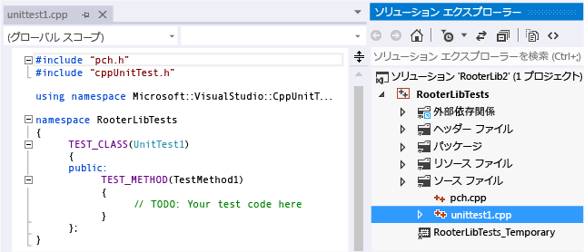
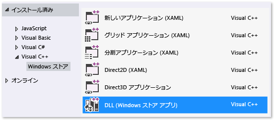
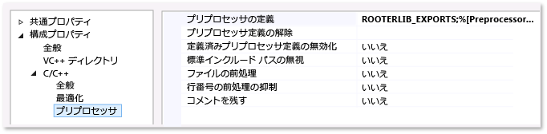

# <a name="how-to-test-a-visual-c-dll"></a>Visual C++ DLL をテストする方法

このトピックでは、C++ 用の Microsoft テスト フレームワークを使用して、ユニバーサル Windows プラットフォーム (UWP) アプリ用の C++ DLL の単体テストを作成する 1 つの方法について説明します。 RooterLib DLL は、指定した数値の平方根の概数を計算する関数を実装することによって、微積分の限界理論の不明瞭なメモリを示します。 この DLL を、ユーザーが数学で実行できる楽しい作業を提示する UWP アプリに組み込むことができます。

 このトピックでは、開発の第一歩として単体テストを使用する方法を示します。 この方法ではまず、テスト対象のシステムの特定の動作を検証するテスト メソッドを作成し、テストに合格するコードを記述します。 後述する手順の順序を変更することにより、この方法を逆にして、テストするコードを最初に記述し、単体テストを作成することができます。

 このトピックでは、テストする単体テストと DLL に 1 つの Visual Studio ソリューションと個別のプロジェクトも作成します。 また、DLL プロジェクトに単体テストを直接含めることも、単体テストと DLL ごとに個別のソリューションを作成することもできます。 使用できる構造体のヒントについては、「[テスト エクスプローラーを使用した既存の C++ アプリケーションの単体テスト](../test/unit-testing-existing-cpp-applications-with-test-explorer.md)」をご覧ください。

##  <a name="Create_the_solution_and_the_unit_test_project"></a> ソリューションと単体テスト プロジェクトを作成する

1.  **[ファイル]** メニューで、**[新規]** > **[新しいプロジェクト]** を選びます。

2.  [新しいプロジェクト] ダイアログで **[インストール済み]** > **[Visual C++]** の順に展開し、**[Windows ユニバーサル]** を選びます。 プロジェクト テンプレートの一覧の **[単体テスト アプリ (ユニバーサル Windows)]** を選択します。

3.  プロジェクトに `RooterLibTests` という名前を付けます。場所を指定します。ソリューションに `RooterLib` という名前を付けます。**[ソリューションのディレクトリを作成]** チェックボックスがオンになっていることを確認します。

     

4.  新しいプロジェクトで、**unittest1.cpp** を開きます。

     

     次の点に注意してください。

    -   各テストは `TEST_METHOD(YourTestName){...}` を使用して定義されます。

         従来の関数の署名を記述する必要はありません。 署名は、マクロ TEST_METHOD によって作成されます。 マクロは、void を返すインスタンス関数を生成します。 また、テスト メソッドに関する情報を返す静的関数も生成します。 この情報により、テスト エクスプ ローラーはメソッドを見つけます。

    -   テスト メソッドは、 `TEST_CLASS(YourClassName){...}`を使用してクラスにグループ化されます。

         テストが実行されると、各テスト クラスのインスタンスが作成されます。 テスト メソッドが呼び出される順序は決まっていません。 各モジュール、クラス、またはメソッドの前後に呼び出される特殊なメソッドを定義することができます。 詳細については、「[Microsoft.VisualStudio.TestTools.CppUnitTestFramework の使用](how-to-use-microsoft-test-framework-for-cpp.md)」をご覧ください。

##  <a name="Verify_that_the_tests_run_in_Test_Explorer"></a> テストがテスト エクスプローラーで実行されることを確認する

1.  幾らかのテスト コードを挿入します。

    ```cpp
    TEST_METHOD(TestMethod1)
    {
        Assert::AreEqual(1,1);
    }
    ```

     `Assert` クラスは、テスト メソッドで結果を確認するために使用するいくつかの静的メソッドを提供することに注意してください。

2.  **[テスト]** メニューの **[実行]** をポイントし、**[すべて実行]** をクリックします。

     テスト プロジェクトがビルドされ、実行されます。 **テスト エクスプローラー**のウィンドウが表示され、テストが **[成功したテスト]** に表示されます。 ウィンドウの下部の **[概要]** ウィンドウに、選択したテストに関する詳細情報が表示されます。

     

##  <a name="Add_the_DLL_project_to_the_solution"></a> DLL プロジェクトをソリューションに追加する

1.  **ソリューション エクスプローラー**でソリューション名を選択します。 ショートカット メニューの **[追加]** をポイントし、**[新しいプロジェクトの追加]** を選択します。

     

2.  **[新しいプロジェクトの追加]** ダイアログ ボックスの **[DLL (UWP アプリ)]** を選択します。

3.  *RooterLib.h* ファイルに次のコードを追加します。

    ```cpp
    // The following ifdef block is the standard way of creating macros which make exporting
    // from a DLL simpler. All files within this DLL are compiled with the ROOTERLIB_EXPORTS
    // symbol defined on the command line. This symbol should not be defined on any project
    // that uses this DLL. This way any other project whose source files include this file see
    // ROOTERLIB_API functions as being imported from a DLL, whereas this DLL sees symbols
    // defined with this macro as being exported.
    #ifdef ROOTERLIB_EXPORTS
    #define ROOTERLIB_API  __declspec(dllexport)
    #else
    #define ROOTERLIB_API __declspec(dllimport)
    #endif //ROOTERLIB_EXPORTS

    class ROOTERLIB_API CRooterLib {
    public:
        CRooterLib(void);
        double SquareRoot(double v);
    };
    ```

     コメントは、dll の開発者だけでなく、プロジェクトで DLL を参照するユーザーにも ifdef ブロックについて説明しています。 DLL のプロジェクト プロパティを使用して、コマンド ラインに ROOTERLIB_EXPORTS シンボルを追加できます。

     `CRooterLib` クラスは、コンストラクターと `SqareRoot` エスティメーターのメソッドを宣言します。

4.  コマンド ラインに ROOTERLIB_EXPORTS のシンボルを追加します。

    1.  **ソリューション エクスプローラー**で **RooterLib** プロジェクトを選択し、ショートカット メニューの **[プロパティ]** を選択します。

         

    2.  **RooterLib の [プロパティ ページ]** ダイアログ ボックスで **[構成プロパティ]**、**[C++]** の順に展開し、**[プリプロセッサ]** を選択します。

    3.  **[プリプロセッサの定義]** ボックスの一覧の **[\<編集...>]** を選択し、**[プリプロセッサの定義]** ダイアログ ボックスに `ROOTERLIB_EXPORTS` を追加します。

5.  宣言された関数の最小限の実装を追加します。 *RooterLib.cpp* を開き、次のコードを追加します。

    ```cpp
    // constructor
    CRooterLib::CRooterLib()
    {
    }

    // Find the square root of a number.
    double CRooterLib::SquareRoot(double v)
    {
        return 0.0;
    }

    ```

##  <a name="make_the_dll_functions_visible_to_the_test_code"></a> DLL 関数をテスト コードに表示させる

1. RooterLibTests プロジェクトに RooterLib を追加します。

   1.  **ソリューション エクスプローラー**で **RooterLibTests** プロジェクトを選択し、ショートカット メニューの **[参照]** を選択します。

   2.  **RooterLib の [プロジェクトのプロパティ]** ダイアログ ボックスで **[共通プロパティ]** を展開し、**[Framework と参照]** を選択します。

   3.  **[新しい参照の追加]** を選択します。

   4.  **[参照の追加]** ダイアログ ボックスで **[ソリューション]** を展開し、**[プロジェクト]** を選択します。 次に **[RouterLib]** 項目を選択します。

2. *unittest1.cpp* に RooterLib のヘッダー ファイルをインクルードします。

   1.  *unittest1.cpp* を開きます。

   2.  `#include "CppUnitTest.h"` 行の下に次のコードを追加します。

       ```cpp
       #include "..\RooterLib\RooterLib.h"
       ```

3. インポートした関数を使用するテストを追加します。 *unittest1.cpp* に次のコードを追加します。

   ```cpp
   TEST_METHOD(BasicTest)
   {
       CRooterLib rooter;
       Assert::AreEqual(
           // Expected value:
           0.0,
           // Actual value:
           rooter.SquareRoot(0.0),
           // Tolerance:
           0.01,
           // Message:
           L"Basic test failed",
           // Line number - used if there is no PDB file:
           LINE_INFO());
   }
   ```

4. ソリューションをビルドします。

    新しいテストが**テスト エクスプローラー**の **[テストを実行しない]** ノードに表示されます。

5. **テスト エクスプローラー**で **[すべて実行]** をクリックします。

    

   テストとコード プロジェクトをセット アップして、コード プロジェクトで関数を実行するテストを実行できることを確認しました。 ここで、実際のテストおよびコードの記述を開始できます。

##  <a name="Iteratively_augment_the_tests_and_make_them_pass"></a> テストを繰り返し増やして成功させる

1.  新しいテストを追加します。

    ```cpp
    TEST_METHOD(RangeTest)
    {
        CRooterLib rooter;
        for (double v = 1e-6; v < 1e6; v = v * 3.2)
        {
            double expected = v;
            double actual = rooter.SquareRoot(v*v);
            double tolerance = expected/1000;
            Assert::AreEqual(expected, actual, tolerance);
        }
    };
    ```

    > [!TIP]
    > 合格したテスト内容を変更しないことをお勧めします。 代わりに、新しいテストを追加し、テストが合格するようにコードを更新してから別のテストを追加する、という過程を繰り返します。
    >
    > ユーザーが要件を変更したら、正しくなくなったテストを無効にします。 新しいテストを作成し、一度に 1 つずつ、同じ増分方式で処理するようにします。

2.  **テスト エクスプローラー**で **[すべて実行]** をクリックします。

3.  テストが失敗します。

     

    > [!TIP]
    > 各テストが記述した後すぐに失敗することを確認します。 これは、絶対に失敗しないテストを記述するという簡単なミスを避けることに役立ちます。

4.  新しいテストが成功するように、テスト対象のコードを増やします。 *RooterLib.cpp* に次のコードを追加します。

    ```cpp
    #include <math.h>
    ...
    // Find the square root of a number.
    double CRooterLib::SquareRoot(double v)
    {
        double result = v;
        double diff = v;
        while (diff > result/1000)
        {
            double oldResult = result;
            result = result - (result*result - v)/(2*result);
            diff = abs (oldResult - result);
        }
        return result;
    }

    ```

5.  ソリューションをビルドし、**テスト エクスプローラー**で **[すべて実行]** を選択します。

     両方のテストが合格します。

> [!TIP]
> 一度に 1 つのテストを追加してコードを開発します。 各反復処理の後にすべてのテストが合格することを確認します。


##  <a name="Debug_a_failing_test"></a> 失敗したテストをデバッグする

1. *unittest1.cpp* に別のテストを追加します。

   ```cpp
   // Verify that negative inputs throw an exception.
    TEST_METHOD(NegativeRangeTest)
    {
      wchar_t message[200];
      CRooterLib rooter;
      for (double v = -0.1; v > -3.0; v = v - 0.5)
      {
        try
        {
          // Should raise an exception:
          double result = rooter.SquareRoot(v);

          swprintf_s(message, L"No exception for input %g", v);
          Assert::Fail(message, LINE_INFO());
        }
        catch (std::out_of_range ex)
        {
          continue; // Correct exception.
        }
        catch (...)
        {
          swprintf_s(message, L"Incorrect exception for %g", v);
          Assert::Fail(message, LINE_INFO());
        }
      }
   };
   ```

2. **テスト エクスプローラー**で **[すべて実行]** をクリックします。

    テストが失敗します。 **テスト エクスプローラー**でテスト名を選択します。 失敗したアサーションが強調表示されます。 エラー メッセージは、**テスト エクスプローラー**の [詳細] ウィンドウに表示されます。

    

3. テストが失敗した理由を表示するには、関数をステップ実行します。

   1.  `SquareRoot` 関数の先頭にブレークポイントを設定します。

   2.  失敗したテストのショートカット メニューで **[選択したテストのデバッグ]** をクリックします。

        実行がブレークポイントで停止したら、コードをステップ実行します。

   3.  例外をキャッチするには、*RooterLib.cpp* にコードを追加します。

       ```cpp
       #include <stdexcept>
       ...
       double CRooterLib::SquareRoot(double v)
       {
           //Validate the input parameter:
           if (v < 0.0)
           {
             throw std::out_of_range("Can't do square roots of negatives");
           }
       ...

       ```

   1.  **テスト エクスプローラー**で **[すべて実行]** をクリックして、修正されたメソッドをテストし、回帰が生じていないことを確認します。

   今回は、すべてのテストに合格します。

   

##  <a name="Refactor_the_code_without_changing_tests"></a> テストを変更せずにコードをリファクタリングする

1.  `SquareRoot` 関数の計算全体を簡略化します。

    ```csharp
    // old code
    //result = result - (result*result - v)/(2*result);
    // new code
    result = (result + v/result) / 2.0;
    ```

2.  **[すべて実行]** をクリックして、リファクタリングされたメソッドをテストし、回帰が生じていないことを確認します。

    > [!TIP]
    > 安定した一連の適切な単体テストを実行することで、コードを変更したときにバグが生じていないことを確信できます。
    >
    > 常に他の変更とは別にリファクタリングしてください。
