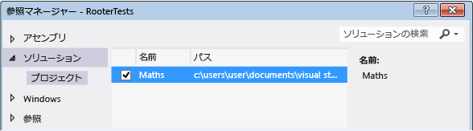
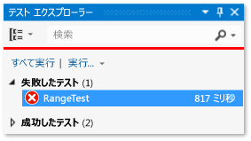
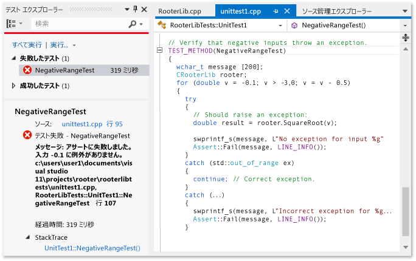
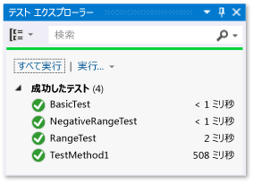

# <a name="unit-testing-visual-c-code"></a>Visual C# コードの単体テスト

この記事では、UWP アプリの Visual C# クラスの単体テストを作成する方法の 1 つについて説明します。 Rooter クラスは、指定した数値の平方根の概数を計算する関数を実装することによって、微積分の限界理論の不明瞭なメモリを示します。 Maths アプリケーションではこの関数を使用して、数学で実行できる楽しいことをユーザーに示すことができます。

この記事では、開発の第一歩として単体テストを使用する方法を示します。 この方法ではまず、テスト対象のシステムの特定の動作を検証するテスト メソッドを作成し、テストに合格するコードを記述します。 後述する手順の順序を変更することにより、この方法を逆にして、テストするコードを最初に記述し、単体テストを作成することができます。

この記事では、テストする単体テストと DLL に 1 つの Visual Studio ソリューションと個別のプロジェクトも作成します。 また、DLL プロジェクトに単体テストを直接含めることも、単体テストと DLL ごとに個別のソリューションを作成することもできます。

## <a name="create-the-solution-and-the-unit-test-project"></a>ソリューションと単体テスト プロジェクトを作成する

1. **[ファイル]** メニューで、**[新規]** > **[プロジェクト]** の順に選択します。

2. **[新しいプロジェクト]** ダイアログ ボックスで **[インストール済み]** > **[Visual C#]** の順に展開し、**[Windows ユニバーサル]** を選択します。 プロジェクト テンプレートの一覧の **[新しいアプリケーション]** をクリックします。

3. プロジェクトに「`Maths`」という名前を付け、**[ソリューションのディレクトリを作成]** チェックボックスがオンになっていることを確認します。

4. **ソリューション エクスプローラー**でソリューション名をクリックし、ショートカット メニューの **[追加]** をクリックし、**[新しいプロジェクト]** を選択します。

5. **[新しいプロジェクト]** ダイアログ ボックスで **[インストール済み]**、**[Visual C#]** の順に展開し、**[Windows ユニバーサル]** を選択します。 プロジェクト テンプレートの一覧の **[単体テスト アプリ (ユニバーサル Windows)]** を選択します。

6. Visual Studio エディターで *UnitTest1.cs* を開きます。

   ```csharp
   using System;
   using System.Collections.Generic;
   using System.Linq;
   using System.Text;
   using Microsoft.VisualStudio.TestTools.UnitTesting;
   using Maths;

   namespace RooterTests
   {
       [TestClass]
       public class UnitTest1

           [TestMethod]
           public void TestMethod1()
           {

           }
   ```

   次の点に注意してください。

   - 各テストは <xref:Microsoft.VisualStudio.TestTools.UnitTesting.TestMethodAttribute> 属性を使用して定義されます。 テスト メソッドは void を返す必要があり、パラメーターをとることはできません。

   - テスト メソッドは <xref:Microsoft.VisualStudio.TestTools.UnitTesting.TestClassAttribute> の属性で装飾されたクラスに配置する必要があります。

        テストの実行時に、各テスト クラスのインスタンスが作成されます。 テスト メソッドが呼び出される順序は決まっていません。

   - 各モジュール、クラス、またはメソッドの前後に呼び出される特殊なメソッドを定義することができます。 詳細については、「[単体テストでの MSTest フレームワークの使用](../test/using-microsoft-visualstudio-testtools-unittesting-members-in-unit-tests.md)」を参照してください。

## <a name="verify-that-the-tests-run-in-test-explorer"></a>テスト エクスプローラーでテストの実行を確認します。

1. *UnitTest1.cs* ファイルの TestMethod1 のテスト コードを挿入します。

   ```csharp
   [TestMethod]
   public void TestMethod1()
   {
       Assert.AreEqual(0, 0);
   }
   ```

   <xref:Microsoft.VisualStudio.TestTools.UnitTesting.Assert> クラスは、テスト メソッドで結果を確認するために使用するいくつかの静的メソッドを提供することに注意してください。

2. **[テスト]** メニューの **[実行]** をポイントし、**[すべて実行]** をクリックします。

   テスト プロジェクトがビルドされ、実行されます。 **テスト エクスプローラー**のウィンドウが表示され、テストが **[成功したテスト]** に表示されます。 ウィンドウの下部の **[概要]** ウィンドウに、選択したテストに関する詳細情報が表示されます。

   

## <a name="add-the-rooter-class-to-the-maths-project"></a>Maths プロジェクトに Rooter クラスを追加します。

1. **ソリューション エクスプローラー**でプロジェクト名の **[Maths]** を選択します。 ショートカット メニューの **[追加]** をポイントし、**[クラス]** をクリックします。

2. クラス ファイルに *Rooter.cs* という名前を付けます。

3. Rooter クラスの *Rooter.cs* ファイルに次のコードを追加します。

   ```csharp
   public Rooter()
   {
   }

   // estimate the square root of a number
   public double SquareRoot(double x)
   {
       return 0.0;
   }
   ```

   `Rooter` クラスは、コンストラクターと `SquareRoot` エスティメーターのメソッドを宣言します。

4. `SquareRoot` メソッドは、テスト設定の基本的な構造をテストするための必要最小限の実装にすぎません。

## <a name="couple-the-test-project-to-the-app-project"></a>アプリケーション プロジェクトにテスト プロジェクトを結合する

1. RooterTests プロジェクトに Maths アプリケーションへの参照を追加します。

    1. **ソリューション エクスプローラー**で、**RooterTests** プロジェクトを選択し、ショートカット メニューの **[参照の追加]** を選択します。

    2. **[参照の追加 - RooterTests]** ダイアログ ボックスの **[ソリューション]** を展開し、**[プロジェクト]** を選択します。 次に **[Maths]** 項目を選択します。

        

2. 使用するステートメントを *UnitTest1.cs* ファイルに追加します。

    1. *UnitTest1.cs* を開きます。

    2. `using Microsoft.VisualStudio.TestTools.UnitTesting;` 行の下に次のコードを追加します。

       ```csharp
       using Maths;
       ```

3. Rooter 関数を使用するテストを追加します。 *UnitTest1.cpp* に次のコードを追加します。

   ```csharp
   [TestMethod]
   public void BasicTest()
   {
       Maths.Rooter rooter = new Rooter();
       double expected = 0.0;
       double actual = rooter.SquareRoot(expected * expected);
       double tolerance = .001;
       Assert.AreEqual(expected, actual, tolerance);
   }
   ```

4. ソリューションをビルドします。

   新しいテストが**テスト エクスプローラー**の **[テストを実行しない]** ノードに表示されます。

5. **テスト エクスプローラー**で **[すべて実行]** をクリックします。

   

テストとコード プロジェクトをセット アップして、コード プロジェクトで関数を実行するテストを実行できることを確認しました。 ここで、実際のテストおよびコードの記述を開始できます。

## <a name="iteratively-augment-the-tests-and-make-them-pass"></a>テストを繰り返し増やして成功させる

1. 新しいテストを追加します。

   ```csharp
   [TestMethod]
   public void RangeTest()
   {
       Rooter rooter = new Rooter();
       for (double v = 1e-6; v < 1e6; v = v * 3.2)
       {
           double expected = v;
           double actual = rooter.SquareRoot(v*v);
           double tolerance = ToleranceHelper(expected);
           Assert.AreEqual(expected, actual, tolerance);
       }
   }
   ```

   > [!TIP]
   > 合格したテスト内容を変更しないことをお勧めします。 代わりに、新しいテストを追加し、テストが合格するようにコードを更新してから別のテストを追加する、という過程を繰り返します。
   >
   > ユーザーが要件を変更したら、正しくなくなったテストを無効にします。 新しいテストを作成し、一度に 1 つずつ、同じ増分方式で処理するようにします。

2. **テスト エクスプローラー**で **[すべて実行]** をクリックします。

3. テストが失敗します。

   

   > [!TIP]
   > そのテストを作成した直後に、各テストが失敗することを検証します。 これは、絶対に失敗しないテストを記述するという簡単なミスを避けることに役立ちます。

4. 新しいテストが成功するように、テスト対象のコードを増やします。 *Rooter.cs* の `SquareRoot` 関数を次のように変更します。

   ```csharp
   public double SquareRoot(double x)
   {
       double estimate = x;
       double diff = x;
       while (diff > estimate / 1000)
       {
           double previousEstimate = estimate;
           estimate = estimate - (estimate * estimate - x) / (2 * estimate);
           diff = Math.Abs(previousEstimate - estimate);
       }
       return estimate;
   }
   ```

5. ソリューションをビルドし、**テスト エクスプローラー**で **[すべて実行]** を選択します。

   3 つのテストはすべて成功しました。

> [!TIP]
> 一度に 1 つのテストを追加してコードを開発します。 各反復処理の後にすべてのテストが合格することを確認します。

## <a name="debug-a-failing-test"></a>失敗したテストをデバッグする

1. *UnitTest1.cs* に別のテストを追加します。

    ```csharp
    // Verify that negative inputs throw an exception.
    [TestMethod]
    public void NegativeRangeTest()
    {
        string message;
        Rooter rooter = new Rooter();
        for (double v = -0.1; v > -3.0; v = v - 0.5)
        {
            try
            {
                // Should raise an exception:
                double actual = rooter.SquareRoot(v);

                message = String.Format("No exception for input {0}", v);
                Assert.Fail(message);
            }
            catch (ArgumentOutOfRangeException ex)
            {
                continue; // Correct exception.
            }
            catch (Exception e)
            {
                message = String.Format("Incorrect exception for {0}", v);
                Assert.Fail(message);
            }
        }
    }
    ```

2. **テスト エクスプローラー**で **[すべて実行]** をクリックします。

   テストが失敗します。 **テスト エクスプローラー**でテスト名を選択します。 失敗したアサーションが強調表示されます。 エラー メッセージは、**テスト エクスプローラー**の [詳細] ウィンドウに表示されます。

   

3. テストが失敗した理由を表示するには、関数をステップ実行します。

    1. `SquareRoot` 関数の先頭にブレークポイントを設定します。

    2. 失敗したテストのショートカット メニューで **[選択したテストのデバッグ]** をクリックします。

        実行がブレークポイントで停止したら、コードをステップ実行します。

    3. 例外をキャッチするには、Rooter メソッドにコードを追加します。

        ```csharp
        public double SquareRoot(double x)
        {
            if (x < 0.0)
            {
                throw new ArgumentOutOfRangeException();
        }
        ```

4. **テスト エクスプローラー**で **[すべて実行]** をクリックして、修正されたメソッドをテストし、回帰が生じていないことを確認します。

今回は、すべてのテストに合格します。



## <a name="refactor-the-code"></a>コードをリファクタリングする

**SquareRoot 関数の中心的な計算を簡素化します。**

1. 結果の実装を変更する

    ```csharp
    // old code
    //result = result - (result*result - v)/(2*result);
    // new code
    result = (result + v/result) / 2.0;
    ```

2. **[すべて実行]** をクリックして、リファクタリングされたメソッドをテストし、回帰が生じていないことを確認します。

> [!TIP]
> 安定した一連の適切な単体テストを実行することで、コードを変更したときにバグが生じていないことを確信できます。

**テスト コードをリファクタリングして、重複したコードを削除します。**

`RangeTest` メソッドでは、<xref:Microsoft.VisualStudio.TestTools.UnitTesting.Assert> メソッドで使用される `tolerance` 変数の分母をハードコーディングします。 同じ許容値計算を使用するテストを追加する場合、ハードコーディングされた値を複数の場所で使用すると、エラーの原因となる可能性があります。

1. 代わりに、Unit1Test クラスにプライベート メソッドを追加して、許容値を計算し、そのメソッドを呼び出します。

    ```csharp
    private double ToleranceHelper(double expected)
    {
        return expected / 1000;
    }

    ...

    [TestMethod]
    public void RangeTest()
    {
        ...
        // old code
        // double tolerance = expected/1000;
        // new code
        double tolerance = ToleranceHelper(expected);
        Assert.AreEqual(expected, actual, tolerance);
    }
    ...
    ```

2. **[すべて実行]** をクリックして、リファクタリングされたメソッドをテストし、エラーが生じていないことを確認します。

> [!NOTE]
> **テスト エクスプローラー**に表示したくないテスト クラスにヘルパー メソッドを追加する場合は、メソッドに <xref:Microsoft.VisualStudio.TestTools.UnitTesting.TestMethodAttribute> 属性を追加しないでください。