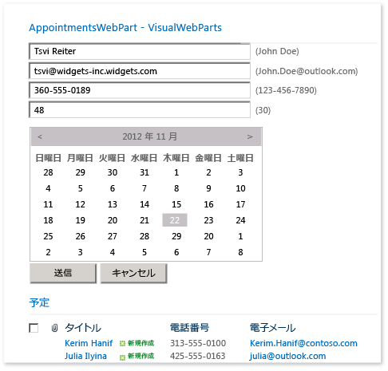
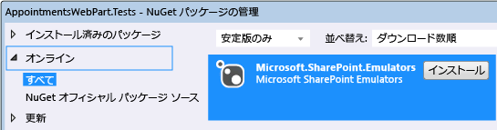
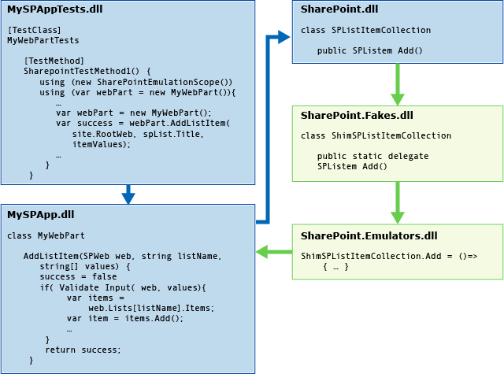
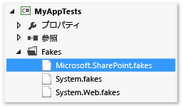
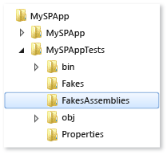

# <a name="using-emulators-to-isolate-unit-tests-for-sharepoint-2010-applications"></a>Sharepoint 2010 アプリケーションの単体テストを分離するためのエミュレーターの使用

Microsoft.SharePoint.Emulators パッケージには、Microsoft SharePoint 2010 アプリケーションの分離単体テストの作成に役立つ一連のライブラリが用意されています。 エミュレーターは、[Microsoft Fakes](../test/isolating-code-under-test-with-microsoft-fakes.md) 分離フレームワークで [shim](../test/using-shims-to-isolate-your-application-from-other-assemblies-for-unit-testing.md) を使用して、SharePoint API の最も一般的なオブジェクトおよびメソッドを模倣する、軽量なメモリ内オブジェクトを作成します。 SharePoint メソッドがエミュレートされていない場合、またはエミュレーターの既定の動作を変更する場合は、Fakes shim を作成して必要な結果を提供できます。

既存のテスト メソッドとクラスは、エミュレーターのコンテキストで実行されるように容易に変換できます。 この機能を使用すると、二重用途のテストを作成できます。 二重用途のテストは、実際の SharePoint API に対する統合テストと、エミュレーターを使用する分離単体テストを切り替えることができます。

##  <a name="BKMK_Requirements"></a> 要件

-   Microsoft SharePoint 2010 (SharePoint 2010 Server または SharePoint 2010 Foundation)

-   Microsoft Visual Studio Enterprise

-   Microsoft SharePoint Emulators NuGet パッケージ

また、[Visual Studio での単体テストの基本](../test/unit-test-basics.md)をよく理解しておく必要があるほか、[Microsoft Fakes](../test/isolating-code-under-test-with-microsoft-fakes.md) に関する知識も必要です。

##  <a name="BKMK_The_AppointmentsWebPart_example"></a> AppointmentsWebPart の例

AppointmentsWebPart を使用すると、予定の SharePoint リストを表示および管理できます。



この例では、Web パーツの 2 つのメソッドをテストします。

-   `ScheduleAppointment` メソッドは、自身に渡されたリスト項目の値を検証し、指定された SharePoint Web にある一覧に新しいエントリを作成します。

-   `GetAppointmentsForToday` メソッドは、今日の予定の詳細を返します。

##  <a name="convert-an-existing-test"></a>既存のテストを変換する

SharePoint コンポーネントの一般的なメソッド テストでは、テスト メソッドにより、一時的なサイトが SharePoint Foundation に作成され、テスト対象のコードが必要とする SharePoint コンポーネントが追加されます。 その後、コンポーネントのインスタンスが作成および実行されます。 このサイトは、テストの終了時に破棄されます。

テスト対象のコードの `ScheduleAppointment` メソッドは、ほとんどの場合、そのコンポーネントに対して記述された最初のメソッドの 1 つです。

```csharp
// method under test
public bool ScheduleAppointment(SPWeb web, string listName, string name,
    string phone, string email, string age, DateTime date, out string errorMsg)
{
    errorMsg = string.Empty;
    var badFormat = this.checkInput(name, phone, email, age);
    if (badFormat)
    {
        errorMsg = "Bad Format";
        return false;
    }
    var exists = this.CheckDuplicate(listName, web, name, phone, email, age, date);
    if (exists)
    {
        errorMsg = "Item already exists";
        return false;
    }
    SPListItemCollection items = web.Lists[listName].Items;
    // create item and populate fields
    SPListItem item = items.Add();
    item["Name"] = name;
    item["Phone"] = phone;
    item["Email"] = email;
    item["Age"] = age;
    item["Date"] = date.ToString("D");
    item.Update();
    return true;
}
```

`ScheduleAppointment` メソッドの機能の最初のテストは次のようになります。

```csharp
[TestMethod]
public void ScheduleAppointmentReturnsTrueWhenNewAppointmentIsCreated()
{
    using( var site = new SPSite("http://localhost"))
    using (var webPart = new BookAnAppointmentWebPart())
    {
        // Arrange
        string errorMsg = string.Empty;
        DateTime date = DateTime.Now;
        SPList list = AddListToSiteHelper(site);

        // Act
        bool success = webPart.ScheduleAppointment(site.RootWeb, list.Title,
            "Raisa Pokrovskaya", "425-555-0163", "raisa@outlook.com", "55", date,
            out errorMsg);
        list.Delete();

        // Assert
        Assert.IsTrue(success);
    }
}
```

このテスト メソッドは、`ScheduleAppointment` メソッドによって新しいエントリが一覧に適切に追加されたかどうかを検証しますが、コードの特定の動作のテストというよりも、どちらかというと Web パーツの統合テストです。 このテストは、SharePoint および SharePoint API に対する外部依存関係によって、`ScheduleAppointment` メソッドのユーザー コード以外の理由で失敗することがあります。 また、SharePoint サイトの作成および破棄のオーバーヘッドによりテストが遅くなりすぎて、コード プロセスの一部として実行できなくなることもあります。 すべてのテスト メソッドに対してサイトの設定と破棄を実行しても、効率的な開発者単体テストの作成に関する問題を悪化させるだけです。

Microsoft SharePoint エミュレーターは、よく使用する SharePoint API の動作を模倣する一連のオブジェクトとメソッド "doubles" を提供します。 エミュレートされたメソッドは SharePoint API の軽量な実装で、SharePoint を実行する必要がありません。 Microsoft Fakes を使用して、SharePoint API への呼び出しを、SharePoint エミュレーターのメソッド doubles に迂回させることで、テストを分離して、必要なコードをテストしているかどうかを確認します。 エミュレートされていない SharePoint のメソッドを呼び出すと、Fake を使用して必要な動作を直接作成できます。

###  <a name="BKMK_Adding_the_Emulators_package_to_a_test_project"></a> テスト プロジェクトにエミュレーター パッケージを追加する

SharePoint エミュレーターをテスト プロジェクトに追加するには:

1.  **ソリューション エクスプローラー**でテスト プロジェクトを選択します。

2.  ショートカット メニューの **[NuGet パッケージの管理]** を選択します。

3.  `Microsoft.SharePoint.Emulators` の **[オンライン]** カテゴリを検索し、**[インストール]** を選択します。



###  <a name="BKMK__Running_a_test_method_in_the_emulation_context"></a> エミュレーションを使用してテスト メソッドを実行する

パッケージをインストールすると、必要なライブラリへの参照がプロジェクトに追加されます。 既存のテスト クラスでエミュレーターを使いやすくするには、名前空間 `Microsoft.SharePoint.Emulators` と `Microsoft.QualityTools.Testing.Emulators` を追加します。

テスト メソッドでエミュレーションを有効にするには、`using` オブジェクトを作成する `SharePointEmulationScope` ステートメントでメソッド本体をラップします。 次に例を示します。

```csharp
[TestMethod]
public void ScheduleAppointmentReturnsTrueWhenNewAppointmentIsCreated()
{
    // create the emulation scope with a using statement
    using (new SharePointEmulationScope())
    using( var site = new SPSite("http://localhost"))
    using (var webPart = new BookAnAppointmentWebPart())
    {
        // Arrange
        string errorMsg = string.Empty;
        DateTime date = DateTime.Now;
        SPList list = AddListToSiteHelper(site);

        // Act
        bool success = webPart.ScheduleAppointment(site.RootWeb, list.Title,
            "Raisa Pokrovskaya", "425-555-0163", "raisa@outlook.com", "55", date,
            out errorMsg);
        list.Delete();

        // Assert
        Assert.IsTrue(success);
    }
}
```

テスト メソッドが実行されると、エミュレーター ランタイムは、Microsoft Fake を呼び出してコードを SharePoint メソッドに動的に挿入し、これらのメソッドへの呼び出しを、*Microsoft.SharePoint.Fakes.dll* で宣言されているデリゲートに迂回させます。 *Microsoft.SharePoint.Emulators.dll* は、エミュレートされたメソッドのデリゲートを実装し、SharePoint の実際の動作を正確に模倣します。 テスト メソッドまたはテスト対象のコンポーネントが SharePoint メソッドを呼び出した結果として生じる動作は、エミュレーションの動作です。



##  <a name="create-dual-use-classes-and-methods"></a>二重用途のクラスおよびメソッドを作成する

実際の SharePoint API に対する統合テストと、エミュレーターを使用する分離単体テストの両方に使用できるメソッドを作成するには、オーバーロードされたコンストラクター `SharePointEmulationScope(EmulationMode)` を使用して、テスト メソッド コードをラップします。 `EmulationMode` 列挙型の 2 つの値は、スコープがエミュレーターを使用するかどうか  (`EmulationMode.Enabled`)、またはスコープが SharePoint API を使用するかどうか (`EmulationMode.Passthrough`) を指定します。

たとえば、次のコードは、前回のテストを二重用途に変更する方法を示しています。

```csharp
// class level field specifies emulation mode
private const EmulationMode emulatorMode = EmulationMode.Enabled;

[TestMethod]
public void ScheduleAppointmentReturnsTrueWhenNewAppointmentIsCreated()
{
    // emulation scope determined by emulatorMode
    using( SharePointEmulationScope(emulatorMode))
    using( var site = new SPSite("http://localhost"))
    using (var webPart = new BookAnAppointmentWebPart())
    {
        // Arrange
        string errorMsg = string.Empty;
        DateTime date = DateTime.Now;
        SPList list = AddListToSiteHelper(site);

        // Act
        bool success = webPart.ScheduleAppointment(site.RootWeb, list.Title,
            "Raisa Pokrovskaya", "425-555-0163", "raisa@outlook.com", "55", date,
            out errorMsg);
        list.Delete();

        // Assert
        Assert.IsTrue(success);
    }
}
```

## <a name="use-testinitialize-and-testcleanup-attributes-to-create-a-dual-use-test-class"></a>TestInitialize 属性と TestCleanup 属性を使用して二重用途のテスト クラスを作成する

`SharePointEmulationScope` を使用してクラスのすべてのテスト、またはほとんどのテストを実行すると、クラス レベルの手法を利用して、エミュレーション モードを設定できます。

-   <xref:Microsoft.VisualStudio.TestTools.UnitTesting.TestInitializeAttribute> および <xref:Microsoft.VisualStudio.TestTools.UnitTesting.TestCleanupAttribute> を使用して属性設定されているテスト クラス メソッドが、スコープを作成および破棄できます。

-   クラス レベルで `EmulationMode` を設定すると、`EmulationMode.Enabled` および `EmulationMode.Passthrough` の間のモード変更を自動化できます。

`[TestInitialize]` を使用して属性設定されているクラス メソッドが、各テスト メソッドの開始時に実行され、`[TestCleanup]` を使用して属性設定されているメソッドが、各テスト メソッドの終了時に実行されます。 クラス レベルで `SharePointEmulationScope` オブジェクトのプライベート フィールドを宣言し、`TestInitialize` 属性付きメソッドで初期化して、`TestCleanup` 属性付きメソッドでオブジェクトを破棄できます。

任意のメソッドを選択して使用し、`EmulationMode`の選択を自動化できます。 1 つは、プリプロセッサ ディレクティブを使用してシンボルの存在をチェックする方法です。 たとえば、エミュレーターを使用してクラスでテスト メソッドを実行するために、テスト プロジェクト ファイルまたはビルド コマンド ラインで `USE_EMULATION` などのシンボルを定義できます。 シンボルを定義すると、クラス レベルの `EmulationMode` 定数が宣言され、`Enabled` に設定されます。 それ以外の場合、定数は `Passthrough` に設定されます。

次のテスト クラスの例は、プリプロセッサ ディレクティブ、`TestInitialize` 属性付きメソッド、および `TestCleanup` 属性付きメソッドを使用して、エミュレーション モードを設定する方法を示しています。

```csharp
//namespace declarations
...

namspace MySPAppTests
{
    [TestClass]
    public class BookAnAppointmentWebPartTests
    {

        // emulationScope is a class level field
        private SharePointEmulationScope emulationScope;

        // preprocessor directives determine the value of emulatorMode
        #if USE_EMULATIONprivate const EmulationMode emulatorMode = EmulationMode.Enabled;#elseprivate const EmulationMode emulatorMode = EmulationMode.Passthrough;#endif

        // InitializeTest sets the emulation scope at the beginning of each test method
        [TestInitialize]public void InitializeTest(){this.emulationScope = new SharePointEmulationScope(emulatorMode);}

        // CleanupTest disposes the emulation scope at the end of each test method
        [TestCleanup]public void CleanupTest(){this.emulationScope.Dispose();}

        [TestMethod]
        public void ScheduleAppointmentReturnsTrueWhenNewAppointmentIsCreated()
        {
            // remove the SharePointEmulationScope using statement from the method
            using( var site = new SPSite("http://localhost"))
            using (var webPart = new BookAnAppointmentWebPart())
            {
                // Arrange
                string errorMsg = string.Empty;
                DateTime date = DateTime.Now;
                SPList list = AddListToSiteHelper(site);

                // Act
                bool success = webPart.ScheduleAppointment(site.RootWeb, list.Title,
                    "Raisa Pokrovskaya", "425-555-0163", "raisa@outlook.com", "55", date,
                    out errorMsg);
                list.Delete()

                // Assert
                Assert.IsTrue(success);
            }
        }

        ...// More tests

    }
}
```

##  <a name="handle-non-emulated-sharepoint-methods"></a>エミュレートされていない SharePoint メソッドを処理する

すべての SharePoint 型がエミュレートされるわけではありません。また、エミュレートされた型のすべてのメソッドがエミュレートされるわけでもありません。 テスト対象のコードが、エミュレートされていない SharePoint メソッドを呼び出すと、そのメソッドによって `NotSupportedException` 例外がスローされます。 例外が発生したら、SharePoint メソッドの Fakes shim を追加します。

**SharePoint Fakes の準備**

Microsoft Fakes shim を明示的に呼び出すには:

1.  エミュレートされていない SharePoint クラスに shim を使用する場合は、*Microsoft.SharePoint.fakes* ファイルを編集し、shim が使用されたクラスの一覧にそのクラスを追加します。 「[Microsoft Fakes におけるコード生成、コンパイル、および名前付け規則](../test/code-generation-compilation-and-naming-conventions-in-microsoft-fakes.md)」の「[スタブのコード生成を構成する](code-generation-compilation-and-naming-conventions-in-microsoft-fakes.md#configure-code-generation-of-stubs)」セクションを参照してください。

     

2.  Microsoft SharePoint エミュレーター パッケージのインストール後、*Microsoft.SharePoint.Fakes* ファイルを編集した場合、少なくとも 1 回はテスト プロジェクトをリビルドします。 プロジェクトをビルドすると、ディスク上のプロジェクト ルート フォルダーに **FakesAssembly** フォルダーが作成され、設定されます。

     

3.  **FakesAssembly** フォルダーにある **Microsoft.SharePoint.14.0.0.0.Fakes.dll** アセンブリに参照を追加します。

4.  (省略可能) 名前空間ディレクティブを、使用する `Microsoft.QualityTools.Testing.Fakes`、`Microsoft.SharePoint.Fakes`、および `Microsoft.SharePoint.Fakes` の入れ子になった名前空間のテスト クラスに追加します。

**SharePoint メソッドの shim デリゲートの実装**

この例のプロジェクトでは、`GetAppointmentsForToday` メソッドは [SPList.GetItems (SPQuery)](xref:Microsoft.SharePoint.SPList.GetItems%2A) SharePoint API メソッドを呼び出しています。

```csharp
// method under test
public string GetAppointmentsForToday(string listName, SPWeb web)
{
    SPList list = web.Lists[listName];
    DateTime today = DateTime.Now;
    var listQuery = new SPQuery{Query = String.Format("<Where><Eq><FieldRef Name='Date'/>" +"<Value Type='Text'>{0}</Value>" +"</Eq></Where>", today.ToString("D"))};
    var result = new System.Text.StringBuilder();
    foreach (SPListItem item in list.GetItems(listQuery))
    {
        result.AppendFormat("Name: {0}, Phone: {1}, Email: {2}, Age: {3}, Date: {4}\n",
            item["Name"], item["Phone"], item["Email"], item["Age"], item["Date"]);
    }
    return result.ToString();
}
```

オーバーロードされた `SPList.GetItems(SPQuery)` メソッドの `GetItems` バージョンはエミュレートされません。 したがって、`GetAppointmentsForToday` では、`SharePoint.Emulation.Scope` の既存のテストをラップできません。 機能するテストを作成するには、テスト対象の結果を返す Fakes デリゲート `ShimSPList.GetItemsSPQuery` の実装を記述する必要があります。

Fakes デリゲートを実装する既存のテスト メソッド `GetAppointmentsForTodayReturnsOnlyTodaysAppointments` を次のように変更します。 必要な変更については、コメントで説明が示されています。

> [!IMPORTANT]
> テストが `ShimNotSupported` コンテキストで実行されると、Fake shim を明示的に作成するテスト メソッドにより `EmulationMode.Passthrough` 例外がスローされます。 この問題を回避するには、変数を使用して `EmulationMode` 値を設定し、値をテストする `if` ステートメントで Fakes コードをラップします。

```csharp
// class level field to set emulation mode
private const EmulationMode emulatorMode = EmulationMode.Enabled

[TestMethod]
public void GetAppointmentsForTodayReturnsOnlyTodaysAppointments()
{

    // create the emulation scope with a using statement
    using (var emulationScope = new SharePointEmulationScope(emulatorMode))
    using( var site = new SPSite("http://localhost"))
    using (var webPart = new BookAnAppointmentWebPart())
    {
        // Arrange
        DateTime date = DateTime.Now;
        SPList list = AddListToSiteHelper(site);
        // insert 2 items into list
        AddItemsToListHelper(list, new string[] {"Raisa Pokrovskaya", "425-555-0163",
            "raisa@outlook.com", "55", date.ToString("D") });
        AddItemsToListHelper(list, new string[] {"Francis Totten", "313-555-0100",
            "francis@contoso.com", "42", date.AddDays(1).ToString("D") });

        // use Fakes shims only if emulation is enabled
        if (emulatorMode == EmulationMode.Enabled){var sList = new ShimSPList(list);sList.GetItemsSPQuery = (query) =>{var shim = new ShimSPListItemCollection();shim.Bind(new[] { list.Items[0] });return shim.Instance;}}

        // Act
        string result = webPart.GetAppointmentsForToday(list.Title, site.RootWeb);
        list.Delete();

        // Assert
        Assert.IsTrue(result.Contains(String.Format(
            "Name: Raisa Pokrovskaya, Phone: 425-555-0163, Email: raisa@outlook.com," +
            "Age: 55, Date: {0}", date.ToString("D"))));
        Assert.IsFalse(result.Contains("Name: Francis Totten"));
    }
}
```

このメソッドでは、最初に、エミュレーションが有効になっていることをテストします。 有効になっている場合は、`SPList` リストに対して Fakes shim オブジェクトを作成してから、メソッドを作成して、その `GetItemsSPQuery` デリゲートに割り当てます。 デリゲートは Fake `Bind` メソッドを使用して、呼び出し元に返される `ShimSPListItemCollection` に正しいリスト項目を追加します。

##  <a name="write-emulation-tests-from-scratch-and-a-summary"></a>新しいエミュレーション テストの作成と概要

前のセクションで説明したエミュレーション テストおよび二重用途のテストを作成する手法では、既存のテストを変換することを前提としていますが、テストをゼロから記述する手法も使用できます。 次の一覧にこの手法の概要を示します。

-   テスト プロジェクトでエミュレーターを使用するには、Microsoft.SharePoint.Emulators NuGet パッケージをプロジェクトに追加します。

-   テスト メソッドでエミュレーターを使用するには、メソッドの先頭で `SharePointEmulationScope` オブジェクトを作成します。 サポートされる SharePoint API はすべて、スコープが破棄されるまでエミュレートされます。

-   実際の SharePoint API に記述しているように、テスト コードを記述します。 エミュレーションのコンテキストによって、SharePoint メソッドへの呼び出しはそのメソッドのエミュレーターに自動的に迂回します。

-   すべての SharePoint オブジェクトがエミュレートされるわけではありません。また、エミュレートされたオブジェクトのすべてのメソッドがエミュレートされるわけでもありません。 エミュレートされていないオブジェクトまたはメソッドを使用すると、`NotSupportedException` 例外がスローされます。 この場合は、そのメソッドに対して Fake shim デリゲートを明示的に作成し、必要な動作を返します。

-   二重用途のテストを作成するには、`SharePointEmulationScope(EmulationMode)` コンストラクターを使用して、エミュレーション スコープ オブジェクトを作成します。 `EmulationMode` 値では、SharePoint 呼び出しが実際の SharePoint サイトに対してエミュレートまたは実行されているかどうかを指定します。

-   テスト クラスのテスト メソッドのほとんどまたはすべてがエミュレーションのコンテキストで実行される場合は、クラス レベルの `TestInitialize` 属性付きメソッドを使用して `SharePointEmulationScope` オブジェクトを作成し、クラス レベルのフィールドを使用してエミュレーション モードを設定できます。 これは、エミュレーション モードの変更を自動化するときに役立ちます。 その後、`TestCleanup` 属性付きメソッドを使用して、スコープ オブジェクトを破棄します。

##  <a name="BKMK_Example"></a> 「例」

次に示す最後の例には、上記の SharePoint エミュレーター手法が組み込まれています。

```csharp
using System;
//other namespace declarations
...
// code under test
using MySPApps;
using Microsoft.SharePoint;
// unit testing and emulators
using Microsoft.VisualStudio.TestTools.UnitTesting;
using Microsoft.QualityTools.Testing.Emulators;
using Microsoft.SharePoint.Emulators;
// explicit Fakes shims
using Microsoft.QualityTools.Testing.Fakes;
using Microsoft.SharePoint.Fakes

namspace MySPAppTests
{
    [TestClass]
    public class BookAnAppointmentWebPartTests
    {

        // emulationScope is a class level field
        private SharePointEmulationScope emulationScope;

        // preprocessor directives determine the value of emulatorMode
        #if USE_EMULATION
            private const EmulationMode emulatorMode = EmulationMode.Enabled;
        #else
            private const EmulationMode emulatorMode = EmulationMode.Passthrough;
        #endif

        // InitializeTest sets the emulation scope at the beginning of each test method
        [TestInitialize]
        public void InitializeTest()
        {
            this.emulationScope = new SharePointEmulationScope(emulatorMode);
        }

        // CleanupTest disposes the emulation scope at the end of each test method
        [TestCleanup]
        public void Cleanup()
        {
            this.emulationScope.Dispose();
        }

        [TestMethod]
        public void ScheduleAppointmentReturnsTrueWhenNewAppointmentIsCreated()
        {
            // remove the SharePointEmulationScope using statement from the method
            using( var site = new SPSite("http://localhost"))
            using (var webPart = new BookAnAppointmentWebPart())
            {
                // Arrange
                string errorMsg = string.Empty;
                DateTime date = DateTime.Now;
                SPList list = AddListToSiteHelper(site);

                // Act
                bool success = webPart.ScheduleAppointment(site.RootWeb, list.Title,
                    "Raisa Pokrovskaya", "425-555-0163", "raisa@outlook.com", "55", date,
                    out errorMsg);
                list.Delete()

                // Assert
                Assert.IsTrue(success);
            }
        }

        [TestMethod]
        public void GetAppointmentsForTodayReturnsOnlyTodaysAppointments()
        {

            // remove the SharePointEmulationScope using statement from the method
            using( var site = new SPSite("http://localhost"))
            using (var webPart = new BookAnAppointmentWebPart())
            {
                // Arrange
                DateTime date = DateTime.Now;
                SPList list = AddListToSiteHelper(site);
                // insert 2 items into list
                AddItemsToListHelper(list, new string[] {"Raisa Pokrovskaya", "425-555-0163",
                    "raisa@outlook.com", "55", date.ToString("D") });
                AddItemsToListHelper(list, new string[] {"Francis Totten", "313-555-0100",
                    "francis@contoso.com", "42", date.AddDays(1).ToString("D") });

                // use Fakes shims only if emulation is enabled
                if (emulatorMode == EmulationMode.Enabled)
                {
                    var sList = new ShimSPList(list);

                    sList.GetItemsSPQuery = (query) =>
                    {
                        var shim = new ShimSPListItemCollection();
                        shim.Bind(new[] { list.Items[0] });
                        return shim.Instance;
                    }
                }

                // Act
                string result = webPart.GetAppointmentsForToday(list.Title, site.RootWeb);
                list.Delete();

                // Assert
                Assert.IsTrue(result.Contains(String.Format(
                    "Name: Raisa Pokrovskaya, Phone: 425-555-0163, Email: raisa@outlook.com," +
                    "Age: 55, Date: {0}", date.ToString("D"))));
                Assert.IsFalse(result.Contains("Name: Francis Totten"));
            }
        }

        ...// More tests

    }
}
```

##  <a name="BKMK_Emulated_SharePoint_types"></a> エミュレートされた SharePoint の型

 <xref:Microsoft.SharePoint.SPField?displayProperty=nameWithType>

 <xref:Microsoft.SharePoint.SPFieldIndex?displayProperty=nameWithType>

 <xref:Microsoft.SharePoint.SPFieldIndexCollection?displayProperty=nameWithType>

 <xref:Microsoft.SharePoint.SPFieldLink?displayProperty=nameWithType>

 <xref:Microsoft.SharePoint.SPFieldLinkCollection?displayProperty=nameWithType>

 <xref:Microsoft.SharePoint.SPFieldUrlValue?displayProperty=nameWithType>

 <xref:Microsoft.SharePoint.SPFile?displayProperty=nameWithType>

 <xref:Microsoft.SharePoint.SPFileCollection?displayProperty=nameWithType>

 <xref:Microsoft.SharePoint.SPFolder?displayProperty=nameWithType>

 <xref:Microsoft.SharePoint.SPFolderCollection?displayProperty=nameWithType>

 <xref:Microsoft.SharePoint.SPItem?displayProperty=nameWithType>

 <xref:Microsoft.SharePoint.SPItemEventDataCollection?displayProperty=nameWithType>

 <xref:Microsoft.SharePoint.SPItemEventProperties?displayProperty=nameWithType>

 <xref:Microsoft.SharePoint.SPList?displayProperty=nameWithType>

 <xref:Microsoft.SharePoint.SPListCollection?displayProperty=nameWithType>

 <xref:Microsoft.SharePoint.SPListEventProperties?displayProperty=nameWithType>

 <xref:Microsoft.SharePoint.SPListItem?displayProperty=nameWithType>

 <xref:Microsoft.SharePoint.SPListItemCollection?displayProperty=nameWithType>

 <xref:Microsoft.SharePoint.SPQuery?displayProperty=nameWithType>

 <xref:Microsoft.SharePoint.SPRoleAssignment?displayProperty=nameWithType>

 <xref:Microsoft.SharePoint.SPRoleAssignmentCollection?displayProperty=nameWithType>

 <xref:Microsoft.SharePoint.SPSecurableObject?displayProperty=nameWithType>

 <xref:Microsoft.SharePoint.SPSecurity?displayProperty=nameWithType>

 <xref:Microsoft.SharePoint.SPSite?displayProperty=nameWithType>

 <xref:Microsoft.SharePoint.SPUser?displayProperty=nameWithType>

 <xref:Microsoft.SharePoint.SPUserCollection?displayProperty=nameWithType>

 <xref:Microsoft.SharePoint.SPView?displayProperty=nameWithType>

 <xref:Microsoft.SharePoint.SPViewCollection?displayProperty=nameWithType>

 <xref:Microsoft.SharePoint.SPViewContext?displayProperty=nameWithType>

 <xref:Microsoft.SharePoint.SPWeb?displayProperty=nameWithType>

 <xref:Microsoft.SharePoint.SPWebCollection?displayProperty=nameWithType>

## <a name="see-also"></a>関連項目

- [コードの単体テスト](../test/unit-test-your-code.md)
- [コード化された UI テストを使用して SharePoint 2010 アプリケーションをテストする](../test/testing-sharepoint-2010-applications-with-coded-ui-tests.md)
- [SharePoint ソリューションの開発](../sharepoint/developing-sharepoint-solutions.md)
