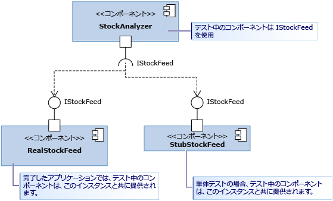

# <a name="using-stubs-to-isolate-parts-of-your-application-from-each-other-for-unit-testing"></a>スタブを使用して単体テストでアプリケーションの各部分を相互に分離する
*スタブ型*は、テスト対象のコンポーネントをそれが呼び出した他のコンポーネントから簡単に区別できるようにするために Microsoft Fakes フレームワークによって提供されている 2 つのテクノロジのうちの 1 つです。 スタブは、テスト中に別のコンポーネントの代わりをする短いコードです。 スタブを使用することの利点は、スタブによって一貫した結果が返され、テストを簡単に記述できることです。 また、他のコンポーネントがまだ動作しなくてもテストを実行できます。  
  
 Fakes の概要とクイック スタート ガイドについては、「[Microsoft Fakes を使用したテストでのコードの分離](../test/isolating-code-under-test-with-microsoft-fakes.md)」を参照してください。  
  
 スタブを使用するには、アプリケーションの他の部分を参照する際に、クラスでなくインターフェイスだけを使用するようにコンポーネントを記述する必要があります。 1 つの部分で変更があったときに別の部分でも変更が必要になる可能性が低くなるため、これは優れたデザイン方法です。 テストでは、実際のコンポーネントをスタブに置き換えることができます。  
  
 図では、StockAnalyzer というコンポーネントがテスト対象です。 これは通常、別のコンポーネントである RealStockFeed を使用します。 しかし、RealStockFeed はメソッドが呼び出されるたびに異なる結果を返すので、StockAnalyzer のテストが難しくなります。  そこで、テスト中は StubStockFeed という別のクラスに置き換えます。  
  
   
  
 スタブは、コードをこのように構成できることに依存しているため、通常は自分が管理しているアプリケーションの 1 つの部分を他の部分から分離するために使用されます。 自分の管理下にない他のアセンブリ (System.dll など) から分離するには、通常は shim を使用します。 「[shim を使用して単体テストでアプリケーションを他のアセンブリから分離する](../test/using-shims-to-isolate-your-application-from-other-assemblies-for-unit-testing.md)」を参照してください。  
  
 **Requirements**  
  
-   Visual Studio Enterprise  
  
## <a name="in-this-topic"></a>このトピックの内容  
  
-   [スタブの使用方法](#how)  
  
    -   [依存関係の挿入のデザイン](#Dependency)  
  
    -   [スタブを生成する](#GeneratingStubs)  
  
    -   [スタブを使用してテストを作成する](#WriteTest)  
  
    -   [パラメーター値を確認する](#mocks)  
  
-   [さまざまな種類の型メンバーのスタブ](../test/using-stubs-to-isolate-parts-of-your-application-from-each-other-for-unit-testing.md#BKMK_Stub_basics)  
  
    -   [メソッド](../test/using-stubs-to-isolate-parts-of-your-application-from-each-other-for-unit-testing.md#BKMK_Methods)  
  
    -   [プロパティ](../test/using-stubs-to-isolate-parts-of-your-application-from-each-other-for-unit-testing.md#BKMK_Properties)  
  
    -   [イベント](../test/using-stubs-to-isolate-parts-of-your-application-from-each-other-for-unit-testing.md#BKMK_Events)  
  
    -   [ジェネリック メソッド](../test/using-stubs-to-isolate-parts-of-your-application-from-each-other-for-unit-testing.md#BKMK_Generic_methods)  
  
    -   [仮想クラスのスタブ](../test/using-stubs-to-isolate-parts-of-your-application-from-each-other-for-unit-testing.md#BKMK_Partial_stubs)  
  
-   [スタブをデバッグする](../test/using-stubs-to-isolate-parts-of-your-application-from-each-other-for-unit-testing.md#BKMK_Debugging_stubs)  
  
-   [スタブの制限事項](../test/using-stubs-to-isolate-parts-of-your-application-from-each-other-for-unit-testing.md#BKMK_Stub_limitation)  
  
-   [スタブの既定の動作を変更する](../test/using-stubs-to-isolate-parts-of-your-application-from-each-other-for-unit-testing.md#BKMK_Changing_the_default_behavior_of_stubs)  
  
##  <a name="How"></a> スタブの使用方法  
  
###  <a name="Dependency"></a> 依存関係の挿入のデザイン  
 スタブを使用するには、各コンポーネントが互いに依存せず、インターフェイス定義だけに依存するようにアプリケーションをデザインする必要があります。 コンポーネントはコンパイル時には結合されず、実行時に接続されます。 このパターンでは、変更がコンポーネントの境界を越えて広がることが少ないので、堅牢で更新しやすいソフトウェアを作成できます。 スタブを使用しない場合でも、このパターンに従うことをお勧めします。 新しいコードを記述する場合は、[依存関係の挿入](http://en.wikipedia.org/wiki/Dependency_injection)パターンに簡単に準拠できます。 既存のソフトウェアのテストを作成する場合は、通常、ソフトウェアをリファクタリングする必要があります。 それが現実的でない場合は、代わりに shim を使用する方法もあります。  
  
 ここではまず、図に示されているような、スタブに適した例について説明します。 クラス StockAnalyzer は、株価を読み取り、興味深い結果を生成します。 いくつかのパブリック メソッドがあり、それらをテスト対象にします。 説明を簡単にするために、これらのメソッドのうちの 1 つに着目します。特定の株式の現在の価格を報告する単純なメソッドです。 このメソッドの単体テストを記述します。 テストの最初のドラフトは、次のようになります。  
  
```c#  
[TestMethod]  
public void TestMethod1()  
{  
    // Arrange:  
    var analyzer = new StockAnalyzer();  
    // Act:  
    var result = analyzer.GetContosoPrice();  
    // Assert:  
    Assert.AreEqual(123, result); // Why 123?  
}  
```  
  
```vb#  
<TestMethod()> Public Sub TestMethod1()  
    ' Arrange:  
    Dim analyzer = New StockAnalyzer()  
    ' Act:  
    Dim result = analyzer.GetContosoPrice()  
    ' Assert:  
    Assert.AreEqual(123, result) ' Why 123?  
End Sub  
```  
  
 このテストの問題は、一見して明らかです。株価は変化するので、アサーションは通常は失敗します。  
  
 もう 1 つの問題は、StockAnalyzer によって使用される StockFeed コンポーネントがまだ開発中であることです。 テスト中のメソッドのコードは、最初のドラフトで、次のようになります。  
  
```c#  
public int GetContosoPrice()  
{  
    var stockFeed = new StockFeed(); // NOT RECOMMENDED  
    return stockFeed.GetSharePrice("COOO");  
}  
```  
  
```vb#  
Public Function GetContosoPrice()  
    Dim stockFeed = New StockFeed() ' NOT RECOMMENDED  
    Return stockFeed.GetSharePrice("COOO")  
End Function  
```  
  
 現時点では、StockFeed クラスの作業が完了していないため、このメソッドはコンパイルされないか、例外をスローする場合があります。  
  
 インターフェイス挿入は、両方の問題を解決します。  
  
 インターフェイス挿入では、次の規則が適用されます。  
  
-   アプリケーションのすべてのコンポーネントのコードは、宣言内でも、`new` ステートメント内でも、他のコンポーネントのクラスを明示的に参照してはいけません。 代わりに、変数とパラメーターは、インターフェイス付きで宣言する必要があります。 コンポーネントのインスタンスは、コンポーネントのコンテナーのみで作成されます。  
  
     ここでは、"コンポーネント" はクラス、または一緒に開発および更新するクラスのグループを意味します。 通常、コンポーネントは 1 つの Visual Studio プロジェクト内のコードです。 1 つのコンポーネント内の各クラスは同時に更新されるため、それらを分離することは、あまり重要ではありません。  
  
     System.dll などの比較的安定したプラットフォームのクラスからコンポーネントを分離することも、あまり重要ではありません。 これらのすべてのクラスのインターフェイスを記述したのでは、コードが煩雑になってしまいます。  
  
 StockAnalyzer のコードは、次のようにインターフェイスを使用して StockFeed から分離することによって、より良いコードにすることができます。  
  
```c#  
public interface IStockFeed  
{  
    int GetSharePrice(string company);  
}  
  
public class StockAnalyzer  
{  
    private IStockFeed stockFeed;  
    public Analyzer(IStockFeed feed)  
    {  
        stockFeed = feed;  
    }  
    public int GetContosoPrice()  
    {  
        return stockFeed.GetSharePrice("COOO");  
    }  
}  
```  
  
```vb#  
Public Interface IStockFeed  
    Function GetSharePrice(company As String) As Integer  
End Interface  
  
Public Class StockAnalyzer  
    ' StockAnalyzer can be connected to any IStockFeed:  
    Private stockFeed As IStockFeed  
    Public Sub New(feed As IStockFeed)  
        stockFeed = feed  
    End Sub    
    Public Function GetContosoPrice()  
        Return stockFeed.GetSharePrice("COOO")  
    End Function  
End Class  
  
```  
  
 この例では、StockAnalyzer が構築されるときに IStockFeed の実装が渡されます。 完成したアプリケーションでは、次のように、初期化コードによって接続が行われます。  
  
```  
analyzer = new StockAnalyzer(new StockFeed())  
```  
  
 この接続を行うには、より柔軟な方法があります。 たとえば、StockAnalyzer は、さまざまな条件で IStockFeed のさまざまな実装をインスタンス化できるファクトリ オブジェクトを受け取ることができます。  
  
###  <a name="GeneratingStubs"></a> スタブを生成する  
 テスト対象のクラスを、それが使用する他のコンポーネントから分離しました。 分離することによって、アプリケーションの堅牢性と柔軟性を高めるだけでなく、テスト対象のコンポーネントをインターフェイスのスタブ実装にテスト用に接続することもできます。  
  
 スタブは、単に通常の方法でクラスとして記述することもできます。 しかし、Microsoft Fakes では、各テストで最も適切なスタブを作成するための、より動的な手段が用意されています。  
  
 スタブを使用するには、まず、インターフェイス定義からスタブ型を生成する必要があります。  
  
##### <a name="adding-a-fakes-assembly"></a>Fakes アセンブリを追加する  
  
1.  ソリューション エクスプローラーで、単体テスト プロジェクトの **[参照設定]** を展開します。  
  
    -   Visual Basic で作業している場合、参照一覧を表示するには、ソリューション エクスプローラー ツール バーの **[すべてのファイルを表示]** を選択する必要があります。  
  
2.  作成するスタブに対応するインターフェイス定義が含まれているアセンブリを選択します。  
  
3.  ショートカット メニューで、**[Fakes アセンブリに追加]** を選択します。  
  
###  <a name="WriteTest"></a> スタブを使用してテストを作成する  
  
```c#  
[TestClass]  
class TestStockAnalyzer  
{  
    [TestMethod]  
    public void TestContosoStockPrice()  
    {  
      // Arrange:  
  
        // Create the fake stockFeed:  
        IStockFeed stockFeed =   
             new StockAnalysis.Fakes.StubIStockFeed() // Generated by Fakes.  
                 {  
                     // Define each method:  
                     // Name is original name + parameter types:  
                     GetSharePriceString = (company) => { return 1234; }  
                 };  
  
        // In the completed application, stockFeed would be a real one:  
        var componentUnderTest = new StockAnalyzer(stockFeed);  
  
      // Act:  
        int actualValue = componentUnderTest.GetContosoPrice();  
  
      // Assert:  
        Assert.AreEqual(1234, actualValue);  
    }  
    ...  
}  
```  
  
```vb#  
<TestClass()> _  
Class TestStockAnalyzer  
  
    <TestMethod()> _  
    Public Sub TestContosoStockPrice()  
        ' Arrange:  
        ' Create the fake stockFeed:  
        Dim stockFeed As New StockAnalysis.Fakes.StubIStockFeed  
        With stockFeed  
            .GetSharePriceString = Function(company)  
                                       Return 1234  
                                   End Function  
        End With  
        ' In the completed application, stockFeed would be a real one:  
        Dim componentUnderTest As New StockAnalyzer(stockFeed)  
        ' Act:  
        Dim actualValue As Integer = componentUnderTest.GetContosoPrice  
        ' Assert:  
        Assert.AreEqual(1234, actualValue)  
    End Sub  
End Class  
  
```  
  
 ここでの特殊なマジックは、`StubIStockFeed` クラスです。 参照アセンブリのそれぞれのパブリック型に対して、Microsoft Fakes のメカニズムによってスタブ クラスが生成されます。 スタブ クラスの名前はインターフェイスの名前から派生します。プレフィックスとして `Fakes.Stub` が付き、パラメーターの型名が加わります。  
  
 また、イベントおよびジェネリック メソッドについて、プロパティの getter および setter に対してもスタブが生成されます。  
  
###  <a name="mocks"></a> パラメーター値を確認する  
 自分のコンポーネントが他のコンポーネントを呼び出すときに、適切な値が渡されることを検証できます。 スタブ内にアサーションを配置するか、値を保存して、テストの本体で検証できます。 例:  
  
```c#  
[TestClass]  
class TestMyComponent  
{  
  
    [TestMethod]  
    public void TestVariableContosoPrice()  
    {  
     // Arrange:  
        int priceToReturn;  
        string companyCodeUsed;  
        var componentUnderTest = new StockAnalyzer(new StubIStockFeed()  
            {  
               GetSharePriceString = (company) =>   
                  {   
                     // Store the parameter value:  
                     companyCodeUsed = company;  
                     // Return the value prescribed by this test:  
                     return priceToReturn;  
                  };  
            };  
        // Set the value that will be returned by the stub:  
        priceToReturn = 345;  
  
     // Act:  
        int actualResult = componentUnderTest.GetContosoPrice();  
  
     // Assert:  
        // Verify the correct result in the usual way:  
        Assert.AreEqual(priceToReturn, actualResult);  
  
        // Verify that the component made the correct call:  
        Assert.AreEqual("COOO", companyCodeUsed);  
    }  
...}  
  
```  
  
```vb#  
<TestClass()> _  
Class TestMyComponent  
    <TestMethod()> _  
    Public Sub TestVariableContosoPrice()  
        ' Arrange:  
        Dim priceToReturn As Integer  
        Dim companyCodeUsed As String = ""  
        Dim stockFeed As New StockAnalysis.Fakes.StubIStockFeed()  
        With stockFeed  
            ' Implement the interface's method:  
            .GetSharePriceString = _  
                Function(company)  
                    ' Store the parameter value:  
                    companyCodeUsed = company  
                    ' Return a fixed result:  
                    Return priceToReturn  
                End Function  
        End With  
        ' Create an object to test:  
        Dim componentUnderTest As New StockAnalyzer(stockFeed)  
        ' Set the value that will be returned by the stub:  
        priceToReturn = 345  
  
        ' Act:  
        Dim actualResult As Integer = componentUnderTest.GetContosoPrice()  
  
        ' Assert:  
        ' Verify the correct result in the usual way:  
        Assert.AreEqual(priceToReturn, actualResult)  
        ' Verify that the component made the correct call:  
        Assert.AreEqual("COOO", companyCodeUsed)  
    End Sub  
...  
End Class  
```  
  
##  <a name="BKMK_Stub_basics"></a> さまざまな種類の型メンバーのスタブ  
  
###  <a name="BKMK_Methods"></a> メソッド  
 例に示すように、スタブ クラスのインスタンスにデリゲートをアタッチすることによって、メソッドをスタブすることができます。 スタブ型の名前は、メソッドとパラメーターの名前から派生されます。 たとえば、`IMyInterface` というインターフェイスと `MyMethod` というメソッドがあるとします。  
  
```c#  
// application under test  
interface IMyInterface   
{  
    int MyMethod(string value);  
}  
```  
  
 スタブを、常に 1 を返す `MyMethod` にアタッチします。  
  
```c#  
// unit test code  
  var stub = new StubIMyInterface ();  
  stub.MyMethodString = (value) => 1;  
  
```  
  
 関数のスタブを指定しないと、戻り値の型の既定値を返す関数が Fakes によって生成されます。 数値の場合、既定値は 0 です。クラス型の場合は、`null` (C#) または `Nothing` (Visual Basic) です。  
  
###  <a name="BKMK_Properties"></a> プロパティ  
 プロパティの getter と setter は、個別のデリゲートとして公開され、個別にスタブできます。 例として、`Value` の `IMyInterface` プロパティを考えます。  
  
```c#  
// code under test  
interface IMyInterface   
{  
    int Value { get; set; }  
}  
  
```  
  
 自動プロパティをシミュレートするために、`Value` の getter と setter にデリゲートをアタッチします。  
  
```c#  
// unit test code  
int i = 5;  
var stub = new StubIMyInterface();  
stub.ValueGet = () => i;  
stub.ValueSet = (value) => i = value;  
  
```  
  
 プロパティの setter または getter にスタブ メソッドを指定しないと、値を格納するスタブが Fakes によって生成されます。そのため、スタブ プロパティは単純な変数のように動作します。  
  
###  <a name="BKMK_Events"></a> イベント  
 イベントは、デリゲート フィールドとして公開されます。 そのため、スタブされたイベントは、単にイベントのバッキング フィールドを呼び出すだけで発生させることができます。 次のようなインターフェイスをスタブするとします。  
  
```c#  
// code under test  
interface IWithEvents   
{  
    event EventHandler Changed;  
}  
```  
  
 `Changed` イベントを発生させるには、単にバッキング デリゲートを呼び出します。  
  
```c#  
// unit test code  
  var withEvents = new StubIWithEvents();  
  // raising Changed  
  withEvents.ChangedEvent(withEvents, EventArgs.Empty);  
  
```  
  
###  <a name="BKMK_Generic_methods"></a> ジェネリック メソッド  
 メソッドに必要な各インスタンス化用のデリゲートを用意することによって、ジェネリック メソッドをスタブすることができます。 たとえば、次のような、ジェネリック メソッドを含むインターフェイスがあるとします。  
  
```c#  
// code under test  
interface IGenericMethod   
{  
    T GetValue<T>();  
}  
```  
  
 `GetValue<int>` のインスタンス化をスタブするテストを、次のように記述できます。  
  
```c#  
// unit test code  
[TestMethod]  
public void TestGetValue()   
{  
    var stub = new StubIGenericMethod();  
    stub.GetValueOf1<int>(() => 5);  
  
    IGenericMethod target = stub;  
    Assert.AreEqual(5, target.GetValue<int>());  
}  
```  
  
 コードが他のインスタンス化で `GetValue<T>` を呼び出す場合、スタブは単に動作を呼び出します。  
  
###  <a name="BKMK_Partial_stubs"></a> 仮想クラスのスタブ  
 これまでの例では、スタブはインターフェイスから生成されていました。 仮想メンバーまたは抽象メンバーを持つクラスからスタブを生成することもできます。 次に例を示します。  
  
```c#  
// Base class in application under test  
    public abstract class MyClass  
    {  
        public abstract void DoAbstract(string x);  
        public virtual int DoVirtual(int n)  
        { return n + 42; }  
        public int DoConcrete()  
        { return 1; }  
    }  
```  
  
 このクラスから生成されたスタブでは、DoAbstract() と DoVirtual() のデリゲート メソッドを設定できますが、DoConcrete() のデリゲート メソッドは設定できません。  
  
```c#  
// unit test  
  var stub = new Fakes.MyClass();  
  stub.DoAbstractString = (x) => { Assert.IsTrue(x>0); };  
  stub.DoVirtualInt32 = (n) => 10 ;  
  
```  
  
 仮想メソッドのデリゲートを指定しない場合、Fakes は既定の動作を提供するか、基底クラスのメソッドを呼び出すことができます。 基本メソッドが呼び出されるようにするには、次のように `CallBase` プロパティを設定します。  
  
```c#  
// unit test code  
var stub = new Fakes.MyClass();  
stub.CallBase = false;  
// No delegate set - default delegate:  
Assert.AreEqual(0, stub.DoVirtual(1));  
  
stub.CallBase = true;  
//No delegate set - calls the base:  
Assert.AreEqual(43,stub.DoVirtual(1));  
```  
  
##  <a name="BKMK_Debugging_stubs"></a> スタブをデバッグする  
 スタブ型は、デバッグを円滑に行うことができるように設計されています。 既定では、デバッガーは生成されたすべてのコードをステップ オーバーするように設定されています。そのため、スタブにアタッチされたカスタム メンバー実装に直接ステップ インする必要があります。  
  
##  <a name="BKMK_Stub_limitation"></a> スタブの制限事項  
  
1.  ポインターを含むメソッド シグネチャはサポートされていません。  
  
2.  スタブ型は仮想メソッド ディスパッチに依存しているため、シール クラスまたは静的メソッドはスタブできません。 そのような場合、「[shim を使用して単体テストでアプリケーションを他のアセンブリから分離する](../test/using-shims-to-isolate-your-application-from-other-assemblies-for-unit-testing.md)」の説明にある shim 型を利用してください。  
  
##  <a name="BKMK_Changing_the_default_behavior_of_stubs"></a> スタブの既定の動作を変更する  
 生成された各スタブ型は、`IStubBehavior` インターフェイスのインスタンスを保持します (`IStub.InstanceBehavior` プロパティを通じて)。 この動作は、カスタム デリゲートをアタッチされていないメンバーをクライアントが呼び出すたびに呼び出されます。 動作が設定されていない場合は、`StubsBehaviors.Current` プロパティによって返されるインスタンスが使用されます。 既定では、このプロパティは `NotImplementedException` 例外をスローする動作を返します。  
  
 動作は、任意のスタブ インスタンス上の `InstanceBehavior` プロパティを設定することによって、いつでも変更できます。 たとえば、次のスニペットは、何も行わないか、戻り値の型の既定値 (`default(T)`) を返す動作を変更します。  
  
```c#  
// unit test code  
var stub = new StubIFileSystem();  
// return default(T) or do nothing  
stub.InstanceBehavior = StubsBehaviors.DefaultValue;  
```  
  
 `StubsBehaviors.Current` プロパティを設定することによって、動作が設定されていないすべてのスタブ オブジェクトの動作をグローバルに変更することもできます。  
  
```c#  
// unit test code  
//change default behavior for all stub instances  
//where the behavior has not been set  
StubBehaviors.Current =   
    BehavedBehaviors.DefaultValue;  
```  
  
## <a name="external-resources"></a>外部リソース  
  
### <a name="guidance"></a>ガイダンス  
 [Visual Studio 2012 を使用した継続的配信のためのテスト - 第 2 章: 単体テスト: 内部のテスト](http://go.microsoft.com/fwlink/?LinkID=255188)  
  
## <a name="see-also"></a>関連項目  
 [Microsoft Fakes を使用したテストでのコードの分離](../test/isolating-code-under-test-with-microsoft-fakes.md)

