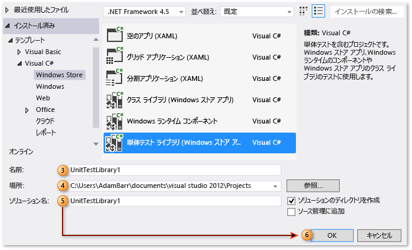
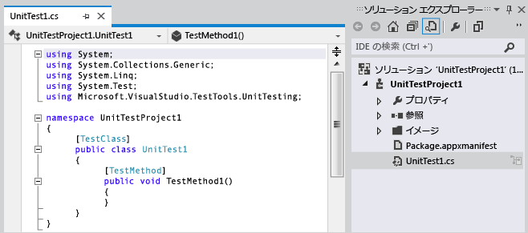
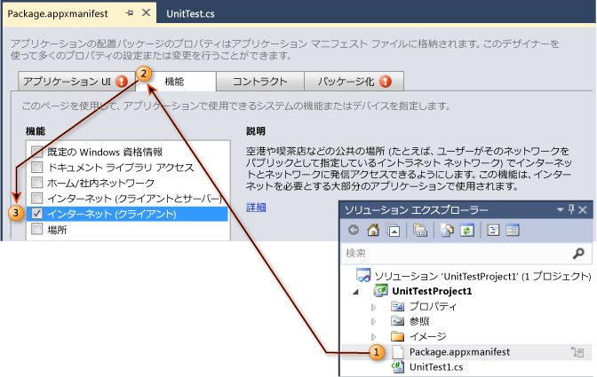
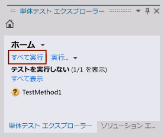
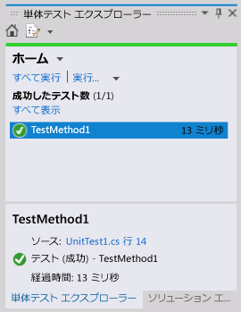

# チュートリアル: UWP アプリ用の単体テストの作成および実行

Visual Studio には、ユニバーサル Windows プラットフォーム (UWP) アプリの単体テストに対するサポートが含まれています。 これには、Visual C#、Visual Basic、Visual C++ 用の単体テスト ライブラリ テンプレートが含まれます。

> [!TIP]
> UWP アプリの開発の詳細については、[UWP アプリの概要](/windows/uwp/get-started/)に関するページを参照してください。

次の手順は、UWP アプリに対して、単体テストを作成、実行、デバッグする手順について説明します。

## UWP アプリの単体テスト プロジェクトを作成する

1.  **[ファイル]** メニューの **[新しいプロジェクト]** をクリックします。

     [新しいプロジェクト] ダイアログ ボックスが表示されます。

2.  テンプレートで、単体テストを作成するプログラミング言語を選択した後、関連する Windows ユニバーサルの単体テスト ライブラリを選択します。 たとえば、 **[Visual C#]**、**[Windows ユニバーサル]**、**[単体テスト ライブラリ (ユニバーサル Windows)]** の順に選択します。

3.  (省略可能) **[名前]** テキストボックスに、プロジェクトで使用する名前を入力します。

4.  (省略可能) **[位置]** テキストボックスに入力するか、**[参照]** ボタンを選択することにより、プロジェクトを作成する場所のパスを変更します。

5.  (省略可能) **[ソリューション]** 名テキストボックスに、ソリューションで使用する名前を入力します。

6.  **[ソリューションのディレクトリを作成]** をクリックしたまま、 **[OK]** をクリックします。

     

     ソリューション エクスプローラーに UWP 単体テスト プロジェクトが設定され、コード エディターに UnitTest1 という既定の単体テストが表示されます。

     

## 単体テスト プロジェクトの UWP アプリケーション マニフェスト ファイルを編集する

1.  ソリューション エクスプローラーで、*Package.appxmanifest* ファイルを右クリックし、**[開く]** を選択します。

     マニフェスト デザイナーが編集のために表示されます。

2.  マニフェスト デザイナーで、 **[機能]** タブをクリックします。

3.  **[機能]** リストで、単体テストを必要とする機能とコードを選択します。 たとえば、単体テストが必要で、テストするコードにインターネットにアクセスする機能が必要な場合は、 **[インターネット]** チェック ボックスをオンにします。

    > [!NOTE]
    > 選択する機能には、単体テストが正しく機能するために必要な機能だけが含まれる必要があります。

     

## UWP アプリの単体テストをコーディングする

コード エディターで、単体テストを編集し、テストに必要なアサートとロジックを追加します。

## 単体テストの実行

### ソリューションをビルドしテスト エクスプローラーを使用して単体テストを実行するには

1.  **[テスト]** メニューで **[Windows]** を選択し、 **[テスト エクスプローラー]** を選択します。

     テスト エクスプローラーが表示されます。テストは表示されません。

2.  **[ビルド]** メニューの **[ソリューションのビルド]** をクリックします。

     これで、単体テストが一覧に含まれます。

    > [!NOTE]
    > テスト エクスプローラーの単体テストの一覧を更新するソリューションをビルドする必要があります。

3.  テスト エクスプローラーで、作成した単体テストを選択します。

    > [!TIP]
    > テスト エクスプローラーでは、 **[ソース]** の横のソース コードへのリンクが表示されます。

4.  **[すべて実行]** をクリックします。

     

    > [!TIP]
    > エクスプローラーに一覧表示された 1 つ以上の単体テストを選択し、 **[選択したテストの実行]** を右クリックして選択します。
    >
    > また、 **[選択されたテストをデバッグ]**、 **[テストを開く]** をクリックし、 **[プロパティ]** オプションを使用できます。
    >
    > 

    単体テストが実行されます。 完了すると、テスト エクスプローラーは、テストの状態、経過時間、およびソースへのリンクを表示します。

    

## 関連項目

- [Visual Studio での UWP アプリのテスト](../test/testing-store-apps-with-visual-studio.md)
- [UWP アプリのビルドとテスト](/vsts/build-release/apps/windows/universal?tabs=vsts)
