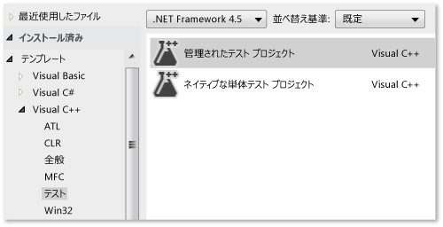
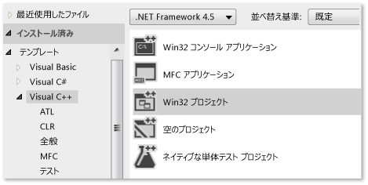
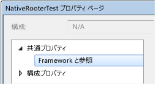
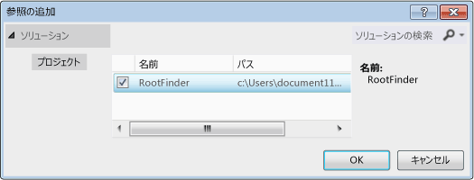
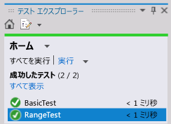

# <a name="writing-unit-tests-for-cc-with-the-microsoft-unit-testing-framework-for-c"></a>C++ 用の Microsoft 単体テスト フレームワークを使用した C++ 用単体テストの記述
Visual Studio では、C++ で記述されたアンマネージ コードの単体テストを作成できます。 アンマネージ コードは、ネイティブ コードとも呼ばれることがあります。  
  
 次の手順には、作業を開始するための重要な情報が含まれています。 以降のセクションでは、手順の詳細を説明するチュートリアルを記載しています。  
  
### <a name="to-write-unit-tests-for-an-unmanaged-code-dll"></a>アンマネージ コード DLL 用の単体テストを作成するには  
  
1.  **ネイティブ テスト プロジェクト** テンプレートを使用して、テスト用に別の Visual Studio プロジェクトを作成します。  
  
     プロジェクトには、サンプルのテスト コードが含まれています。  
  
2.  DLL をテスト プロジェクトにアクセスできるようにします。  
  
    -   DLL の外部アクセス可能な関数の宣言を含む `.h` ファイルを `#include` します。  
  
         `.h` ファイルには、`_declspec(dllimport)` でマークされた関数の宣言が含まれる必要があります。 代わりに、DEF ファイルを使用してメソッドをエクスポートすることができます。 詳細については、「[インポートとエクスポート](/cpp/build/importing-and-exporting)」を参照してください。  
  
         単体テストでは、テスト対象の DLL からエクスポートされた関数のみにアクセスできます。  
  
    -   DLL プロジェクトをテスト プロジェクトの参照に追加します。  
  
         テスト プロジェクトの **[プロパティ]** で、 **[共通プロパティ]**、 **[フレームワークと参照]**の順に展開し、 **[参照の追加]**をクリックします。  
  
3.  テスト プロジェクトで、TEST マクロと Assert クラスを使って、次の方法でテスト クラスとテスト メソッドを作成します。  
  
    ```cpp  
    #include "stdafx.h"  
    #include <CppUnitTest.h>  
    #include "..\MyProjectUnderTest\MyCodeUnderTest.h"  
    using namespace Microsoft::VisualStudio::CppUnitTestFramework;  
    TEST_CLASS(TestClassName)  
    {  
    public:  
      TEST_METHOD(TestMethodName)  
      {  
        // Run a function under test here.  
        Assert::AreEqual(expectedValue, actualValue, L"message", LINE_INFO());  
      }  
    }  
    ```  
  
    -   `Assert` には、テスト結果の確認に使用できるいくつかの静的関数が含まれます。  
  
    -   
          `LINE_INFO()` パラメーターは省略可能です。 PDB ファイルがない場合、テスト ランナーはエラーの発生場所を特定できます。  
  
    -   また、テストのセットアップおよびクリーンアップのメソッドを記述できます。 詳細については、 `TEST_METHOD` マクロの定義を開き、CppUnitTest.h 内のコメントをお読みください。  
  
    -   テスト クラスを入れ子にすることはできません。  
  
4.  テストを実行するには、テスト エクスプ ローラーを使用します。  
  
    1.  **[表示]** メニューで、 **[その他のウィンドウ]**、 **[テスト エクスプローラー]**の順にクリックします。  
  
    2.  Visual Studio ソリューションをビルドします。  
  
    3.  テスト エクスプローラーで **[すべて実行]**をクリックします。  
  
    4.  テスト エクスプ ローラーでテストを詳細に調査するには、  
  
        1.  テスト名を選択して、エラー メッセージとスタック トレースなどの詳細を表示します。  
  
        2.  (たとえばダブルクリックして) テスト名を開き、エラーの発生場所またはテスト コードに移動します。  
  
        3.  テストのショートカット メニューで、 **[選択したテストのデバッグ]** をクリックして、デバッガーでテストを実行します。  
  
##  <a name="walkthrough"></a> チュートリアル: テスト エクスプローラーによるアンマネージ DLL の開発  
 このチュートリアルを、自分の DLL の開発に適応させることができます。 基本的な手順は次のとおりです。  
  
1.  [ネイティブのテスト プロジェクトを作成する](#unitTestProject)。 テストは、開発中の DLL とは別のプロジェクト内に作成されます。  
  
2.  [DLL プロジェクトの作成](#createDllProject)。 このチュートリアルでは新しい DLL を作成しますが、既存の DLL をテストする手順は類似しています。  
  
3.  [DLL 関数をテストに表示させる](#coupleProjects)。  
  
4.  [テストを反復拡張する](#iterate)。 コードの開発がテストによって主導される「red-green-refactor」サイクルの使用をお勧めします。  
  
5.  [失敗したテストをデバッグする](#debug)。 テストをデバッグ モードで実行することができます。  
  
6.  [テストを変更しないままリファクタリングする](#refactor)。 リファクタリングとは、外部の動作を変更せずに、コードの構造を改善するという意味です。 リファクタリングを行うと、コードのパフォーマンス、拡張性、または読みやすさが向上します。 目的は動作を変更しないことであるため、コードへの変更をリファクタリングするときはテストを変更しないでください。 テストは、リファクタリング中にバグを持ち込んでいないことを確認するのに役立ちます。 そのため、テストをしなかった場合よりはるかに高い信頼性でこのような変更を行えます。  
  
7.  [カバレッジを確認する](https://msdn.microsoft.com/en-us/library/fc8hec9e.aspx)。 単体テストは、コードをより多く実行する場合はさらに有用です。 コードのどの部分がテストで使用されたかを見つけ出すことができます。  
  
8.  [外部リソースから単位を分離する](https://msdn.microsoft.com/library/hh549174.aspx)。 一般に、DLL は、他の DLL、データベース、またはリモートのサブシステムなど、開発中のシステムの他のコンポーネントに依存しています。 各単位をその依存関係から分離してテストすると役立ちます。 外部コンポーネントは、テストの実行を遅くする可能性があります。 開発中、他のコンポーネントが不完全であることもあり得ます。  
  
###  <a name="unitTestProject"></a> ネイティブ単体テスト プロジェクトを作成する  
  
1.  **[ファイル]** メニューで、 **[新規]**、 **[プロジェクト]**をクリックします。  
  
     ダイアログ ボックスで、 **[インストール済み]**、 **[テンプレート]**、 **[Visual C++]**、 **[テスト]**の順に展開します。  
  
     **ネイティブ テスト プロジェクト** テンプレートを選択します。  
  
     このチュートリアルでは、テスト プロジェクトの名前は `NativeRooterTest`です。  
  
       
  
2.  新しいプロジェクトで、 **unittest1.cpp**を検査します。  
  
       
  
     以下の点に注意してください。  
  
    -   各テストは `TEST_METHOD(YourTestName){...}` を使用して定義されます。  
  
         従来の関数の署名を記述する必要はありません。 署名は、マクロ TEST_METHOD によって作成されます。 マクロは、void を返すインスタンス関数を生成します。 また、テスト メソッドに関する情報を返す静的関数も生成します。 この情報により、テスト エクスプ ローラーはメソッドを見つけます。  
  
    -   テスト メソッドは、 `TEST_CLASS(YourClassName){...}`を使用してクラスにグループ化されます。  
  
         テストが実行されると、各テスト クラスのインスタンスが作成されます。 テスト メソッドが呼び出される順序は決まっていません。 各モジュール、クラス、またはメソッドの前後に呼び出される特殊なメソッドを定義することができます。  
  
3.  テストがテスト エクスプ ローラーで実行することを確認します。  
  
    1.  幾らかのテスト コードを挿入します。  
  
        ```cpp  
        TEST_METHOD(TestMethod1)  
        {  
        Assert::AreEqual(1,1);  
        }  
        ```  
  
         `Assert` クラスは、テスト メソッドで結果を確認するために使用するいくつかの静的メソッドを提供することに注意してください。  
  
    2.  **[テスト]** メニューで **[実行]** 、 **[すべてのテスト]**の順にクリックします。  
  
         テストがビルドし、実行します。  
  
         テスト エクスプローラーが表示されます。  
  
         **[合格したテスト]**の下にテストが表示されます。  
  
           
  
###  <a name="createDllProject"></a> アンマネージ DLL プロジェクトを作成する  
  
1.  **Win32 プロジェクト** テンプレートを使用して **Visual C++** プロジェクトを作成します。  
  
     このチュートリアルでは、プロジェクトの名前を `RootFinder`とします。  
  
       
  
2.  [Win32 アプリケーション ウィザード] で **[DLL]** と **[シンボルのエクスポート]** を選択します。  
  
     **[シンボルのエクスポート]** オプションは、エクスポートされたメソッドの宣言に使用できる便利なマクロを生成します。  
  
     ![[DLL] と [シンボルのエクスポート] が設定された C&#43;&#43; プロジェクト ウィザード](../test/media/utecpp06.png "UteCpp06")  
  
3.  プリンシパル .h ファイルでエクスポートされた関数を宣言します。  
  
       
  
     宣言子 `__declspec(dllexport)` は、クラスのパブリック メンバーと保護されるメンバーが DLL の外部で表示できるようにします。 詳細については、「 [Using dllimport and dllexport in C++ Classes](/cpp/cpp/using-dllimport-and-dllexport-in-cpp-classes)」を参照してください。  
  
4.  プリンシパル .cpp ファイルでは、最小限の本体を関数に追加します。  
  
    ```cpp  
    // Find the square root of a number.  
    double CRootFinder::SquareRoot(double v)  
    {  
      return 0.0;  
    }  
    ```  
  
###  <a name="coupleProjects"></a> DLL プロジェクトにテスト プロジェクトを結合する  
  
1.  DLL プロジェクトをテスト プロジェクトのプロジェクト参照に追加します。  
  
    1.  テスト プロジェクトのプロパティを開き、 **[共通プロパティ]**、 **[フレームワークと参照]**の順に選択します。  
  
           
  
    2.  **[新しい参照の追加]**をクリックします。  
  
         **[参照の追加]** ダイアログ ボックスで、DLL プロジェクトを選択し、 **[追加]**をクリックします。  
  
           
  
2.  プリンシパルの単体テストの .cpp ファイルに、DLL コードの .h ファイルを含めます。  
  
    ```cpp  
    #include "..\RootFinder\RootFinder.h"  
    ```  
  
3.  エクスポートされた関数を使用する基本テストを追加します。  
  
    ```cpp  
    TEST_METHOD(BasicTest)  
    {  
    CRootFinder rooter;  
    Assert::AreEqual(  
    // Expected value:  
    0.0,   
    // Actual value:  
    rooter.SquareRoot(0.0),   
    // Tolerance:  
    0.01,  
    // Message:  
    L"Basic test failed",  
    // Line number - used if there is no PDB file:  
    LINE_INFO());  
    }  
    ```  
  
4.  ソリューションをビルドします。  
  
     テスト エクスプ ローラーに新しいテストが表示されます。  
  
5.  テスト エクスプローラーで **[すべて実行]**をクリックします。  
  
       
  
 テストとコード プロジェクトをセット アップして、コード プロジェクトで関数を実行するテストを実行できることを確認しました。 ここで、実際のテストおよびコードの記述を開始できます。  
  
###  <a name="iterate"></a> テストを繰り返し増やして成功させる  
  
1.  新しいテストを追加します。  
  
    ```cpp  
    TEST_METHOD(RangeTest)  
    {  
      CRootFinder rooter;  
      for (double v = 1e-6; v < 1e6; v = v * 3.2)  
      {  
        double actual = rooter.SquareRoot(v*v);  
        Assert::AreEqual(v, actual, v/1000);  
      }  
    }  
    ```  
  
    > [!TIP]
    >  合格したテスト内容を変更しないことをお勧めします。 代わりに、新しいテストを追加し、テストが合格するようにコードを更新してから別のテストを追加する、という過程を繰り返します。  
    >   
    >  ユーザーが要件を変更したら、正しくなくなったテストを無効にします。 新しいテストを作成し、一度に 1 つずつ、同じ増分方式で処理するようにします。  
  
2.  ソリューションをビルドし、テスト エクスプ ローラーで **[すべて実行]**を選択します。  
  
     新しいテストは失敗します。  
  
       
  
    > [!TIP]
    >  各テストが記述した後すぐに失敗することを確認します。 これは、絶対に失敗しないテストを記述するという簡単なミスを避けることに役立ちます。  
  
3.  新しいテストが合格するように、テスト対象のコードを拡張します。  
  
    ```cpp  
    #include <math.h>  
    ...  
    double CRootFinder::SquareRoot(double v)  
    {  
      double result = v;  
      double diff = v;  
      while (diff > result/1000)  
      {  
        double oldResult = result;  
        result = result - (result*result - v)/(2*result);  
        diff = abs (oldResult - result);  
      }  
      return result;  
    }  
    ```  
  
4.  ソリューションをビルドし、テスト エクスプ ローラーで **[すべて実行]**を選択します。  
  
     両方のテストが合格します。  
  
       
  
    > [!TIP]
    >  一度に 1 つのテストを追加してコードを開発します。 各反復処理の後にすべてのテストが合格することを確認します。  
  
###  <a name="debug"></a> 失敗したテストをデバッグする  
  
1.  別のテストを追加します。  
  
    ```cpp  
  
    #include <stdexcept>  
    ...  
    // Verify that negative inputs throw an exception.  
    TEST_METHOD(NegativeRangeTest)  
    {  
      wchar_t message[200];  
      CRootFinder rooter;  
      for (double v = -0.1; v > -3.0; v = v - 0.5)  
      {  
        try   
        {  
          // Should raise an exception:  
          double result = rooter.SquareRoot(v);  
  
          _swprintf(message, L"No exception for input %g", v);  
          Assert::Fail(message, LINE_INFO());  
        }  
        catch (std::out_of_range ex)  
        {  
          continue; // Correct exception.  
        }  
        catch (...)  
        {  
          _swprintf(message, L"Incorrect exception for %g", v);  
          Assert::Fail(message, LINE_INFO());  
        }  
      }  
    }  
    ```  
  
2.  ソリューションをビルドし、 **[すべて実行]**をクリックします。  
  
3.  失敗したテストを開きます (またはダブルクリックします)。  
  
     失敗したアサーションが強調表示されます。 エラー メッセージは、テスト エクスプ ローラーの [詳細] ウィンドウに表示されます。  
  
       
  
4.  テストが失敗した理由を表示するには、関数をステップ実行します。  
  
    1.  SquareRoot 関数の始めに、ブレークポイントを設定します。  
  
    2.  失敗したテストのショートカット メニューで **[選択したテストのデバッグ]**をクリックします。  
  
         実行がブレークポイントで停止したら、コードをステップ実行します。  
  
5.  開発中の関数にコードを挿入します。  
  
    ```cpp  
  
    #include <stdexcept>  
    ...  
    double CRootFinder::SquareRoot(double v)  
    {  
        // Validate parameter:  
        if (v < 0.0)   
        {  
          throw std::out_of_range("Can't do square roots of negatives");  
        }  
  
    ```  
  
6.  今回は、すべてのテストに合格します。  
  
       
  
> [!TIP]
>  個々のテストに実行順序を定める依存関係がない場合、ツール バーにある  トグル ボタンで並列テストの実行を有効にします。 これにより、すべてのテスト実行にかかる時間を著しく短縮できます。  
  
###  <a name="refactor"></a> テストを変更せずにコードをリファクタリングする  
  
1.  SquareRoot 関数の中心的な計算を簡素化します。  
  
    ```  
    // old code:  
    //   result = result - (result*result - v)/(2*result);  
    // new code:  
         result = (result + v/result)/2.0;  
  
    ```  
  
2.  ソリューションをビルドし、 **[すべて実行]**をクリックして、エラーが持ち込まれていないことを確認します。  
  
    > [!TIP]
    >  一連の単体テストがうまくいくことは、コードを変更する際にバグが持ち込まれていないという信用を与えます。  
    >   
    >  常に他の変更とは別にリファクタリングしてください。  
  
## <a name="next-steps"></a>次の手順  
  
-   **分離。** ほとんどの DLL は、データベースや他の DLL など、他のサブシステムに依存しています。 これらの他のコンポーネントは、多くの場合、並列で開発されます。 他のコンポーネントがまだ使用可能でないときに単体テストを行えるようにするには、モックまたは  
  
-   **ビルド確認テスト。** 設定された間隔で、チームのビルド サーバーでテストを実行することができます。 これにより、複数のチーム メンバーの作業が統合されてもバグが持ち込まれることはありません。  
  
-   **チェックイン テスト。** 各チーム メンバーがコードをソース管理にチェックインする前にテストを実行することを要求できます。 通常、これはビルド確認テストの完全なセットのサブセットです。  
  
     また、最低限のコード カバレッジも要求できます。  
  
## <a name="see-also"></a>関連項目  
 [既存の C++ アプリケーションへの単体テストの追加](../test/unit-testing-existing-cpp-applications-with-test-explorer.md)   
 [Microsoft.VisualStudio.TestTools.CppUnitTestFramework の使用](../test/using-microsoft-visualstudio-testtools-cppunittestframework.md)   
 [マネージ/アンマネージ コードの相互運用性の概要](http://msdn.microsoft.com/library/ms973872.aspx)   
 [ネイティブ コードのデバッグ](../debugger/debugging-native-code.md)   
 [チュートリアル: ダイナミック リンク ライブラリの作成と使用 (C++)](/cpp/build/walkthrough-creating-and-using-a-dynamic-link-library-cpp)   
 [インポートとエクスポート](/cpp/build/importing-and-exporting)

