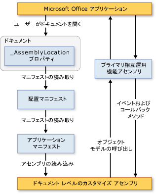

# ドキュメント レベルのカスタマイズのアーキテクチャ
  [!INCLUDE[vs_dev12](../vsto/includes/vs-dev12-md.md)] には、Microsoft Office Word および Microsoft Office Excel のドキュメント レベルのカスタマイズを作成するためのプロジェクトが含まれています。 ここでは、ドキュメント レベルのカスタマイズの次の側面について説明します。  
  
-   [カスタマイズについて](#UnderstandingCustomizations)  
  
-   [カスタマイズのコンポーネント](#Components)  
  
-   [カスタマイズと Microsoft Office アプリケーションの連携](#HowCustomizationsWork)  
  
 [!INCLUDE[appliesto_alldoc](../vsto/includes/appliesto-alldoc-md.md)]  
  
 ドキュメント レベルのカスタマイズの作成の概要については、「[Office ソリューションの開発の概要 &#40;VSTO&#41;](../vsto/office-solutions-development-overview-vsto.md)」、「[Word 用のドキュメント レベルのカスタマイズのプログラミングについて](../vsto/getting-started-programming-document-level-customizations-for-word.md)」および「[Excel のドキュメント レベルのカスタマイズのプログラミングの概要](../vsto/getting-started-programming-document-level-customizations-for-excel.md)」をご覧ください。  
  
##   カスタマイズについて  
 Visual Studio の Office 開発ツールを使用してドキュメント レベルのカスタマイズをビルドする場合は、特定の文書に関連付けられたマネージ コード アセンブリを作成します。 アセンブリがリンクされている文書やブックは、マネージ コード拡張機能がある、と言い表されます。 詳細については、「[Office ソリューションのデザインと作成](../vsto/designing-and-creating-office-solutions.md)」を参照してください。  
  
 ユーザーがドキュメントを開くと、Microsoft Office アプリケーションによってアセンブリが読み込まれます。 アセンブリが読み込まれると、ドキュメントが開いている間、カスタマイズはイベントに応答できます。 また、ドキュメントが開いている間、カスタマイズはオブジェクト モデルを呼び出し、アプリケーションを自動化して拡張することもできます。[!INCLUDE[dnprdnshort](../sharepoint/includes/dnprdnshort-md.md)] 内の任意のクラスを使用することも可能です。  
  
 アセンブリは、アプリケーションのプライマリ相互運用機能アセンブリを介してアプリケーションの COM コンポーネントとの通信を行います。 詳細については、次のトピックを参照してください。[Office プライマリ相互運用機能アセンブリ](../vsto/office-primary-interop-assemblies.md) および[Office ソリューションの開発の概要 &#40;VSTO&#41;](../vsto/office-solutions-development-overview-vsto.md).  
  
 複数のドキュメント レベルのカスタマイズを同時に開くと、各アセンブリは異なるアプリケーション ドメインに読み込まれます。 このため、1 つのソリューションが正しく動作しない場合でも、それが原因で他のソリューションにエラーが発生することはありません。 ドキュメント レベルのカスタマイズは、1 つのアプリケーション ドメイン内の 1 つのドキュメントと連携するように設計されています。 ドキュメント間のやり取りに対応するようには設計されていません。 アプリケーション ドメインについて詳しくは、「[アプリケーション ドメイン](../Topic/Application%20Domains.md)」をご覧ください。  
  
> [!NOTE]  
>  Visual Studio の Office 開発ツールを使用して作成するドキュメント レベルのカスタマイズは、エンド ユーザーがアプリケーションを起動したときのみ使用されることを目的としています。 アプリケーションがプログラムで起動された場合 \(オートメーション機能を使用する場合など\)、カスタマイズは予期したとおりに動作しないことがあります。  
  
### デザイン時と実行時のエクスペリエンス  
 ドキュメント レベルのカスタマイズのアーキテクチャを理解すると、ソリューションのデザイン時と実行時におけるエクスペリエンスについて理解を深めることができます。  
  
#### デザイン時  
 デザイン時のエクスペリエンスには、次のような手順が含まれます。  
  
1.  開発者は、ドキュメント レベルのプロジェクトを [!INCLUDE[vsprvs](../sharepoint/includes/vsprvs-md.md)] で作成します。 このプロジェクトには、ドキュメントと、ドキュメントとは分離して実行されるアセンブリが組み込まれます。 ドキュメントは既に存在している \(設計者によって作成済み\) 場合もあります。また、プロジェクトと共に新しいドキュメントを作成することもできます。  
  
2.  設計者 \(プロジェクトを作成する開発者、または他のユーザーのいずれか\) は、エンド ユーザー向けにドキュメントの最終的な外観を仕上げます。  
  
#### 実行時  
 実行時のエクスペリエンスには、次のような手順が含まれます。  
  
1.  エンド ユーザーが、マネージ コード拡張機能を実装している文書またはブックを開きます。  
  
2.  文書またはブックにより、コンパイルされたアセンブリが読み込まれます。  
  
3.  ユーザーが文書またはブックで操作すると、アセンブリがイベントに応答します。  
  
#### 開発者とエンド ユーザーの立場の違い  
 開発者は主に [!INCLUDE[vsprvs](../sharepoint/includes/vsprvs-md.md)] で作業を行い、エンド ユーザーは Word または Excel で作業を行うため、ドキュメント レベルのカスタマイズを理解するには、次に示す 2 つの視点に立つことが必要です。  
  
|開発者の視点|エンド ユーザーの視点|  
|------------|-----------------|  
|開発者は [!INCLUDE[vsprvs](../sharepoint/includes/vsprvs-md.md)] を使用して、Word および Excel にアクセス可能なコードを記述します。   Word または Excel を実行する実行可能ファイルを作成しているように思えますが、実際の処理は別の方法で行われます。 ドキュメントにはアセンブリが関連付けられており、そのアセンブリへのポインターが含まれています。 ドキュメントを開くと、Word または Excel はアセンブリを検索し、すべてのイベント処理に呼応して動作します。|ソリューションを使用するには、他の Microsoft Office ファイルを開く場合と同様に、文書またはブックを開く \(または、テンプレートから新しいドキュメントを作成する\) だけです。   アセンブリにより、文書またはブックをカスタマイズできます。たとえば、現在のデータを基に文書やブックを自動生成したり、情報の入力を求めるダイアログ ボックスを表示したりできます。|  
  
### ドキュメント レベルのカスタマイズでサポートされているドキュメント形式  
 カスタマイズ プロジェクトを作成するときには、プロジェクト内で使用するドキュメントの形式を選択できます。 詳細については、「[方法: Visual Studio で Office プロジェクトを作成する](../vsto/how-to-create-office-projects-in-visual-studio.md)」を参照してください。  
  
 Excel および Word のドキュメント レベルのカスタマイズで使用可能なドキュメント形式を、次の表に示します。  
  
|Excel|Word|  
|-----------|----------|  
|Excel ブック \(.xlsx\)   Excel マクロ有効ブック \(.xlsm\)   Excel バイナリ ブック \(.xlsb\)   Excel 97 ～ Excel 2003 のブック \(.xls\)   Excel テンプレート \(.xltx\)   Excel マクロ有効テンプレート \(.xltm\)   Excel 97 ～ Excel 2003 のテンプレート \(.xlt\)|Word 文書 \(.docx\)   Word マクロ有効文書 \(.docm\)   Word 97 ～ Word 2003 の文書 \(.doc\)   Word テンプレート \(.dotx\)   Word マクロ有効テンプレート \(.dotm\)   Word 97 ～ Word 2003 のテンプレート \(.dot\)|  
  
 サポートされている形式のドキュメントに対してだけ、マネージ コード拡張機能を設計する必要があります。 そうしないと、アプリケーションでドキュメントを開くときに、特定のイベントが発生しない可能性があります。 たとえば、Excel XML スプレッドシート形式または Web ページ \(.htm、.html\) 形式で保存されたブックでマネージ コード拡張機能を使用すると、<xref:Microsoft.Office.Tools.Excel.Workbook.Open> イベントは発生しません。  
  
### .xml ファイル名拡張子を持つ Word 文書のサポート  
 ドキュメント レベルのプロジェクト テンプレートを使用して、次のファイル形式に基づくプロジェクトを作成することはできません。  
  
-   Word XML 文書 \(\*xml\)  
  
-   Word 2003 XML 文書 \(\*xml\)  
  
 エンド ユーザーがこれらのファイル形式でカスタマイズを使用できるようにするには、前の表に示した、サポートされているいずれかのファイル形式に基づくカスタマイズを作成して配置します。 このカスタマイズをインストールすると、エンド ユーザーは文書を Word XML ドキュメント \(\*xml\) 形式または Word 2003 XML ドキュメント \(\*xml\) 形式で保存できます。カスタマイズは、引き続き、予期したとおりに動作します。  
  
##   カスタマイズのコンポーネント  
 カスタマイズの主要なコンポーネントは、ドキュメントとアセンブリです。 これらのコンポーネントに加えて、Microsoft Office アプリケーションがカスタマイズを検出して読み込むときに重要な役割を果たすものがあります。  
  
### 配置マニフェストとアプリケーション マニフェスト  
 カスタマイズは、配置マニフェストとアプリケーション マニフェストを使用して、最新バージョンのカスタマイズ アセンブリを特定し、読み込みます。 配置マニフェストは、最新のアプリケーション マニフェストを指します。 アプリケーション マニフェストは、カスタマイズ アセンブリを指し、エントリ ポイント クラス \(1 つまたは複数のクラス\) を指定して、アセンブリ内で実行します。 詳細については、「[Office ソリューションにおけるアプリケーション マニフェストと配置マニフェスト](../vsto/application-and-deployment-manifests-in-office-solutions.md)」を参照してください。  
  
### Visual Studio Tools for Office ランタイム  
 Visual Studio の Office 開発ツールを使用して作成したドキュメント レベルのカスタマイズを実行するには、エンド ユーザーのコンピューターに [!INCLUDE[vsto_runtime](../vsto/includes/vsto-runtime-md.md)] がインストールされている必要があります。[!INCLUDE[vsto_runtime](../vsto/includes/vsto-runtime-md.md)] には、カスタマイズ アセンブリを読み込むアンマネージ コンポーネントが含まれています。また、一連のマネージ アセンブリも含まれています。 これらのマネージ アセンブリにより、カスタマイズ コードがホスト アプリケーションを自動化して拡張するために使用するオブジェクト モデルが提供されます。  
  
 詳細については、「[Visual Studio Tools for Office Runtime の概要](../vsto/visual-studio-tools-for-office-runtime-overview.md)」を参照してください。  
  
##   カスタマイズと Microsoft Office アプリケーションの連携  
 ユーザーが Microsoft Office カスタマイズの一部であるドキュメントを開くと、アプリケーションはそのドキュメントにリンクされている配置マニフェストを使用して、最新バージョンのカスタマイズ アセンブリを特定し、読み込みます。 配置マニフェストの場所は、\_AssemblyLocation というカスタム ドキュメント プロパティに格納されています。 この場所を示す文字列は、ソリューションをビルドするときにプロパティに挿入されます。  
  
 配置マニフェストはアプリケーション マニフェストを指し、アプリケーション マニフェストは最新のアセンブリを指します。 詳細については、「[Office ソリューションにおけるアプリケーション マニフェストと配置マニフェスト](../vsto/application-and-deployment-manifests-in-office-solutions.md)」を参照してください。  
  
 ドキュメント レベルのカスタマイズに関する基本アーキテクチャを、次の図に示します。  
  
   
  
> [!NOTE]  
>  [!INCLUDE[net_v40_short](../sharepoint/includes/net-v40-short-md.md)] を対象とする Office ソリューションでは、ソリューションはプライマリ相互運用機能アセンブリ \(PIA: Primary Interop Assembly\) を直接呼び出す代わりに、ソリューション アセンブリに埋め込まれた PIA 型情報を使用してホスト アプリケーションのオブジェクト モデルを呼び出します。 詳細については、「[Office ソリューションのデザインと作成](../vsto/designing-and-creating-office-solutions.md)」を参照してください。  
  
### 読み込みプロセス  
 ユーザーが Microsoft Office ソリューションの一部であるドキュメントを開くと、次の処理が実行されます。  
  
1.  Microsoft Office アプリケーションはカスタム ドキュメント プロパティをチェックして、そのドキュメントに関連付けられているマネージ コード拡張機能があるかどうかを調べます。 詳細については、「[カスタム ドキュメント プロパティの概要](../vsto/custom-document-properties-overview.md)」を参照してください。  
  
2.  マネージ コード拡張機能がある場合、アプリケーションは VSTOEE.dll を読み込みます。VSTOEE.dll によって、VSTOLoader.dll が読み込まれます。 これらは、Visual Studio 2010 Tools for Office Runtime のローダー コンポーネントであるアンマネージ DLL です。 詳細については、「[Visual Studio Tools for Office Runtime の概要](../vsto/visual-studio-tools-for-office-runtime-overview.md)」を参照してください。  
  
3.  VSTOLoader.dll は [!INCLUDE[dnprdnshort](../sharepoint/includes/dnprdnshort-md.md)] を読み込み、[!INCLUDE[vsto_runtime](../vsto/includes/vsto-runtime-md.md)] のマネージ部分を起動します。  
  
4.  ドキュメントがローカル コンピューター以外の場所から開かれている場合、[!INCLUDE[vsto_runtime](../vsto/includes/vsto-runtime-md.md)] は、該当する Office アプリケーション用に設定された **\[セキュリティ センターの設定\]** の **\[信頼できる場所\]** の一覧にドキュメントの場所が載っていることを確認します。 ドキュメントの場所が信頼できる場所でない場合、カスタマイズは信頼されず、読み込みプロセスはここで停止します。  
  
5.  [!INCLUDE[vsto_runtime](../vsto/includes/vsto-runtime-md.md)] は、ソリューションをインストールし \(まだインストールされていない場合\)、最新のアプリケーション マニフェストと配置マニフェストをダウンロードし、一連のセキュリティ チェックを実行します。 詳細については、「[Office ソリューションのセキュリティ保護](../vsto/securing-office-solutions.md)」を参照してください。  
  
6.  カスタマイズを信頼して実行できる場合、[!INCLUDE[vsto_runtime](../vsto/includes/vsto-runtime-md.md)] は配置マニフェストとアプリケーション マニフェストを使用して、アセンブリの更新をチェックします。 利用できる新しいバージョンのアセンブリが存在する場合、ランタイムは、クライアント コンピューターの [!INCLUDE[ndptecclick](../vsto/includes/ndptecclick-md.md)] キャッシュに新しいバージョンのアセンブリをダウンロードします。 詳細については、「[Office ソリューションの配置](../vsto/deploying-an-office-solution.md)」を参照してください。  
  
7.  [!INCLUDE[vsto_runtime](../vsto/includes/vsto-runtime-md.md)] は、カスタマイズ アセンブリを読み込むときに使用する、新しいアプリケーション ドメインを作成します。  
  
8.  [!INCLUDE[vsto_runtime](../vsto/includes/vsto-runtime-md.md)] は、カスタマイズ アセンブリをアプリケーション ドメインに読み込みます。  
  
9. [!INCLUDE[vsto_runtime](../vsto/includes/vsto-runtime-md.md)] は、カスタマイズ アセンブリ内の **Startup** イベント ハンドラーを呼び出します。 詳細については、「[Office プロジェクトのイベント](../vsto/events-in-office-projects.md)」を参照してください。  
  
## 参照  
 [Visual Studio の Office ソリューションのアーキテクチャ](../vsto/architecture-of-office-solutions-in-visual-studio.md)   
 [VSTO アドインのアーキテクチャ](../vsto/architecture-of-vsto-add-ins.md)   
 [Visual Studio Tools for Office Runtime の概要](../vsto/visual-studio-tools-for-office-runtime-overview.md)   
 [Office ソリューションのセキュリティ保護](../vsto/securing-office-solutions.md)   
 [Office ソリューションのデザインと作成](../vsto/designing-and-creating-office-solutions.md)   
 [カスタム ドキュメント プロパティの概要](../vsto/custom-document-properties-overview.md)   
 [ドキュメント レベルのカスタマイズのキャッシュ データ](../vsto/cached-data-in-document-level-customizations.md)  
  
  