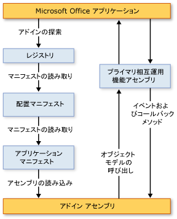

# VSTO アドインのアーキテクチャ
  Visual Studio の Office Developer Tools を使用して作成される VSTO アドインには、安定性とセキュリティを重視するアーキテクチャ上の特性があり、Microsoft Office と密接に連携させることができます。 このトピックでは、VSTO アドインの次の点について説明します。  
  
- [VSTO アドインを理解します。](#UnderstandingAddIns)  
  
- [VSTO アドインのコンポーネント](#AddinComponents)  
  
- [VSTO アドインと Microsoft Office アプリケーションの連携](#HowAddinsWork)  
  
  [!INCLUDE[appliesto_allapp](../vsto/includes/appliesto-allapp-md.md)]  
  
  VSTO アドインの作成の概要については、次を参照してください。 [Office ソリューション開発の概要&#40;VSTO&#41; ](../vsto/office-solutions-development-overview-vsto.md)と[VSTO アドインのプログラミングを始める](../vsto/getting-started-programming-vsto-add-ins.md)します。  
  
##   VSTO アドインを理解します。  
 VSTO アドインをビルドする Visual Studio で Office developer tools を使用する場合は、Microsoft Office アプリケーションによって読み込まれるマネージ コード アセンブリを作成します。 アセンブリが読み込まれると、VSTO アドインがアプリケーションで発生するイベント (ユーザーがメニュー項目をクリックした場合など) に応答できます。 また、VSTO アドインはオブジェクト モデルを呼び出して、アプリケーションの自動化や拡張を行うこともでき、さらに [!INCLUDE[dnprdnshort](../sharepoint/includes/dnprdnshort-md.md)]のすべてのクラスも使用できます。  
  
 アセンブリは、アプリケーションのプライマリ相互運用機能アセンブリを介してアプリケーションの COM コンポーネントとの通信を行います。 詳細については、次を参照してください。 [Office プライマリ相互運用機能アセンブリ](../vsto/office-primary-interop-assemblies.md)と[Office ソリューション開発の概要&#40;VSTO&#41;](../vsto/office-solutions-development-overview-vsto.md)します。  
  
 アプリケーションに複数の VSTO アドインがインストールされている場合、それぞれの VSTO アドインは異なるアプリケーション ドメインに読み込まれます。 つまり、正しく動作しない 1 つの VSTO アドインが原因で他の VSTO アドインでエラーが発生することはありません。 また、アプリケーションが閉じられた場合に、すべての VSTO アドイン アセンブリを確実にメモリからアンロードするためにも役立ちます。 アプリケーション ドメインの詳細については、次を参照してください。[アプリケーション ドメイン](/dotnet/framework/app-domains/application-domains)します。  
  
> [!NOTE]  
>  Visual Studio の Office Developer Tools を使用して作成する VSTO アドインは、エンド ユーザーがホストの Microsoft Office アプリケーションを起動したときにのみ使用されることを目的としています。 アプリケーションがプログラムで起動された場合 (オートメーション機能を使用して起動される場合など)、VSTO アドインが予期したとおりに動作しないことがあります。  
  
##   VSTO アドインのコンポーネント  
 VSTO アドイン アセンブリは主要なコンポーネントですが、Microsoft Office アプリケーションが VSTO アドインを検出して読み込む動作において重要な役割を果たすコンポーネントが他にもいくつかあります。  
  
### レジストリ エントリ  
 Microsoft Office アプリケーションは、一連のレジストリ エントリを検索して VSTO アドインを検出します。 VSTO アドインで使用されるレジストリ エントリの完全な一覧を参照してください。 [VSTO アドインのレジストリ エントリ](../vsto/registry-entries-for-vsto-add-ins.md)します。  
  
 ソリューションをビルドすると、Visual Studio によって開発用コンピューター上に必要なレジストリ エントリがすべて作成されるので、VSTO アドインをデバッグして実行することができます。 詳細については、次を参照してください。[ビルドの Office ソリューション](../vsto/building-office-solutions.md)します。  
  
 ClickOnce を使用してソリューションを展開する場合、発行プロセスによって自動的に生成されたセットアップ プログラムは、エンドユーザーのコンピューターにレジストリ キーを作成します。 詳細については、次を参照してください。 [ClickOnce を使用して Office ソリューションを配置](../vsto/deploying-an-office-solution-by-using-clickonce.md)します。  
  
### 配置マニフェストとアプリケーション マニフェスト  
 VSTO アドインは配置マニフェストとアプリケーション マニフェストを使用して、最新バージョンの VSTO アドイン アセンブリを特定して読み込みます。 配置マニフェストは、最新のアプリケーション マニフェストを指します。 アプリケーション マニフェストは、VSTO アドイン アセンブリを指し、アセンブリ内で実行するエントリ ポイント クラスを指定します。 詳細については、次を参照してください。 [Office ソリューションでのアプリケーションと展開マニフェスト](../vsto/application-and-deployment-manifests-in-office-solutions.md)します。  
  
### Visual Studio Tools for Office ランタイム  
 Visual Studio での Office developer tools を使用して作成した VSTO アドインを実行するエンドユーザーのコンピューターがいる必要があります、[!INCLUDE[vsto_runtime](../vsto/includes/vsto-runtime-md.md)]をインストールします。 ランタイムには、アンマネージド コンポーネントと一連のマネージド アセンブリが含まれています。 アンマネージ コンポーネントは、VSTO アドイン アセンブリを読み込みます。 マネージド アセンブリにより、VSTO アドイン コードがホスト アプリケーションを自動化して拡張するために使用するオブジェクト モデルが提供されます。  
  
 詳細については、次を参照してください。 [Visual Studio Tools for Office runtime の概要](../vsto/visual-studio-tools-for-office-runtime-overview.md)します。  
  
##   Microsoft Office アプリケーションで VSTO アドインの機能  
 ユーザーが Microsoft Office アプリケーションを起動すると、アプリケーションは配置マニフェストとアプリケーション マニフェストを使用して、最新バージョンの VSTO アドイン アセンブリを特定して読み込みます。 これらの VSTO アドインの基本アーキテクチャを、次の図に示します。  
  
   
  
> [!NOTE]  
>  [!INCLUDE[net_v40_short](../sharepoint/includes/net-v40-short-md.md)] または [!INCLUDE[net_v45](../vsto/includes/net-v45-md.md)]を対象とする Office ソリューションでは、PIA を直接呼び出す代わりに、ソリューション アセンブリに埋め込まれた PIA 型情報を使用してホスト アプリケーションのオブジェクト モデルを呼び出します。 詳細については、次を参照してください。[デザイン Office ソリューションの作成と](../vsto/designing-and-creating-office-solutions.md)します。  
  
### 読み込みプロセス  
 ユーザーがアプリケーションを起動すると、次のステップが実行されます。  
  
1.  アプリケーションは、Visual Studio の Office Developer Tools を使用して作成された VSTO アドインを特定するエントリのレジストリをチェックします。  
  
2.  アプリケーションは、これらのレジストリ エントリを検出すると、VSTOEE.dll を読み込みます。これにより、VSTOLoader.dll が読み込まれます。 これらは、Visual Studio 2010 Tools for Office Runtime のローダー コンポーネントであるアンマネージ DLL です。 詳細については、次を参照してください。 [Visual Studio Tools for Office runtime の概要](../vsto/visual-studio-tools-for-office-runtime-overview.md)します。  
  
3.  *VSTOLoader.dll*読み込みます、[!INCLUDE[dnprdnshort](../sharepoint/includes/dnprdnshort-md.md)]のマネージ部分を起動し、[!INCLUDE[vsto_runtime](../vsto/includes/vsto-runtime-md.md)]します。  
  
4.  [!INCLUDE[vsto_runtime](../vsto/includes/vsto-runtime-md.md)] はマニフェストの更新をチェックして、最新のアプリケーション マニフェストと配置マニフェストをダウンロードします。  
  
5.  [!INCLUDE[vsto_runtime](../vsto/includes/vsto-runtime-md.md)] は、一連のセキュリティ チェックを実行します。 詳細については、次を参照してください。[セキュリティで保護された Office ソリューション](../vsto/securing-office-solutions.md)します。  
  
6.  VSTO アドインを信頼して実行できる場合、 [!INCLUDE[vsto_runtime](../vsto/includes/vsto-runtime-md.md)] は配置マニフェストとアプリケーション マニフェストを使用して、アセンブリの更新をチェックします。 利用できる新しいバージョンのアセンブリが存在する場合、ランタイムは、クライアント コンピューターの [!INCLUDE[ndptecclick](../vsto/includes/ndptecclick-md.md)] キャッシュに新しいバージョンのアセンブリをダウンロードします。 詳細については、次を参照してください。 [Office ソリューションを配置](../vsto/deploying-an-office-solution.md)します。  
  
7.  [!INCLUDE[vsto_runtime](../vsto/includes/vsto-runtime-md.md)] は、VSTO アドイン アセンブリの読み込み先となる新しいアプリケーション ドメインを作成します。  
  
8.  [!INCLUDE[vsto_runtime](../vsto/includes/vsto-runtime-md.md)] は、VSTO アドイン アセンブリをそのアプリケーション ドメインに読み込みます。  
  
9. [!INCLUDE[vsto_runtime](../vsto/includes/vsto-runtime-md.md)] は、VSTO アドインの <xref:Microsoft.Office.Tools.AddInBase.RequestComAddInAutomationService%2A> メソッドを呼び出します (このメソッドがオーバーライドされている場合)。  
  
     必要に応じて、このメソッドをオーバーライドして、VSTO アドイン内のオブジェクトを他の Microsoft Office ソリューションに公開できます。 詳細については、次を参照してください。[他の Office ソリューションから VSTO アドイン内のコードを呼び出す](../vsto/calling-code-in-vsto-add-ins-from-other-office-solutions.md)します。  
  
10. [!INCLUDE[vsto_runtime](../vsto/includes/vsto-runtime-md.md)] は、VSTO アドインの <xref:Microsoft.Office.Tools.AddInBase.RequestService%2A> メソッドを呼び出します (このメソッドがオーバーライドされている場合)。  
  
     必要に応じて、このメソッドをオーバーライドして、機能拡張インターフェイスを実装するオブジェクトを返すことで Microsoft Office 機能を公開できます。 詳細については、次を参照してください。[機能拡張インターフェイスによる UI のカスタマイズ機能](../vsto/customizing-ui-features-by-using-extensibility-interfaces.md)します。  
  
    > [!NOTE]  
    >  [!INCLUDE[vsto_runtime](../vsto/includes/vsto-runtime-md.md)] は、ホスト アプリケーションでサポートされている機能拡張インターフェイスごとに、 <xref:Microsoft.Office.Tools.AddInBase.RequestService%2A> メソッドを呼び出します。 <xref:Microsoft.Office.Tools.AddInBase.RequestService%2A> メソッドの最初の呼び出しは、通常、 `ThisAddIn_Startup` メソッド呼び出しの前に実行されますが、 <xref:Microsoft.Office.Tools.AddInBase.RequestService%2A> メソッドが呼び出される時点や回数について、推測に基づいて VSTO アドインを作成してはいけません。  
  
11. [!INCLUDE[vsto_runtime](../vsto/includes/vsto-runtime-md.md)] は VSTO アドインの `ThisAddIn_Startup` メソッドを呼び出します。 このメソッドは、 <xref:Microsoft.Office.Tools.AddInBase.Startup> イベントの既定のイベント ハンドラーです。 詳細については、次を参照してください。 [Office プロジェクト内のイベント](../vsto/events-in-office-projects.md)します。  
  
## 関連項目  
 [Visual Studio での Office ソリューションのアーキテクチャ](../vsto/architecture-of-office-solutions-in-visual-studio.md)   
 [ドキュメント レベルのカスタマイズのアーキテクチャ](../vsto/architecture-of-document-level-customizations.md)   
 [Visual Studio のツール for Office runtime の概要](../vsto/visual-studio-tools-for-office-runtime-overview.md)   
 [VSTO アドインをプログラミングします。](../vsto/programming-vsto-add-ins.md)   
 [Office ソリューションを開発します。](../vsto/developing-office-solutions.md)   
 [セキュリティで保護された Office ソリューション](../vsto/securing-office-solutions.md)   
 [Office ソリューションをデプロイします。](../vsto/deploying-an-office-solution.md)  
  
  