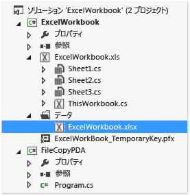
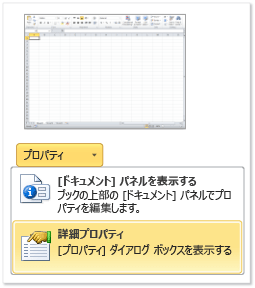

# <a name="deploy-an-office-solution-by-using-clickonce"></a>ClickOnce を使用して Office ソリューションを配置します。
  ClickOnce を使用する場合は、少しの手順で Office ソリューションを配置できます。 更新プログラムを発行する場合は、ソリューションはそれらを自動的に検出してインストールします。 ただし、ClickOnce を使用する場合は、コンピューターのユーザーごとに、ソリューションを個別にインストールする必要があります。 Windows インストーラーを使用してそのため、検討 (*.msi*) 場合は、複数のユーザーは同じコンピューターにソリューションを実行します。

## <a name="in-this-topic"></a>このトピックの内容

- [ソリューションを発行します。](#Publish)

- [ソリューションに信頼を付与する方法を決定します。](#Trust)

- [ユーザー ソリューションのインストールの支援します。](#Helping)

- [ソリューションのドキュメントをエンドユーザーのコンピューター (ドキュメント レベルのカスタマイズのみ) に配置します。](#Put)

- [ソリューションのドキュメント (ドキュメント レベルのカスタマイズのみ) SharePoint を実行しているサーバーに配置します。](#SharePoint)

- [カスタム インストーラーを作成します。](#Custom)

- [更新プログラムを発行します。](#Update)

- [ソリューションのインストール場所を変更します。](#Location)

- [ソリューションを以前のバージョンにロールバックします。](#Roll)

  Windows インストーラー ファイルを作成して Office ソリューションをデプロイする方法の詳細については、次を参照してください。 [Windows インストーラーを使用して Office ソリューションを配置](../vsto/deploying-an-office-solution-by-using-windows-installer.md)します。

##  <a name="Publish"></a> ソリューションを発行します。
 使用してソリューションを発行することができます、**発行ウィザード**または**プロジェクト デザイナー**します。 この手順で使用する、**プロジェクト デザイナー**パブリッシング オプションの完全なセットを提供するためです。 参照してください[発行ウィザード&#40;Visual Studio での Office 開発&#41;](../vsto/publish-wizard-office-development-in-visual-studio.md)します。

#### <a name="to-publish-the-solution"></a>ソリューションを発行するには

1. **ソリューション エクスプ ローラー**プロジェクトの名前はノードを選択します。

2. メニュー バーで、**プロジェクト**、 *ProjectName* **プロパティ**します。

3. **プロジェクト デザイナー**、選択、**発行**タブで、次の図に示します。

    ![プロジェクト デザイナーの [発行] タブ](../vsto/media/vsto-publishtab.png "プロジェクト デザイナーの [発行] タブ")

4. **発行フォルダーの場所 (ftp サーバー、またはファイル パス)** ボックスに、先のフォルダーのパスを入力、**プロジェクト デザイナー**ソリューション ファイルをコピーします。

    次のいずれかの種類のパスを入力できます。

   -   ローカル パス (たとえば、 *C:\FolderName\FolderName*)。

   -   ネットワーク上のフォルダーへの汎用名前付け規則 (UNC) パス (たとえば、  *\\\ServerName\FolderName*)。

   -   相対パス (たとえば、 *PublishFolder\\* 既定でプロジェクトを発行先のフォルダーでは)。

5. **インストール フォルダーの URL**ボックスで、ソリューションのいる場所の完全修飾パスを入力します。

    場所がわかりません。 まだ、このフィールドに何も入力しないでください場合。 既定では、ClickOnce はこのフォルダーの中で、ユーザーがソリューションをインストールするための更新プログラムを検索します。

6. **[必須コンポーネント]** ボタンをクリックします。

7. **の前提条件** ダイアログ ボックスで、いることを確認、**必須コンポーネントをインストールするセットアップ プログラムを作成** チェック ボックスをオンします。

8. **をインストールする必須コンポーネントを選択**一覧で、チェック ボックスをオン**Windows インストーラー 4.5**と .NET Framework の適切なパッケージです。

    たとえば場合、ソリューションが対象と、 [!INCLUDE[net_v45](../vsto/includes/net-v45-md.md)]、チェック ボックスをオン**Windows インストーラー 4.5**と**Microsoft .NET Framework 4.5 Full**します。

9. ソリューションが .NET Framework 4.5 を対象とする場合も選択する、 **Visual Studio 2010 Tools for Office Runtime**チェック ボックスをオンします。

    > [!NOTE]
    >  既定では、このチェック ボックスは表示されません。 このチェック ボックスを表示するには、ブートストラップ パッケージを作成する必要があります。 参照してください[Visual Studio 2012 での Office 2013 VSTO アドインをブートス トラップ パッケージを作成](create-vsto-add-ins-for-office-by-using-visual-studio.md)です。

10. **の前提条件のインストール場所を指定**を選択し、表示されるオプションのいずれかを選択、 **OK**ボタン。

     各オプションの説明を次の表に示します。

    |オプション|説明|
    |------------|-----------------|
    |**必須コンポーネントをコンポーネントの開発元の Web サイトからダウンロードする**|ユーザーは、販売元からこれらの必須コンポーネントをダウンロードしてインストールするように求められます。|
    |**アプリケーションと同じ場所から必須コンポーネントをダウンロードする**|必要なソフトウェアは、ソリューションと共にインストールされます。 このオプションを選択すると、Visual Studio はすべての必須パッケージを発行場所に自動的にコピーします。 このオプションを使用するには、必須パッケージが開発用コンピューターに存在する必要があります。|
    |**次の場所から必須コンポーネントをダウンロード**|Visual Studio は、指定した場所にすべての必須パッケージをコピーし、ソリューションと共にそれらをインストールします。|

     参照してください[の前提条件 ダイアログ ボックス](../ide/reference/prerequisites-dialog-box.md)します。

11. 選択、**更新**ボタンで、各エンドユーザーが VSTO アドインまたはカスタマイズを更新プログラムを確認したいどのくらいの頻度を指定、 **OK**ボタン。

    > [!NOTE]
    >  CD またはリムーバブル ドライブを使用してデプロイする場合は、選択、**更新プログラムを確認しない**オプション ボタンをクリックします。

     更新を発行する方法については、次を参照してください。[更新プログラムの発行](#Update)します。

12. 選択、**オプション**ボタン、オプションの確認、**オプション** ダイアログ ボックスを選び、 **ok**ボタンをクリックします。

13. 選択、**今すぐ発行**ボタンをクリックします。

     この手順で既に指定した発行フォルダーに、Visual Studio は次のフォルダーとファイルを追加します。

    - **アプリケーション ファイル**フォルダー。

    - セットアップ プログラム。

    - 最新バージョンの配置マニフェストを指す配置マニフェスト。

      **アプリケーション ファイル**フォルダーに発行する各バージョン用のサブフォルダーが含まれています。 バージョン固有の各サブフォルダーには、次のファイルが含まれます。

    - アプリケーション マニフェスト。

    - 配置マニフェスト。

    - カスタマイズ アセンブリ。

      次の図に、Outlook VSTO アドインに対応する発行フォルダーの構造を示します。

      

    > [!NOTE]
    >  ClickOnce の追加、 *.deploy*アセンブリへの拡張機能のインターネット インフォメーション サービス (IIS) にインストールをセキュリティで保護された安全でない拡張機能のためファイルをブロックしないようにします。 ClickOnce を削除、ユーザーがソリューションをインストールするとき、 *.deploy*拡張機能。

14. この手順で既に指定したインストール場所に、ソリューション ファイルをコピーします。

##  <a name="Trust"></a> ソリューションに信頼を付与する方法を決定します。
 ユーザーのコンピューターでソリューションを実行する前に、次のいずれかの方法で信頼を付与する必要があります。そうしない場合は、ユーザーはソリューションをインストールするときに、信頼プロンプトに応答する必要が生じます。 ソリューションに信頼を付与するには、既知の信頼される発行者を特定する証明書を使用してマニフェストに署名します。 参照してください[、アプリケーション マニフェストと配置マニフェストに署名することで、ソリューションを信頼](../vsto/granting-trust-to-office-solutions.md#Signing)します。

 ドキュメント レベルのカスタマイズを配置して、ユーザーのコンピューター上のフォルダーにドキュメントを配置またはドキュメントを SharePoint サイトで使用できるようにする場合、は、Office ドキュメントの場所を信頼することを確認します。 参照してください[ドキュメントに信頼を付与](../vsto/granting-trust-to-documents.md)します。

##  <a name="Helping"></a> ユーザー ソリューションのインストールの支援します。
 ユーザーはソリューションをインストールするために、セットアップ プログラムを実行して配置マニフェストを開くか、またはドキュメント レベルのカスタマイズの場合はドキュメントを直接開くことができます。 ベスト プラクティスとして、ユーザーはセットアップ プログラムを使用してソリューションをインストールする必要があります。 その他の 2 つの方法はない前提条件のソフトウェアがインストールされていることを確認します。 ユーザーがインストール場所からドキュメントを開こうとする場合は、Office アプリケーションのセキュリティ センターにある信頼できる場所の一覧に、そのインストール場所を追加する必要があります。

### <a name="opening-the-document-of-a-document-level-customization"></a>ドキュメント レベルのカスタマイズに対応するドキュメントを開く
 ドキュメント レベルのカスタマイズに対応するドキュメントの場合は、ユーザーはインストール場所からそのドキュメントを直接開くか、またはドキュメントをローカル コンピューターにコピーしてからコピー先ドキュメントを開くことができます。

 ベスト プラクティスとして、ユーザーはローカル コンピューター上にあるドキュメントのコピーを開く必要があります。その結果、複数のユーザーが同じドキュメントを同時に開こうとすることはありません。 このプラクティスを強制するために、ユーザーのコンピューターにドキュメントをコピーするようにセットアップ プログラムを構成することができます。 参照してください[ソリューションのドキュメントをエンドユーザーのコンピューター (ドキュメント レベルのカスタマイズのみ) に配置](#Put)します。

### <a name="install-the-solution-by-opening-the-deployment-manifest-from-an-iis-website"></a>IIS の web サイトから配置マニフェストを開くことで、ソリューションをインストールします。
 ユーザーは、Web で配置マニフェストを開くことにより、Office ソリューションをインストールできます。 ただし、インターネット インフォメーション サービス (IIS) にインストールをセキュリティで保護されたを持つファイルをブロック、 *.vsto*拡張機能。 IIS を使用して Office ソリューションを配置する前に、IIS に MIME の種類を定義する必要があります。

##### <a name="to-add-the-vsto-mime-type-to-iis-60"></a>IIS 6.0 に MIME の種類 (.vsto) を追加するには

1.  IIS 6.0 を実行しているサーバーで次のように選択します**開始** > **すべてのプログラム** > **管理ツール** >   **。インターネット インフォメーション サービス (IIS) マネージャー**します。

2.  コンピューターの名前を選択、 **Websites**フォルダー、または web サイトを構成しています。

3.  メニュー バーで、**アクション** > **プロパティ**します。

4.  **HTTP ヘッダー**  タブで、選択、 **MIME の種類**ボタンをクリックします。

5.  **MIME の種類**ウィンドウで、選択、**新規**ボタンをクリックします。

6.  **MIME の種類**ウィンドウで、入力 **.vsto** 、拡張機能として次のように入力します。**アプリケーション/x-ms vsto** MIME として「」と、新しい設定を適用。

    > [!NOTE]
    >  変更を有効にするために、World Wide Web 発行サービスを再起動するか、ワーカー プロセスがリサイクルされるまで待つ必要があります。 ブラウザーのディスク キャッシュをフラッシュし、開くに再試行する必要があります、 *.vsto*ファイルを再びします。

##### <a name="to-add-the-vsto-mime-type-to-iis-70"></a>IIS 7.0 に MIME の種類 (.vsto) を追加するには

1.  IIS 7.0 を実行しているサーバーで次のように選択します。**開始** > **すべてのプログラム** > **アクセサリ**します。

2.  ショートカット メニューを開き**コマンド プロンプト**を選び、**管理者として実行します。**

3.  **オープン**ボックスで、次のパスを入力して選択し、 **OK**ボタン。

    ```cmd
    %windir%\system32\inetsrv
    ```

4.  次のコマンドを入力し、新しい設定を適用します。

    ```cmd
    set config /section:staticContent /+[fileExtension='.vsto',mimeType='application/x-ms-vsto']
    ```

    > [!NOTE]
    >  変更を有効にするために、World Wide Web 発行サービスを再起動するか、ワーカー プロセスがリサイクルされるまで待つ必要があります。 ブラウザーのディスク キャッシュをフラッシュし、開くに再試行する必要があります、 *.vsto*ファイルを再びします。

##  <a name="Put"></a> ソリューションのドキュメントをエンドユーザーのコンピューター (ドキュメント レベルのカスタマイズのみ) に配置します。
 それらのエンドユーザーのコンピューター上に、ソリューションのドキュメントをコピーするには、配置後アクションを作成します。 これにより、ソリューションのインストール後に自分のコンピューターにインストール場所からドキュメントを手動でコピーするユーザーはありません。 配置後アクションを定義するクラスを作成、ビルドしソリューションを発行、アプリケーション マニフェストを変更およびアプリケーションと配置マニフェストに再署名する必要があります。

 次の手順は、プロジェクト名が前提としています。 **ExcelWorkbook**ソリューションを発行すると、 **C:\publish**ディレクトリ、コンピューターにします。

### <a name="create-a-class-that-defines-the-post-deployment-action"></a>配置後アクションを定義するクラスを作成します。

1. メニュー バーで、**ファイル** > **追加** > **新しいプロジェクト**します。

2. **新しいプロジェクトの追加** ダイアログ ボックスで、**インストールされたテンプレート**ウィンドウで、選択、 **Windows**フォルダー。

3. **テンプレート**ウィンドウで、選択、**クラス ライブラリ**テンプレート。

4. **名前**フィールドに、入力**FileCopyPDA**、選択し、 **[ok]** ボタンをクリックします。

5. **ソリューション エクスプ ローラー**、選択、 **FileCopyPDA**プロジェクト。

6. メニュー バーで、**[プロジェクト]** > **[参照の追加]** の順に選択します。

7. **.NET**への参照の追加 タブで、`Microsoft.VisualStudio.Tools.Applications.Runtime`と`Microsoft.VisualStudio.Tools.Applications.ServerDocument`します。

8. クラスの名前を `FileCopyPDA` に変更してから、ファイルの内容を次のコードに置き換えます。 このコードは次のタスクを実行します。

   - ドキュメントをユーザーのデスクトップにコピーします。

   - 配置マニフェストの完全修飾パスに相対パスから _AssemblyLocation プロパティを変更します。

   - ユーザーがソリューションをアンインストールする場合は、ファイルを削除します。

     [!code-vb[Trin_ExcelWorkbookPDA#7](../vsto/codesnippet/VisualBasic/trin_excelworkbookpda/filecopypda/class1.vb#7)]
     [!code-csharp[Trin_ExcelWorkbookPDA#7](../vsto/codesnippet/CSharp/trin_excelworkbookpda/filecopypda/class1.cs#7)]

### <a name="build-and-publish-the-solution"></a>ソリューションをビルドし、発行します。

1.  **ソリューション エクスプ ローラー**、ショートカット メニューを開き、 **FileCopyPDA**プロジェクトを選び、**ビルド**します。

2.  ショートカット メニューを開き、 **ExcelWorkbook**プロジェクトを選び、**ビルド**します。

3.  ショートカット メニューを開き、 **ExcelWorkbook**プロジェクトを選び、**参照の追加**します。

4.  **参照の追加** ダイアログ ボックスで、選択、**プロジェクト** タブで、選択**FileCopyPDA**、選択し、 **OK**ボタン。

5.  **ソリューション エクスプ ローラー**、選択、 **ExcelWorkbook**プロジェクト。

6.  メニュー バーで、次のように選択します。**プロジェクト** > **新しいフォルダー**します。

7.  Enter**データ**を選択し、 **」と入力**キー。

8.  **ソリューション エクスプ ローラー**、選択、**データ**フォルダー。

9. メニュー バーで、**プロジェクト** > **既存項目の追加**します。

10. **既存項目の追加** ダイアログ ボックスでの出力ディレクトリを参照、 **ExcelWorkbook**プロジェクトで、選択、 **ExcelWorkbook.xlsx**ファイル、および、を選択し、**追加**ボタンをクリックします。

11. **ソリューション エクスプ ローラー**選択、 **ExcelWorkbook.xlsx**ファイル。

12. **プロパティ**ウィンドウで、変更、**ビルド アクション**プロパティを**コンテンツ**と**出力ディレクトリにコピー** プロパティ**新しい場合はコピー**します。

     次の手順を完了すると、プロジェクトは次の図は、ようになります。

     

13. 発行、 **ExcelWorkbook**プロジェクト。

### <a name="modify-the-application-manifest"></a>アプリケーション マニフェストの変更

1.  開く、 **c:\publish**を使用してディレクトリ**ファイル エクスプ ローラー**します。

2.  開く、**アプリケーション ファイル**フォルダー、および最新に対応するフォルダーを開きますが、ソリューションのバージョンを発行します。

3.  開く、 **ExcelWorkbook.dll.manifest**メモ帳などのテキスト エディターでファイル。

4.  `</vstav3:update>` 要素の後に、次のコードを追加します。 クラス属性、`<vstav3:entryPoint>`要素、次の構文を使用します。*NamespaceName.ClassName*します。 次の例では、名前空間名とクラス名は同じであるため、最終的にエントリ ポイント名は `FileCopyPDA.FileCopyPDA` になります。

    ```xml
    <vstav3:postActions>
      <vstav3:postAction>
        <vstav3:entryPoint
          class="FileCopyPDA.FileCopyPDA">
          <assemblyIdentity
            name="FileCopyPDA"
            version="1.0.0.0"
            language="neutral"
            processorArchitecture="msil" />
        </vstav3:entryPoint>
        <vstav3:postActionData>
        </vstav3:postActionData>
      </vstav3:postAction>
    </vstav3:postActions>
    ```

### <a name="re-sign-the-application-and-deployment-manifests"></a>アプリケーション マニフェストと配置マニフェストへの再署名

1.  **%USERPROFILE%\Documents\Visual Studio 2013\Projects\ExcelWorkbook\ExcelWorkbook**フォルダーをコピー、 **ExcelWorkbook_TemporaryKey.pfx**証明書のファイル、および、に貼り付けます*PublishFolder* **\Application Files\ExcelWorkbook**\__MostRecentPublishedVersion_フォルダー。

2.  Visual Studio コマンド プロンプトを開き、ディレクトリを変更、 **c:\publish\Application \excelworkbook**\__MostRecentPublishedVersion_フォルダー (たとえば、 **c:\publish\Application \excelworkbook_1_0_0_4**)。

3.  次のコマンドを実行し、変更したアプリケーション マニフェストに署名します。

    ```cmd
    mage -sign ExcelWorkbook.dll.manifest -certfile ExcelWorkbook_TemporaryKey.pfx
    ```

     "ExcelWorkbook.dll.manifest が正常に署名されました" というメッセージが表示されます。

4.  変更、 **c:\publish**フォルダー、および then の更新プログラムとサインオン配置マニフェストの次のコマンドを実行します。

    ```cmd
    mage -update ExcelWorkbook.vsto -appmanifest "Application Files\Ex
    celWorkbookMostRecentVersionNumber>\ExcelWorkbook.dll.manifest" -certfile "Application Files\ExcelWorkbookMostRecentVersionNumber>\ExcelWorkbook_TemporaryKey.pfx"
    ```

    > [!NOTE]
    >  前の例では、ソリューションの発行されている最新バージョンのバージョン番号で MostRecentVersionNumber を置き換えます (たとえば、 **1_0_0_4**)。

     "ExcelWorkbook.vsto 正常に署名されました" というメッセージが表示されます。

5.  コピー、 *ExcelWorkbook.vsto*ファイルを**c:\publish\Application \excelworkbook**\__MostRecentVersionNumber_ディレクトリ。

##  <a name="SharePoint"></a> ソリューションのドキュメント (ドキュメント レベルのカスタマイズのみ) SharePoint を実行しているサーバーに配置します。
 SharePoint を使用して、エンド ユーザーに対してドキュメント レベルのカスタマイズを発行できます。 ユーザーが SharePoint サイトにアクセスし、ドキュメントを開くと、ランタイムが自動的に共有ネットワーク フォルダーからユーザーのローカル コンピューターにソリューションをインストールします。 ソリューションをローカル インストールした後、ドキュメントをデスクトップなど別の場所にコピーした場合でも、カスタマイズは引き続き機能します。

#### <a name="to-put-the-document-on-a-server-thats-running-sharepoint"></a>SharePoint を実行しているサーバーにドキュメントを配置するには

1.  SharePoint サイト上のドキュメント ライブラリにソリューション ドキュメントを追加します。

2.  次の方法のいずれかに対応する手順を実行します。

    -   Office 構成ツールを使用し、すべてのユーザーのコンピューターで Word または Excel のセキュリティ センターに、SharePoint を実行しているサーバーを追加します。

         参照してください[セキュリティ ポリシーおよび Office 2010 で設定](http://go.microsoft.com/fwlink/?LinkId=99227)します。

    -   各ユーザーが確実に次の手順を実行するようにします。

        1.  Word または Excel を開いて、ローカル コンピューターの選択、**ファイル**、タブをクリックして、**オプション**ボタンをクリックします。

        2.  **トラスト センター**  ダイアログ ボックスで、選択、**信頼できる場所**ボタンをクリックします。

        3.  選択、 **(推奨されません)、ネットワーク上で信頼できる場所を許可する**チェック ボックスをオンにして、**新しい場所の追加**ボタンをクリックします。

        4.  **パス**ボックスに、アップロードしたドキュメントを含む SharePoint ドキュメント ライブラリの URL を入力します (たとえば、 *http://SharePointServerName/TeamName/ProjectName/DocumentLibraryName*)。

             など、既定の Web ページの名前を追加しないでください*default.aspx*または*AllItems.aspx*します。

        5.  選択、**この場所のサブフォルダも信頼**チェック ボックスをオンにして、 **OK**ボタン。

             ユーザーが SharePoint サイトからドキュメントを開いた時点で、そのドキュメントが開かれ、カスタマイズがインストールされます。 ユーザーは、ドキュメントを自分のデスクトップにコピーすることができます。 ドキュメント内のプロパティは、ドキュメントが存在しているネットワークの場所を指しているので、カスタマイズは引き続き実行されます。

##  <a name="Custom"></a> カスタム インストーラーを作成します。
 カスタム インストーラーは、ソリューションを発行するときに作成するセットアップ プログラムを使用する代わりに、Office ソリューションを作成できます。 たとえば、ログイン スクリプトを使用してインストールを開始したり、バッチ ファイルを使用して、ユーザーの操作なしにソリューションをインストールすることもできます。 このようなシナリオは、エンド ユーザーのコンピューターに必須コンポーネントがインストール済みの場合に最適です。

 カスタム インストール プロセスの一環として、Office ソリューションのインストーラー ツールを呼び出して、(*VSTOInstaller.exe*)、既定では、次の場所にインストールされています。

 *%commonprogramfiles%\microsoft shared\VSTO\10.0\VSTOInstaller.exe*

 ツールは、その場所にいない場合場合を使用できます、**この Runtime setup \v4\installerpath**または**hkey_local_machine \software\wow6432node\microsoft\vsto Runtime Setup\v4\InstallerPath**ツールへのパスを検索するレジストリ キー。

 次のパラメーターを使用する*VSTOinstaller.exe*します。


| パラメーター | 定義 |
|------------------| - |
| /Install または /I | ソリューションをインストールします。 このオプションの後に配置マニフェストのパスを指定する必要があります。 ローカル コンピューター上のパス、汎用名前付けの規則 (UNC) のファイル共有を指定できます。 ローカル パスを指定することができます (*C:\FolderName\PublishFolder*)、相対パス (*発行\\*)、または完全修飾の場所 (*\\\ServerName\FolderName*または http://<em>Servername/foldername</em>)。 |
| /Uninstall または /U | ソリューションをアンインストールします。 このオプションの後に配置マニフェストのパスを指定する必要があります。 ローカル コンピューター上のパス、UNC ファイル共有を指定できます。 ローカル パスを指定することができます (*c:\FolderName\PublishFolder*)、相対パス (*発行\\*)、または完全修飾の場所 (*\\\ServerName\FolderName*または http://<em>Servername/foldername</em>)。 |
| /Silent または /S | ユーザーに入力を要求したりメッセージを表示したりすることなくソリューションをインストールまたはアンインストールします。 信頼プロンプトが必要な場合、カスタマイズされていないインストールまたは更新します。 |
| /Help または /? | ヘルプ情報を表示します。 |

 実行すると*VSTOinstaller.exe*、次のエラー コードが表示される可能性があります。

|エラー コード|定義|
|----------------|----------------|
|0|ソリューションが正常にインストールまたはアンインストールされたか、VSTOInstaller ヘルプが表示されました。|
|-100|1 つ以上のコマンド ライン オプションが有効でないか、複数回設定されました。 詳細については、次のように入力します"vstoinstaller/でしょうか。"。 参照してくださいまたは[ClickOnce Office ソリューション用のカスタム インストーラーを作成する](https://msdn.microsoft.com/3e5887ed-155f-485d-b8f6-3c02c074085e)します。|
|-101|1 つまたは複数のコマンド ライン オプションが無効です。 詳細については、"vstoinstaller /?" と入力してください。|
|-200|配置マニフェストの URI が無効です。 詳細については、"vstoinstaller /?" と入力してください。|
|-201|配置マニフェストが有効でないために、ソリューションをインストールできませんでした。 参照してください[Office ソリューション用配置マニフェスト](../vsto/deployment-manifests-for-office-solutions.md)します。|
|-202|Visual Studio Tools for Office セクションのアプリケーション マニフェストが有効でないために、ソリューションをインストールできませんでした。 参照してください[Office ソリューション用アプリケーション マニフェスト](../vsto/application-manifests-for-office-solutions.md)します。|
|-203|ダウンロード エラーが発生したため、ソリューションをインストールできませんでした。 配置マニフェストの URI またはネットワーク ファイルの位置を確認し、もう一度、実行してみてください。|
|-300|セキュリティ例外が発生したため、ソリューションをインストールできませんでした。 参照してください[セキュリティで保護された Office ソリューション](../vsto/securing-office-solutions.md)します。|
|-400|ソリューションをインストールできませんでした。|
|-401|ソリューションをアンインストールできませんでした。|
|-500|ソリューションをインストールまたはアンインストールできなかったこと、または配置マニフェストをダウンロードできなかったことが原因で、操作は取り消されました。|

##  <a name="Update"></a> 更新プログラムを発行します。
 ソリューションを更新するには、再度発行を使用して、**プロジェクト デザイナー**または**発行ウィザード**、し、インストールの場所を更新したソリューションをコピーします。 インストール場所にファイルをコピーするときに、前のファイルを確実に上書きしてください。

 次回ソリューションを確認、更新プログラムのことを検索し、新しいバージョンを自動的に読み込みます。

##  <a name="Location"></a> ソリューションのインストール場所を変更します。
 ソリューションを発行した後、インストール パスの追加または変更を行うことができます。 次の理由の 1 つ以上により、インストール パスを変更する可能性があります:

- インストール パスが既知になる前に、セットアップ プログラムをコンパイルした。

- ソリューション ファイルは、別の場所からコピーされたものである。

- インストール ファイルをホストするサーバーの名前または場所が変更された。

  ソリューションのインストール パスを変更するには、開発者がセットアップ プログラムを更新し、その後、ユーザーがそのプログラムを実行する必要があります。 ドキュメント レベルのカスタマイズの場合、新しい場所を指すように、ユーザーがドキュメントのプロパティを更新する必要もあります。

> [!NOTE]
>  ドキュメント プロパティの更新をユーザーに確認しない場合は、インストール場所から更新されたドキュメントを取得するユーザーを依頼できます。

#### <a name="to-change-the-installation-path-in-the-setup-program"></a>セットアップ プログラムのインストール パスを変更するには

1. 開く、**コマンド プロンプト**ウィンドウ、およびしインストール フォルダーにディレクトリを変更します。

2. セットアップ プログラムを実行します。このとき、文字列として新しいインストール パスを表す `/url` パラメーターを指定します。

    次の例で、インストール パスを、Fabrikam の Web サイト上にある場所に変更する方法を示しますが、この URL は必要なパスに置き換えることができます。

   ```cmd
   setup.exe /url="http://www.fabrikam.com/newlocation"
   ```

   > [!NOTE]
   >  実行可能ファイルのシグネチャが無効化されることを示すメッセージが表示された場合は、ソリューションの署名に使用された証明書がもう有効ではなく、発行者が不明です。 その結果、ユーザーはソリューションをインストールする前に、ソリューションのソースを信頼することを示すために、メッセージを確認する必要があります。

   > [!NOTE]
   >  URL の現在の値を表示するには、`setup.exe /url` を実行します。

   ドキュメント レベルのカスタマイズ、ユーザーではドキュメントを開き、その _AssemblyLocation プロパティを更新する必要があります。 次の手順では、ユーザーがこのタスクを実行する方法について説明します。

#### <a name="to-update-the-assemblylocation-property-in-a-document"></a>ドキュメントの_AssemblyLocation プロパティを更新するには

1.  **ファイル** タブで、選択**情報**が次の図が表示されます。

     ![Excel では、[情報] タブ](../vsto/media/vsto-infotab.png "Excel では、[情報] タブ")

2.  **プロパティ**一覧で、選択**プロパティの高度な**が次の図が表示されます。

     

3.  **カスタム** タブで、**プロパティ**一覧で、次の図として _AssemblyLocation を選択します。

     ![[Assemblylocation] プロパティ。](../vsto/media/vsto-assemblylocationproperty.png "[Assemblylocation] プロパティ。")

     **値**ボックスには、配置マニフェストの識別子が含まれています。

4.  、識別子の前に、と形式での縦棒を、ドキュメントの完全修飾パスを入力します。*パス*|*識別子*(たとえば、 *File://ServerName/フォルダー/ファイル名 | 74744e4b-e4d6-41eb-84f7-ad20346fe2d9*します。

     この識別子の書式を設定する方法の詳細については、次を参照してください。[カスタム ドキュメント プロパティの概要](../vsto/custom-document-properties-overview.md)します。

5.  選択、 **OK**ボタンをクリックすると、保存して、ドキュメントを閉じます。

6.  セットアップ プログラムを実行します。このとき、指定の場所にあるソリューションをインストールするための /url パラメーターは指定しません。

##  <a name="Roll"></a> ソリューションを以前のバージョンにロールバックします。
 開発者がソリューションをロールバックすると、ユーザーはそのソリューションの以前のバージョンに戻されることになります。

#### <a name="to-roll-back-a-solution"></a>ソリューションをロールバックするには

1.  ソリューションのインストール場所を開きます。

2.  発行フォルダーの最上位レベルで、配置マニフェストの削除 (、 *.vsto*ファイル)。

3.  ロールバック先のバージョンに対応するサブフォルダーを見つけます。

4.  このサブフォルダー内の配置マニフェストをトップレベルの発行フォルダーにコピーします。

     たとえば、呼び出されるソリューションをロールバックする**OutlookAddIn1**バージョン 1.0.0.0 をバージョン 1.0.0.1 からファイルをコピー **OutlookAddIn1.vsto**から、 **OutlookAddIn1_1_0_0_0**フォルダー。 貼り付け、最上位レベルにファイルの発行フォルダーのバージョンに固有の配置マニフェストを上書きする**OutlookAddIn1_1_0_0_1**を既に配置されています。

     次の図に、この例に対応する発行フォルダーの構造を示します。

     

     アプリケーションまたはカスタマイズされたドキュメントをユーザーが次回開くときに、配置マニフェストの変更が検出されます。 Office ソリューションの以前のバージョンは、ClickOnce キャッシュから実行されます。

> [!NOTE]
>  ローカル データは、ソリューションの 1 つ前のバージョンについてのみ保存されます。 2 つのバージョンをロールバックする場合は、ローカル データは保持されません。 ローカル データの詳細については、次を参照してください。 [ClickOnce アプリケーションにおけるローカルおよびリモートのデータにアクセス](../deployment/accessing-local-and-remote-data-in-clickonce-applications.md)します。

## <a name="see-also"></a>関連項目

- [Office ソリューションをデプロイします。](../vsto/deploying-an-office-solution.md)
- [Office ソリューションを発行します。](../vsto/deploying-an-office-solution-by-using-clickonce.md)
- [方法: ClickOnce を使用して、Office ソリューションを発行します。](https://msdn.microsoft.com/2b6c247e-bc04-4ce4-bb64-c4e79bb3d5b8)
- [方法: ClickOnce Office ソリューションをインストールします。](https://msdn.microsoft.com/14702f48-9161-4190-994c-78211fe18065)
- [方法: ClickOnce を使用して SharePoint サーバーに、ドキュメント レベルの Office ソリューションを発行する.](https://msdn.microsoft.com/2408e809-fb78-42a1-9152-00afa1522e58)
- [ClickOnce office ソリューション用のカスタム インストーラーを作成します。](https://msdn.microsoft.com/3e5887ed-155f-485d-b8f6-3c02c074085e)