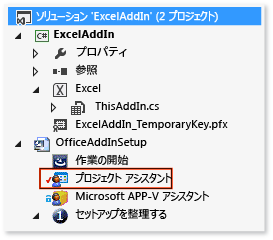
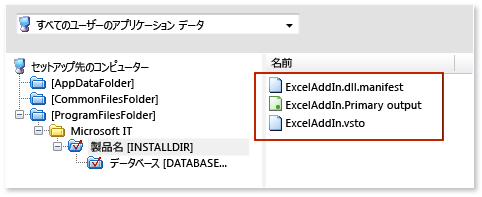
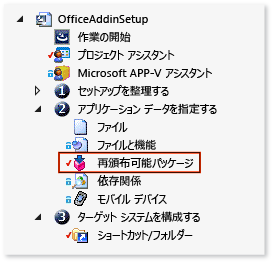

# <a name="deploying-an-office-solution-by-using-windows-installer"></a>Windows インストーラーを使用した Office ソリューションの配置
[!INCLUDE[vs_dev12](../vsto/includes/vs-dev12-md.md)]を使用して Office ソリューション用の Windows インストーラーを作成する方法について説明します。  
  
Visual Studio を使用して Windows インストーラーを作成すると、エンド ユーザーのコンピューターに対する管理アクセスを必要とする Office ソリューションを配置できます。 たとえば、1 台のコンピューターのすべてのユーザーを対象にして、1 度のみの実行でソリューションをインストールするファイルを使用することができます。 これ以外に、ClickOnce を使用して Office ソリューションを配置することもできますが、そのソリューションは、コンピューター上のユーザーごとに個別にインストールする必要があります。  
  
  
## <a name="in-this-topic"></a>このトピックの内容  
  
- [VSTO アドインのサンプルをダウンロードします。](#Download)  
  
- [InstallShield Limited Edition の入手](#Obtain)  
  
- [ソリューションに信頼を付与する方法の決定](#ApplySecurity)  
  
- [セットアップ プロジェクトの作成](#Create)  
  
- [プロジェクト出力の追加](#Add)  
  
- [配置マニフェストとアプリケーション マニフェストの追加](#AddD)  
  
- [依存コンポーネントを前提条件として構成](#Configure)  
  
- [ユーザーのコンピューター上でのソリューションの配置場所の指定](#Location)  
  
- [VSTO アドインの構成](#ConfigureRegisitry)  
  
- [Configure a document-level customization](#ConfigureDocument)  
  
- [Build the setup project](#Build)  
  
ClickOnce を使用して Office ソリューションを配置する方法の詳細については、次を参照してください。 [ClickOnce を使用して Office ソリューションの配置](../vsto/deploying-an-office-solution-by-using-clickonce.md)です。  
  
[!INCLUDE[vs_dev10_long](../sharepoint/includes/vs-dev10-long-md.md)]を使用して、Windows インストーラー ファイルを作成する方法について詳しくは、「 [Windows インストーラーを使用した Visual Studio 2010 Tools for Office ソリューションの配置](http://go.microsoft.com/fwlink/?LinkId=201807)」をご覧ください。  
  
  
## <a name="Download"></a>サンプルのダウンロード  
このトピックでは、次のダウンロード可能なサンプルを参照します。  
  
  
  
|サンプル<br /><br />|説明<br /><br />|  
|----------|---------------|  
|[ExcelAddIn](http://go.microsoft.com/fwlink/?LinkID=275492)<br /><br />|32 ビット版または 64 ビット版の Office を実行しているコンピューターにインストールできる Excel VSTO アドイン。<br /><br />|  
|[ExcelWorkbook](http://go.microsoft.com/fwlink/?LinkID=275493)<br /><br />|32 ビット版または 64 ビット版の Office を実行しているコンピューターにインストールできる Excel ドキュメントレベルのカスタマイズ。<br /><br />|  
  
## <a name="ApplySecurity"></a>ソリューションに信頼を付与する方法の決定  
ユーザーのコンピューターでソリューションを実行する前に、次の方法のいずれかで信頼を付与する必要があります。そうしない場合は、ユーザーはソリューションをインストールするときに、信頼プロンプトに応答する必要が生じます。  
  
  
- 既知の信頼される発行者を特定する証明書を使用してマニフェストに署名します。 詳細については、["Trusting the Solution by Signing the Application and Deployment Manifests (アプリケーション マニフェストと配置マニフェストへの署名によりソリューションを信頼)"](../vsto/granting-trust-to-office-solutions.md#Signing) を参照してください。  
  
- ユーザーのコンピューターの Program Files ディレクトリにソリューションをインストールします。  
  
> [!NOTE]  
> ドキュメント レベルのカスタマイズでは、ドキュメントの位置も信頼する必要があります。 詳細については、「 [Granting Trust to Documents](../vsto/granting-trust-to-documents.md)」を参照してください。  
  
  
## <a name="Obtain"></a>InstallShield Limited Edition の入手  
InstallShield Limited Edition (ISLE) を使用して、Windows インストーラー ファイルを作成することもできます。Visual Studio をインストールする場合は、ISLE を無料で使用できます。 ISLE は、以前のバージョンの Visual Studio で提供されていた、セットアップと配置を対象とするプロジェクト テンプレートの機能を置き換えます。  
  
  
#### <a name="to-get-installshield-limited-edition"></a>InstallShield Limited Edition の入手方法  
  
1. メニュー バーで、 **[ファイル]**、 **[新規作成]**、 **[プロジェクト]**の順にクリックします。  
  
   **[新しいプロジェクト]** ダイアログ ボックスが表示されます。  
  
2. テンプレート ペインで、 **[その他のプロジェクトの種類]**を展開し、 **[セットアップと配置]** テンプレートをクリックします。  
  
3. **[セットアップと配置]**に関するプロジェクトの種類の一覧で、 **[InstallShield Limited Edition の有効化]**をクリックし、 **[OK]** をクリックします。  
  
   InstallShield Limited Edition の入手方法に関する情報を示すページが表示されます。  
  
4. このページで、 **[ダウンロード Web サイトにアクセスします。]** リンクをクリックします。  
  
5. InstallShield Limited Edition のダウンロード ページで、必要な情報を適切なフィールドに入力し、 **[Download now]** リンクをクリックします。  
  
   この製品をダウンロードし、インストールしてアクティブにすると、 **[InstallShield Limited Edition Project]** のプロジェクト テンプレートが Visual Studio 内に表示されます。  
  
  
## <a name="Create"></a>セットアップ プロジェクトの作成  
  
####   
1. [!INCLUDE[vsprvs](../sharepoint/includes/vsprvs-md.md)]で、配置しようとする Office プロジェクトを開きます。  
  
   このトピックに関連付けられた VSTO アドインの例には、 **ExcelAddIn**という名前のプロジェクトが含まれています。 ドキュメント レベルのカスタマイズの例には、 **ExcelWorkbook**という名前のプロジェクトが含まれています。 ここでは、これらの 2 つの名前のどちらかを使用して、ソリューション内で Office プロジェクトを参照します。  
  
2. メニュー バーで **[ファイル]**をクリックし、 **[追加]**を選択し、 **[新しいプロジェクト]**をクリックします。  
  
   **[新しいプロジェクトの追加]** ダイアログ ボックスが表示されます。  
  
3. テンプレート ペインで、 **[その他のプロジェクトの種類]**を展開し、 **[セットアップと配置]** テンプレートをクリックします。  
  
4. **[セットアップと配置]**に対応するプロジェクトの種類の一覧で、 **[InstallShield Limited Edition Project]**をクリックし、プロジェクトに名前を付けた後、 **[OK]** をクリックします。  
  
   作成したばかりの InstallShield セットアップ プロジェクトがソリューション内に表示されます。  
  
   このトピックで使用するサンプルには **OfficeAddInSetup**という名前のセットアップ プロジェクトが含まれています。 ここでは、同じ名前を使用して、ソリューション内でセットアップ プロジェクトを参照します。  
  
  
## <a name="Add"></a>プロジェクト出力の追加  
Office プロジェクトの出力を含めるように、 **OfficeAddInSetup** プロジェクトを構成します。 VSTO アドイン プロジェクトの場合は、プロジェクト出力は、ソリューション アセンブリのみです。 ドキュメント レベルのカスタマイズ プロジェクトの場合は、プロジェクト出力には、ソリューション アセンブリに加えて、ドキュメント自体も含まれています。  
  
  
#### <a name="to-add-the-project-output"></a>プロジェクト出力を追加するには  
  
1. **ソリューション エクスプローラー**で、 **[OfficeAddInSetup]** プロジェクト ノードを展開し、次の図に示す **[Project Assistant]** ファイルをクリックします。  
  
     
  
2. メニュー バーの **[表示]**、 **[開く]**の順にクリックします。  
  
3. **[Project Assistant]** ページの下部で、次の図に示す **[Application Files]** をクリックします。  
  
     
  
4. **[Application Files]** ページで、 **[Add Project Outputs]** をクリックします。  
  
5. **[Visual Studio Output Selector]** ダイアログ ボックスで、 **[Primary Output]** チェック ボックスをオンにし、 **[OK]** をクリックします。  
  
  
## <a name="AddD"></a>配置マニフェストとアプリケーション マニフェストの追加  
  
####   
1. **[Application Files]** ページで、 **[Add Files]** をクリックします。  
  
2. **[Open]** ダイアログ ボックスで、 **ExcelAddIn** プロジェクトの出力ディレクトリを参照します。  
  
   選択したビルド構成にもよりますが、通常、出力ディレクトリは、プロジェクトのルート ディレクトリ内にある **bin\release** サブフォルダーです。  
  
3. 出力ディレクトリで、 **ExcelAddIn.vsto** と **ExcelAddIn.dll.manifest** の両方のファイルを選択し、 **[Open]** をクリックします。  
  
   次の図のように、 **[Application Files]** ページには、プロジェクトの出力ファイル、配置マニフェスト、およびアプリケーション マニフェストが含まれています。  
  
     
  
  
## <a name="Configure"></a>依存コンポーネントを前提条件として構成  
セットアップ アプリケーション内で、次のコンポーネントに加えて、ソリューションを実行するために必要な他のすべてのコンポーネントがも含める必要があります。  
  
  
- Office ソリューションが対象とする .NET Framework のバージョン。  
  
- Microsoft Visual Studio 2010 Tools for Office Runtime  
  
  
### <a name="add-the-net-framework-4-or-the-net-framework-45-as-a-prerequisite"></a>前提条件である .NET Framework 4 または .NET Framework 4.5 を追加します。  
  
#####   
1. **ソリューション エクスプローラー**で、 **[OfficeAddInSetup]** プロジェクト ノードを展開し、 **[Specify Application Data]** ノードを展開してから、次の図に示す **[Redistributables]** ファイルをクリックします。  
  
     
  
2. メニュー バーの **[表示]**、 **[開く]**の順にクリックします。  
  
   **[Redistributables]** ページが開きます。  
  
3. 再頒布可能コンポーネントの一覧で、ソリューションが対象とする .NET Framework のバージョンに対応する適切なチェック ボックスをオンにします。  
  
   たとえば、ソリューションで [!INCLUDE[net_v45](../vsto/includes/net-v45-md.md)]を対象とする場合は、 **[Microsoft .NET Framework 4.5 Full]** チェック ボックスをオンにします。 前提条件であるコンポーネントを追加する前に、InstallShield で必要とされる再頒布可能コンポーネントをインストールするかどうかを問い合わせるダイアログ ボックスが表示される可能性があります。 このダイアログ ボックスが表示されない場合、コンポーネントがコンピューターに既に存在します。  
  
4. このダイアログ ボックスが表示された場合は、 **[No]** をクリックします。  
  
  
### <a name="AddToolsForOffice"></a>Visual Studio 2010 Tools for Office Runtime の追加  
**[Redistributables]** ページには **[Microsoft VSTO 2010 Runtime]**という名前の項目が含まれていますが、これはランタイムの古いバージョンを参照しています。 したがって、最新バージョンを参照する構成ファイルを手動で作成することができます。 そのファイルを、 **[Redistributables]** ページに表示される他の項目すべてに対応する構成ファイルと同じディレクトリに配置する必要があります。  
  
  
##### <a name="to-add-the-visual-studio-2010-tools-for-office-runtime-as-a-prerequisite"></a>前提条件として Visual Studio 2010 Tools for Office Runtime を追加するには  
  
1. メモ帳を開き、次の XML をテキスト ファイルに貼り付けます。  
  
  
   ```xml  
   <?xml version="1.0" encoding="UTF-8"?>  
   <SetupPrereq>  
   <conditions>  
       <condition Type="32" Comparison="2" Path="HKEY_LOCAL_MACHINE\SOFTWARE\Microsoft\VSTO Runtime Setup\v4R" FileName="Version" ReturnValue="10.0.50903" Bits="2"></condition>  
   <condition Type="32" Comparison="2" Path="HKEY_LOCAL_MACHINE\SOFTWARE\Wow6432Node\Microsoft\VSTO Runtime Setup\v4R" FileName="Version" ReturnValue="10.0.50903" Bits="2"></condition>  
   </conditions>  
   <files>  
       <file LocalFile="<ISProductFolder>\SetupPrerequisites\VSTOR\vstor_redist.exe" URL="http://download.microsoft.com/download/C/0/0/C001737F-822B-48C2-8F6A-CDE13B4B9E9C/vstor_redist.exe" CheckSum="88b8aa9e8c90818f98c80ac4dd998b88" FileSize=" 0,40117912"></file>  
   </files>  
   <execute file="vstor_redist.exe" returncodetoreboot="1641,3010" requiresmsiengine="1">  
   </execute>  
   <properties Id="{15965040-56BB-49B8-A88F-3525C48D9BA8}" Description="This prerequisite installs the most recent version of the Microsoft Visual Studio 2010 Tools for Office Runtime." >  
   </properties>  
     
   </SetupPrereq>  
   ```  
  
2. Visual Studio での GUID の生成。 **[ツール]** メニューの **[GUID の作成]**をクリックします。  
  
3. **[GUID ジェネレーター]** プログラム内で、 **[4. レジストリ形式 ( {xxxxxxx-xxxx ... xxxx })]** オプション ボタンをクリックし、 **[コピー]** をクリックし、 **[終了]** をクリックします。  
  
4. メモ帳で、テキスト **Your GUID goes here** の位置に GUID を貼り付け、そのテキストを置換します。  
  
   次の図のように、 **&lt;properties&gt;** 要素は、次の例のようになります。  
  
  
   ```xml  
   <properties Id="{87989B73-21DC-4403-8FD1-0C68A41A6D8C}" Description="This prerequisite installs the most recent version of the Microsoft Visual Studio 2010 Tools for Office Runtime." >  
   </properties>  
   ```  
  
5. メモ帳のメニュー バーの **[ファイル]**、 **[上書き保存]**の順にクリックします。  
  
6. **[名前を付けて保存]** ダイアログ ボックスで、 **[デスクトップ]** フォルダーを参照します。  
  
7. **型として保存**一覧で、選択**すべてのファイル (&#42;.&#42;)**.  
  
8. **[ファイル名]** ボックスに、「 **Visual Studio 2010 Tools for Office Runtime.prq**」と入力し、 **[保存]** をクリックします。  
  
   > [!NOTE]  
   >    このファイルが前提条件であることを識別できるように、ファイル名の末尾に「 **.prq** 」を追加してください。  
  
9. メモ帳を閉じます。  
  
10. **[デスクトップ]** フォルダーから、ローカル コンピューターの次のディレクトリのいずれかに Visual Studio 2010 Tools for Office Runtime.prq ファイルをコピーします。  
  
   32 ビット オペレーティング システム: %ProgramFiles%\InstallShield\2013LE\SetupPrerequisites\  
  
   64 ビット オペレーティング システム: %programfiles (x86) %\2013LE\SetupPrerequisites\  
  
11. InstallShield プロジェクトの **[Redistributable]** ページで、次の図に示すように、再頒布可能コンポーネントの一覧を更新するために **[Refresh]** をクリックします。  
  
     
  
12. 再頒布可能コンポーネントの一覧で、 **[Visual Studio 2010 Tools for Office Runtime]** チェック ボックスをオンにします。  
  
   再頒布可能コンポーネントをインストールするかどうかを問い合わせるダイアログ ボックスが表示される可能性があります。 このダイアログ ボックスが表示されない場合をスキップすることができます、[ユーザーのコンピューターでソリューションを配置する場所を指定して](#Location)このトピックの「します。  
  
13. このダイアログ ボックスが表示された場合は、 **[No]** をクリックします。  
  
  
## <a name="Location"></a>ユーザーのコンピューター上でのソリューションのインストール場所の指定  
  
####   
1. **ソリューション エクスプローラー**で、 **[OfficeAddInSetup]** ノードを展開し、 **[Organize your Setup]** ノードを展開してから **[General Information]** ファイルをクリックします。  
  
2. メニュー バーの **[表示]**、 **[開く]**の順にクリックします。  
  
3. プロパティの一覧で、 **[INSTALLDIR]** プロパティの隣にある **[参照]** ボタンをクリックします。  
  
4. **Set INSTALLDIR**  ダイアログ ボックスで、ソリューションをインストールするユーザーのコンピューター上のフォルダーを選択します。  
  
   > [!NOTE]  
   >    **Set INSTALLDIR** ダイアログ ボックスで、一覧の中にある任意のフォルダーに対応するショートカット メニューを開いて、サブディレクトリを作成することもできます。  
  
  
## <a name="ConfigureRegisitry"></a>VSTO アドインの構成  
コンピューターを使用するすべてのユーザーに対して (コンピューター単位)、またはインストールを実行するユーザーに対してのみ (ユーザー単位)、VSTO アドインをインストールするかどうかを指定できます。  
  
コンピューター単位のインストールをサポートする場合は、2 つの別々のインストーラーを作成します。 Office のバージョン (32 ビットおよび 64 ビット)、またはユーザーが実行されている Windows のバージョン (32 ビットおよび 64 ビット) に基づいてインストーラーを分割できます。  
  
ユーザー単位のインストールでは、Office または Windows のバージョンにかかわらず、必要なインストーラーは 1 つだけです。  
  
> [!NOTE]  
> このセクションでは、VSTO アドインを配置する場合にのみ適用されます。 ドキュメント レベルのカスタマイズを配置する場合に移動できます、[ドキュメント レベルのカスタマイズの構成](#ConfigureDocument)セクションです。  
  
  
#### <a name="to-specify-whether-you-want-to-support-per-user-or-per-computer-installations"></a>ユーザー単位またはコンピューター単位のインストールをサポートするかどうかを指定するには  
  
1. **ソリューション エクスプローラー**で、 **[OfficeAddInSetup]** ノードを展開し、 **[Organize Your Setup]** ノードを展開してから **[General Information]** ファイルをクリックします。  
  
2. メニュー バーの **[表示]**、 **[開く]**の順にクリックします。  
  
   セットアップ プロジェクトのプロパティが表示されます。  
  
3. **[AllUSERS]** プロパティの一覧で、コンピューター上のすべてのユーザーに対してこのソリューションをインストールするか、またはこのソリューションをインストールしようとするユーザーのみに対してインストールするかを指定します。  
  
   現在のユーザー用の VSTO アドインをインストールするには、選択**ALLUSERS =""(per-user installation)**です。 コンピューターのすべてのユーザーに対して VSTO アドインをインストールするには、 **[ALLUSERS=1 (Per-machine installation)]**を選びます。  
  
   次の手順では、Office アプリケーションを検出し、VSTO アドインの読み込みを有効にするレジストリ キーを作成します。 「 [Registry Entries for VSTO Add-ins](../vsto/registry-entries-for-vsto-add-ins.md)」を参照してください。  
  
  
#### <a name="to-create-registry-keys"></a>レジストリ キーを作成するには  
  
1. **ソリューション エクスプローラー**で、 **[Project Assistant]** ノードをクリックします。  
  
   メニュー バーの **[表示]**、 **[開く]**の順にクリックします。  
  
2. **[Project Assistant]** ページの下部で、次の図に示す **[Application Registry]** をクリックします。  
  
   ![[アプリケーション レジストリ] ボタン。] (../vsto/media/installshield-applicationregistry.gif "[アプリケーション レジストリ] ボタン。")  
  
   **[Application Registry]** ページが表示されます。  
  
3. **[Do you want to configure the registry data that your application will install?]**の下で、 **[Yes]** オプション ボタンをクリックします。  
  
4. **Destination computer's Registry view**一覧を作成するインストーラーの種類を有効にするキー階層を追加します。  
  
   このセクションで構成するパスは、ユーザー単位のインストーラーとコンピューター単位のインストーラーのどちらを作成するかによって異なります。  
  
   **ユーザー単位のインストーラー**  
  
   **HKEY_CURRENT_USER\Software\Microsoft\Office\Excel\Addins\SampleCompany.ExcelAddIn**  
  
   **Office のバージョンに基づくコンピューター単位のインストーラー**  
  
  
  
|Office のバージョン<br /><br />|InstallShield の構成パス<br /><br />|  
|------------------|------------------------------------|  
|32 ビット<br /><br />|**HKEY_LOCAL_MACHINE\SOFTWARE(32-Bit) \Microsoft\Office\Excel\Addins\SampleCompany.ExcelAddIn**<br /><br />|  
|64 ビット<br /><br />|**HKEY_LOCAL_MACHINE\SOFTWARE(64-Bit) \Microsoft\Office\Excel\Addins\SampleCompany.ExcelAddIn**<br /><br />|  
   **Windows のバージョンに基づくコンピューター単位のインストーラー**  
  
  
  
|Windows のバージョン<br /><br />|InstallShield の構成パス<br /><br />|  
|-------------------|------------------------------------|  
|32 ビット<br /><br />|**HKEY_LOCAL_MACHINE\SOFTWARE(32-Bit) \Microsoft\Office\Excel\Addins\SampleCompany.ExcelAddIn**<br /><br />|  
|64 ビット<br /><br />|**HKEY_LOCAL_MACHINE\SOFTWARE(32-Bit) \Microsoft\Office\Excel\Addins\SampleCompany.ExcelAddIn**<br /><br />**HKEY_LOCAL_MACHINE\SOFTWARE(64-Bit) \Microsoft\Office\Excel\Addins\SampleCompany.ExcelAddIn**<br /><br />|  
   > [!NOTE]  
   >    64 ビット Windows 用のインストーラーでは、64 ビット Windows を実行しているコンピューターで 32 ビットおよび 64 ビット バージョンの Office を実行するユーザーの可能性があるために、2 つのレジストリ パスが必要です。  
  
   > [!NOTE]  
   >    ベスト プラクティスとして、VSTO アドインの名前の先頭を、自分の会社の名前にします。 この規則により、キーが一意になる可能性が高くなり、別のサプライヤーから供給される VSTO アドインと競合する可能性が低くなります。 同じ名前を持つ複数のアドインは、たとえば、互いのレジストリ キーを上書きする可能性があります。 この手法で、キーが一意になることを保証できるわけではありませんが、名前が競合する可能性を小さくすることができます。  
  
5. キーの階層を作成した後は、ショートカット メニューを開き、 **SampleCompany.ExcelAddIn**キーで、選択**新規**を選択し**文字列値**です。  
  
   新しい文字列値に表示されます**先のコンピューターのレジストリ データ** ボックスの一覧です。 この文字列値の名前が強調表示されていて、その名前を変更することができます。  
  
6. 値の名前を「 **Description**」に変更します。  
  
7. この手順を繰り返して、次の値を追加します。  
  
  
  
|値型<br /><br />|名前<br /><br />|  
|--------------|--------|  
|[Key]<br /><br />|**FriendlyName**<br /><br />|  
|DWORD 値<br /><br />|**LoadBehavior**<br /><br />|  
|[Key]<br /><br />|**Manifest**<br /><br />|  
  
8. **[Description]** 値のショートカット メニューを開き、 **[Modify]**をクリックします。  
  
   **[データの編集]** ダイアログ ボックスが表示されます。  
  
9. **[Value data]** テキスト ボックスに「 **Excel Demo Add-In**」と入力し、 **[OK]** ボタンを選びます。  
  
   この説明は、ユーザーが Office アプリケーションを開き、 **[オプション]** ダイアログ ボックスの **[アドイン]** ウィンドウでこの VSTO アドインを選んだときに表示されます。  
  
10. **[FriendlyName]** 値のショートカット メニューを開き、 **[Modify]**をクリックします。  
  
   **[データの編集]** ダイアログ ボックスが表示されます。  
  
11. **[Value data]** テキスト ボックスに「 **Excel Demo Add-In**」と入力し、 **[OK]** ボタンを選びます。  
  
   この文字列は、Office アプリケーションの **[COM アドイン]** ダイアログ ボックスに表示されます。 既定では、文字列の値は、VSTO アドインの ID です。  
  
12. **[LoadBehavior]** 値のショートカット メニューを開き、 **[Modify]**をクリックします。  
  
   **[データの編集]** ダイアログ ボックスが表示されます。  
  
13. **[Value data]** テキスト ボックスに「 **3**」と入力し、 **[OK]** ボタンを選びます。  
  
   アプリケーションの起動時に、3 という値を使用して VSTO アドインが読み込まれます。 LoadBehavior 値について詳しくは、「 [Registry Entries for VSTO Add-ins](../vsto/registry-entries-for-vsto-add-ins.md)」をご覧ください。  
  
14. **[Manifest]** 値のショートカット メニューを開き、 **[Modify]**をクリックします。  
  
   **[データの編集]** ダイアログ ボックスが表示されます。  
  
15. **[Value data]** テキスト ボックスに「 **file:///[INSTALLDIR]ExcelAddIn.vsto|vstolocal**」と入力し、 **[OK]** ボタンを選びます。  
  
   Visual Studio 2010 Tools for Office Runtime は、配置マニフェストを見つけるために、このパスを使用します。 このパスの **[INSTALLDIR]** の部分は、InstallShield セットアップ プロジェクトの **[一般情報]** プロパティ ページ内の **INSTALLDIR** プロパティへのマップを行うマクロです。 このプロパティは、VSTO アドインのインストール先になる、ターゲット コンピューター上の位置を指定します。 **|vstolocal** サフィックスにより、ClickOnce キャッシュではなく、インストール フォルダーからソリューションが読み込まれます。  
  
> [!IMPORTANT]  
> Outlook 用 VSTO アドインの中でカスタム フォーム領域を作成する場合は、その領域を Outlook に登録するための追加レジストリ エントリを作成する必要があります。 詳細については、「 [Registry Entries for Outlook Form Regions](../vsto/registry-entries-for-vsto-add-ins.md#OutlookEntries)」を参照してください。  
  
  
## <a name="ConfigureDocument"></a>Configure a document-level customization  
このセクションでは、ドキュメント レベルのカスタマイズを配置する場合にのみ適用されます。 直ちに移動できますを VSTO アドインを配置する場合、[セットアップ プロジェクトのビルド](#Build)セクションです。  
  
ドキュメント レベルのカスタマイズには、レジストリ キーを使用しないでください。 その代わりに、カスタム ドキュメント プロパティの中に、配置マニフェストの場所が格納されます。  
  
カスタム プロパティを変更するには、ドキュメント レベルのカスタマイズをドキュメントから削除し、適切なプロパティに変更を加え、その後、カスタマイズをドキュメントに再アタッチするプログラムを作成します。 その後、プログラムを実行するカスタム アクションを作成し、そのアクションをセットアップ プロジェクトに追加します。  
  
  
#### <a name="to-create-a-program-that-modifies-document-properties"></a>ドキュメントのプロパティを変更するプログラムを作成するには  
  
1. メニュー バーで **[ファイル]**をクリックし、 **[追加]**を選択し、 **[新しいプロジェクト]**をクリックします。  
  
   **[新しいプロジェクトの追加]** ダイアログ ボックスが表示されます。  
  
2. [テンプレート] ペインで、使用する言語のノードの下にある **[Windows]** フォルダーを展開します。  
  
3. **[Windows]**のプロジェクトの種類の一覧で、 **[コンソール アプリケーション]** テンプレートを選択します。  
  
4. プロジェクトに「 **SetExcelDocumentProperties**」という名前を付けて **[OK]** ボタンを選びます。  
  
5. **ソリューション エクスプローラー**で、 **[すべてのファイルの表示]** をクリックし、 **[SetExcelDocumentProperties]** プロジェクト ノードのショートカット メニューを開き、 **[参照の追加]**をクリックします。  
  
6. **[参照マネージャー]** ダイアログ ボックスで、 **[拡張機能]** タブをクリックしてから、次のアセンブリの隣にあるチェック ボックスをオンにし、 **[OK]** をクリックします。  
  
  
   - Microsoft.VisualStudio.Tools.Applications.Runtime  
  
   - Microsoft.VisualStudio.Tools.Applications.ServerDocument  
  
7. **ソリューション エクスプローラー**で、 **[Program.cs]** ファイル (C# アプリケーションの場合)、または **[Module1.vb]** ファイル (Visual Basic アプリケーションの場合) をクリックします。  
  
8. メニュー バーの **[表示]**、 **[開く]**の順にクリックします。  
  
9. このファイルの内容全体を次のコードで置き換えます。  
  
[!code-vb[Trin_CustomAction#1](../vsto/codesnippet/VisualBasic/setexceldocumentproperties/module1.vb#1)]
[!code-csharp[Trin_CustomAction#1](../vsto/codesnippet/CSharp/setexceldocumentproperties/program.cs#1)]  
  
10. プロジェクトをコンパイルします。  
  
  
#### <a name="to-add-a-custom-action-that-runs-your-program"></a>プログラムを実行するカスタム アクションを追加するには  
  
1. **ソリューション エクスプローラー**で、 **[OfficeAddInSetup]** プロジェクト ノードを展開し、次の図に示す **[Project Assistant]** ファイルをクリックします。  
  
     
  
2. メニュー バーの **[表示]**、 **[開く]**の順にクリックします。  
  
3. **[Project Assistant]** ページの下部で、次の図に示す **[Application Files]** をクリックします。  
  
     
  
4. **[Application Files]** ページで、 **[Add Project Outputs]** をクリックします。  
  
   **[Visual Studio Output Selector]** ダイアログ ボックスが表示されます。  
  
5. **[SetExcelDocumentProperties]** ノードの下で、 **[プライマリ出力]** チェック ボックスをオンにし、 **[OK]** をクリックします。  
  
6. **ソリューション エクスプローラー**で、 **[OfficeAddInSetup]** ノードの下にある **[Define Setup Requirements and Actions]** ノードを展開してから **[カスタム アクション]** フォルダーをクリックします。  
  
7. メニュー バーの **[表示]**、 **[開く]**の順にクリックします。  
  
   イベントの一覧は、画面の端にあるウィンドウの中に表示されます。  
  
   > [!NOTE]  
   >    InstallShield Limited Edition で使用できるのは、この一覧に表示されるイベントのいくつかのみです。 この手順でプログラムを実行を使用して、 **After Setup Complete Success ダイアログ**イベント。  
  
8. イベントの一覧で、 **[Custom Actions During Installation]**の下にある、 **[After Setup Complete Success dialog]** イベントのショートカット メニューを開き、 **[New EXE]**をクリックします。  
  
   **[NewCustomAction1]** という名前のカスタム アクションが、 **[After Setup Complete Success dialog]** イベントの下に表示されます。 カスタム アクションに対応する一連のプロパティは、イベントの隣にあるウィンドウの中に表示されます。  
  
   > [!IMPORTANT]  
   >    **[After Setup Complete Success dialog]** の 2 種類のイベントは、イベントの一覧に表示されます。 **[Custom Actions During Installation]** ノードの下で、 **[After Setup Complete Success dialog]** イベントのインスタンスを選択してください。  
  
9. **[ソースの場所]** のプロパティの一覧で、 **[Installed with the Product]**をクリックします。  
  
10. **[ファイル名]** プロパティの隣にある **[参照]** ボタンをクリックします。  
  
11. **[Browse for a Destination File]** ダイアログ ボックスで、 **[SetExcelDocumentProperties.Primary.output]** ファイルを選択し、 **[開く]** をクリックします。  
  
   このファイルの場所は、セットアップ プロジェクトの **[INSTALLDIR]** プロパティで指定したフォルダーによって異なります。 たとえば、プロパティを **[PersonalFolder]DemoWorkbookApp**という名前のフォルダーに設定した場合は、 **[ProgramFilesFolder] \DemoWorkbookApp** を参照して、 **SetExcelDocumentProperties.Primary.output**ファイルを見つけることができます。  
  
   次のいくつかの手順をドキュメントのソリューション ID を取得し、パラメーターとしてコンソール アプリケーションにその ID を渡します。 ドキュメント、配置マニフェスト、およびドキュメントのアセンブリの場所も渡す必要があります。  
  
12. **[ExcelWorkbook]** プロジェクトのショートカット メニューを開き、オペレーティング システムに応じて、 **[エクスプローラーでフォルダーを開く]** 、または **[エクスプローラーでフォルダーを開く]** をクリックします。  
  
   ソリューションを含むフォルダーが開きます。  
  
13. ソリューションに対応するプロジェクト ファイルをメモ帳で開きます。 Visual Basic プロジェクトの場合は、ファイル名は ExcelWorkbook.vbproj です。 C# プロジェクトの場合は、ファイル名は ExcelWorkbook.csproj です。  
  
14. プロジェクト ファイルでは検索、 **&lt;ソリューション Id&gt;** 要素、その値をクリップボードにコピーし、メモ帳を閉じます。  
  
   この値を、パラメーターとしてコンソール アプリケーションに渡します。  
  
15. **[NewCustomAction1]**プロパティ ページで、 **[コマンド ライン]** プロパティを次のテキスト行に設定します。  
  
  
   ```  
   /assemblyLocation="[INSTALLDIR]ExcelWorkbook.dll" /deploymentManifestLocation="[INSTALLDIR]ExcelWorkbook.vsto" /documentLocation="[INSTALLDIR]ExcelWorkbook.xlsx" /solutionID="Your Solution ID"  
   ```  
  
16. **Your Solution ID** を、クリップボードにコピーしたソリューション ID で置き換えます。  
  
   > [!IMPORTANT]  
   >    インストーラーをテストし、このカスタム アクションで実行するコンソール アプリケーションが INSTALLDIR ディレクトリ内のドキュメントにアクセスできることを確認します。 ユーザーのコンピューターの一部のディレクトリには、管理アクセス権 (たとえば、Program Files ディレクトリ) が必要です。 を管理者のアクセスを必要とするディレクトリにソリューションを配置する場合を開く必要があります、**プロパティ** ダイアログ ボックス、setup.exe ファイルの選択、**互換性**タブをクリックし、を選択し、**このプログラムを管理者として実行**インストーラーを配布する前に チェック ボックスです。 ユーザーが管理者権限でセットアップ プログラムを実行しない場合は、先ユーザーがアクセス ディレクトリに、[INSTALLDIR] プロパティを設定など、**ドキュメント**ディレクトリ。 詳細については、次を参照してください。、[を指定するユーザーのコンピューターにソリューションをインストール](#Location)このトピックの「します。  
  
  
## <a name="Build"></a>Build the setup project  
  
####   
1. **ソリューション エクスプローラー**で、 **[Prepare for Release]** ノードを展開し、 **[Releases]** ファイルをクリックします。  
  
2. メニュー バーの **[表示]**、 **[開く]**の順にクリックします。  
  
   横のウィンドウで **[Builds]** エクスプローラーが開き、作成しようとするリリースの種類を選択できます。  
  
3. **[Builds]** エクスプローラーで、 **[SingleImage]** フォルダーを選択します。  
  
4. **[Builds]** エクスプローラーの横にあるペインで、 **[Setup.exe]** タブをクリックします。  
  
5. **[Setup.exe]** プロパティ ページで、 **[InstallShield Prerequisites Location]** の一覧から、 **[Download From The Web]**をクリックします。  
  
6. メニュー バーで **[ビルド]**、 **[構成マネージャー]**の順に選択します。  
  
7. **[Active solution configuration]** の一覧で **[SingleImage]**をクリックします。  
  
8. **OfficeAddInSetup** プロジェクトの **[Configuration]** 列にある **[Project contexts]** の表で、 **[SingleImage]**をクリックしてから **[Close]** をクリックします。  
  
9. メニュー バーの **[ビルド]**、 **[OfficeAddInSetup のビルド]**の順にクリックします。  
  
   Setup.exe ファイルを検索することができます、ビルドが完了した後、 **OfficeAddInSetup**次の場所にプロジェクト: *OfficeAddInSetupProjectRoot * * * \OfficeAddInSetup\Express\SingleImage\DiskImages\ディスク 1\**  
  
  
## <a name="see-also"></a>関連項目  
[Office ソリューションを配置するための必須コンポーネント](http://msdn.microsoft.com/en-us/library/9f672809-43a3-40a1-9057-397ce3b5126e)  
[Office ソリューションの配置](../vsto/deploying-an-office-solution.md)  
[Registry Entries for VSTO Add-ins](../vsto/registry-entries-for-vsto-add-ins.md)  
[カスタム ドキュメント プロパティの概要](../vsto/custom-document-properties-overview.md)  
[Office ソリューションへの信頼の付与](../vsto/granting-trust-to-office-solutions.md)  
[Granting Trust to Documents](../vsto/granting-trust-to-documents.md)  
[Windows インストーラーを使用した Visual Studio 2010 Tools for Office ソリューションの配置](http://go.microsoft.com/fwlink/?LinkId=201807)  
  
