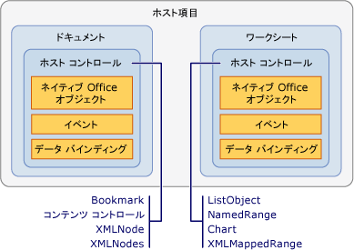

# ホスト項目とホスト コントロールの概要
  ホスト項目とホスト コントロールは、Visual Studio の Office 開発ツールを使用して作成される Office ソリューションのプログラミング モデルを提供する助けとなる型です。 ホスト項目とホスト コントロールは、Microsoft Office Word および Microsoft Office Excel の COM ベースのオブジェクト モデルとの対話を、Windows フォーム コントロールなどのマネージ オブジェクトとの対話と似たものにします。  
  
 [!INCLUDE[appliesto_controls](../vsto/includes/appliesto-controls-md.md)]  
  
## ホスト項目  
 ホスト項目は、Office プロジェクトでオブジェクト モデルの階層構造の最上位にある型です。[!INCLUDE[vsto_runtime](../vsto/includes/vsto-runtime-md.md)] は、Word ソリューションおよび Excel ソリューションに対して次のホスト項目を定義します:  
  
-   <xref:Microsoft.Office.Tools.Word.Document>  
  
-   <xref:Microsoft.Office.Tools.Excel.Workbook>  
  
-   <xref:Microsoft.Office.Tools.Excel.Worksheet>  
  
-   <xref:Microsoft.Office.Tools.Excel.ChartSheet>  
  
 これらの型はそれぞれが、Word または Excel のオブジェクト モデルにネイティブに存在する *ネイティブ Office オブジェクト*と呼ばれるオブジェクトを拡張します。 たとえば、<xref:Microsoft.Office.Tools.Word.Document> ホスト項目は、Word のプライマリ相互運用機能アセンブリに定義されている <xref:Microsoft.Office.Interop.Word.Document> オブジェクトを拡張します。  
  
 ホスト項目は、一般に、対応する Office オブジェクトと同じ基本機能を備えていますが、さらに次の機能を備えています：  
  
-   ホスト コントロールや Windows フォーム コントロールなどのマネージ コントロールをホストする機能。  
  
-   豊富なイベント モデル。 ネイティブの Word または Excel オブジェクト モデルの一部の文書、ブック、ワークシート イベントはアプリケーション レベルでのみ発生します。 ホスト項目は文書レベルでこれらのイベントを提供します。そのため、特定の文書のイベントを簡単に処理できます。  
  
### ドキュメント レベルのプロジェクトのホスト項目について  
 ドキュメント レベルのプロジェクトでは、ホスト項目はコードのエントリ ポイントを提供し、ソリューションの開発に役立つデザイナーを備えています。  
  
 <xref:Microsoft.Office.Tools.Word.Document> と <xref:Microsoft.Office.Tools.Excel.Worksheet> のホスト項目は、Windows フォーム デザイナーに似た、文書やワークシートを視覚的に表現する関連デザイナーを備えています。 このデザイナーを使用して、Word や Excel で文書やワークシートのコンテンツを変更したり、デザイン サーフェイスにコントロールをドラッグしたりすることができます。 詳細については、次のトピックを参照してください。[Document ホスト項目](../vsto/document-host-item.md) および[Worksheet ホスト項目](../vsto/worksheet-host-item.md).  
  
 <xref:Microsoft.Office.Tools.Excel.Workbook> ホスト項目は、ユーザー インターフェイスのあるコントロールのコンテナーとしては動作しません 代わりに、このホスト項目のデザイナーはコンポーネント トレイとして機能し、ユーザーはこのデザイナーを使用して <xref:System.Data.DataSet> などのコンポーネントをデザイン サーフェイスにドラッグできます。 詳細については、「[Workbook ホスト項目](../vsto/workbook-host-item.md)」を参照してください。  
  
 ドキュメント レベルのプロジェクトでは、ホスト項目をプログラムで作成することはできません。 その代わり、デザイン時に Visual Studio によってプロジェクトに自動的に生成される `ThisDocument`、`ThisWorkbook`、または`Sheet`*n* クラスを使用します。 生成されるこれらのクラスは、ホスト項目から派生するもので、コードのエントリ ポイントを提供します。 詳細については、「[ホスト項目およびホスト コントロールのプログラム上の制限事項](../vsto/programmatic-limitations-of-host-items-and-host-controls.md)」を参照してください。  
  
### VSTO アドイン プロジェクトのホスト項目について  
 VSTO アドインを作成する場合、既定では、ホスト項目にはアクセスできません。 ただし、Word および Excel の VSTO アドインでは、実行時に <xref:Microsoft.Office.Tools.Word.Document>、<xref:Microsoft.Office.Tools.Excel.Workbook>、および <xref:Microsoft.Office.Tools.Excel.Worksheet> ホスト項目を生成できます。  
  
 ホスト項目を生成すると、文書にコントロールを追加するなどのタスクを実行できます。 詳細については、「[VSTO アドインにおける実行時の Word 文書と Excel ブックの拡張](../vsto/extending-word-documents-and-excel-workbooks-in-vsto-add-ins-at-run-time.md)」を参照してください。  
  
## ホスト コントロール  
 ホスト コントロールは、Word や Excel のオブジェクト モデルで、Microsoft.Office.Interop.Word.ContentControl や <xref:Microsoft.Office.Interop.Excel.Range> オブジェクトなどのさまざまなユーザー インターフェイス \(UI\) オブジェクトを拡張します。  
  
 Excel プロジェクトで使用できるホスト コントロールを次に示します:  
  
-   [Chart コントロール](../vsto/chart-control.md)  
  
-   [ListObject コントロール](../vsto/listobject-control.md)  
  
-   [NamedRange コントロール](../vsto/namedrange-control.md)  
  
-   [XmlMappedRange コントロール](../vsto/xmlmappedrange-control.md)  
  
 Word プロジェクトで使用できるホスト コントロールを次に示します:  
  
-   [Bookmark コントロール](../vsto/bookmark-control.md)  
  
-   [コンテンツ コントロール](../vsto/content-controls.md)  
  
-   [XMLNode コントロール](../vsto/xmlnode-control.md)  
  
-   [XMLNodes コントロール](../vsto/xmlnodes-control.md)  
  
 Office ドキュメントに追加されたホスト コントロールは、ネイティブな Office オブジェクトのように動作しますが、ホスト コントロールには、イベントやデータ バインディング機能を含む追加の機能があります。 たとえば、Excel 内のネイティブな <xref:Microsoft.Office.Interop.Excel.Range> オブジェクトのイベントをキャプチャするには、最初にワークシートの変更イベントを処理する必要があります。 次に、変更が <xref:Microsoft.Office.Interop.Excel.Range> 内で発生したかどうかを判断する必要があります。 一方、<xref:Microsoft.Office.Tools.Excel.NamedRange> ホスト コントロールには、直接処理できる <xref:Microsoft.Office.Tools.Excel.NamedRange.Change> イベントがあります。  
  
 ホスト項目とホスト コントロールの関係は、Windows フォームと Windows フォーム コントロールの関係によく似ています。 Windows フォームにテキスト ボックス コントロールを配置するのと同じように、<xref:Microsoft.Office.Tools.Excel.Worksheet> ホスト項目に <xref:Microsoft.Office.Tools.Excel.NamedRange> コントロールを配置します。 次の図は、ホスト項目とホスト コントロールの関係を示しています。  
  
   
  
 また、Windows フォーム コントロールを Word および Excel の文書領域に直接追加することによって、Office ソリューションで Windows フォーム コントロールを使用できます。 詳細については、「[Office ドキュメントでの Windows フォーム コントロールの概要](../vsto/windows-forms-controls-on-office-documents-overview.md)」を参照してください。  
  
> [!NOTE]  
>  Word サブ文書へのホスト コントロールおよび Windows フォーム コントロールの追加はサポートされていません。  
  
### 文書へのホスト コントロールの追加  
 ドキュメント レベルのプロジェクトでは、次の方法を使用して、デザイン時に Word 文書や Excel ワークシートにホスト コントロールを追加できます。  
  
-   ホスト コントロールを、デザイン時に、ネイティブ オブジェクトを追加する場合と同じ方法でドキュメントに追加します。  
  
-   **ツールボックス**からホスト コントロールを文書やワークシートにドラッグします。 Excel のホスト コントロールは Excel プロジェクトの **\[Excel コントロール\]** タブにあり、Word のホスト コントロールは、Word プロジェクトの **\[Word コントロール\]** タブにあります。  
  
-   **\[データ ソース\]** ウィンドウから文書やワークシートに、ホスト コントロールをドラッグします。 これによって、既にデータにバインドされているコントロールを追加できます。 詳細については、「[Office ソリューションでのコントロールへのデータのバインド](../vsto/binding-data-to-controls-in-office-solutions.md)」を参照してください。  
  
 ドキュメント レベルのプロジェクトおよび VSTO アドインのプロジェクトでは、実行時にドキュメントに対していくつかのホスト コントロールを追加できます。 詳細については、「[実行時の Office ドキュメントへのコントロールの追加](../vsto/adding-controls-to-office-documents-at-run-time.md)」を参照してください。  
  
 ホスト コントロールをドキュメントに追加する方法の詳細については、以下のトピックを参照してください:  
  
-   [方法 : ワークシートに Chart コントロールを追加する](../vsto/how-to-add-chart-controls-to-worksheets.md)  
  
-   [方法 : ワークシートに ListObject コントロールを追加する](../vsto/how-to-add-listobject-controls-to-worksheets.md)  
  
-   [方法 : ワークシートに NamedRange コントロールを追加する](../vsto/how-to-add-namedrange-controls-to-worksheets.md)  
  
-   [方法 : ワークシートに XMLMappedRange コントロールを追加する](../vsto/how-to-add-xmlmappedrange-controls-to-worksheets.md)  
  
-   [方法 : Word 文書に Bookmark コントロールを追加する](../vsto/how-to-add-bookmark-controls-to-word-documents.md)  
  
-   [方法 : Word 文書にコンテンツ コントロールを追加する](../vsto/how-to-add-content-controls-to-word-documents.md)  
  
-   [方法 : Word 文書に XMLNode コントロールを追加する](../vsto/how-to-add-xmlnode-controls-to-word-documents.md)  
  
-   [方法 : Word 文書に XMLNodes コントロールを追加する](../vsto/how-to-add-xmlnodes-controls-to-word-documents.md)  
  
### ホスト コントロールの名前付け  
 **ツールボックス**から文書にホスト コントロールをドラッグすると、コントロールには自動的にコントロールの型と末尾の増分番号で構成される名前が付けられます。 たとえば、ブックマークには **bookmark1** や **bookmark2** などの名前が付けられます。 Word または Excel のネイティブ機能を使用してコントロールを追加する場合は、コントロールの作成時に特定の名前を指定できます。**\[プロパティ\]** ウィンドウで、**\[名前\]** プロパティの値を変更してコントロールの名前を変更することもできます。  
  
> [!NOTE]  
>  ホスト コントロールの名前に予約語は使用できません。 たとえば、<xref:Microsoft.Office.Tools.Excel.NamedRange> コントロールをワークシートに追加し、名前を **System** に変更すると、プロジェクトをビルドするときにエラーが発生します。  
  
### ホスト コントロールの削除  
 ドキュメント レベルのプロジェクトでは、デザイン時に Excel ワークシートまたは Word 文書のコントロールを選択し、Del キーを押してホスト コントロールを削除できます。 ただし、<xref:Microsoft.Office.Tools.Excel.NamedRange> コントロールを削除するには、Excel の **\[名前の定義\]** ダイアログ ボックスを使用する必要があります。  
  
 デザイン時に文書にホスト コントロールを追加した場合は、それを実行時にプログラムで削除しないでください。次にコード内でコントロールを使用すると、例外がスローされます。 ホスト コントロールの `Delete` メソッドは、実行時に文書に追加されたホスト コントロールのみを削除します。 デザイン時に作成されたホスト コントロールの `Delete` メソッドを呼び出すと、例外がスローされます。  
  
 たとえば、<xref:Microsoft.Office.Tools.Excel.NamedRange> の <xref:Microsoft.Office.Tools.Excel.NamedRange.Delete%2A> メソッドは、プログラムによってワークシートに追加された場合のみ \(動的に作成されたホスト コントロールと呼ばれます\)、<xref:Microsoft.Office.Tools.Excel.NamedRange> を正しく削除します。 動的に作成されたホスト コントロールは、コントロール名を <xref:Microsoft.Office.Tools.Excel.Worksheet.Controls%2A> プロパティまたは <xref:Microsoft.Office.Tools.Word.Document.Controls%2A> プロパティの `Remove` メソッドに渡すことによっても削除できます。 詳細については、「[実行時の Office ドキュメントへのコントロールの追加](../vsto/adding-controls-to-office-documents-at-run-time.md)」を参照してください。  
  
 エンド ユーザーが実行時にドキュメントからホスト コントロールを削除すると、ソリューションは予想外の形で失敗することがあります。 Word および Excel のドキュメント保護機能を使用して、ホスト コントロールが削除されないように保護できます。 詳細については、「[Office 開発のサンプルとチュートリアル](../vsto/office-development-samples-and-walkthroughs.md)」を参照してください。  
  
> [!NOTE]  
>  文書やワークシートの `Shutdown` イベント ハンドラーでは、コントロールをプログラムで削除しないでください。`Shutdown` イベントが発生すると、UI 要素は使用できなくなります。 アプリケーションが終了する前にコントロールを削除する場合は、`BeforeClose` や `BeforeSave` などの別のイベント ハンドラーにコードを追加してください。  
  
### ホスト コントロール イベントに対するプログラミング  
 ホスト コントロールが Office オブジェクトを拡張する方法の 1 つに、イベントの追加が挙げられます。 たとえば、Excel の <xref:Microsoft.Office.Interop.Excel.Range> オブジェクトと Word の <xref:Microsoft.Office.Interop.Word.Bookmark> オブジェクトはイベントを持ちませんが、[!INCLUDE[vsto_runtime](../vsto/includes/vsto-runtime-md.md)] では、プログラミング可能なイベントを追加することによってこれらのオブジェクトを拡張します。 Windows フォームのコントロールのイベントにアクセスするのと同じ方法で、これらのイベントにアクセスし、コーディングすることができます。Visual Basic ではイベント ドロップダウン リストを使用し、C\# ではイベント プロパティ ページを使用します。 詳細については、「[チュートリアル : NamedRange コントロールのイベントのプログラミング  
](../vsto/walkthrough-programming-against-events-of-a-namedrange-control.md)」を参照してください。  
  
> [!NOTE]  
>  Excel の <xref:Microsoft.Office.Interop.Excel.Application> オブジェクトの <xref:Microsoft.Office.Interop.Excel._Application.EnableEvents%2A> プロパティを **false** に設定しないでください。 このプロパティを **false** に設定すると、ホスト コントロールのイベントを含む、すべてのイベントが Excel で発生しなくなります。  
  
## 参照  
 [ホスト項目およびホスト コントロールのプログラム上の制限事項](../vsto/programmatic-limitations-of-host-items-and-host-controls.md)   
 [VSTO アドインのプログラミング](../vsto/programming-vsto-add-ins.md)   
 [ドキュメント レベルのカスタマイズのプログラミング](../vsto/programming-document-level-customizations.md)   
 [拡張オブジェクトによる Word の自動化](../vsto/automating-word-by-using-extended-objects.md)   
 [拡張オブジェクトによる Excel の自動化](../vsto/automating-excel-by-using-extended-objects.md)   
 [Office ドキュメントのコントロール](../vsto/controls-on-office-documents.md)   
 [Office ソリューションでのコントロールへのデータのバインド](../vsto/binding-data-to-controls-in-office-solutions.md)  
  
  