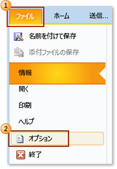
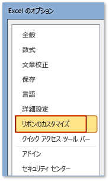

# 方法: リボンの [開発] タブを表示します。
  アクセスする、**開発者** タブ、Office アプリケーションのリボンで、既定で表示されないため、このタブを表示するように構成する必要があります。 たとえば、Word のドキュメント レベルのカスタマイズに <xref:Microsoft.Office.Tools.Word.GroupContentControl> を追加しようとする場合、このタブを表示する必要があります。  
  
> [!NOTE]  
>  このガイダンスは Office 2010 以降のアプリケーションのみに適用されます。 2007 Microsoft Office System のこのタブは表示する場合は、このトピックの次のバージョンを参照してください。[方法。リボンの [開発] タブを表示する](https://web.archive.org/web/20140303033431/msdn.microsoft.com/library/bb608625(v=vs.90).aspx
)します。  
  
 [!INCLUDE[appliesto_ribbon](../vsto/includes/appliesto-ribbon-md.md)]  
  
> [!NOTE]  
>  アクセスはありません、**開発者**タブ。  
  
## [開発] タブを表示するには  
  
1.  このトピックでサポートされている Office アプリケーションのいずれかを起動します。 参照してください、**に適用されます:** このトピックの前に注意してください。  
  
2.  **ファイル** タブで、選択、**オプション**ボタンをクリックします。  
  
     次に示します、**ファイル** タブと**オプション**Office 2010 でボタンをクリックします。  
  
       
  
     次に示します、**ファイル**Office 2013 でのタブ。  
  
     ![Outlook 2013 で、[ファイル] タブ](../vsto/media/vsto-office2013-filetab.png "Outlook 2013 の [ファイル] タブ")  
  
     次に示します、**オプション**Office 2013 でボタンをクリックします。  
  
     ![Outlook 2013 Preview の [オプション] ボタン](../vsto/media/vsto-office2013-optionsbutton.png "Outlook 2013 Preview で [オプション] ボタン")  
  
3.  _ApplicationName_**オプション** ダイアログ ボックスで、選択、**リボンのカスタマイズ**ボタンをクリックします。  
  
     次に示します、**オプション** ダイアログ ボックスおよび**リボンのカスタマイズ**Excel 2010 でボタンをクリックします。 このボタンの位置は、このトピックの上部付近の「対象」セクションに記載されている他のすべてのアプリケーションで同様です。  
  
       
  
4.  メイン タブの一覧で選択、**開発者**チェック ボックスをオンします。  
  
     次に示します、**開発者**Word 2010 でのチェック ボックスと[!INCLUDE[Word_15_short](../vsto/includes/word-15-short-md.md)]します。 このチェック ボックスの位置は、このトピックの上部付近の「対象」セクションに記載されている他のすべてのアプリケーションと同様です。  
  
     ![Word のオプションダイアログ ボックスの [開発] チェック ボックス](../vsto/media/vsto-office2010-developercheckbox.png "Word のオプションダイアログ ボックスで [開発] チェック ボックス")  
  
5.  選択、 **OK**を閉じる ボタン、**オプション** ダイアログ ボックス。  
  
## 関連項目  
 [Office UI のカスタマイズ](../vsto/office-ui-customization.md)  
