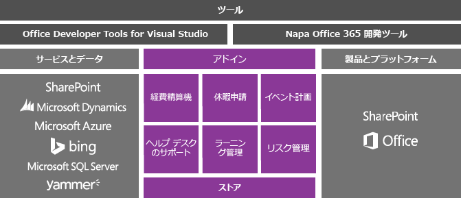
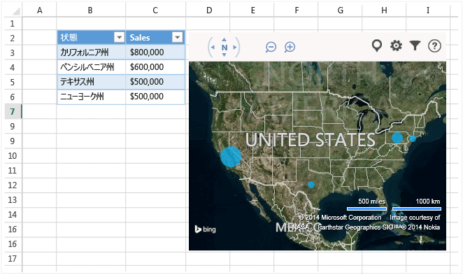

# Visual Studio での Office および SharePoint 開発
  ユーザーが [Office ストア](https://store.office.com/)または組織のカタログからダウンロードする軽量なアプリやアドインを作成するか、ユーザーがコンピューターにインストールする .NET Framework ベースのソリューションを作成することによって、Microsoft Office および SharePoint を拡張できます。  
  
 このトピックの内容  
  
-   [Office と SharePoint 用アドインの作成](#Apps)  
  
-   [VSTO アドインの作成](#Add-ins)  
  
-   [SharePoint ソリューションの作成](#Solutions)  
  
##   Office と SharePoint 用アドインの作成  
 Office 2013 と SharePoint 2013 では、Office と SharePoint を拡張するためのアドインを構築、配布、収益化するために役立つ新しいアドイン モデルが導入されます。  これらのアドインは、Office Online または SharePoint Online で実行でき、ユーザーは多くのデバイスからアプリと対話できます。  
  
 新しい [Office アドイン モデル](https://msdn.microsoft.com/library/office/jj220082.aspx)を使用してユーザーの Office エクスペリエンスを拡張する方法をご確認ください。  
  
 これらのアドインのフットプリントは、VSTO アドインやソリューションと比較して非常に小さく、その作成には、HTML5、JavaScript、CSS3、XML など、ほぼすべての Web プログラミング テクノロジを使用できます。  作業を始めるには、Visual Studio で Office Developer Tools を使用するか、コードネーム "Napa" Office 365 開発ツールと呼ばれる、軽量な Web ベースのツールを使用します。これらのツールを使用すると、プロジェクトを作成し、コードを記述した後、構築したアドインをブラウザー内で実行できます。  
  
   
  
 **詳細を表示**  
  
|終了|解決方法については、|  
|--------|----------------|  
|Napa Office 365 開発ツールの詳細を確認する。|[Napa Office 365 開発ツール](https://msdn.microsoft.com/library/dn974046.aspx)|  
  
### Office アドインの作成  
 Office の機能を拡張するには、Office アドインを構築します。 このアプリは基本的に、Excel、Word、Outlook、PowerPoint などの Office アプリケーションでホストされる Web ページです。 構築したアプリを使用して、ドキュメント、ワークシート、電子メール メッセージ、予定、プレゼンテーション、およびプロジェクトに機能を追加できます。  
  
 構築したアプリは Office ストアで販売できます。[Office ストア](https://store.office.com/)を使用すると、アドインの収益化、更新プログラムの管理、および利用統計情報の追跡が簡単になります。 また、SharePoint のアプリ カタログや Exchange Server 上で、アプリをユーザーに公開することもできます。  
  
 Bing マップ内にワークシートのデータを表示する Office 向けアプリを次に示します。  
  
   
  
 **詳細を表示**  
  
|終了|解決方法については、|  
|--------|----------------|  
|Office アドインの詳細を確認し、アドインを構築する。|[Office アドイン](http://msdn.microsoft.com/office/dn448457)|  
|Office のさまざまな拡張方法を比較し、アプリと Office アドインのどちらを使用する必要があるかを判断する。|[Office アドイン、VSTO、および VBA へのロードマップ](http://blogs.msdn.com/b/officeapps/archive/2013/06/18/roadmap-for-apps-for-office-vsto-and-vba.aspx)|  
|Napa Office 365 開発ツールの詳細を確認する。|[Napa Office 365 開発ツール](https://msdn.microsoft.com/library/dn974046.aspx)|  
  
### SharePoint アドインの作成  
 ユーザー向けに SharePoint を拡張するには、SharePoint アドインを構築します。 このアプリは基本的に、ユーザーやビジネスの要件を解決する、小さくて使いやすい、スタンドアロンのアプリケーションです。  
  
 構築した SharePoint 用のアプリは [Office ストア](https://store.office.com/)で販売できます。 また、SharePoint のアドイン カタログを使用して、アドインをユーザーに公開することもできます。  サイト所有者は、ファーム サーバーやサイト コレクションの管理者の助けを借りることなく、アドインを SharePoint サイトにインストール、アップグレード、およびアンインストールできます。  
  
 ユーザーがビジネス用連絡先を管理するのに役立つ SharePoint 向けアプリの例を次に示します。  
  
   
  
 **詳細を表示**  
  
|終了|解決方法については、|  
|--------|----------------|  
|SharePoint アドインの詳細を確認し、アドインを構築する。|[SharePoint アドイン](https://msdn.microsoft.com/library/office/fp179930.aspx)|  
|SharePoint アドインを従来の SharePoint ソリューションと比較する。|[SharePoint アドインと SharePoint ソリューションの比較](http://msdn.microsoft.com/library/office/jj163114.aspx)|  
|SharePoint ソリューションと SharePoint アドインのどちらを構築するかを選択する。|[SharePoint アドインと SharePoint ソリューションの比較](https://msdn.microsoft.com/library/office/jj163114.aspx)|  
|Napa Office 365 開発ツールの詳細を確認する。|[Napa Office 365 開発ツール](https://msdn.microsoft.com/library/dn974046.aspx)|  
  
##   VSTO アドインの作成  
 Office 2007 または Office 2010 を対象とする VSTO アドインを作成したり、Office 2013 と Office 2016 を拡張するための VSTO アドインを作成して、Office アドインでは提供できない機能を実装したりできます。 VSTO アドインはデスクトップ上でのみ動作します。 ユーザーは VSTO アドインをインストールする必要があるため、通常はアドインの配置やサポートが難しくなります。  ただし、VSTO アドインは、より密接に Office に統合できます。 たとえば、Office リボンにタブやコントロールを追加し、文書の結合やグラフの変更などの高度な自動化タスクを実行できます。 また、.NET Framework を活用し、C\# および Visual Basic を使用して、Office オブジェクトと対話することもできます。  
  
 VSTO アドインで提供できる機能の例を次に示します。 この VSTO アドインは、PowerPoint にリボン コントロール、カスタム作業ウィンドウ、およびダイアログ ボックスを追加します。  
  
   
  
 **詳細を表示**  
  
|終了|読み取り|  
|--------|----------|  
|Office のさまざまな拡張方法を比較し、VSTO アドインと Office アドインのどちらを使用する必要があるかを判断する。|[Office アドイン、VSTO、および VBA へのロードマップ](http://blogs.msdn.com/b/officeapps/archive/2013/06/18/roadmap-for-apps-for-office-vsto-and-vba.aspx)|  
|VSTO アドインを作成する。|[Visual Studio で作成した VSTO アドイン](https://msdn.microsoft.com/library/jj620922.aspx)|  
  
##   SharePoint ソリューションの作成  
 SharePoint Foundation 2010 および SharePoint Server 2010 を対象とする SharePoint ソリューションを作成したり、SharePoint 2013 と SharePoint 2016 を拡張するための SharePoint ソリューションを作成して、SharePoint アドインでは提供できない機能を実装したりできます。  
  
 SharePoint ソリューションには、内部設置型の SharePoint ファーム サーバーが必要です。 管理者はソリューションをインストールする必要があります。また、ソリューションは SharePoint 内で実行されるため、サーバーのパフォーマンスに影響を与える可能性があります。 ただし、ソリューションでは、より深いレベルの SharePoint オブジェクトへのアクセスが提供されます。 また、SharePoint ソリューションの構築時に、.NET Framework を活用し、C\# および Visual Basic を使用して、SharePoint オブジェクトと対話できます。  
  
 **詳細を表示**  
  
|終了|解決方法については、|  
|--------|----------------|  
|SharePoint ソリューションを SharePoint アドインと比較する。|[SharePoint アドインと SharePoint ソリューションの比較](http://msdn.microsoft.com/library/office/jj163114.aspx)|  
|SharePoint ソリューションを作成する。|[SharePoint ソリューションの作成](../sharepoint/create-sharepoint-solutions.md)|  
  
  