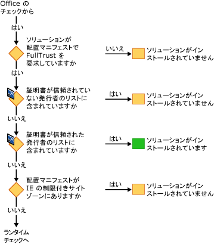
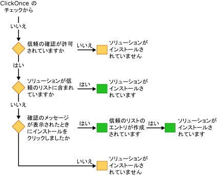

# セキュリティで保護された Office ソリューション
  Office ソリューションのセキュリティ モデルでは、いくつかのテクノロジ: [!INCLUDE[vsto_runtime](../vsto/includes/vsto-runtime-md.md)]、 [!INCLUDE[ndptecclick](../vsto/includes/ndptecclick-md.md)]、Microsoft Office、および Internet Explorer の制限付きサイト ゾーンのセキュリティ センターです。 次のセクションでは、さまざまなセキュリティ機能のしくみについて説明します:  
  
-   [Office ソリューションに信頼を付与](#GrantingTrustToSolutions)  
  
-   [ドキュメントへの信頼を付与](#GrantingTrustToDocuments)  
  
-   [Windows インストーラーを使用する場合は、信頼を付与します。](#GrantingTrustWindowsInstaller)  
  
-   [Office ソリューションの特定のセキュリティに関する考慮事項](#Security)  
  
-   [開発時のセキュリティ](#SecurityDuringDeployment)  
  
-   [Visual Studio Tools for Office ランタイム](#VisualStudioToolsForOfficeRuntime)  
  
 [!INCLUDE[appliesto_all](../vsto/includes/appliesto-all-md.md)]  
  
##   Office ソリューションに信頼を付与  
 Office ソリューションへの信頼の付与とは、以下の証拠に基づいて Office ソリューションを信頼するように各エンド ユーザーのセキュリティ ポリシーを変更することを意味します。  
  
-   配置マニフェストへの署名に使用する証明書  
  
-   配置マニフェストの URL  
  
 詳細については、次を参照してください。 [Office ソリューションに信頼を付与](../vsto/granting-trust-to-office-solutions.md)です。  
  
##   ドキュメントへの信頼を付与  
 ドキュメント レベルのカスタマイズでは、ドキュメントを信頼できる場所として指定されたディレクトリに置く必要があります。  詳細については、次を参照してください。[ドキュメントへの信頼を付与](../vsto/granting-trust-to-documents.md)です。  
  
##   Windows インストーラーを使用する場合は、信頼を付与します。  
 Windows インストーラーを使用して Program Files ディレクトリに Office ソリューションをインストールする MSI ファイルを作成できますが、これには管理者権限が必要です。 Office ソリューションの Program Files ディレクトリに、Visual Studio 2010 Tools for Office runtime が信頼されるようにこれらの Office ソリューションを検討し、ClickOnce 信頼プロンプトが表示されません。  
  
##   Office ソリューションの特定のセキュリティに関する考慮事項  
 [!INCLUDE[net_v40_short](../sharepoint/includes/net-v40-short-md.md)]、[!INCLUDE[net_v45](../vsto/includes/net-v45-md.md)] および Microsoft Office に用意されているセキュリティ機能は、Office ソリューションのさまざまなセキュリティ上の脅威に対する保護に役立てることができます。 詳細については、次を参照してください。 [Office ソリューションの特定のセキュリティに関する考慮事項](../vsto/specific-security-considerations-for-office-solutions.md)です。  
  
##   開発時のセキュリティ  
 Visual Studio では、開発プロセスを容易にするために、プロジェクトをビルドするたびにソリューションの実行およびデバッグに必要なセキュリティ ポリシーが設定されます。 場合によっては、プロジェクトの開発に追加のセキュリティ手順が必要になります。  
  
### ドキュメント レベルのソリューション  
 次の種類のプロジェクトを開発する場合は、Microsoft Office アプリケーションの信頼できる場所の一覧にドキュメントの完全修飾パスを追加する必要があります。  
  
-   ドキュメント レベルのようには、ネットワーク ファイル共有上にあるソリューション *\\\servername\sharename*です。  
  
-   ドキュメント レベルのソリューションを使用して Word 用 *.doc*または *.docm*ファイル。  
  
 ドキュメントの場所を信頼できる場所の一覧に追加するときにサブディレクトリを含めるか、デバッグ用のフォルダーとビルド用のフォルダーそれ自体を含めます。 詳細については、Microsoft Office オンライン ヘルプの記事を参照してください。[作成、削除、または変更、ファイルに対して信頼できる場所](https://support.office.com/en-au/article/Create-remove-or-change-a-trusted-location-for-your-files-f5151879-25ea-4998-80a5-4208b3540a62)です。  
  
### 一時的な証明書  
 Visual Studio では、既存の署名証明書がない場合、一時的な証明書が作成されます。  一時的な証明書は開発時のみ使用し、配置には正式な証明書を購入する必要があります。  
  
 一時的な証明書は、Office プロジェクトを最初にビルドした後に生成されます。 次にキーを押すとき**f5 キーを押して**、証明書が追加されたときに変更されると、プロジェクトが設定されているため、プロジェクトが再構築します。  
  
 時間の経過と共に多くの一時的な証明書が生成される可能性があるため、一時的な証明書を随時クリアする必要があります。  
  
##   Visual Studio Tools for Office ランタイム  
 [!INCLUDE[vsto_runtime](../vsto/includes/vsto-runtime-md.md)]にパブリッシャーとカスタマイズに付与されるアクセス許可の id を検証する機能があります。 アクセス許可を確認するときには、一連のセキュリティ チェックが実行されます。  
  
### カスタマイズの読み込み中にセキュリティ  
 ドキュメント レベルのカスタマイズが読み込まれるときに、[!INCLUDE[vsto_runtime](../vsto/includes/vsto-runtime-md.md)]常に、ドキュメントが信頼できる場所 ボックスの一覧にするかどうかを確認します。 さらに、ランタイムは、ソリューションがアプリケーション マニフェストに FullTrust を要求するかどうかを確認します。 カスタマイズの読み込み中に追加のセキュリティ チェックは行われません。  
  
### インストール中にセキュリティ チェックのシーケンス  
 Office ソリューションをインストールまたは更新するときには、[!INCLUDE[vsto_runtime](../vsto/includes/vsto-runtime-md.md)] が一連のセキュリティ チェックを所定の順序で実行し、信頼の決定を行います。 ソリューションのインストールまたは更新は、ソリューションが信頼されているとランタイムが判断した場合のみ実行されます。  
  
 4 つの方法のいずれかで、インストール プロセスを開始することができます。 セットアップ プログラムを実行して、配置マニフェストを開くことによって、ホストを開く、Microsoft Office アプリケーション、またはを実行して*VSTOInstaller.exe*です。  
  
 最初のセキュリティ チェックはドキュメント レベルのソリューションのみが対象となります。 ドキュメント レベルのソリューションのドキュメントは、信頼できる場所に置く必要があります。 ドキュメントがリモート ネットワーク ファイル共有、または場合、 *.doc*または *.docm*ファイル名拡張子、ドキュメントの場所を信頼できる場所の一覧に追加する必要があります。 詳細については、次を参照してください。[ドキュメントへの信頼を付与](../vsto/granting-trust-to-documents.md)です。  
  
   
  
 次に、[!INCLUDE[vsto_runtime](../vsto/includes/vsto-runtime-md.md)] と ClickOnce によって一連のセキュリティ チェックが実行されます。 これらのチェックを通過するには、Office ソリューションは、信頼されない発行元一覧で、一覧表示されていない証明書で署名されている、および、Internet Explorer の制限付きサイト ゾーンに含まれていない場所にある FullTrust アクセス許可を要求する必要があります。 証明書が信頼できる発行元リスト内にある場合は、ソリューションは直ちにインストールされます。 そうでない場合は、いずれかのチェックで不合格とならなければ、最後のチェックに進みます。  
  
   
  
 場合、[!INCLUDE[ndptecclick](../vsto/includes/ndptecclick-md.md)]信頼プロンプトが許可されていると、ソリューションがまだ与えられていない信頼、ランタイム、エンドユーザーが作成した信頼の決定できるようになります。 ユーザーがソリューションに信頼を付与すると、そのユーザーの信頼のリストにエントリが追加されます。 ユーザーの信頼のリストに追加されたソリューションは、完全に信頼されているため、インストールおよび実行が可能です。  
  
 Visual Studio 2010 以降では、Windows インストーラー (MSI) を使用して Office ソリューションを Program Files ディレクトリにインストールすると、信頼のリストがバイパスされます。 詳細については、次を参照してください。[信頼 Office ソリューションの信頼のリストを使用して、](../vsto/trusting-office-solutions-by-using-inclusion-lists.md)です。  
  
   
  
## 関連項目  
 [Office ソリューションに信頼を付与](../vsto/granting-trust-to-office-solutions.md)   
 [ドキュメントへの信頼を付与](../vsto/granting-trust-to-documents.md)   
 [信頼のリストを使用して Office ソリューションを信頼します。](../vsto/trusting-office-solutions-by-using-inclusion-lists.md)   
 [方法: 信頼リストのセキュリティを構成します。](../vsto/how-to-configure-inclusion-list-security.md)   
 [方法: Office ソリューションの署名](../vsto/how-to-sign-office-solutions.md)   
 [Office ソリューションのセキュリティをトラブルシューティングします。](../vsto/troubleshooting-office-solution-security.md)   
 [Office ソリューション用アプリケーション マニフェスト](../vsto/application-manifests-for-office-solutions.md)   
 [Office ソリューション用配置マニフェストします。](../vsto/deployment-manifests-for-office-solutions.md)   
 [ClickOnce の参照](/visualstudio/deployment/clickonce-reference)   
 [Office ソリューションを配置します。](../vsto/deploying-an-office-solution.md)  
  
  