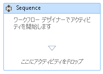
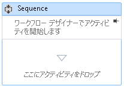

# ワークフロー デザイナーでワークフローにコメントを追加する方法
より大きく複雑なワーク フローを簡単に作成するため、[!INCLUDE[net_v45](../ide/includes/net_v45_md.md)] では開発者がデザイナーで次の種類の項目に注釈を追加できます。  
  
-   <xref:System.Activities.Activity>  
  
-   <xref:System.Activities.Statements.State>  
  
-   <xref:System.Activities.Statements.Transition>  
  
-   クラス (派生) <xref:System.Activities.Statements.FlowNode>  
  
-   <xref:System.Activities.Variable>  
  
-   <xref:System.Activities.Argument>  
  
> [!IMPORTANT]
>  注釈の内容はワーク フローに関連付けられた XAML ファイルにテキスト形式で保存され、他のユーザーに読み取られる可能性があります。 注釈に機密情報を入力する場合は注意してください。  
  
### デザイナーのアクティビティへの注釈の追加  
  
1.  ワークフロー デザイナーと選択内の項目を右クリックし、ワークフロー デザイナーで**注釈**、**注釈の追加**です。  
  
2.  注釈のテキストを提供された領域に追加します。  
  
3.  項目に注釈アイコンが表示されます。 注釈アイコン上にカーソルを置くと、注釈のテキストが表示されます。  
  
       
  
### アクティビティのデザイナーへの注釈の表示  
  
1.  アクティビティの外部に注釈表示するアクティビティ デザイナー、をクリックして、 **Pin**注釈の装飾のアイコン。  
  
2.  注釈がアクティビティ デザイナーに表示されます。 次のスクリーンショットでは、「ワーク フローのアクティビティを開始する」という注釈がアクティビティ デザイナーに表示されています。  
  
       
  
3.  アクティビティ デザイナーの外部に注釈を表示するアクティビティ デザイナーの注釈の領域を合わせるし をクリックして、**ピン解除** アイコン  
  
       
  
### すべての注釈の表示または非表示  
  
1.  注釈を持つアクティビティを右クリックします。 選択**注釈**、**すべての注釈を表示する**です。  
  
2.  すべての注釈がアクティビティのデザイナーに表示されます。  
  
3.  クリックし、アクティビティを右クリックし、アクティビティのデザイナーの外部のすべての注釈を表示する**注釈**、**すべての注釈を非表示に**です。  
  
### アクティビティの注釈の編集または削除  
  
1.  注釈を持つアクティビティを右クリックします。  
  
2.  選択**注釈**、 **注釈の編集**または**注釈を削除**です。  
  
3.  編集または削除用に注釈が開きます。  
  
4.  すべての注釈を一度に削除するには、ワークフロー デザイナーと選択を右クリックして**注釈**、**注釈をすべて削除**です。  
  
### 変数または引数の注釈の追加、編集、削除  
  
1.  変数または引数を右クリックし、[注釈の追加] をクリックします。  
  
2.  注釈のテキストを入力します。 変数または引数に注釈アイコンが表示されます。  
  
3.  注釈を持つ変数または引数を右クリックします。 [注釈の編集] をクリックします。  
  
4.  編集用に注釈が開きます。  
  
5.  注釈を持つ変数または引数を右クリックします。 [注釈の削除] をクリックします。  
  
6.  注釈が削除されます。