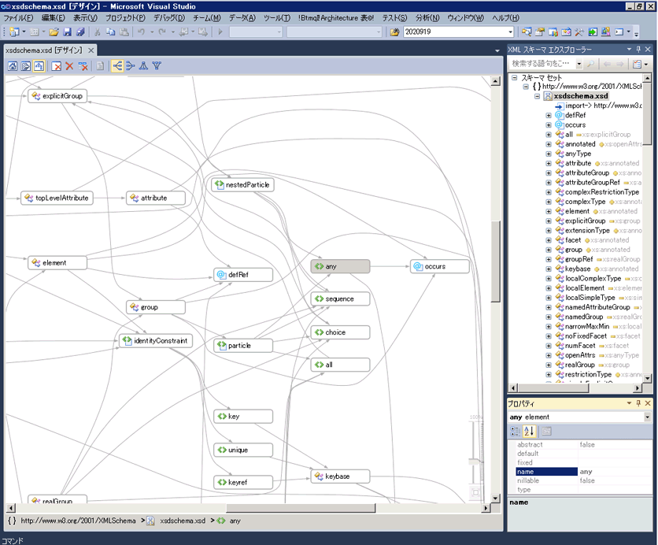
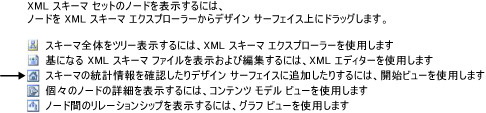

# グラフ ビュー

グラフ ビューには、グローバル スキーマ ノードおよびノード間のリレーションシップがグラフィック表示されます。 グラフ ビューでは、デザイン サーフェイスのスキーマ セットのレイアウトを変更できないことに注意してください。 グラフ ビューには、XML スキーマ デザイナーのツール バーおよび階層リンク バーも含まれています。

 次の画像は、デザイン サーフェイスに 6 つのグローバル ノードが表示されたグラフ ビューを示します。

 

## デザイン画面

 グラフ ビューのデザイン画面の内容を表示する、 [XML スキーマ デザイナーのワークスペース](../xml-tools/xml-schema-designer-workspace.md)です。 ワークスペースにスキーマ セットからのグローバル ノードが含まれている場合、ノードがグラフ ビューのデザイン サーフェイスに表示され、リレーションシップを持つノード間に矢印が引かれます。

 グラフ ビューのノードをダブルクリックすると、XML エディターが表示されます。

 ワークスペースから選択したノードを削除するには、XSD デザイナーのツールバーを使用または**削除**キー。

 デザイン サーフェイスが空白の場合、XML エディター、 **XML スキーマ エクスプ ローラー**、され、レベルのウォーターマークが表示されます。 *ウォーターマーク*XSD デザイナーのすべてのビューへのリンクの一覧を示します。

 

 スキーマ セットにエラーがある場合、一覧の最後に "スキーマ セット内のエラーを表示および修正するには、エラー一覧を使用します" というテキストが表示されます。

## 階層リンク バー

 グラフ ビューの下部に表示される階層リンク バーは、選択したノードが存在するスキーマ セットの場所を示します。 複数の項目が選択されている場合、階層リンク バーは空白になります。

## コンテキスト メニュー

 グラフ ビューのデザイン サーフェイスにあるすべてのノードに使用できるオプションを次の表に示します。

|オプション|説明|
|------------|-----------------|
|**XML スキーマ エクスプ ローラーで表示します。**|スキーマ エクスプローラーにフォーカスを置き、スキーマ セット ノードを強調表示します。|
|**グラフ ビューで表示します。**|グラフ ビュー (灰色表示) に切り替えます。|
|**サンプル XML を生成します。**|グローバル要素でのみ使用できます。 グローバル要素のサンプル XML ファイルを生成します。|
|**ワークスペースをクリアします。**|ワークスペースおよびデザイン サーフェイスをクリアします。|
|**ワークスペースからの削除します。**|ワークスペースおよびデザイン サーフェイスから選択したノードを削除します。|
|**ワークスペースからの選択以外はすべて削除します。**|ワークスペースおよびデザイン サーフェイスから選択されていないノードを削除します。|
|**イメージとしてダイアグラムをエクスポートします。**|デザイン サーフェイスを XPS ファイルに保存します。|
|**[すべて選択] します。**|デザイン サーフェイスのすべてのノードを選択します。|
|**コードの表示**|選択したノードを含むファイルが XML エディターで開きます。 選択されているアイテム、 **XML スキーマ エクスプ ローラー** XML エディターでもオンになっています。|
|**[プロパティ] ウィンドウ**|開く、**プロパティ**ウィンドウ (これがまだ開いていない) 場合。 このウィンドウには、ノードに関する情報が表示されます。|

 グローバル要素のコンテキスト メニューには、前述の共通オプションに加えて、次のオプションがあります。

|オプション|説明|
|------------|-----------------|
|**型定義を追加します。**|ダイアグラムに基本型を追加します。|
|**すべての参照を追加します。**|要素を参照するすべてのノードを追加し、その間にリレーションシップを示す矢印を引きます。|
|**代替グループのメンバーを追加します。**|すべての代替グループのメンバーを追加します。 このオプションは、要素が代替グループの先頭またはメンバーの場合にビューに表示されます。|
|**サンプル XML を生成します。**|グローバル要素のサンプル XML ファイルを生成します。|

 グローバル単純型とグローバル複合型のコンテキスト メニューには、前述の共通オプションに加えて、次のオプションがあります。

|オプション|説明|
|------------|-----------------|
|**基本データ型を追加します。**|選択した型がグローバル型から派生している場合に、選択した型の基本型を追加します。|
|**すべての参照を追加します。**|選択した型へのすべての参照を追加します。 これには、選択した型および選択した型から派生した型の要素と属性が含まれます。|
|**すべての派生型を追加します。**|選択した型から直接または間接的に派生したすべての型を追加します。|
|**すべての先祖を追加します。**|すべての親の型 (基本型) を追加します。|

 グローバル グループと属性グループのコンテキスト メニューには、前述の共通オプションに加えて、次のオプションがあります。

|オプション|説明|
|------------|-----------------|
|**すべての参照を追加します。**|グループを参照するすべてのノードを追加し、その間にリレーションシップを示す矢印を引きます。|
|**すべてのメンバーを追加します。**|グループのすべてのメンバーを追加し、その間にリレーションシップを示す矢印を引きます。|

 グローバル属性のコンテキスト メニューには、上記の共通オプションに加えて、次のオプションがあります。

|オプション|説明|
|------------|-----------------|
|**すべての参照を追加します。**|グループを参照するすべてのノードを追加し、その間にリレーションシップを示す矢印を引きます。|

## [プロパティ] ウィンドウ

 開くには最初に、コンテキスト メニューを使用して、**プロパティ**ウィンドウです。 既定では、**プロパティ**Visual Studio の右下隅にウィンドウが表示されます。 そのノードのプロパティが表示されます、コンテンツ モデル ビューに表示されているノードをクリックすると、**プロパティ**ウィンドウです。

## XSD ツールバー

 グラフ ビューがアクティブな場合に、次の XSD ツール バー ボタンが表示されます。

 

|オプション|説明|
|------------|-----------------|
|**スタート ビューを表示します。**|切り替わり、[表示の開始](../xml-tools/start-view.md)です。 このビューは、キーボード ショートカットを使用してアクセスできます: **Ctrl**+**1**です。|
|**コンテンツ モデル ビューを表示します。**|切り替わり、[コンテンツ モデル ビュー](../xml-tools/content-model-view.md)です。 このビューは、キーボード ショートカットを使用してアクセスできます: **Ctrl**+**2**です。|
|**グラフ ビューを表示します。**|切り替わり、[グラフ ビュー](../xml-tools/graph-view.md)です。 このビューは、キーボード ショートカットを使用してアクセスできます: **Ctrl**+**3**です。|
|**ワークスペースをクリアします。**|ワークスペースおよびデザイン サーフェイスをクリアします。|
|**ワークスペースからの削除します。**|ワークスペースおよびデザイン サーフェイスから選択したノードを削除します。|
|**ワークスペースからの選択以外はすべて削除します。**|ワークスペースおよびデザイン サーフェイスから選択されていないノードを削除します。 このオプションは、コンテンツ モデル ビューおよびグラフ ビューで有効です。|
|**左右から**|グラフ ビューのレイアウトを、左から右にノードの階層が表示されるように変更します。 このオプションは、キーボード ショートカットを使用してアクセスできます: **Alt**+**右矢印**です。|
|**右から左へ**|グラフ ビューのレイアウトを、右から左にノードの階層が表示されるように変更します。 このオプションは、キーボード ショートカットを使用してアクセスできます: **Alt**+**左矢印**です。|
|**上下からへ**|グラフ ビューのレイアウトを、上から下にノードの階層が表示されるように変更します。 このオプションは、キーボード ショートカットを使用してアクセスできます: **Alt**+**下向きの矢印**です。|
|**下から上**|グラフ ビューのレイアウトを、下から上にノードの階層が表示されるように変更します。 このオプションは、キーボード ショートカットを使用してアクセスできます: **Alt**+**上向き矢印**です。|

## パン/スクロール

 デザイン サーフェイスをパンするには、スクロール バーを使用するか、保持している、 **Ctrl**キーをクリックして、マウスをドラッグします。 マウスをクリックしてドラッグすることでデザイン サーフェイスをパンした場合は、カーソルが 4 方向を指す 4 つの交差矢印に変化します。

## 元に戻す/やり直し

 元に戻す/やり直し機能は、グラフ ビューの次の操作に対して有効です。

-   ドラッグ アンド ドロップして 1 つのノードを追加する。

-   スキーマ エクスプローラーの検索結果ウィンドウまたはスタート ビューのクエリで複数のノードを追加する。

-   1 つまたは複数のノードを削除する。

## ズーム

 ズームはグラフ ビューの右下隅にあります。

 ズームは、次の方法で制御できます。

-   押しながら、 **Ctrl**キーとマウスを回転してホイール マウスがグラフ ビューのサーフェイスを置いたときにします。

-   スライダー コントロールを使用する。 スライダーは現在のズーム レベルを示します。

選択して、マウス ポインターを置くか、または使用、ズーム スライダーが不透明である**Ctrl**が透過的なマウスのホイールを拡大する; 他のすべてのタイミングで、します。

## XML エディターとの統合

 ノードをクリックしたり、[コードの表示] コンテキスト メニューを使用することで、グラフ ビューと XML エディターを切り替えることができます。

 XML エディターでスキーマ セットを変更すると、グラフ ビューにもその変更が同期されます。 詳細については、次を参照してください。 [XML エディターとの統合](../xml-tools/integration-with-xml-editor.md)です。

## 関連項目

- [デザイン画面](../xml-tools/xml-schema-designer-workspace.md)