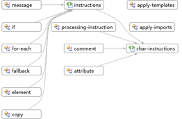

# 方法: グラフ ビューを使用してスキーマ セットの概要を表示する
[!INCLUDE[vs2017banner](../code-quality/includes/vs2017banner.md)]

このトピックでは、[グラフ ビュー](../xml-tools/graph-view.md)を使用して、スキーマ セット内のノードの概要とノード間のリレーションシップを表示する方法について説明します。  
  
### 新しい XSD ファイルを作成してコンテンツ モデル ビューにルート要素を表示するには  
  
1.  新しい XML スキーマ ファイルを作成して、Relationships.xsd という名前でファイルを保存します。  
  
2.  スタート ビューの **\[XML エディターを使用して基になる XML スキーマ ファイルを表示および編集する\]** リンクをクリックします。  
  
3.  「[サンプル XML スキーマ : リレーションシップ](../Topic/Sample%20XSD%20File:%20Relationships.md)」から XML スキーマのサンプル コードをコピーして、新しい XSD ファイルに既定で追加されたコードの代わりに貼り付けます。  
  
4.  XML エディター内を右クリックして **\[ビュー デザイナー\]** をクリックします。  
  
5.  XSD ツール バーからグラフ ビューを選択します。  
  
6.  XML スキーマ エクスプローラーの **\[スキーマ セット\]** ノードを選択し、グラフ ビューのデザイン サーフェイスにノードをドラッグします。すべてのグローバル ノードが表示され、リレーションシップを持つノード間に矢印が引かれます。  
  
       
  
7.  デザイン サーフェイスでノードをクリックし、階層リンク バーで選択したノードが存在するスキーマ セットの場所を確認します。  
  
8.  デザイン サーフェイスで要素ノードを右クリックし、**\[サンプル XML の生成\]** をクリックして XML インスタンス ドキュメントを表示します。