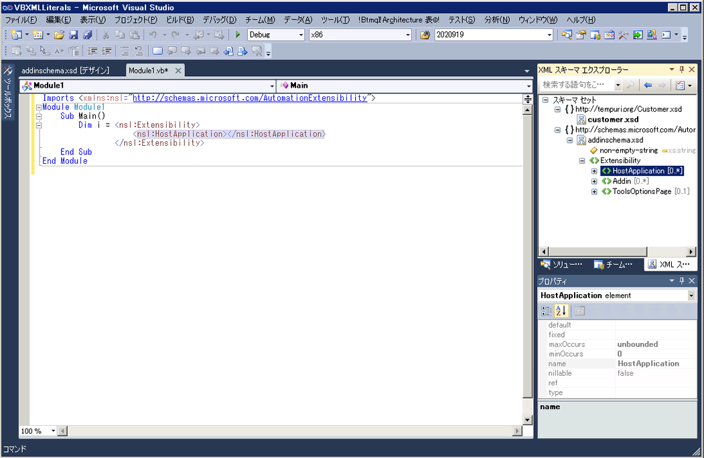

# XML リテラルと XML スキーマ エクスプ ローラーの統合

Visual Basic では、Visual Basic のコードに直接 XML フラグメントを組み込むことができますので、XML リテラルをサポートしています。 詳細については、次を参照してください。 [XML リテラルの概要](http://go.microsoft.com/fwlink/?LinkId=140325)です。

## 方法

XML スキーマ セットを表示するには、Visual Basic プロジェクトで XSD ファイルには、XML リテラルが含まれている場合、 **XML スキーマ エクスプ ローラー**です。 XML リテラルに関連付けられたスキーマ セットを表示するには、XML リテラルまたは XML 名前空間インポートで XML ノードを右クリックし、選択**スキーマ エクスプ ローラーで表示**です。

開き、 **XML スキーマ エクスプ ローラー** Visual Basic ファイルとサイド バイ サイドします。

## 関連項目

- [方法: XML リテラルと XML スキーマ デザイナーを使用します。](../xml-tools/how-to-use-the-xml-schema-designer-with-xml-literals.md)