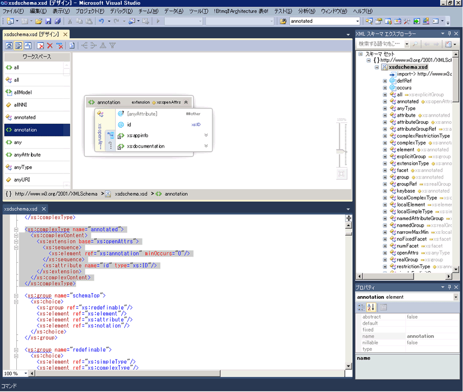

# XML エディターとの統合
XML スキーマ デザイナーは、XML エディターと統合されています。 変更が反映されますが、XML エディターの XSD ファイルを変更する場合、 [XML スキーマ エクスプ ローラー](../xml-tools/xml-schema-explorer.md)です。 ある場合、[グラフ ビュー](../xml-tools/graph-view.md)または[コンテンツ モデル ビュー](../xml-tools/content-model-view.md)開く、変更にも反映されますがあります。 次の方法を使用して XML スキーマ デザイナーと XML エディターの間を移動できます。  
  
-   XML エディターで、ノードを右クリックし、選択**XML スキーマ エクスプ ローラーで表示**です。  
  
-   グラフ ビューと XML スキーマ エクスプ ローラーで、ノードをダブルクリックまたはノードを右クリックし **コードの表示**です。 コンテンツ モデル ビューでノードを右クリックし、選択**コードの表示**です。  
  
次のスクリーン ショットは、XML スキーマが表示されている XML スキーマ エクスプローラーを示しています。 XML スキーマ エクスプローラーでは、スキーマ セットがツリー ビューに表示されます。 XML エディターには、XML スキーマ エクスプローラーで現在アクティブになっているノードのテキスト ビューが表示されます。  
  
  
  
場合によっては、XML エディターとグラフィカルなデザイナーのコードを並べて表示すると便利です。 を同時に両方のファイルを表示する XML エディターで任意の場所を右クリックし、選択**ビュー デザイナー**です。 Visual Studio Windows メニューで、次のように選択します。**新しい水平 (または垂直) タブ グループ**です。  
  
  
  
## 関連項目  
 [XML スキーマ エクスプローラー](../xml-tools/xml-schema-explorer.md)