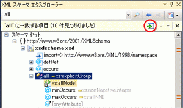

# スキーマ セットの検索
XML スキーマ エクスプローラーでは、次の方法でスキーマ セットを検索できます。  
  
-   キーワード検索  
  
-   スキーマ固有の検索  
  
## キーワード検索  
 内の部分文字列を入力してキーワード検索を実行する、**検索 SchemaSet** XML スキーマ エクスプ ローラーのツールバーのテキスト ボックス。  
  
   
  
 XML スキーマ エクスプローラーは、次のようにスキーマ セットを検索します。  
  
-   指定したキーワードに一致する `name` 属性または `ref` 属性。 これを使用すると、要素、属性、型などを名前で検索することができます。  
  
-   include ステートメントの `schemaLocation` 属性。  
  
-   import ステートメントの `namespace` 属性。  
  
## スキーマ固有の検索  
 XML スキーマ エクスプローラーには、XML スキーマ エクスプローラーのコンテキスト メニューを使用してアクセスできる組み込みの検索機能もあります。 使用できるコンテキスト メニューの詳細については、次を参照してください。[コンテキスト メニュー](../xml-tools/context-menus-xml-schema-explorer.md)です。 スタート ビューからスキーマに固有の検索を実行することもできます。詳細については、「スキーマ セットの詳細」セクションを参照してください、[スタート ビュー](../xml-tools/start-view.md)トピックです。  
  
## 検索結果の表示および移動  
 検索が終了すると、ツール バーに概要結果ペインが追加され、検索結果が表示されます。 検索結果は XML スキーマ エクスプローラーでも強調表示され、垂直スクロール バーの目盛りでマークされます。 使用して、検索結果を移動することができます、**次の検索結果に移動**と**前の検索結果に移動**; XML スキーマ エクスプ ローラーのツールバーのキーボード キーを使用して、概要結果ペイン上のボタンF3 キーおよび shift + f3 です。または、スクロール バーの目盛りをクリックします。  
  
 をクリックして、ワークスペースに検索結果を追加することができます、**強調表示されたノードをワークスペースに追加**概要結果ペインでボタンをクリックします。  
  
   
  
## 検索結果のクリア  
 検索結果をクリアする] をクリックして、 **x** XML スキーマ エクスプ ローラー検索ツールバーの [概要結果ペインでボタンをクリックします。  
  
## 関連項目  
 [XML スキーマ エクスプローラー](../xml-tools/xml-schema-explorer.md)