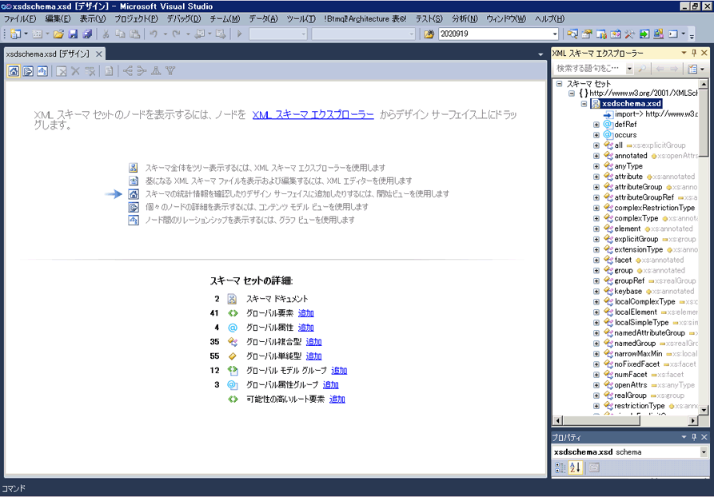

# スタート ビュー
[!INCLUDE[vs2017banner](../code-quality/includes/vs2017banner.md)]

スタート ビューは、XML スキーマ \(XSD\) デザイナーの起点です。新しい XSD ファイルを作成すると、最初にスタート ビューが表示されます。  
  
 スタート ビューには、*ウォーターマーク*および **\[スキーマ セットの詳細\]** ペインの 2 つの主要セクションがあります。さらに、XSD デザイナーのすべてのビューで使用できるツール バーも含まれています。  
  
   
  
## ウォーターマーク  
 ウォーターマーク ペインには、XSD デザイナーのすべてのビュー、XML エディター、および XML スキーマ エクスプローラーへのリンクの一覧があります。スキーマ セットにエラーがある場合、一覧の最後に "スキーマ セット内のエラーを表示および修正するには、エラー一覧を使用します" というテキストが表示されます。  
  
## スキーマ セットの詳細  
 **\[スキーマ セットの詳細\]** ペインには、グローバル スキーマ ノード型が一覧表示され、スキーマに存在する各型のインスタンス数が表示されます。ワークスペースに新しいノードを追加するには、ノード型の横にある **\[追加\]** リンクを使用できます。  
  
## ツール バー  
 XML スキーマ デザイナーのツール バーからスタート ビュー、[コンテンツ モデル ビュー](../xml-tools/content-model-view.md)、および[グラフ ビュー](../xml-tools/graph-view.md)の間を移動することができます。  
  
   
  
 スタート ビューがアクティブな場合に、XSD デザイナーのツール バーに次のボタンが表示されます。  
  
|オプション|内容|  
|-----------|--------|  
|**\[スタート ビューの表示\]**|スタート ビューに切り替えます。このビューには、ショートカット キーの **Ctrl \+ 1** を使用してアクセスできます。|  
|**\[コンテンツ モデル ビューの表示\]**|コンテンツ モデル ビューに切り替えます。このビューには、ショートカット キーの **Ctrl \+ 2** を使用してアクセスできます。|  
|**\[グラフ ビューの表示\]**|グラフ ビューに切り替えます。このビューには、ショートカット キーの **Ctrl \+ 3** を使用してアクセスできます。|  
  
## 参照  
 [XML スキーマ エクスプローラー](../xml-tools/xml-schema-explorer.md)   
 [グラフ ビュー](../xml-tools/graph-view.md)   
 [コンテンツ モデル ビュー](../xml-tools/content-model-view.md)   
 [XML エディター](../xml-tools/xml-editor.md)