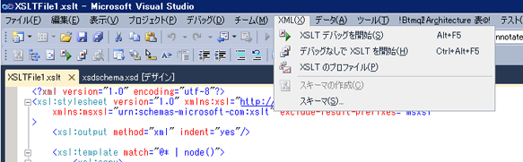

# XSLT プロファイラー
XSLT プロファイラーは、XSLT ドキュメントの開発とデバッグに役立つパフォーマンス分析プロファイラー ツールです。 XSLT プロファイラーを使用して詳細な XSLT パフォーマンス レポートを作成することにより、XSLT コード内のパフォーマンス関連の問題を計測および評価できるようになります。 XSLT プロファイラーには、XSL および XSLT のスタイル シートの最適化に役立つヒントが含まれており、最高のパフォーマンスが必要になる XSLT ベースのアプリケーションには不可欠です。  
  
XSLT プロファイラーは、Visual Studio の一部であるし、は、 **XML**メニュー。  
  

  
> [!NOTE]
>  一部の画面可能性があるために表示が異なるバージョンの Visual Studio で、次のトピックではこれらのスクリーン ショットがキャプチャされた後に、一部の視覚要素が変更されました。  
  
## 関連項目  
[チュートリアル: XSLT プロファイラー](../xml-tools/walkthrough-xslt-profiler.md)