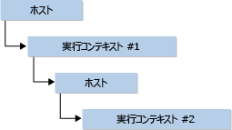

# <a name="targeting-edge-vs-legacy-engines-in-jsrt-apis"></a>JsRT API での Edge エンジンとJsRT API のレガシ エンジン
Windows 10 以降、Chakra (JavaScript エンジン) に加えられた変更点の 1 つは、2 つの異なる Chakra エンジンをサポートすることです。これは、新しい Edge のレンダリング エンジンをサポートするための Windows 10 のブラウザー戦略に沿った変更です。  
  
-   Internet Explorer 11 に付属していてそれをサポートする古い Chakra エンジン (以下では、 *レガシ エンジン* または jscript9.dll とも呼ばれます)。 このエンジンはその時点で凍結され、Win8.1/IE11 リリース以降は基本的に変更されません。  
  
-   Windows 10 の新しいブラウザーである Microsoft Edge に付属していてそれをサポートする新しい Chakra エンジン (以下では、 *Edge エンジン* または chakra.dll とも呼ばれます)。 このエンジンは継続的に更新され、"動的な" [Edge](http://blogs.msdn.com/b/ie/archive/2014/11/11/living-on-the-edge-our-next-step-in-interoperability.aspx) エンジンをサポートします。 動的な Edge エンジンとは、レガシ エンジンとは異なり、Edge エンジンで採用するいかなる形式のバージョン管理スクリプト機能も繰り越さないことを意味します。  
  
 JavaScript ランタイムのホスト処理 (JsRT) API を使用してアプリを作成する場合、レガシ エンジンまたは Edge エンジンのいずれかを対象として選択できます。  
  
-   既存のアプリケーションの下位互換性に重きを置く必要がある場合は、レガシ エンジンを対象にします。  
  
-   将来を見据えて、新しい JavaScript 機能 (たとえば、ECMAScript 6) がリリースされたときに、アプリがそれをサポートするようにする場合は、Edge エンジンを対象にします。  
  
 このトピックでは、それぞれのエンジンを対象とする方法が詳しく説明されます。  
  
## <a name="target-your-preferred-version"></a>優先されるバージョンを対象とする  
 アプリを作成する場合、Edge エンジンまたはレガシ エンジンのいずれかをサポートする JsRT のバージョンを選択できます。 上記のガイドラインに基づいて JsRT のバージョンを選択できます。 このような違いに合わせて、 `JsCreateRuntime`、 `JsCreateContext`、および `JsStartDebugging`に対して次の変更が加えられました。  
  
 `JsCreateRuntime`の場合:  
  
-   レガシ エンジンを対象とする場合、 `JsRuntimeVersionEdge` 列挙値は推奨されず、代わりに `JsRuntimeVersionInternetExplorer11` 値の使用を勧めるメッセージが表示されます。  
  
-   Edge エンジンを対象とする場合は、バージョン パラメーターが `JsCreateRuntime` 関数から除外されます。  
  
    ```cpp  
    JsErrorCode JsCreateRuntime(JsRuntimeAttributes attributes, JsThreadServiceCallback callback, _Out_ JsRuntimeHandle* runtime);  
    ```  
  
 `JsCreateContext` および `JsStartDebugging`の場合:  
  
-   レガシ エンジンを対象とする場合、 `IDebugApplication` インターフェイスを使用して、独自の非リモート デバッグ メソッドが提供されます。 デバッグを目的として、 `JsCreateContext` 関数と `JsStartDebugging` 関数は、 `IDebugApplication` をパラメーターとして扱います。  
  
-   Edge エンジンを対象とする場合、 `IDebugApplication` インターフェイスは推奨されません。 Chakra エンジンは、Visual Studio デバッガーによるネイティブ デバッグ機能とスクリプト デバッグ機能を有効にします。その際、ユーザーからの `IDebugApplication` の実装は不要です。 結果として、インターフェイスは `JsCreateContext` および `JsStartDebugging` のパラメーターではなくなります。  
  
 レガシ エンジンにおける前述の API のシグネチャは、次のとおりです。  
  
```cpp  
JsErrorCode JsCreateRuntime(JsRuntimeAttributes attributes, JsRuntimeVersion version, JsThreadServiceCallback callback, _Out_ JsRuntimeHandle* runtime);  
  
JsErrorCode JsCreateContext(JsRuntimeHandle runtime, IDebugApplication *debugApplication, JsContextRef *newContext);  
  
JsErrorCode JsStartDebugging(IDebugApplication *debugApplication);  
```  
  
 Edge エンジンにおける前述の API のシグネチャは、次のとおりです。  
  
```cpp  
JsErrorCode JsCreateRuntime(JsRuntimeAttributes attributes, JsThreadServiceCallback callback, _Out_ JsRuntimeHandle* runtime);  
  
JsErrorCode JsCreateContext(JsRuntimeHandle runtime, JsContextRef *newContext);  
  
JsErrorCode JsStartDebugging();  
```  
  
## <a name="compile-for-your-preferred-version-using-visual-c"></a>Visual C++ を使用した、優先されるバージョンのコンパイル  
 Visual C++ を使用する場合、jsrt.h ヘッダーを含めることによって JsRT API をインポートし、jsrt.lib がリンカー入力ファイルの一覧に含まれていることを確認します。  
  
```cpp  
#include <jsrt.h>  
```  
  
   
  
 Edge エンジンのバイナリを対象とする場合は、jsrt.h を含める前にマクロ `USE_EDGEMODE_JSRT` を定義し、jsrt.lib に対してではなく、chakrart.lib に対してリンクを行う必要があります。  
  
```cpp  
#define USE_EDGEMODE_JSRT  
#include <jsrt.h>  
```  
  
   
  
 新しいアプリケーションを開始しようとしている場合は、JsRT API に対するコードの作成を開始する準備ができています。  
  
## <a name="compile-for-your-preferred-version-using-net"></a>.NET を使用した、優先されるバージョンのコンパイル  
 .NET および P/Invoke を使用している場合、jscript9.dll ではなく chakra.dll をインポートするように JsRT API [DllImport] 宣言を変更する必要があります。 さらに、 `JsCreateRuntime` の定義を変更して `JsRuntimeVersion` パラメーターを削除し、 `JsCreateContext` および `JsStartDebugging` の定義を変更して `IDebugApplication` パラメーターを削除します。  
  
 レガシ エンジンの場合は、次のコードを使用します。  
  
```c#  
[DllImport("jscript9.dll")]  
public static extern JsErrorCode JsCreateRuntime(  
    JsRuntimeAttributes attributes,  
    JsRuntimeVersion version,  
    JsThreadServiceCallback callback,  
    out JsRuntimeSafeHandle runtime  
);  
  
[DllImport("jscript9.dll")]  
public static extern JsErrorCode JsCreateContext(  
    JsRuntimeSafeHandle runtime,  
    IDebugApplication debugApplication,  
    out JsContextRef newContext  
);   
  
[DllImport("jscript9.dll")]  
public static extern JsErrorCode JsStartDebugging(  
    IDebugApplication debugApplication,  
);  
```  
  
 Edge エンジンの場合は、次のコードを使用します。  
  
```c#  
[DllImport("chakra.dll")]  
public static extern JsErrorCode JsCreateRuntime(  
    JsRuntimeAttributes attributes,  
    JsThreadServiceCallback callback,  
    out JsRuntimeSafeHandle runtime  
);  
  
[DllImport("chakra.dll")]  
public static extern JsErrorCode JsCreateContext(  
    JsRuntimeSafeHandle runtime,  
    out JsContextRef newContext  
);   
  
[DllImport("chakra.dll")]  
public static extern JsErrorCode JsStartDebugging();  
```  
  
> [!CAUTION]
>  関数ポインターを手動でマーシャリングしている場合 (たとえば、LoadLibrary/GetProcAddress を通して)、メソッドの宣言を混合しないようにすることが重要です。混合すると、スタックの不整合が発生し、アプリのクラッシュなど、予期しない動作の原因となります。 インポートしたコード内で jscript9.dll のインスタンスのグローバル検索と置換を実行すると、削除した `version` パラメーターが不足するため、同様の問題が発生します。  
  
## <a name="summary"></a>まとめ  
 Windows 10 では、JavaScript ランタイムのホスト処理 API は 2 つに分割されます。 これらの API は、"動的な" Edge エンジンをサポートするようになりました。その言語機能は、Microsoft Edge の "動的" Edge エンジンと一致するように設定されます。 これらの機能を、デスクトップまたはストア アプリから利用して、新しく魅力的な方法を作成してアプリケーションを拡張し、従来の Web スキルを既存のコード ベースで活用することができます。 ただし、以前のバージョンとの微妙な違いがあるため、Edge エンジンまたはレガシ エンジンを対象とする際には、次の点に注意する必要があります。  
  
-   プロセスごとにアプリがサポートできる JsRT のバージョンは 1 つだけです。  
  
     たとえば、Edge エンジン ランタイムを作成してからレガシ エンジン ランタイムを作成して、それらが同じプロセス内で正常に動作することを期待することはできません。 これはサポートされておらず、2 つ目の DLL の読み込みの失敗などの記載されていない動作が引き起こされる可能性があります。  
  
-   Edge エンジンを対象としている場合、基になるプラットフォームが自動的に更新されたときに、アプリが予期せずに新しい機能を取得する場合があります。  
  
     たとえば、レガシ ランタイムの Internet Explorer 11 モードは、ブロック スコープの変数宣言 ( `let` および `const`など) をサポートします。 Edge エンジンのバージョンの自動管理動作が以前は標準だった場合、ブロック スコープ規則のない Internet Explorer 10 モードで動作していたコードは、プラットフォームが自動的にアップグレードしたときに障害が生じ始めている可能性があります。 これは、使用するランタイム モデルを選択するときに考慮する必要のある点です。 可能な場合にはいつでも Edge エンジンを対象とすることをお勧めしますが、JavaScript コード構造は将来無効になる可能性があるため、その使用については慎重であってください。  
  
-   Windows ストア用の JsRT は、Edge エンジン (chakra.dll) のみサポートします。 jscript9.dll 内の任意の JsRT API に対してリンクしようとするアプリは、認定に失敗します。  
  
-   スタックのバランスが崩れる原因になる可能性があるため、 `JsCreateRuntime`、 `JsCreateContext`、および `JsStartDebugging` の宣言を jscript9.dll と chakra.dll の間で混同しないようにすることは重要です。  
  
     C および C++ を使用している場合、`LoadLibrary` を呼び出してから `GetProcAddress` を呼び出すなどの操作を実行しない限り、正しくない宣言を使用しようとするとリンカー エラーが発生します。 .NET 開発者にとってこの問題を検出するのは簡単ではないため、この機能を使用する際にはコードを再確認してください。  
  
## <a name="see-also"></a>関連項目  
 [JavaScript ランタイムのホスト処理](../chakra-hosting/javascript-runtime-hosting.md)